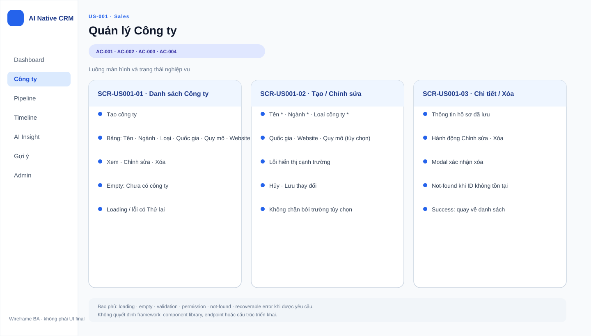
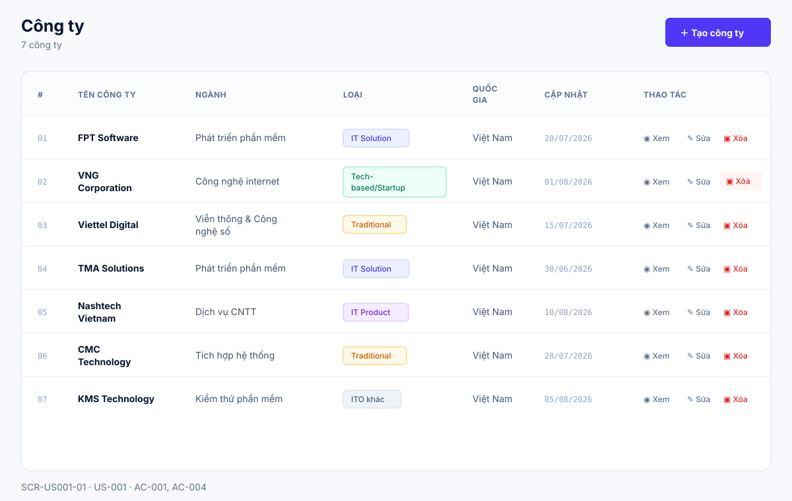
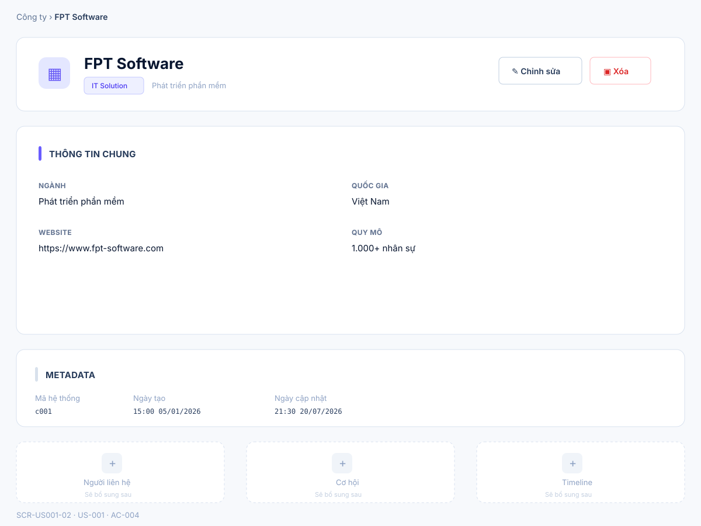
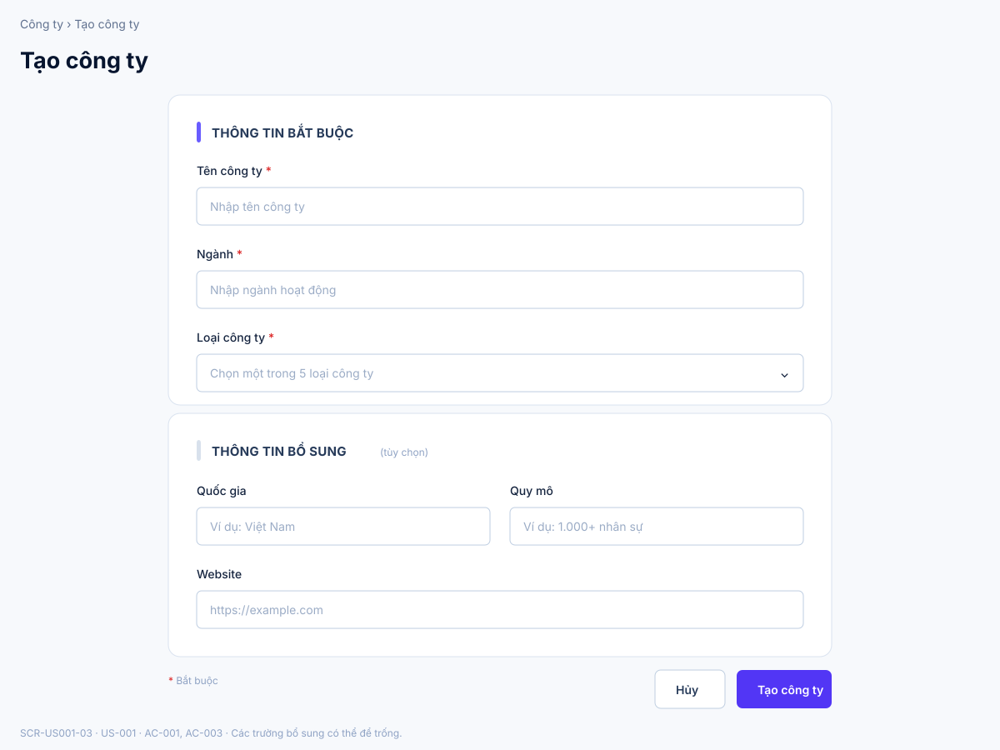
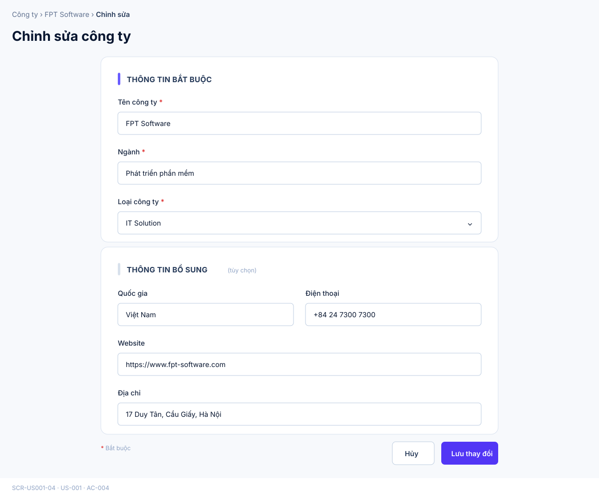
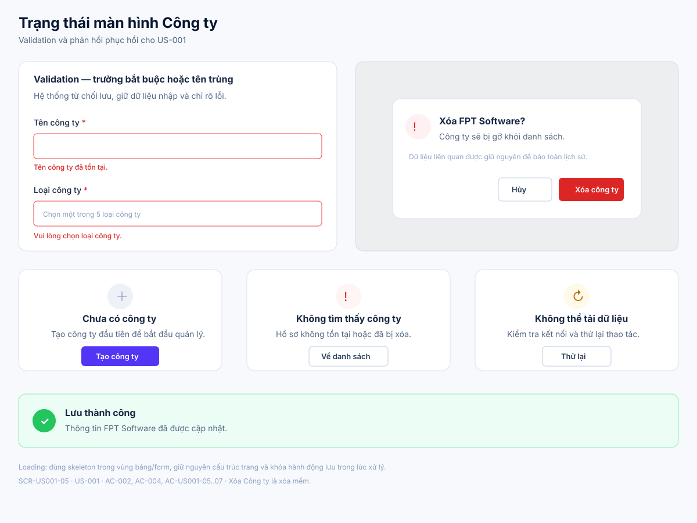

# Business Specification — US-001: Quản lý Công ty (CRUD + chi tiết)

## 1. Document Information

| Field | Value |
|---|---|
| Story | `US-001` — Quản lý Công ty (CRUD + chi tiết) |
| Feature / domain | `FEAT-001` / `D1 — CRM lõi làm tay` / `EPIC-01` |
| Version | `1.2` |
| Status | `SPECIFICATION_APPROVED` |
| Date | `2026-08-14` |
| Priority | Must (17) |
| Sources | `REQ-101`, `BR-001`; `US-001`, `AC-001..004`; `T-1`; DoR review; architect handoff |

## 2. Purpose

**[CONFIRMED — US-001, REQ-101]** Xác định hành vi nghiệp vụ để Sales tạo, xem chi tiết, sửa và xoá hồ sơ Công ty; khi tạo, Tên công ty, Ngành và Loại công ty là ba thông tin bắt buộc, còn các thông tin khác có thể để trống.

## 3. User Story

**[CONFIRMED — US-001]** As a Sales, I want tạo/sửa/xoá/xem chi tiết công ty, so that tôi có hồ sơ khách chuẩn để làm việc và chịu trách nhiệm.

## 4. Business Goal

**[CONFIRMED — US-001]** Sales có hồ sơ khách chuẩn để làm việc và chịu trách nhiệm. **[INFERRED — REQ-101]** Ba thông tin cốt lõi tạo mức thông tin tối thiểu nhất quán cho CRM làm tay.

## 5. Scope

- **[CONFIRMED — REQ-101, US-001]** Sales tạo Công ty, xem danh sách và xem chi tiết Công ty.
- **[CONFIRMED — REQ-101, US-001]** Sales sửa và xoá Công ty.
- **[CONFIRMED — REQ-101, AC-001..003]** Khi tạo, Tên công ty, Ngành và Loại công ty là bắt buộc; các ô khác được phép để trống.
- **[CONFIRMED — BR-001, AC-001]** Loại công ty phải là một trong năm loại được quy định.
- **[CONFIRMED — human decision 2026-08-14]** Quốc gia, Website và Quy mô là ba thông tin tùy chọn của Công ty trong MVP.
- **[CONFIRMED — human decision 2026-08-14]** Tên công ty là duy nhất sau khi bỏ khoảng trắng đầu/cuối và so sánh không phân biệt hoa/thường.
- **[CONFIRMED — human decision 2026-08-14]** Xoá Công ty là xoá mềm; dữ liệu liên quan được giữ nguyên.

## 6. Out of Scope

- **[CONFIRMED — REQ-102, US-002]** Quản lý Người liên hệ và đầu mối chính.
- **[CONFIRMED — REQ-103..112, user-stories]** Cơ hội, giai đoạn, Hoạt động, dòng thời gian, việc tiếp theo, tìm kiếm/lọc và tổng quan.
- **[CONFIRMED — REQ-201..605, function-decomposition]** Các chức năng AI, gợi ý, tự động hoá, theo dõi và quản trị AI.
- Khôi phục hoặc quản lý danh sách Công ty đã xoá.
- Điện thoại, địa chỉ, mô tả/ghi chú và các trường hồ sơ ngoài sáu trường đã chốt.

## 7. Actor / Permission

| Actor | Business permission | Evidence |
|---|---|---|
| Sales | Tạo, xem chi tiết, sửa và xoá Công ty. | **[CONFIRMED]** US-001; REQ-101 |
| A-AI | Không có hành vi tự động nào trong story này; không được tự xoá dữ liệu do người tạo. | **[CONFIRMED]** BR-017; architecture; project rules |
| Quản trị | Tạo, xem chi tiết, sửa và xoá Công ty như Sales. | **[CONFIRMED]** human decision 2026-08-14 |

## 8. Business Rules

| ID | Rule | Evidence |
|---|---|---|
| BR-001 | Loại công ty chỉ thuộc một trong năm giá trị: Traditional, IT Solution, IT Product, Tech-based/Startup, ITO khác. | **[CONFIRMED]** requirement-analysis; PRD §2 |
| BR-US001-01 | Khi tạo, Tên công ty, Ngành và Loại công ty là ba thông tin bắt buộc. | **[CONFIRMED]** REQ-101; AC-001..002 |
| BR-US001-02 | Các ô khác được phép để trống khi tạo Công ty. | **[CONFIRMED]** REQ-101; AC-003 |
| BR-US001-03 | Thiếu một thông tin bắt buộc thì từ chối lưu và chỉ rõ thông tin thiếu. | **[CONFIRMED]** AC-002 |
| BR-US001-04 | Sales có thể sửa một trường rồi lưu, hoặc xoá Công ty; sau xoá Công ty bị gỡ khỏi danh sách. | **[CONFIRMED]** AC-004 |
| BR-US001-05 | A-AI không được tự xoá dữ liệu Công ty do người tạo. | **[CONFIRMED]** BR-017; project rules |
| BR-US001-06 | Tên công ty là duy nhất sau khi bỏ khoảng trắng đầu/cuối và so sánh không phân biệt hoa/thường. Tên trùng bị từ chối và phải được chỉ rõ tại trường Tên công ty. | **[CONFIRMED]** human decision 2026-08-14 |
| BR-US001-07 | Khi sửa, Tên công ty, Ngành và Loại công ty tiếp tục là thông tin bắt buộc. | **[CONFIRMED]** human decision 2026-08-14 |
| BR-US001-08 | Xoá Công ty là xoá mềm: Công ty không còn xuất hiện trong danh sách và chi tiết thông thường, còn toàn bộ dữ liệu liên quan được giữ nguyên. | **[CONFIRMED]** human decision 2026-08-14 |
| BR-US001-09 | Sales và Quản trị đều được tạo, xem chi tiết, sửa và xoá Công ty. | **[CONFIRMED]** human decision 2026-08-14 |

## 9. Business Data Dictionary

| Business data | Meaning | Applicability / rule | Evidence |
|---|---|---|---|
| Công ty | Một pháp nhân khách hàng tiềm năng hoặc đang giao dịch. | Đối tượng Sales quản lý trong story. | **[CONFIRMED]** PRD §2; US-001 |
| Tên công ty | Tên của Công ty. | Bắt buộc khi tạo và sửa; duy nhất theo BR-US001-06. | **[CONFIRMED]** REQ-101; AC-001..002; human decision 2026-08-14 |
| Ngành | Ngành của Công ty. | Bắt buộc khi tạo và sửa. | **[CONFIRMED]** REQ-101; AC-001..002; human decision 2026-08-14 |
| Loại công ty | Phân loại Công ty theo năm loại ITO. | Bắt buộc khi tạo và sửa; thuộc BR-001. | **[CONFIRMED]** REQ-101; BR-001; AC-001..002; human decision 2026-08-14 |
| Quốc gia | Quốc gia nơi Công ty hoạt động. | Tùy chọn. | **[CONFIRMED]** PRD §3; human decision 2026-08-14 |
| Website | Địa chỉ website của Công ty. | Tùy chọn. | **[CONFIRMED]** PRD §3; human decision 2026-08-14 |
| Quy mô | Quy mô của Công ty. | Tùy chọn. | **[CONFIRMED]** PRD §3; human decision 2026-08-14 |
| Trạng thái xoá | Cho biết Công ty đã bị xoá mềm hay chưa. | Công ty đã xoá không xuất hiện trong các luồng sử dụng thông thường. | **[CONFIRMED]** human decision 2026-08-14 |

## 10. Business Flow

**BF-001-01 — Tạo Công ty.** **[CONFIRMED — AC-001..003; human decision 2026-08-14]** Sales hoặc Quản trị nhập ba thông tin bắt buộc, có thể nhập Quốc gia, Website và Quy mô, rồi lưu. Nếu thiếu trường bắt buộc, Loại công ty không hợp lệ hoặc Tên công ty bị trùng theo BR-US001-06, hệ thống từ chối lưu và chỉ rõ lỗi tại trường tương ứng. Nếu hợp lệ, Công ty được tạo và hiện ở danh sách.

**BF-001-02 — Xem Công ty.** **[CONFIRMED — US-001, REQ-101]** Sales xem danh sách Công ty và mở chi tiết một Công ty để xem hồ sơ.

**BF-001-03 — Sửa Công ty.** **[CONFIRMED — AC-004; human decision 2026-08-14]** Sales hoặc Quản trị thay đổi một trường của Công ty đang tồn tại rồi lưu. Ba trường bắt buộc và quy tắc tên duy nhất được kiểm tra như khi tạo. Nếu hợp lệ, thay đổi được ghi nhận và người dùng trở về chi tiết Công ty; nếu không, dữ liệu đang nhập được giữ để sửa lỗi.

**BF-001-04 — Xoá Công ty.** **[CONFIRMED — AC-004; human decision 2026-08-14]** Sales hoặc Quản trị yêu cầu xoá và xác nhận. Hệ thống xoá mềm Công ty, đưa người dùng về danh sách và không còn cho mở Công ty qua luồng thông thường; dữ liệu liên quan được giữ nguyên.

## 11. Acceptance Criteria

**AC-001 — Tạo công ty đủ trường bắt buộc**

```gherkin
Scenario: Tạo công ty đủ trường bắt buộc
  Given tôi ở màn hình tạo công ty
  When tôi nhập tên, ngành, loại công ty (1 trong 5 loại) và lưu
  Then công ty được tạo và hiện ở danh sách.
```

**AC-002 — Thiếu trường bắt buộc**

```gherkin
Scenario: Thiếu trường bắt buộc
  Given tôi đang tạo công ty
  When tôi bỏ trống tên hoặc ngành hoặc loại công ty và lưu
  Then hệ thống từ chối lưu và chỉ rõ trường còn thiếu.
```

**AC-003 — Ô tuỳ chọn bỏ trống**

```gherkin
Scenario: Ô tuỳ chọn bỏ trống
  Given tôi tạo công ty chỉ với 3 trường bắt buộc
  When tôi lưu
  Then công ty vẫn được tạo với các ô còn lại để trống.
```

**AC-004 — Sửa và xoá**

```gherkin
Scenario: Sửa và xoá
  Given một công ty đã tồn tại
  When tôi sửa một trường rồi lưu / hoặc xoá công ty
  Then thay đổi được ghi / công ty bị gỡ khỏi danh sách.
```

**[CONFIRMED — user-stories]** Bốn acceptance criteria trên được bảo toàn nguyên nghĩa từ nguồn.

**AC-US001-05 — Tên công ty duy nhất**

```gherkin
Scenario: Từ chối tên công ty bị trùng
  Given đã tồn tại công ty có tên "HBLAB"
  When Sales hoặc Quản trị tạo hay đổi tên một công ty thành " hblab "
  Then hệ thống từ chối lưu và chỉ rõ rằng Tên công ty đã tồn tại.
```

**AC-US001-06 — Quy tắc bắt buộc khi chỉnh sửa**

```gherkin
Scenario: Từ chối chỉnh sửa làm thiếu thông tin bắt buộc
  Given một công ty đang hoạt động
  When Sales hoặc Quản trị xoá trống Tên công ty, Ngành hoặc Loại công ty rồi lưu
  Then hệ thống từ chối lưu, chỉ rõ trường còn thiếu và giữ dữ liệu đang nhập.
```

**AC-US001-07 — Xoá mềm Công ty**

```gherkin
Scenario: Xoá Công ty nhưng giữ dữ liệu liên quan
  Given một công ty đang hoạt động và có dữ liệu liên quan
  When Sales hoặc Quản trị xác nhận xoá công ty
  Then công ty không còn trong danh sách và chi tiết thông thường
  And dữ liệu liên quan của công ty vẫn được giữ nguyên.
```

**AC-US001-08 — Quyền của Sales và Quản trị**

```gherkin
Scenario Outline: Vai trò được quản lý Công ty
  Given tôi đăng nhập với vai trò <vai trò>
  When tôi sử dụng chức năng tạo, xem, sửa hoặc xoá Công ty
  Then hệ thống cho phép tôi thực hiện chức năng theo cùng quy tắc nghiệp vụ.

  Examples:
    | vai trò |
    | Sales |
    | Quản trị |
```

## 12. Screen Specification

| Screen ID | Business area | Required information / behavior | Evidence |
|---|---|---|---|
| `SCR-US001-01` | Danh sách Công ty | Sales hoặc Quản trị xem các Công ty chưa xoá với Tên, Ngành, Loại, Quốc gia, Quy mô và Website; có thể mở chi tiết, tạo, sửa hoặc yêu cầu xoá. | **[CONFIRMED]** US-001; AC-001; AC-004; human decision 2026-08-14 |
| `SCR-US001-02` | Chi tiết Công ty | Hiển thị sáu trường đã chốt của Công ty chưa xoá và hành động chỉnh sửa hoặc xoá. | **[CONFIRMED]** US-001; REQ-101; human decision 2026-08-14 |
| `SCR-US001-03` | Tạo Công ty | Thu thập ba trường bắt buộc và ba trường tùy chọn; hiển thị lỗi thiếu, loại không hợp lệ hoặc tên trùng tại trường tương ứng. | **[CONFIRMED]** AC-001..003; AC-US001-05 |
| `SCR-US001-04` | Chỉnh sửa Công ty | Hiển thị dữ liệu hiện tại và áp dụng cùng quy tắc bắt buộc, loại hợp lệ và tên duy nhất như khi tạo. | **[CONFIRMED]** AC-004; AC-US001-05..06 |
| `SCR-US001-05` | Trạng thái và phản hồi | Chỉ rõ lỗi validation; minh hoạ empty, loading, not-found, lỗi có thể thử lại, xác nhận xoá mềm và phản hồi lưu thành công. | **[CONFIRMED]** AC-002; AC-004; AC-US001-05..07 |

## 13. Screen Design

> **UI-DESIGN UPDATE — 2026-08-14:** Hướng trình bày chi tiết được người dùng duyệt theo ảnh tham chiếu: nền sáng, card viền mảnh, bảng dữ liệu, biểu mẫu phân nhóm và hành động chính màu tím. Các asset là SVG Git-friendly, không quyết định framework, component library hoặc cách triển khai.

### 13.1 Tổng quan luồng



### 13.2 `SCR-US001-01` — Danh sách Công ty



### 13.3 `SCR-US001-02` — Chi tiết Công ty



### 13.4 `SCR-US001-03` — Tạo Công ty



### 13.5 `SCR-US001-04` — Chỉnh sửa Công ty



### 13.6 `SCR-US001-05` — Trạng thái và phản hồi



Các SVG chỉ hiển thị sáu trường đã chốt: Tên công ty, Ngành, Loại công ty, Quốc gia, Website và Quy mô.

## 14. Screen States

| State | Visible business outcome | Screen / asset | Evidence |
|---|---|---|---|
| Tạo với đủ ba thông tin bắt buộc | Công ty được tạo và hiện trong danh sách. | `SCR-US001-03` → `SCR-US001-01` | **[CONFIRMED]** AC-001 |
| Tạo thiếu Tên công ty | Không lưu và chỉ rõ Tên công ty thiếu. | `SCR-US001-05` | **[CONFIRMED]** AC-002 |
| Tạo thiếu Ngành | Không lưu và chỉ rõ Ngành thiếu. | `SCR-US001-05`; cùng mẫu validation cạnh trường | **[CONFIRMED]** AC-002 |
| Tạo thiếu Loại công ty | Không lưu và chỉ rõ Loại công ty thiếu. | `SCR-US001-05` | **[CONFIRMED]** AC-002 |
| Tạo chỉ với ba thông tin bắt buộc | Công ty được tạo; thông tin khác để trống. | `SCR-US001-03` | **[CONFIRMED]** AC-003 |
| Tạo hoặc đổi tên sang tên đã tồn tại | Không lưu, giữ dữ liệu đang nhập và chỉ rõ Tên công ty đã tồn tại. | `SCR-US001-03`, `SCR-US001-04`, `SCR-US001-05` | **[CONFIRMED]** AC-US001-05 |
| Sửa Công ty | Hiển thị phản hồi thành công và dữ liệu mới được ghi. | `SCR-US001-04`, `SCR-US001-05` | **[CONFIRMED]** AC-004 |
| Sửa làm thiếu trường bắt buộc | Không lưu, giữ dữ liệu đang nhập và chỉ rõ trường thiếu. | `SCR-US001-04`, `SCR-US001-05` | **[CONFIRMED]** AC-US001-06 |
| Yêu cầu xoá Công ty | Hiển thị xác nhận xoá mềm; sau khi xác nhận, Công ty bị gỡ khỏi danh sách nhưng dữ liệu liên quan được giữ nguyên. | `SCR-US001-05` → `SCR-US001-01` | **[CONFIRMED]** AC-004; AC-US001-07 |
| Danh sách trống | Hiển thị empty state và hành động Tạo công ty. | `SCR-US001-05` | **[CONFIRMED]** approved design 2026-08-14 |
| Không tìm thấy / lỗi có thể phục hồi | Cho phép về danh sách hoặc thử tải lại; lỗi lưu giữ dữ liệu đang nhập. | `SCR-US001-05` | **[CONFIRMED]** approved design 2026-08-14 |

## 15. Validation

| Condition | Expected business response | Evidence |
|---|---|---|
| Thiếu Tên công ty, Ngành hoặc Loại công ty khi tạo | Từ chối lưu và chỉ rõ thông tin thiếu. | **[CONFIRMED]** AC-002 |
| Loại công ty ngoài năm loại BR-001 | Từ chối lưu và chỉ rõ Loại công ty không hợp lệ. | **[CONFIRMED]** BR-001; approved design 2026-08-14 |
| Chỉ có ba thông tin bắt buộc | Cho phép tạo; các ô khác để trống. | **[CONFIRMED]** AC-003 |
| Tên công ty trùng sau khi trim và so sánh không phân biệt hoa/thường | Từ chối lưu và chỉ rõ Tên công ty đã tồn tại. | **[CONFIRMED]** BR-US001-06; AC-US001-05 |
| Sửa làm thiếu thông tin bắt buộc | Từ chối lưu, giữ dữ liệu đang nhập và chỉ rõ trường thiếu. | **[CONFIRMED]** BR-US001-07; AC-US001-06 |

## 16. Dependencies

| Direction | Item | Dependency | Evidence |
|---|---|---|---|
| Downstream | US-002 / FEAT-002 | Quản lý Người liên hệ diễn ra dưới một Công ty. | **[CONFIRMED]** REQ-102; function-decomposition |
| Downstream | US-003 / FEAT-003 | Quản lý Cơ hội diễn ra thuộc một Công ty. | **[CONFIRMED]** REQ-103; function-decomposition |
| Cross-cutting | US-040 / FEAT-040 | Ràng buộc chặn A-AI tự xoá dữ liệu do người tạo áp dụng cho Công ty. | **[CONFIRMED]** BR-017; architect handoff |
| Acceptance | T-1 | CRM lõi, gồm tạo Công ty, hoạt động khi toàn bộ AI tắt. | **[CONFIRMED]** PRD §6; REQ-113; architect handoff |

## 17. Business-level NFR Expectations

- **[CONFIRMED — REQ-113; PRD §6]** CRM làm tay của story hoạt động khi toàn bộ AI tắt; T-1 bao gồm tạo Công ty trong điều kiện này.
- **[CONFIRMED — REQ-704; architecture]** Dữ liệu CRM được kỳ vọng bền qua khởi động lại trong triển khai sản phẩm; đây là kỳ vọng cấp hệ thống, không thêm quy tắc dữ liệu cho US-001.
- **[CONFIRMED — human decision 2026-08-14]** US-001 không đặt SLA riêng; áp dụng kỳ vọng chất lượng chung của hệ thống.

## 18. Test Scenarios

Chưa có `test-scenarios.md` riêng cho US-001. Các tình huống dưới đây là truy vết nghiệp vụ, không phải kiểm thử thực thi; chúng đóng góp vào bộ nghiệm thu **T-1**. **[CONFIRMED — architect handoff; PRD §6]**

| ID | Business scenario | AC / BR | Expected business result | Acceptance trace |
|---|---|---|---|---|
| TC-001 | Sales tạo Công ty với ba thông tin bắt buộc, gồm Loại công ty thuộc BR-001. | AC-001; BR-001 | Công ty được tạo và hiện ở danh sách. | T-1 |
| TC-002 | Sales lần lượt bỏ trống Tên công ty, Ngành hoặc Loại công ty khi tạo. | AC-002; BR-US001-01..03 | Mỗi trường hợp bị từ chối lưu và nêu đúng thông tin thiếu. | T-1 |
| TC-003 | Sales chỉ cung cấp ba thông tin bắt buộc khi tạo. | AC-003; BR-US001-02 | Công ty được tạo; thông tin khác để trống. | T-1 |
| TC-004 | Sales mở chi tiết một Công ty đã tồn tại. | US-001 | Sales xem được hồ sơ Công ty đã chọn. | T-1 |
| TC-005 | Sales sửa một trường của Công ty đang tồn tại rồi lưu. | AC-004 | Thay đổi được ghi nhận. | T-1 |
| TC-006 | Sales xoá một Công ty đang tồn tại. | AC-004 | Công ty bị gỡ khỏi danh sách. | T-1 |
| TC-007 | Sales hoặc Quản trị tạo hay đổi tên thành tên đã tồn tại, khác hoa/thường hoặc có khoảng trắng thừa. | AC-US001-05; BR-US001-06 | Bị từ chối lưu và chỉ rõ Tên công ty đã tồn tại. | T-1 |
| TC-008 | Sales hoặc Quản trị sửa làm trống từng trường bắt buộc. | AC-US001-06; BR-US001-07 | Bị từ chối lưu, dữ liệu nhập được giữ và trường thiếu được chỉ rõ. | T-1 |
| TC-009 | Sales hoặc Quản trị xoá Công ty có dữ liệu liên quan. | AC-US001-07; BR-US001-08 | Công ty bị ẩn khỏi luồng thường; dữ liệu liên quan còn nguyên. | T-1 |
| TC-010 | Lần lượt dùng vai trò Sales và Quản trị cho bốn thao tác CRUD. | AC-US001-08; BR-US001-09 | Cả hai vai trò đều thao tác được theo cùng quy tắc. | T-1 |
| TC-011 | Tạo hoặc sửa với Loại công ty ngoài năm giá trị BR-001. | BR-001 | Bị từ chối lưu và chỉ rõ Loại công ty không hợp lệ. | T-1 |

## 19. Traceability

| Chain | Evidence |
|---|---|
| `D1 → EPIC-01 → FEAT-001 → US-001 → AC-001..004 → T-1` | **[CONFIRMED]** function-decomposition; user-stories; architect handoff |
| `REQ-101 → FEAT-001 → US-001 → AC-001..004` | **[CONFIRMED]** requirement-analysis; user-stories |
| `BR-001 → US-001 → AC-001 → TC-001` | **[CONFIRMED]** requirement-analysis; user-stories |
| `AC-002 → TC-002`; `AC-003 → TC-003`; `AC-004 → TC-005..006` | **[CONFIRMED]** user-stories |
| `REQ-113 → T-1 → US-001` | **[CONFIRMED]** requirement-analysis; PRD §6; architect handoff |
| `BR-017 → US-040 → BR-US001-05` | **[CONFIRMED]** requirement-analysis; architecture; project rules |
| `human decision 2026-08-14 → BR-US001-06..09 → AC-US001-05..08 → TC-007..010` | **[CONFIRMED]** approved brainstorming design |

## 20. Assumptions

| ID | Assumption | Rationale / status |
|---|---|---|
| A-001-01 | Bố cục và visual language tiếp tục theo hướng đã duyệt ngày 2026-08-14: nền sáng, card viền mảnh, bảng dữ liệu, biểu mẫu phân nhóm và hành động chính màu tím. | **[ASSUMPTION]** Không quyết định framework hoặc component library. |
| A-001-02 | Truy cập Công ty đã xoá qua luồng thông thường được biểu diễn bằng trạng thái không tìm thấy; chức năng khôi phục nằm ngoài US-001. | **[ASSUMPTION]** Phù hợp quyết định xoá mềm và ranh giới MVP. |

## 21. Open Questions

Không còn câu hỏi nghiệp vụ mở cho phạm vi US-001. Sáu câu hỏi của phiên bản 1.1 đã được người dùng quyết định ngày 2026-08-14.

## 22. Definition of Ready

| Check | Status | Evidence / note |
|---|---|---|
| Actor và giá trị nghiệp vụ rõ ràng | Ready | **[CONFIRMED]** US-001; DoR review |
| Phạm vi và AC nguồn truy vết được | Ready | **[CONFIRMED]** REQ-101; AC-001..004; DoR review |
| BR-001 và ba thông tin bắt buộc rõ ràng | Ready | **[CONFIRMED]** requirement-analysis; AC-001..003 |
| Phụ thuộc và T-1 đã nhận diện | Ready | **[CONFIRMED]** architect handoff; DoR review |
| Câu hỏi nghiệp vụ được quyết định hoặc được PO chấp nhận làm mở | Ready | Sáu câu hỏi của phiên bản 1.1 đã được quyết định ngày 2026-08-14. |
| Đánh giá DoR của nguồn | READY | **[CONFIRMED]** `docs/02-analysis/dor-review.md` |

**[CONFIRMED — human-approval rule]** Tài liệu dừng tại `AWAITING_SPECIFICATION_APPROVAL`; chỉ con người có thể đặt `SPECIFICATION_APPROVED`.

## 23. Technical Handoff

| Type | Constraint, touchpoint, risk or decision for Tech Lead | Evidence |
|---|---|---|
| Constraint | `AutomationPolicyGuard` phải ràng buộc việc xoá do tác nhân tự động; A-AI không được tự xoá dữ liệu do người tạo, kể cả ngoài giao diện. | **[CONFIRMED]** project rules; architecture; BR-017 |
| Touchpoint | Công ty là ngữ cảnh nghiệp vụ cho Người liên hệ và Cơ hội ở các story downstream. | **[CONFIRMED]** REQ-102..103; function-decomposition |
| Acceptance constraint | Hành vi CRM làm tay của US-001 vẫn dùng được khi AI tắt, theo T-1. | **[CONFIRMED]** REQ-113; PRD §6 |
| Decision | Tên công ty duy nhất theo giá trị trim và không phân biệt hoa/thường; áp dụng khi tạo và đổi tên. | **[CONFIRMED]** BR-US001-06; AC-US001-05 |
| Decision | Xoá là xoá mềm; mọi dữ liệu liên quan được giữ nguyên và Công ty đã xoá bị loại khỏi luồng truy cập thông thường. | **[CONFIRMED]** BR-US001-08; AC-US001-07 |
| Decision | Quốc gia, Website và Quy mô là ba trường tùy chọn; Sales và Quản trị có cùng quyền CRUD Công ty. | **[CONFIRMED]** human decision 2026-08-14 |

## 24. Change Log

| Version | Date | Change | Author/Approver |
|---|---|---|---|
| 1.2 | 2026-08-14 | Chốt sáu câu hỏi mở: trường tùy chọn, loại không hợp lệ, xoá mềm, validation khi sửa, quyền Quản trị và NFR; bổ sung tên công ty duy nhất, AC/test truy vết và đồng bộ SVG theo sáu trường MVP. | Codex — design and written specification approved by user |
| 1.1 | 2026-08-14 | Bổ sung năm màn hình SVG chi tiết `SCR-US001-01..05`, liên kết trực tiếp trong specification và truy vết trạng thái tới AC-001..004; giữ các trường tùy chọn ở mức minh hoạ do Q-001-01 còn mở. | Codex — UI direction approved by user; specification approval unchanged |
| 1.0 | 2026-08-14 | Chuẩn hoá theo template 24 mục; bảo toàn US-001 / FEAT-001 / REQ-101 / BR-001 / AC-001..004 / T-1; loại nội dung kỹ thuật và chuyển quyết định chưa có nguồn thành câu hỏi nghiệp vụ. | Codex — awaiting human specification approval |
