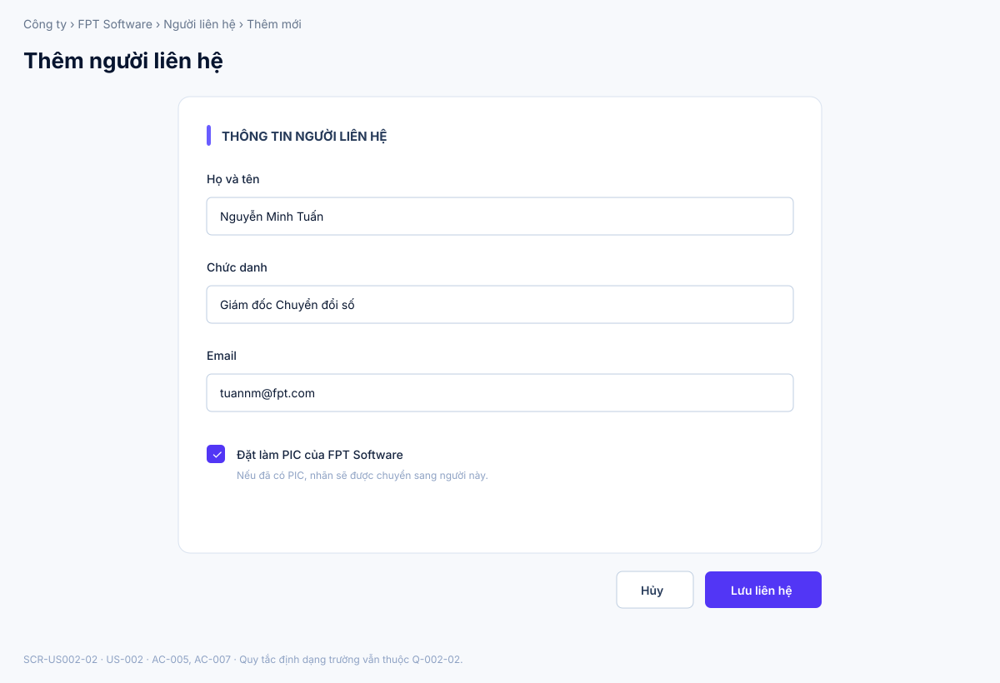
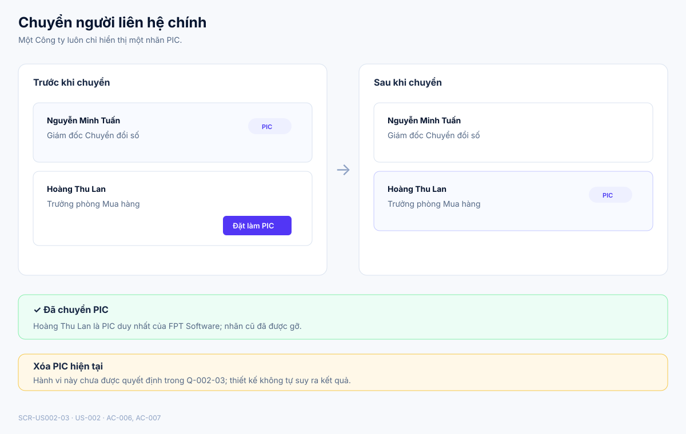

# Business Specification — US-002: Contacts and primary contact
## 1. Document Information
| Field | Value |
|---|---|
| Story / feature | `US-002` / `FEAT-002` (D1) |
| Version | `1.1` |
| Status / sources | `AWAITING_SPECIFICATION_APPROVAL`; `REQ-102`, `BR-002`, `AC-005..007` |
## 2. Purpose
**[CONFIRMED — REQ-102]** Manage contacts under a company and identify one primary contact (PIC).
## 3. User Story
**[CONFIRMED — US-002]** As Sales, I want contacts and exactly one PIC so I know whom to approach.
## 4. Business Goal
**[CONFIRMED — US-002]** Sales maintains the right human contact for each company.
## 5. Scope
**[CONFIRMED — AC-005..007]** Add, edit, delete contacts with name, title, email; each belongs to one company; transferring PIC makes the new contact the sole PIC.
## 6. Out of Scope
**[CONFIRMED — REQ-101,103]** Company CRUD and opportunities; outbound customer contact is prohibited by BR-017.
## 7. Actor / Permission
Sales manages contacts/PIC. **[CONFIRMED — AC-005..007]** Admin permissions are **[OPEN QUESTION — Q-002-01]**.
## 8. Business Rules
`BR-US002-01`: Contact belongs to exactly one company. `BR-US002-02`: Each company has exactly one PIC; selecting another transfers the label. `BR-US002-03`: add/edit/delete changes are recorded. **[CONFIRMED — BR-002; AC-005..007]**
## 9. Business Data Dictionary
Contact: person with name/title/email; PIC: the company’s sole primary contact; Company: contact’s parent. **[CONFIRMED — REQ-102; BR-002]**
## 10. Business Flow
Sales adds a contact; selects a PIC; selecting another contact transfers PIC; Sales may edit/delete. **[CONFIRMED — AC-005..007]**
## 11. Acceptance Criteria
### AC-005 — Add contact
```gherkin
Given a company When Sales adds name, title and email Then the contact belongs to that company.
```
### AC-006 — One PIC
```gherkin
Given a company with a PIC When Sales marks another contact PIC Then the new contact is PIC and the old one is not.
```
### AC-007 — Edit/delete
```gherkin
Given an existing contact When Sales edits or deletes it Then the change is recorded.
```
## 12. Screen Specification
| Screen ID | Business area | Required behavior | Evidence |
|---|---|---|---|
| `SCR-US002-01` | Danh sách Người liên hệ | Hiển thị người liên hệ thuộc đúng Công ty, PIC duy nhất và hành động thêm/sửa/xóa/chuyển PIC. | **[CONFIRMED]** AC-005..007; BR-US002-01..02 |
| `SCR-US002-02` | Thêm/Sửa Người liên hệ | Thu thập tên, chức danh, email trong ngữ cảnh Công ty; cho phép chọn người này làm PIC. | **[CONFIRMED]** AC-005; AC-007 |
| `SCR-US002-03` | Trạng thái PIC | Thể hiện trước/sau khi chuyển nhãn: PIC mới là duy nhất và PIC cũ mất nhãn. | **[CONFIRMED]** AC-006; BR-US002-02 |
## 13. Screen Design

> **UI-DESIGN UPDATE — 2026-08-14:** Wireframe BA dưới đây được tạo từ các US/AC hiện hành và thay thế trạng thái “chưa có asset” được ghi nhận trước bước UI Design.


### `SCR-US002-01` — Danh sách Người liên hệ


### `SCR-US002-02` — Thêm/Sửa Người liên hệ


### `SCR-US002-03` — Trạng thái chuyển PIC


**[ASSUMPTION — A-002-01]** Visual language kế thừa hướng UI đã được người dùng duyệt cho US-001; không tự quyết định validation trường hoặc hành vi xóa PIC đang mở tại Q-002-02..03.
## 14. Screen States
| State | Visible outcome | Screen | Evidence |
|---|---|---|---|
| Contact present | Người liên hệ hiển thị dưới đúng Công ty. | `SCR-US002-01` | **[CONFIRMED]** AC-005 |
| Sole PIC assigned | Chỉ một người có nhãn PIC. | `SCR-US002-01` | **[CONFIRMED]** AC-006 |
| Replacement PIC assigned | Nhãn chuyển sang người mới và bị gỡ khỏi người cũ. | `SCR-US002-03` | **[CONFIRMED]** AC-006 |
| Edited/deleted result | Danh sách phản ánh thay đổi đã ghi. | `SCR-US002-01`, `SCR-US002-02` | **[CONFIRMED]** AC-007 |
## 15. Validation
One-company and exactly-one-PIC invariants apply. Name/title/email format and deleting PIC behavior are **[OPEN QUESTION — Q-002-02..003]**.
## 16. Dependencies
US-001 provides company context; US-040 guardrails prohibit AI deletion of human-created data. **[CONFIRMED — US-002 dependency; BR-017]**
## 17. Business-level NFR Expectations
Manual CRM remains available when AI is disabled. **[CONFIRMED — REQ-113]**
## 18. Test Scenarios
| ID | Scenario | AC / rule |
|---|---|---|
| TC-002-01 | Add contact to a company. | AC-005; BR-US002-01 |
| TC-002-02 | Transfer PIC to another contact. | AC-006; BR-US002-02 |
| TC-002-03 | Edit and delete a contact. | AC-007; BR-US002-03 |
## 19. Traceability
`REQ-102 → EPIC-01 → FEAT-002 → US-002 → AC-005..007 → TC-002-01..03`. **[CONFIRMED — architect handoff]**
## 20. Assumptions
`A-002-01`: visual language dùng mẫu đã được duyệt cho US-001; các chi tiết ngoài AC không đóng Q-002-01..03. **[ASSUMPTION]**
## 21. Open Questions
`Q-002-01`: Admin permission? `Q-002-02`: field validation? `Q-002-03`: handling deletion of current PIC? **[OPEN QUESTION — PO]**
## 22. Definition of Ready
**READY. [CONFIRMED — dor-review]** Actor, AC, dependencies, traceability known; questions do not alter AC.
## 23. Technical Handoff
Preserve one-company/one-PIC business invariant and functional change record; manual flow has no AI dependency. Do not add endpoints, schemas, migrations, source tasks, monitoring, telemetry, log shipping, or prompt logs. **[CONFIRMED — project rules]**
## 24. Change Log
| Version | Date | Change | Author/Approver |
|---|---|---|---|
| 1.1 | 2026-08-14 | Added three detailed SVG screens and mapped UI states to AC-005..007 without resolving open PIC deletion/field-validation questions. | Codex — UI pattern approved; specification approval unchanged |
| 1.0 | 2026-08-14 | Created US-002 specification. | Codex / awaiting human specification approval |
