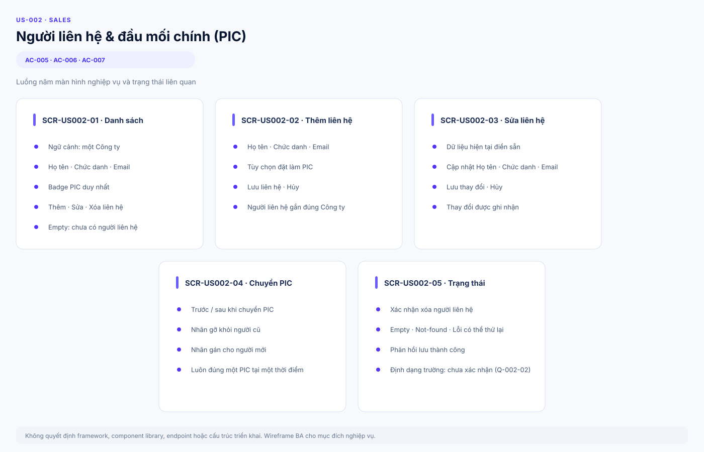
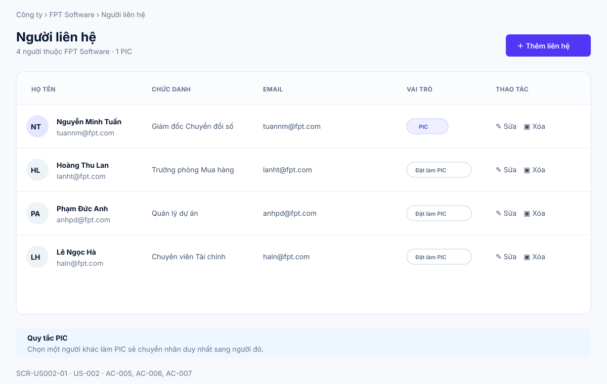
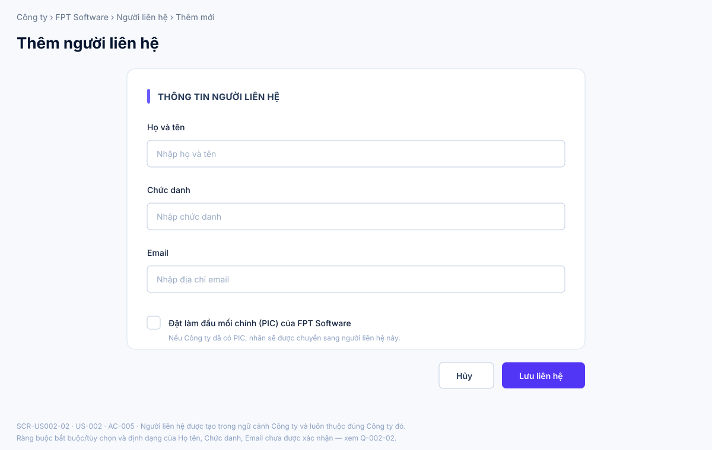
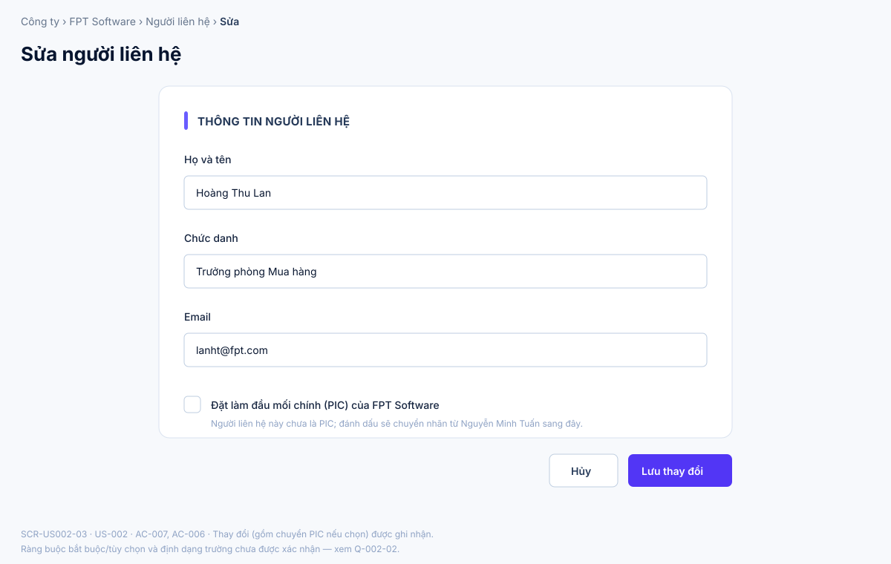
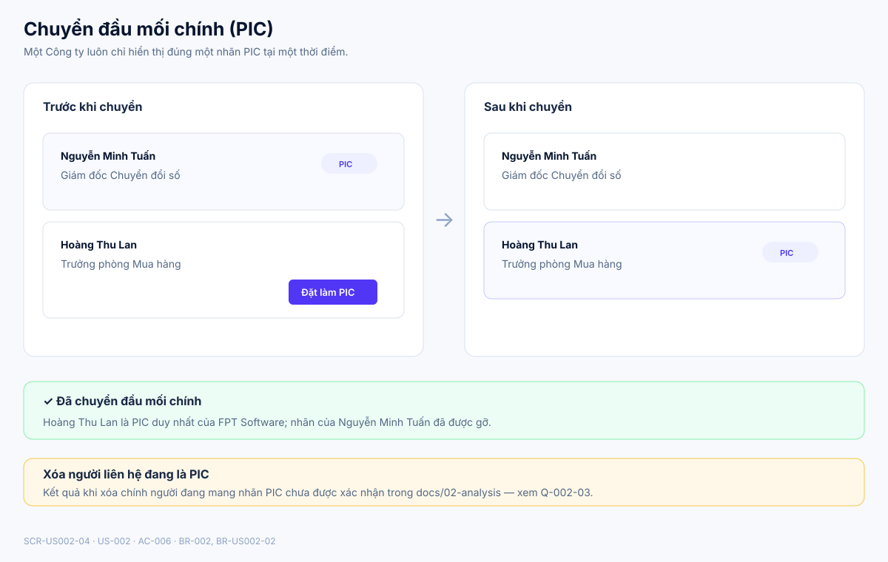
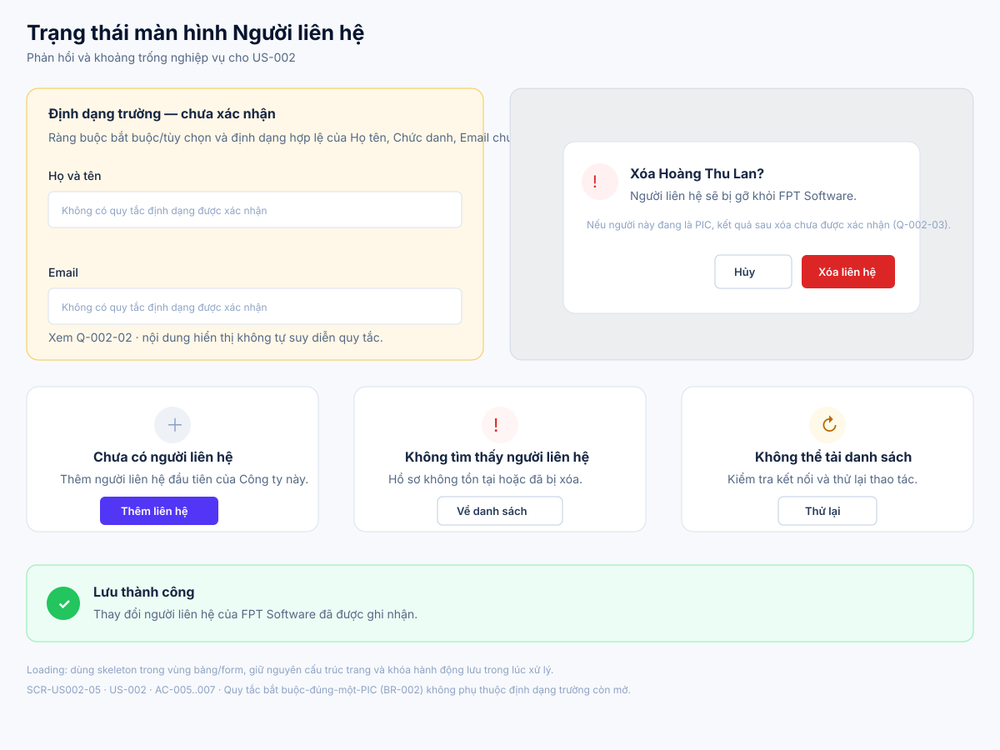

# Business Specification — US-002: Người liên hệ & đầu mối chính (PIC)

## 1. Document Information

| Field | Value |
|---|---|
| Story | `US-002` — Người liên hệ & đầu mối chính (PIC) |
| Feature / domain | `FEAT-002` / `D1 — CRM lõi làm tay` / `EPIC-01` |
| Version | `1.2` |
| Status | `AWAITING_SPECIFICATION_APPROVAL` |
| Date | `2026-08-15` |
| Priority | Should (12) — giữ trong phạm vi vì T-1 bắt buộc "người liên hệ" |
| Sources | `REQ-102`, `BR-002`; `US-002`, `AC-005..007`; `T-1`; DoR review; architect handoff |

## 2. Purpose

**[CONFIRMED — US-002, REQ-102]** Xác định hành vi nghiệp vụ để Sales quản lý Người liên hệ dưới một Công ty và chỉ định đúng một đầu mối chính (PIC), để biết ai là người sở hữu nỗi đau (PIC) và tiếp cận đúng người.

## 3. User Story

**[CONFIRMED — US-002]** As a Sales, I want quản lý người liên hệ dưới công ty và chỉ định đúng một đầu mối chính, so that tôi biết ai là người sở hữu nỗi đau (PIC) để tiếp cận đúng người.

## 4. Business Goal

**[CONFIRMED — US-002]** Sales biết ai là người sở hữu nỗi đau (PIC) để tiếp cận đúng người. **[INFERRED — REQ-102; BR-002]** Ràng buộc đúng-một-PIC giữ cho mỗi Công ty luôn có một đầu mối liên hệ rõ ràng, tránh mơ hồ khi Sales cần liên hệ khách.

## 5. Scope

- **[CONFIRMED — REQ-102; AC-005]** Sales thêm Người liên hệ vào một Công ty với họ tên, chức danh và email.
- **[CONFIRMED — BR-002; AC-006]** Sales chỉ định một Người liên hệ làm đầu mối chính (PIC); mỗi Công ty có đúng một PIC tại một thời điểm.
- **[CONFIRMED — AC-006]** Khi Sales đánh dấu một Người liên hệ khác làm PIC, hệ thống tự động chuyển nhãn: gỡ khỏi người cũ, gán cho người mới.
- **[CONFIRMED — AC-007]** Sales sửa hoặc xoá một Người liên hệ đã tồn tại; thay đổi được ghi nhận.
- **[CONFIRMED — dor-review; backlog-prioritization]** FEAT-002 được giữ trong phạm vi phát triển dù MoSCoW là Should (Score 12), vì T-1 (nghiệm thu CRM lõi) yêu cầu năng lực "người liên hệ" hoạt động khi AI tắt.

## 6. Out of Scope

- **[CONFIRMED — REQ-101, US-001]** Quản lý Công ty (CRUD Công ty) — thuộc US-001.
- **[CONFIRMED — REQ-103, US-003]** Quản lý Cơ hội — thuộc US-003.
- **[CONFIRMED — REQ-201..605; function-decomposition]** Các chức năng đọc nguồn, rút phát hiện, gợi ý, tự động hoá, theo dõi và quản trị AI.
- **[CONFIRMED — BR-017; architecture]** A-AI không được tự liên hệ khách qua các kênh của Người liên hệ và không được tự xoá dữ liệu Người liên hệ do người tạo.
- Số điện thoại, địa chỉ, ghi chú và các trường hồ sơ Người liên hệ ngoài ba trường họ tên/chức danh/email nêu trong AC-005 — không có nguồn xác nhận các trường này thuộc phạm vi US-002.
- Nhiều đầu mối chính đồng thời cho một Công ty — nằm ngoài phạm vi theo BR-002 (đúng một PIC).

## 7. Actor / Permission

| Actor | Business permission | Evidence |
|---|---|---|
| Sales | Thêm, sửa, xoá Người liên hệ và chỉ định/chuyển đầu mối chính (PIC) dưới một Công ty. | **[CONFIRMED]** US-002; REQ-102; AC-005..007 |
| A-AI | Không có hành vi tự động nào trong story này; không được tự xoá dữ liệu Người liên hệ do người tạo và không được tự liên hệ khách qua các kênh của Người liên hệ. | **[CONFIRMED]** BR-017; architecture; project rules |
| Quản trị | Quyền quản lý Người liên hệ/PIC của Quản trị chưa có nguồn xác nhận trong docs/02-analysis (khác với US-001, nơi quyền này đã được quyết định). | **[OPEN QUESTION — Q-002-01]** |

## 8. Business Rules

| ID | Rule | Evidence |
|---|---|---|
| BR-002 | Người liên hệ thuộc đúng một Công ty; mỗi Công ty có đúng một đầu mối chính (PIC). | **[CONFIRMED]** requirement-analysis |
| BR-US002-01 | Người liên hệ được tạo trong ngữ cảnh một Công ty và luôn thuộc đúng Công ty đó. | **[CONFIRMED]** AC-005 |
| BR-US002-02 | Tại một thời điểm, mỗi Công ty có đúng một Người liên hệ mang nhãn đầu mối chính; đánh dấu một Người liên hệ khác làm PIC sẽ chuyển nhãn sang người mới và gỡ nhãn khỏi người cũ. | **[CONFIRMED]** BR-002; AC-006 |
| BR-US002-03 | Sales có thể sửa hoặc xoá một Người liên hệ đã tồn tại; thay đổi được ghi nhận. | **[CONFIRMED]** AC-007 |
| BR-US002-04 | A-AI không được tự xoá dữ liệu Người liên hệ do người tạo. | **[CONFIRMED]** BR-017; project rules |

## 9. Business Data Dictionary

| Business data | Meaning | Applicability / rule | Evidence |
|---|---|---|---|
| Người liên hệ | Một cá nhân liên hệ được tại một Công ty. | Thuộc đúng một Công ty; có họ tên, chức danh, email. | **[CONFIRMED]** REQ-102; AC-005 |
| Họ tên | Tên của Người liên hệ. | Thu thập khi thêm mới theo AC-005; ràng buộc bắt buộc/tùy chọn và định dạng chưa có nguồn. | **[CONFIRMED — thu thập khi thêm]** AC-005; **[OPEN QUESTION — Q-002-02]** ràng buộc định dạng |
| Chức danh | Vị trí công việc của Người liên hệ tại Công ty. | Thu thập khi thêm mới theo AC-005; ràng buộc bắt buộc/tùy chọn chưa có nguồn. | **[CONFIRMED — thu thập khi thêm]** AC-005; **[OPEN QUESTION — Q-002-02]** |
| Email | Địa chỉ email liên hệ. | Thu thập khi thêm mới theo AC-005; định dạng hợp lệ chưa có nguồn. | **[CONFIRMED — thu thập khi thêm]** AC-005; **[OPEN QUESTION — Q-002-02]** |
| Đầu mối chính (PIC) | Nhãn đánh dấu Người liên hệ là đầu mối chính của Công ty. | Đúng một PIC tồn tại tại một thời điểm cho mỗi Công ty. | **[CONFIRMED]** BR-002; AC-006 |
| Công ty | Ngữ cảnh cha của Người liên hệ, đã định nghĩa tại US-001. | Người liên hệ luôn gắn với đúng một Công ty. | **[CONFIRMED]** US-001; REQ-102 |

## 10. Business Flow

**BF-002-01 — Thêm Người liên hệ.** **[CONFIRMED — AC-005]** Sales ở màn hình một Công ty, nhập họ tên, chức danh và email của Người liên hệ mới rồi lưu. Người liên hệ được tạo và gắn vào đúng Công ty đó.

**BF-002-02 — Chỉ định / Chuyển đầu mối chính.** **[CONFIRMED — AC-006; BR-002]** Khi Công ty đã có một Người liên hệ mang nhãn đầu mối chính, nếu Sales đánh dấu một Người liên hệ khác làm đầu mối chính, hệ thống tự động gỡ nhãn khỏi người cũ và gán cho người mới; tại mọi thời điểm Công ty luôn có đúng một đầu mối chính.

**BF-002-03 — Sửa Người liên hệ.** **[CONFIRMED — AC-007]** Sales chọn một Người liên hệ đã tồn tại, thay đổi thông tin rồi lưu; thay đổi được ghi nhận.

**BF-002-04 — Xoá Người liên hệ.** **[CONFIRMED — AC-007]** Sales chọn một Người liên hệ đã tồn tại và xoá; thay đổi được ghi nhận. **[OPEN QUESTION — Q-002-03]** Kết quả nghiệp vụ khi Người liên hệ bị xoá đang là đầu mối chính (PIC) của Công ty — liệu Công ty tạm thời không có PIC, bị chặn xoá, hay phải chỉ định PIC mới trước — chưa có nguồn xác nhận trong docs/02-analysis.

## 11. Acceptance Criteria

**AC-005 — Thêm người liên hệ**

```gherkin
Scenario: Thêm người liên hệ
  Given tôi ở màn hình một công ty
  When tôi thêm người liên hệ với tên, chức danh, email
  Then người liên hệ thuộc đúng công ty đó.
```

**AC-006 — Chỉ một đầu mối chính**

```gherkin
Scenario: Chỉ một đầu mối chính
  Given công ty đã có một người được đánh dấu đầu mối chính
  When tôi đánh dấu người thứ hai làm đầu mối chính
  Then hệ thống chuyển nhãn sang người mới và bỏ nhãn ở người cũ (luôn còn đúng một).
```

**AC-007 — Sửa/xoá người liên hệ**

```gherkin
Scenario: Sửa/xoá người liên hệ
  Given một người liên hệ tồn tại
  When tôi sửa hoặc xoá
  Then thay đổi được ghi lại.
```

**[CONFIRMED — user-stories]** Ba acceptance criteria trên được bảo toàn nguyên nghĩa từ nguồn `docs/02-analysis/user-stories.md`. Không có acceptance criteria bổ sung nào được thêm vào ngoài AC-005..007, vì nguồn không cung cấp thêm kịch bản cho US-002.

## 12. Screen Specification

| Screen ID | Business area | Required information / behavior | Evidence |
|---|---|---|---|
| `SCR-US002-01` | Danh sách Người liên hệ | Sales xem các Người liên hệ thuộc một Công ty với Họ tên, Chức danh, Email và nhãn PIC duy nhất; có thể thêm, sửa, xoá hoặc chuyển PIC. | **[CONFIRMED]** AC-005..007 |
| `SCR-US002-02` | Thêm Người liên hệ | Thu thập họ tên, chức danh, email trong ngữ cảnh một Công ty; cho phép đặt Người liên hệ mới làm PIC. | **[CONFIRMED]** AC-005 |
| `SCR-US002-03` | Sửa Người liên hệ | Hiển thị dữ liệu hiện tại của Người liên hệ và cho phép cập nhật họ tên, chức danh, email hoặc chuyển PIC. | **[CONFIRMED]** AC-007; AC-006 |
| `SCR-US002-04` | Chuyển đầu mối chính | Minh hoạ trạng thái trước/sau khi chuyển PIC: nhãn gỡ khỏi người cũ và gán cho người mới, luôn đúng một PIC. | **[CONFIRMED]** AC-006; BR-US002-02 |
| `SCR-US002-05` | Trạng thái và phản hồi | Xác nhận xoá Người liên hệ; minh hoạ empty, not-found, loading/lỗi có thể thử lại và phản hồi lưu thành công; nêu rõ khoảng trống về định dạng trường. | **[CONFIRMED]** AC-007; **[OPEN QUESTION]** Q-002-02, Q-002-03 |

## 13. Screen Design

> **UI-DESIGN UPDATE — 2026-08-15:** Wireframe BA dưới đây chuẩn hoá lại theo đúng ngôn ngữ hình ảnh đã được người dùng duyệt cho US-001 v1.2 (nền `#f7f9fc`, card bo góc 14px viền `#d9e2ef`, thanh nhấn 5px `#695cff`, hành động chính màu tím `#5236f5`, bảng dữ liệu có header uppercase, badge/tag theo phân loại, dialog xác nhận có lớp phủ + card giữa màn hình, khối trạng thái rỗng/lỗi/not-found dùng icon tròn + tiêu đề + mô tả + nút hành động). Các asset là SVG Git-friendly, không quyết định framework, component library hay cách triển khai.

### 13.1 Tổng quan luồng



### 13.2 `SCR-US002-01` — Danh sách Người liên hệ



### 13.3 `SCR-US002-02` — Thêm Người liên hệ



### 13.4 `SCR-US002-03` — Sửa Người liên hệ



### 13.5 `SCR-US002-04` — Chuyển đầu mối chính



### 13.6 `SCR-US002-05` — Trạng thái và phản hồi



**[ASSUMPTION — A-002-02]** Cách chia năm màn hình (danh sách / thêm / sửa / chuyển PIC / trạng thái) là quyết định trình bày UI kế thừa cấu trúc đã duyệt của US-001, không phải một quy tắc nghiệp vụ mới; các asset không tự suy diễn ràng buộc định dạng trường (Q-002-02) hay kết quả xoá PIC hiện tại (Q-002-03).

## 14. Screen States

| State | Visible business outcome | Screen / asset | Evidence |
|---|---|---|---|
| Thêm người liên hệ với tên, chức danh, email | Người liên hệ được tạo và hiện dưới đúng Công ty. | `SCR-US002-02` → `SCR-US002-01` | **[CONFIRMED]** AC-005 |
| Công ty chưa có PIC, đặt PIC đầu tiên | Người liên hệ được đánh dấu là PIC duy nhất. | `SCR-US002-01`, `SCR-US002-02` | **[CONFIRMED]** BR-002; AC-006 |
| Công ty đã có PIC, đánh dấu người thứ hai làm PIC | Nhãn chuyển sang người mới, gỡ khỏi người cũ; luôn đúng một PIC. | `SCR-US002-04` | **[CONFIRMED]** AC-006 |
| Sửa Người liên hệ | Thay đổi được ghi nhận và phản ánh trong danh sách. | `SCR-US002-03`, `SCR-US002-05` | **[CONFIRMED]** AC-007 |
| Xoá Người liên hệ (không phải PIC hiện tại) | Người liên hệ bị gỡ khỏi danh sách; thay đổi được ghi nhận. | `SCR-US002-05` → `SCR-US002-01` | **[CONFIRMED]** AC-007 |
| Xoá Người liên hệ đang là PIC | Kết quả nghiệp vụ (Công ty còn PIC hay không) chưa xác định. | `SCR-US002-05` | **[OPEN QUESTION]** Q-002-03 |
| Danh sách Người liên hệ trống | Hiển thị empty state và hành động Thêm liên hệ. | `SCR-US002-05` | **[ASSUMPTION]** kế thừa mẫu US-001 (approved design 2026-08-14) |
| Không tìm thấy / lỗi có thể phục hồi | Cho phép về danh sách hoặc thử tải lại. | `SCR-US002-05` | **[ASSUMPTION]** kế thừa mẫu US-001 (approved design 2026-08-14) |
| Nhập họ tên/chức danh/email theo định dạng chưa xác định | Không có quy tắc validation cụ thể để hiển thị; nội dung minh hoạ nêu rõ khoảng trống. | `SCR-US002-05` | **[OPEN QUESTION]** Q-002-02 |

## 15. Validation

| Condition | Expected business response | Evidence |
|---|---|---|
| Đánh dấu một Người liên hệ khác làm PIC khi Công ty đã có PIC | Chuyển nhãn PIC sang người mới, gỡ khỏi người cũ; luôn đúng một PIC. | **[CONFIRMED]** BR-002; AC-006 |
| Người liên hệ được tạo hoặc sửa | Người liên hệ luôn thuộc đúng một Công ty (không đổi Công ty cha). | **[CONFIRMED]** BR-US002-01; AC-005 |
| Sửa hoặc xoá Người liên hệ đã tồn tại | Thay đổi được ghi nhận. | **[CONFIRMED]** BR-US002-03; AC-007 |
| Bắt buộc/tùy chọn của Họ tên, Chức danh, Email khi thêm hoặc sửa | Chưa có nguồn xác nhận; không tự suy diễn ngưỡng hay thông báo lỗi cụ thể. | **[OPEN QUESTION — Q-002-02]** |
| Xoá Người liên hệ đang là PIC hiện tại | Chưa có nguồn xác nhận kết quả (chặn, xoá PIC luôn, hay yêu cầu chỉ định PIC mới trước). | **[OPEN QUESTION — Q-002-03]** |

## 16. Dependencies

| Direction | Item | Dependency | Evidence |
|---|---|---|---|
| Upstream | US-001 / FEAT-001 | Người liên hệ chỉ tồn tại trong ngữ cảnh một Công ty đã được tạo ở US-001. | **[CONFIRMED]** US-002 (`Dep: US-001`); REQ-102 |
| Downstream | US-007 / FEAT-007 | Ghi Hoạt động tham chiếu "người liên hệ liên quan"; cần Người liên hệ tồn tại trước. | **[CONFIRMED]** REQ-107; AC-017 |
| Cross-cutting | US-040 / FEAT-040 | Ràng buộc chặn A-AI tự xoá dữ liệu do người tạo áp dụng cho Người liên hệ. | **[CONFIRMED]** BR-017; architect handoff |
| Acceptance | T-1 | CRM lõi, gồm quản lý Người liên hệ, hoạt động khi toàn bộ AI tắt. | **[CONFIRMED]** architect handoff (ma trận truy vết US-002 → T-1); dor-review |

## 17. Business-level NFR Expectations

- **[CONFIRMED — architect handoff; dor-review]** FEAT-002 được giữ trong T-1 (nghiệm thu CRM lõi khi AI tắt); hành vi thêm/sửa/xoá Người liên hệ và chuyển PIC của US-002 phải hoạt động khi toàn bộ AI tắt.
- **[CONFIRMED — REQ-704; architecture]** Dữ liệu CRM được kỳ vọng bền qua khởi động lại trong triển khai sản phẩm; đây là kỳ vọng cấp hệ thống, không thêm quy tắc dữ liệu riêng cho US-002.
- **[CONFIRMED — dor-review]** US-002 không đặt SLA riêng ngoài kỳ vọng chất lượng chung của hệ thống.

## 18. Test Scenarios

Chưa có `test-scenarios.md` riêng cho US-002. Các tình huống dưới đây là truy vết nghiệp vụ, không phải kiểm thử thực thi; chúng đóng góp vào bộ nghiệm thu **T-1**. **[CONFIRMED — architect handoff]**

| ID | Business scenario | AC / BR | Expected business result | Acceptance trace |
|---|---|---|---|---|
| TC-002-01 | Sales thêm một Người liên hệ với họ tên, chức danh, email vào một Công ty. | AC-005; BR-US002-01 | Người liên hệ được tạo và thuộc đúng Công ty đó. | T-1 |
| TC-002-02 | Công ty chưa có PIC; Sales đánh dấu một Người liên hệ làm PIC. | AC-006; BR-002 | Người liên hệ đó là PIC duy nhất của Công ty. | T-1 |
| TC-002-03 | Công ty đã có một PIC; Sales đánh dấu một Người liên hệ khác làm PIC. | AC-006; BR-US002-02 | Nhãn PIC chuyển sang người mới, gỡ khỏi người cũ; Công ty vẫn đúng một PIC. | T-1 |
| TC-002-04 | Sales sửa thông tin một Người liên hệ đã tồn tại. | AC-007; BR-US002-03 | Thay đổi được ghi nhận. | T-1 |
| TC-002-05 | Sales xoá một Người liên hệ đã tồn tại, không phải PIC hiện tại. | AC-007; BR-US002-03 | Người liên hệ bị gỡ khỏi danh sách; thay đổi được ghi nhận. | T-1 |

## 19. Traceability

| Chain | Evidence |
|---|---|
| `D1 → EPIC-01 → FEAT-002 → US-002 → AC-005..007 → T-1` | **[CONFIRMED]** function-decomposition; user-stories; architect handoff |
| `REQ-102 → FEAT-002 → US-002 → AC-005..007` | **[CONFIRMED]** requirement-analysis; user-stories |
| `BR-002 → US-002 → AC-006 → TC-002-02..03` | **[CONFIRMED]** requirement-analysis; user-stories |
| `AC-005 → TC-002-01`; `AC-007 → TC-002-04..05` | **[CONFIRMED]** user-stories |
| `US-001 → US-002` (dependency) | **[CONFIRMED]** user-stories (`Dep: US-001`) |
| `BR-017 → US-040 → BR-US002-04` | **[CONFIRMED]** requirement-analysis; architecture; project rules |
| `US-002 → T-1` | **[CONFIRMED]** architect handoff (ma trận truy vết); dor-review |

## 20. Assumptions

| ID | Assumption | Rationale / status |
|---|---|---|
| A-002-01 | Bố cục và visual language kế thừa hướng đã duyệt cho US-001 v1.2 ngày 2026-08-14: nền sáng, card viền mảnh, bảng dữ liệu, biểu mẫu phân nhóm và hành động chính màu tím. | **[ASSUMPTION]** Không quyết định framework hoặc component library. |
| A-002-02 | Chia năm màn hình (danh sách / thêm / sửa / chuyển PIC / trạng thái) là cách trình bày UI, không phải quy tắc nghiệp vụ; số lượng và ranh giới màn hình có thể thay đổi khi Q-002-01..03 được quyết định. | **[ASSUMPTION]** Phù hợp ranh giới MVP và mẫu UI đã duyệt của US-001. |

## 21. Open Questions

| ID | Question | Impact if unresolved |
|---|---|---|
| Q-002-01 | Quản trị có được thêm/sửa/xoá Người liên hệ và chuyển PIC như Sales không? | Chưa xác định phạm vi quyền của Quản trị đối với Người liên hệ; US-001 đã có quyết định tương tự cho Công ty nhưng US-002 chưa có quyết định riêng. |
| Q-002-02 | Họ tên, Chức danh, Email có bắt buộc khi thêm/sửa không, và Email có ràng buộc định dạng nào không? | Không có cơ sở để đặc tả thông báo lỗi hay chặn lưu; màn hình hiện chỉ minh hoạ khoảng trống, không giả định quy tắc. |
| Q-002-03 | Khi xoá Người liên hệ đang là đầu mối chính (PIC), Công ty có tạm thời không có PIC, bị chặn xoá, hay phải chỉ định PIC mới trước? | Không có cơ sở để đặc tả hành vi xoá PIC hiện tại; rủi ro vi phạm ngầm định "đúng một PIC" của BR-002 nếu tự suy diễn. |

## 22. Definition of Ready

| Check | Status | Evidence / note |
|---|---|---|
| Actor và giá trị nghiệp vụ rõ ràng | Ready | **[CONFIRMED]** US-002; DoR review |
| Phạm vi và AC nguồn truy vết được | Ready | **[CONFIRMED]** REQ-102; AC-005..007; DoR review |
| BR-002 và ràng buộc đúng-một-PIC rõ ràng | Ready | **[CONFIRMED]** requirement-analysis; AC-006 |
| Phụ thuộc (US-001) và T-1 đã nhận diện | Ready | **[CONFIRMED]** user-stories (`Dep: US-001`); architect handoff |
| Câu hỏi nghiệp vụ chưa chặn AC hiện có | Ready | **[CONFIRMED — dor-review]** Q-002-01..03 còn mở nhưng không thay đổi ý nghĩa AC-005..007. |
| Đánh giá DoR của nguồn | READY | **[CONFIRMED]** `docs/02-analysis/dor-review.md` |

**[CONFIRMED — human-approval rule]** Tài liệu dừng tại `AWAITING_SPECIFICATION_APPROVAL`; chỉ con người có thể đặt `SPECIFICATION_APPROVED`.

## 23. Technical Handoff

| Type | Constraint, touchpoint, risk or decision for Tech Lead | Evidence |
|---|---|---|
| Constraint | `AutomationPolicyGuard` (hoặc cơ chế tương đương do US-040 xác lập) phải ràng buộc việc xoá Người liên hệ do tác nhân tự động; A-AI không được tự xoá dữ liệu Người liên hệ do người tạo, kể cả ngoài giao diện. | **[CONFIRMED]** project rules; architecture; BR-017 |
| Constraint | Bất biến "đúng một PIC tại một thời điểm cho mỗi Công ty" phải được giữ nhất quán khi chuyển PIC, kể cả trong các thao tác ghi đồng thời. | **[CONFIRMED]** BR-002; AC-006 |
| Touchpoint | Người liên hệ là ngữ cảnh nghiệp vụ được US-007 (Hoạt động & Dòng thời gian) tham chiếu qua trường "người liên hệ liên quan". | **[CONFIRMED]** REQ-107; AC-017 |
| Acceptance constraint | Hành vi CRM làm tay của US-002 (thêm/sửa/xoá Người liên hệ, chuyển PIC) vẫn dùng được khi AI tắt, theo T-1. | **[CONFIRMED]** architect handoff |
| Question | Quyền của Quản trị đối với Người liên hệ/PIC chưa được quyết định — cần PO chốt trước khi hiện thực phân quyền. | **[OPEN QUESTION — Q-002-01]** |
| Question | Ràng buộc bắt buộc/tùy chọn và định dạng của Họ tên, Chức danh, Email chưa được quyết định — Tech Lead không nên tự đặt ngưỡng validation. | **[OPEN QUESTION — Q-002-02]** |
| Question | Hành vi khi xoá Người liên hệ đang là PIC hiện tại chưa được quyết định — ảnh hưởng đến thiết kế ràng buộc dữ liệu "đúng một PIC". | **[OPEN QUESTION — Q-002-03]** |

Không có endpoint, OpenAPI, database schema/migration, framework, cấu trúc source code, coding task, hay kế hoạch triển khai nào được đề xuất trong tài liệu này.

## 24. Change Log

| Version | Date | Change | Author/Approver |
|---|---|---|---|
| 1.2 | 2026-08-15 | Viết lại toàn diện theo chuẩn 24 mục US-001 v1.2, đối chiếu docs/02-analysis, chuẩn hoá SVG theo ngôn ngữ hình ảnh đã duyệt. | Codex — comprehensive refinement pass; specification approval unchanged |
| 1.1 | 2026-08-14 | Bổ sung ba màn hình SVG chi tiết (danh sách, biểu mẫu, trạng thái PIC) và gắn trạng thái UI với AC-005..007 mà không giải quyết các câu hỏi mở về xoá PIC/định dạng trường. | Codex — UI pattern approved; specification approval unchanged |
| 1.0 | 2026-08-14 | Tạo specification US-002. | Codex / awaiting human specification approval |
