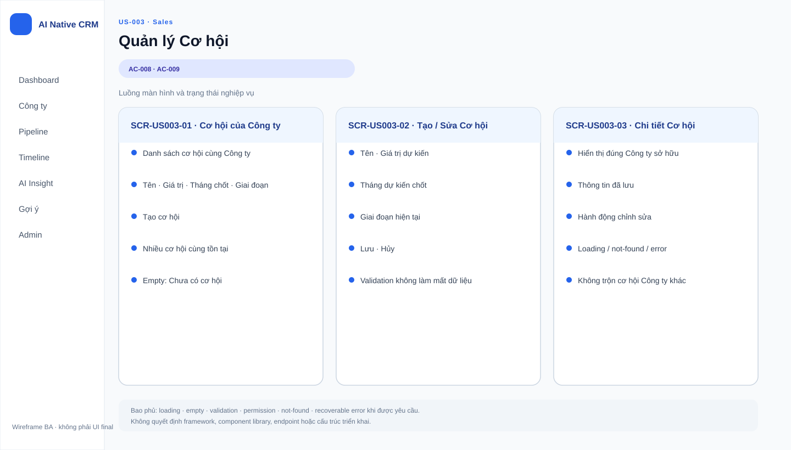
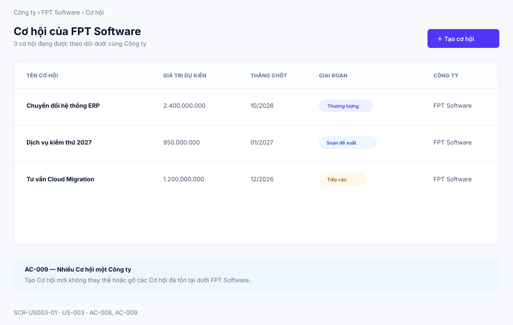
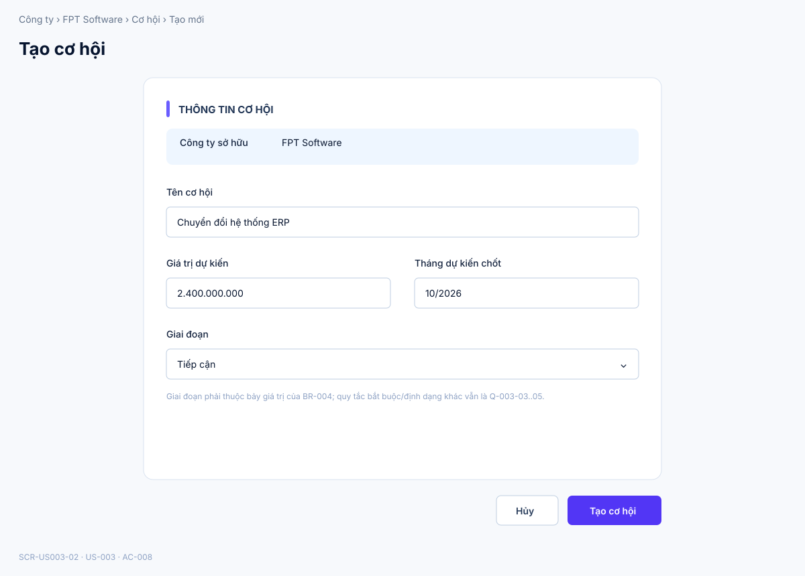
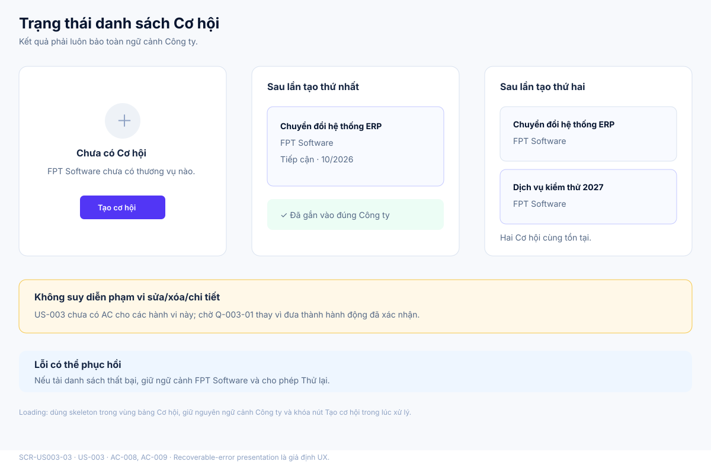

# Business Specification — US-003: Quản lý Cơ hội

## 1. Document Information

| Field | Value |
|---|---|
| Story | `US-003 — Quản lý Cơ hội` |
| Feature / domain | `FEAT-003` / `D1 — CRM lõi làm tay`, `EPIC-01 — Quản lý thực thể CRM` |
| Version | `1.1` |
| Status | `AWAITING_SPECIFICATION_APPROVAL` |
| Date | `2026-08-14` |
| Priority | `Must (17)` |
| Sources | `REQ-103`; `BR-003`, `BR-004`; `US-003`, `AC-008`, `AC-009`; `T-1`; DoR; architect handoff traceability |

## 2. Purpose

**[CONFIRMED — US-003, REQ-103]** Xác định cách Sales tạo và quản lý Cơ hội thuộc một Công ty để theo dõi từng thương vụ. Đặc tả chỉ làm rõ dữ liệu nghiệp vụ, quan hệ sở hữu và phân loại giai đoạn cần có trong phạm vi US-003.

## 3. User Story

**[CONFIRMED — US-003]** As a Sales, I want tạo và quản lý cơ hội thuộc một công ty, so that tôi theo dõi từng thương vụ.

## 4. Business Goal

**[CONFIRMED — US-003]** Sales theo dõi từng thương vụ trong ngữ cảnh Công ty mà thương vụ đó thuộc về. **[INFERRED — BR-003, AC-009]** Việc cho phép nhiều Cơ hội cùng thuộc một Công ty giúp Sales theo dõi các thương vụ riêng biệt của cùng một khách hàng.

## 5. Scope

**[CONFIRMED — REQ-103; BR-003, BR-004; AC-008, AC-009]**

- Sales tạo Cơ hội tại ngữ cảnh một Công ty.
- Sales ghi nhận tên, giá trị dự kiến, tháng dự kiến chốt và giai đoạn khi tạo Cơ hội.
- Cơ hội được gắn với đúng Công ty đang được thao tác.
- Một Công ty có thể có nhiều Cơ hội cùng tồn tại.
- Giai đoạn của Cơ hội được phân loại theo tập mở/đóng của BR-004.

## 6. Out of Scope

**[CONFIRMED — phân rã chức năng, user-stories, REQ-104..112]**

- Đổi giai đoạn, thứ tự hoặc cách thao tác giai đoạn: US-004.
- Dấu hiệu nhu cầu/ngân sách khi vào Đủ điều kiện: US-005.
- Việc tiếp theo và ngày hạn: US-008.
- Hoạt động, dòng thời gian, tìm kiếm/lọc và màn hình tổng quan: US-007, US-009, US-010.
- Tự động hóa AI trên Cơ hội; các giới hạn automation là ràng buộc xuyên suốt thuộc BR-017 và US-040.
- Hành vi sửa hoặc xóa Cơ hội không có tiêu chí chấp nhận riêng trong nguồn US-003; xem Q-003-01.

## 7. Actor / Permission

| Actor | Business permission | Evidence |
|---|---|---|
| Sales | Tạo Cơ hội tại một Công ty; ghi nhận các thông tin nêu trong AC-008; xem nhiều Cơ hội của cùng Công ty theo AC-009. | **[CONFIRMED]** US-003; AC-008, AC-009 |
| Admin | Quyền thao tác Cơ hội cụ thể chưa được nguồn US-003 xác định. | **[OPEN QUESTION]** Q-003-02 |
| A-AI | Không là actor thực hiện hành vi trong phạm vi story này. | **[CONFIRMED]** US-003 nêu Sales là actor; REQ-113 |

## 8. Business Rules

| ID | Rule | Evidence |
|---|---|---|
| BR-003 | Một Công ty có nhiều Cơ hội. | **[CONFIRMED]** BR-003; AC-009 |
| BR-004 | Cơ hội mở là một trong: Tiếp cận, Đủ điều kiện, Soạn đề xuất, Thương lượng, Tạm dừng; Cơ hội đóng là Thắng hoặc Thua. | **[CONFIRMED]** BR-004 |
| BR-US003-01 | Một Cơ hội được tạo trong AC-008 phải được gắn vào Công ty đang được Sales thao tác. | **[CONFIRMED]** AC-008 |
| BR-US003-02 | Cùng một Công ty có thể giữ Cơ hội đã có và Cơ hội thứ hai đồng thời. | **[CONFIRMED]** AC-009; BR-003 |
| BR-US003-03 | US-003 không bổ sung quy tắc về việc đổi giai đoạn; giai đoạn được ghi nhận theo phân loại BR-004. | **[CONFIRMED]** BR-004; phân rã FEAT-003/FEAT-004 |
| BR-US003-04 | Hành vi CRM thủ công của Sales trong story không phụ thuộc vào AI. | **[CONFIRMED]** REQ-113; T-1 |
| BR-US003-05 | Nếu có automation tác động Cơ hội ở use case khác, automation không được tự đổi giai đoạn hoặc giá trị Cơ hội. | **[CONFIRMED]** BR-017; project rules |

## 9. Business Data Dictionary

| Business data | Meaning | Applicability / rule | Evidence |
|---|---|---|---|
| Công ty | Khách hàng doanh nghiệp là ngữ cảnh sở hữu Cơ hội. | Một Công ty có thể có nhiều Cơ hội. | **[CONFIRMED]** BR-003; AC-008, AC-009 |
| Cơ hội | Một thương vụ đang được theo dõi tại một Công ty. | Được tạo dưới Công ty trong AC-008. | **[CONFIRMED]** PRD §2; US-003 |
| Tên Cơ hội | Tên nhận biết thương vụ. | Được Sales nhập khi tạo theo AC-008. | **[CONFIRMED]** AC-008 |
| Giá trị dự kiến | Giá trị tiền dự kiến của thương vụ. | Được Sales nhập khi tạo theo AC-008. | **[CONFIRMED]** REQ-103; AC-008 |
| Tháng dự kiến chốt | Tháng dự kiến hoàn tất thương vụ. | Được Sales nhập khi tạo theo AC-008. | **[CONFIRMED]** REQ-103; AC-008 |
| Giai đoạn | Vị trí nghiệp vụ hiện tại của Cơ hội. | Thuộc phân loại mở/đóng của BR-004. | **[CONFIRMED]** REQ-103; BR-004 |
| Phân loại mở / đóng | Phân loại nghiệp vụ của giai đoạn. | Mở: Tiếp cận, Đủ điều kiện, Soạn đề xuất, Thương lượng, Tạm dừng; đóng: Thắng, Thua. | **[CONFIRMED]** BR-004 |

## 10. Business Flow

### BF-US003-01 — Tạo Cơ hội tại một Công ty

1. **[CONFIRMED — AC-008]** Sales đang ở ngữ cảnh một Công ty.
2. **[CONFIRMED — AC-008]** Sales tạo Cơ hội với tên, giá trị dự kiến, tháng dự kiến chốt và giai đoạn.
3. **[CONFIRMED — AC-008; BR-004]** Cơ hội được ghi nhận với giai đoạn thuộc phân loại nghiệp vụ đã xác định.
4. **[CONFIRMED — AC-008]** Cơ hội được gắn vào Công ty đó.

### BF-US003-02 — Tạo Cơ hội thứ hai

1. **[CONFIRMED — AC-009]** Một Công ty đã có một Cơ hội.
2. **[CONFIRMED — AC-009]** Sales tạo Cơ hội thứ hai dưới cùng Công ty.
3. **[CONFIRMED — AC-009; BR-003]** Cả hai Cơ hội cùng tồn tại dưới Công ty.

## 11. Acceptance Criteria

### AC-008 — Tạo Cơ hội

```gherkin
Scenario: Tạo cơ hội
  Given tôi ở màn hình một công ty
  When tôi tạo cơ hội với tên, giá trị dự kiến, tháng dự kiến chốt, giai đoạn
  Then cơ hội được gắn vào công ty đó.
```

### AC-009 — Nhiều Cơ hội một Công ty

```gherkin
Scenario: Nhiều cơ hội một công ty
  Given công ty đã có một cơ hội
  When tôi tạo cơ hội thứ hai
  Then cả hai cùng tồn tại dưới công ty.
```

**[CONFIRMED — user-stories.md]** AC-008 và AC-009 được giữ nguyên ý nghĩa từ nguồn.

## 12. Screen Specification

| Screen ID | Business area | Required information / behavior | Evidence |
|---|---|---|---|
| `SCR-US003-01` | Cơ hội của Công ty | Hiển thị các Cơ hội cùng tồn tại dưới Công ty đang thao tác và lối vào tạo Cơ hội mới. | **[CONFIRMED]** AC-008; AC-009; BR-003 |
| `SCR-US003-02` | Tạo Cơ hội | Giữ rõ ngữ cảnh Công ty và thu thập tên, giá trị dự kiến, tháng dự kiến chốt, giai đoạn. | **[CONFIRMED]** AC-008; REQ-103 |
| `SCR-US003-03` | Trạng thái kết quả | Thể hiện empty state, Cơ hội đầu tiên và Cơ hội thứ hai cùng được gắn vào đúng Công ty; không suy diễn sửa/xóa/chi tiết. | **[CONFIRMED]** AC-008; AC-009; **[OPEN QUESTION]** Q-003-01 |

## 13. Screen Design

> **UI-DESIGN UPDATE — 2026-08-14:** Wireframe BA dưới đây được tạo từ các US/AC hiện hành và thay thế trạng thái “chưa có asset” được ghi nhận trước bước UI Design.



### `SCR-US003-01` — Cơ hội của Công ty


### `SCR-US003-02` — Tạo Cơ hội


### `SCR-US003-03` — Trạng thái kết quả


**[ASSUMPTION — A-003-01]** Visual language kế thừa mẫu đã được duyệt cho US-001. Asset không đưa sửa/xóa/chi tiết thành phạm vi đã xác nhận và không tự đặt validation, tiền tệ hoặc quy ước tháng đang mở tại Q-003-01..05.

## 14. Screen States

| State | Visible business outcome | Screen | Evidence |
|---|---|---|---|
| Tạo Cơ hội trong ngữ cảnh Công ty | Sales thấy rõ Công ty sở hữu khi nhập các thông tin AC-008. | `SCR-US003-02` | **[CONFIRMED]** AC-008 |
| Cơ hội đã được tạo | Cơ hội xuất hiện dưới đúng Công ty. | `SCR-US003-01`, `SCR-US003-03` | **[CONFIRMED]** AC-008 |
| Công ty có nhiều Cơ hội | Cơ hội đã có và Cơ hội thứ hai cùng tồn tại. | `SCR-US003-01`, `SCR-US003-03` | **[CONFIRMED]** AC-009; BR-003 |
| Chưa có Cơ hội | Empty state giữ ngữ cảnh Công ty và dẫn tới tạo mới. | `SCR-US003-03` | **[ASSUMPTION]** A-003-01 |
| Không tải được danh sách | Giữ ngữ cảnh Công ty và cho phép thử lại. | `SCR-US003-03` | **[ASSUMPTION]** A-003-01 |

## 15. Validation

| Condition | Expected business response | Evidence |
|---|---|---|
| Sales tạo Cơ hội ở ngữ cảnh một Công ty với các thông tin AC-008 nêu | Cơ hội được gắn vào Công ty đó. | **[CONFIRMED]** AC-008 |
| Công ty đã có một Cơ hội và Sales tạo Cơ hội thứ hai | Hai Cơ hội cùng tồn tại dưới Công ty. | **[CONFIRMED]** AC-009; BR-003 |
| Giai đoạn được ghi nhận | Phải bảo toàn phân loại mở/đóng của BR-004. Cách phản hồi khi giá trị ngoài phân loại chưa được nêu. | **[CONFIRMED]** BR-004; **[OPEN QUESTION]** Q-003-04 |
| Tên, giá trị dự kiến hoặc tháng dự kiến chốt không được cung cấp | Nguồn chưa xác định điều kiện bắt buộc, định dạng, giới hạn hoặc phản hồi. | **[OPEN QUESTION]** Q-003-03 |

## 16. Dependencies

| Direction | Item | Dependency | Evidence |
|---|---|---|---|
| Upstream | US-001 | Cung cấp ngữ cảnh Công ty để Sales tạo Cơ hội dưới Công ty đó. | **[CONFIRMED]** US-003 dependency; AC-008 |
| Cross-cutting | REQ-113 | CRM thủ công, gồm hành vi trong story này, tiếp tục hoạt động khi AI tắt. | **[CONFIRMED]** REQ-113; T-1 |
| Cross-cutting | BR-017 / US-040 | Bảo toàn ranh giới automation đối với giai đoạn và giá trị Cơ hội, kể cả ngoài giao diện. | **[CONFIRMED]** BR-017; project rules; architect handoff |

## 17. Business-level NFR Expectations

- **[CONFIRMED — REQ-113; T-1]** Sales vẫn có thể thực hiện luồng CRM thủ công của US-003 khi toàn bộ AI tắt.
- **[CONFIRMED — REQ-704; architecture]** Dữ liệu CRM phải còn sau khi sản phẩm khởi động lại; đây là kỳ vọng cấp hệ thống, không bổ sung quy tắc nghiệp vụ mới cho US-003.
- **[OPEN QUESTION — Q-003-05]** Nguồn chưa nêu kỳ vọng về thời gian phản hồi, quy tắc tiền tệ hoặc múi giờ cho tháng dự kiến chốt.

## 18. Test Scenarios

Chưa có tài liệu `test-scenarios.md` riêng được cung cấp cho US-003. Các tình huống nghiệp vụ dưới đây là đầu vào truy vết cho bộ nghiệm thu T-1; chúng không phải kiểm thử thực thi.

| TC | Business scenario | AC / BR trace | Expected result |
|---|---|---|---|
| TC-US003-01 | Sales ở một Công ty và tạo Cơ hội với tên, giá trị dự kiến, tháng dự kiến chốt và giai đoạn. | AC-008; BR-US003-01; T-1 | Cơ hội được gắn vào đúng Công ty. |
| TC-US003-02 | Một Công ty đã có một Cơ hội; Sales tạo Cơ hội thứ hai. | AC-009; BR-003; BR-US003-02; T-1 | Hai Cơ hội cùng tồn tại dưới Công ty. |
| TC-US003-03 | Sales tạo Cơ hội trong khi toàn bộ AI đang tắt. | REQ-113; BR-US003-04; T-1 | Luồng CRM thủ công vẫn hoạt động. |

## 19. Traceability

| Chain | Evidence |
|---|---|
| `D1 → EPIC-01 → FEAT-003 → US-003 → AC-008, AC-009 → T-1` | **[CONFIRMED]** function-decomposition; user-stories; architect handoff traceability matrix |
| `REQ-103 → FEAT-003 → US-003 → AC-008` | **[CONFIRMED]** requirement-analysis; function-decomposition; user-stories |
| `BR-003 → US-003 → AC-009 → TC-US003-02` | **[CONFIRMED]** requirement-analysis; architect handoff; §18 |
| `BR-004 → US-003 → BR-US003-03 → TC-US003-01` | **[CONFIRMED]** requirement-analysis; architect handoff; §8, §18 |
| `REQ-113 → BR-US003-04 → TC-US003-03 → T-1` | **[CONFIRMED]** requirement-analysis; §17, §18 |

## 20. Assumptions

| ID | Assumption | Rationale / status |
|---|---|---|
| A-003-01 | Visual language dùng mẫu đã được duyệt cho US-001; empty/recoverable-error là biểu đạt UX và không thêm quy tắc nghiệp vụ. | **[ASSUMPTION]** Không thay đổi AC-008/009 hoặc đóng Q-003-01..05. |

## 21. Open Questions

| ID | Question | Owner / impact |
|---|---|---|
| Q-003-01 | “Quản lý” trong US-003 có bao gồm sửa và xóa Cơ hội hay cần được tách/thêm tiêu chí chấp nhận riêng? | PO; xác định phạm vi thao tác ngoài hai AC hiện có. |
| Q-003-02 | Admin có được tạo hoặc xem Cơ hội giống Sales không? | PO; làm rõ quyền nghiệp vụ. |
| Q-003-03 | Tên, giá trị dự kiến và tháng dự kiến chốt có điều kiện bắt buộc, định dạng, giới hạn hay ý nghĩa hợp lệ nào ngoài nội dung AC-008 không? | PO; tránh tự đặt validation. |
| Q-003-04 | Khi giai đoạn không thuộc tập BR-004, phản hồi nghiệp vụ cần là gì? | PO; làm rõ cách bảo toàn BR-004. |
| Q-003-05 | Giá trị dự kiến dùng đơn vị tiền tệ nào, và tháng dự kiến chốt cần được hiểu/trình bày theo quy ước nào? | PO; làm rõ ý nghĩa dữ liệu mà không tự đặt quy ước. |

## 22. Definition of Ready

| DoR item | Status | Evidence / note |
|---|---|---|
| Actor, business value và mô tả rõ | READY | Sales và giá trị theo dõi thương vụ được nêu trong US-003. |
| Acceptance criteria có thể quan sát | READY | AC-008, AC-009. |
| Business rules và dependency đã xác định | READY | REQ-103; BR-003, BR-004; upstream US-001. |
| Traceability rõ | READY | `REQ-103 → FEAT-003 → US-003 → AC-008, AC-009 → T-1`. |
| Priority và backlog được phê duyệt | READY | Must (17); dor-review xác nhận US-003 READY và backlog đã được PO phê duyệt. |
| Câu hỏi không làm thay đổi AC được ghi nhận | READY WITH QUESTIONS | Q-003-01..005; không tự suy diễn phần còn thiếu. |
| Business specification được người có thẩm quyền phê duyệt | PENDING | Gate 1; trạng thái tài liệu giữ `AWAITING_SPECIFICATION_APPROVAL`. |

## 23. Technical Handoff

### Approved constraints

- **[CONFIRMED — AC-008; BR-003]** Bảo toàn việc Cơ hội được gắn đúng Công ty và một Công ty có thể có nhiều Cơ hội.
- **[CONFIRMED — BR-004]** Bảo toàn phân loại giai đoạn mở/đóng đã xác định; không thêm quy tắc đổi giai đoạn vào US-003.
- **[CONFIRMED — REQ-113]** Không tạo phụ thuộc vào AI cho thao tác CRM thủ công của Sales.
- **[CONFIRMED — BR-017; project rules]** Mọi automation có chạm Cơ hội phải tuân `AutomationPolicyGuard`; không có đường đi vòng guardrail.

### Touchpoints and risks

- **[CONFIRMED — US-003 dependency; AC-008]** Story cần ngữ cảnh Công ty từ US-001.
- **[CONFIRMED — BR-004]** Giai đoạn Cơ hội là dữ liệu nghiệp vụ chung; việc thay đổi giai đoạn được giới hạn ngoài phạm vi US-003.
- **[INFERRED — AC-008, AC-009]** Nếu quan hệ Cơ hội–Công ty không nhất quán, Sales có thể theo dõi thương vụ dưới sai khách hàng.
- **[INFERRED — BR-004]** Nếu phân loại mở/đóng không nhất quán, trạng thái nghiệp vụ của Cơ hội có thể bị hiểu sai.

### Decisions required from Tech Lead

- Không có quyết định kỹ thuật mới được đề xuất trong specification này. Tech Lead cần bảo toàn các ràng buộc đã xác nhận và chuyển Q-003-01..005 cho PO thay vì tự suy diễn quy tắc nghiệp vụ.

## 24. Change Log

| Version | Date | Change | Author/Approver |
|---|---|---|---|
| 1.1 | 2026-08-14 | Bổ sung ba SVG chi tiết cho danh sách, tạo và trạng thái Cơ hội; loại cách diễn đạt UI có thể suy ra sửa/xóa/chi tiết khi Q-003-01 còn mở. | Codex — UI pattern approved; specification approval unchanged |
| 1.0 | 2026-08-14 | Chuẩn hóa business specification 24 mục cho US-003; bảo toàn REQ-103, BR-003/004, AC-008/009 và T-1. | Codex / awaiting human specification approval |
