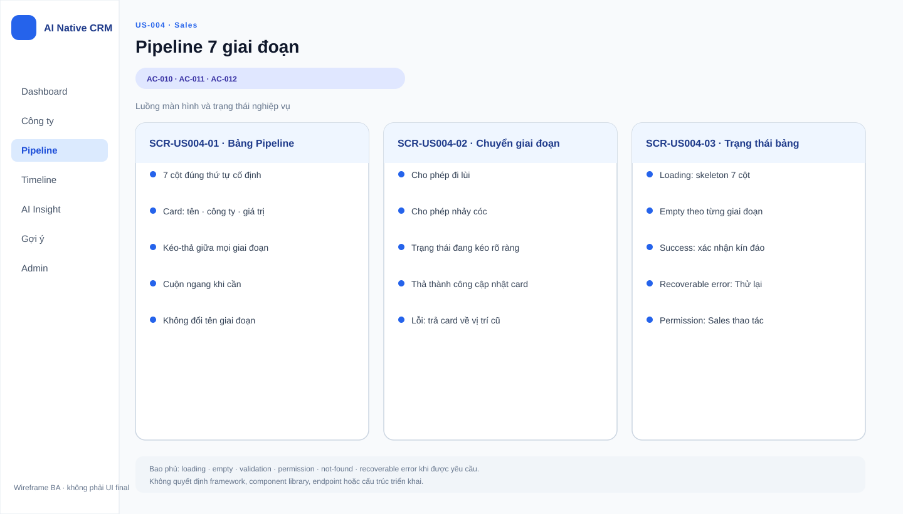
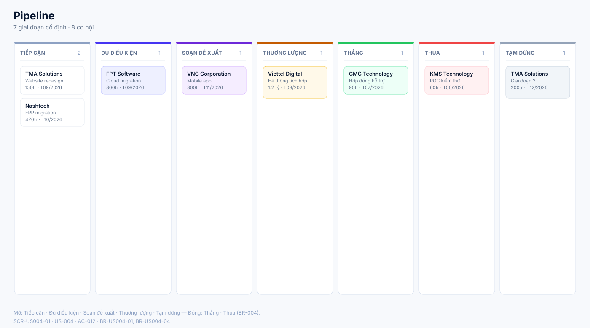
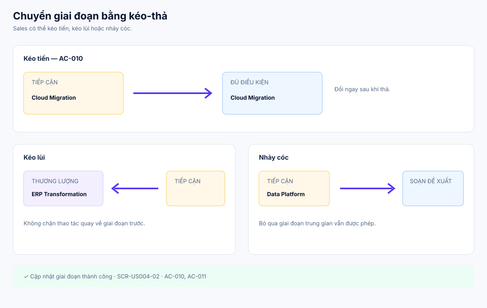
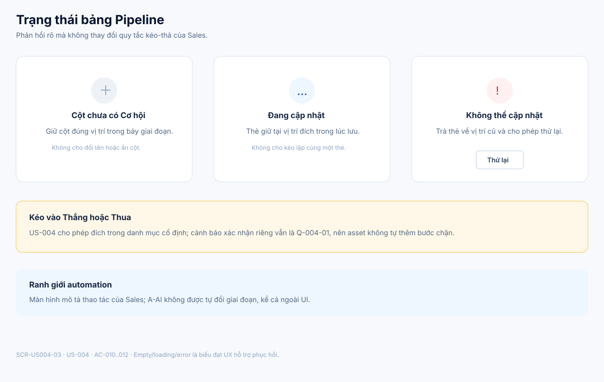

# Business Specification — US-004: Bảng 7 giai đoạn kéo-thả

## 1. Document Information
| Field | Value |
|---|---|
| Story | US-004 |
| Version | 1.1 |
| Status | AWAITING_SPECIFICATION_APPROVAL |
| Sources | REQ-104, REQ-105, BR-004, US-004, architect handoff, DoR review |

## 2. Purpose
**[CONFIRMED — REQ-104..105]** Cho Sales cập nhật tiến độ cơ hội nhanh bằng kéo-thả trên phễu có bảy giai đoạn cố định.

## 3. User Story
**[CONFIRMED — US-004]** As a Sales, I want đổi giai đoạn cơ hội bằng kéo-thả, so that tôi cập nhật tiến độ nhanh mà không mở biểu mẫu.

## 4. Business Goal
**[CONFIRMED — REQ-105]** Phản ánh tiến độ bán hàng linh hoạt, bao gồm tiến, lùi và nhảy cóc, không cản trở thao tác Sales.

## 5. Scope
- **[CONFIRMED — AC-010]** Kéo cơ hội từ Tiếp cận sang Đủ điều kiện và đổi ngay.
- **[CONFIRMED — AC-011]** Cho phép kéo lùi và nhảy cóc, không chặn.
- **[CONFIRMED — AC-012]** Hiển thị đúng bảy giai đoạn cố định, đúng thứ tự, không cho đổi tên.

## 6. Out of Scope
- **[CONFIRMED — REQ-103]** Tạo/sửa/xóa dữ liệu cơ hội; US-003.
- **[CONFIRMED — REQ-106]** Hỏi dấu hiệu nhu cầu/ngân sách khi vào Đủ điều kiện; US-005.
- **[CONFIRMED — REQ-110]** Lý do Thua; US-006.
- **[CONFIRMED — BR-017]** Bất kỳ AI tự đổi giai đoạn hoặc tự Thắng/Thua.

## 7. Actor / Permission
| Actor | Business permission | Evidence |
|---|---|---|
| Sales | Kéo-thả cơ hội giữa các giai đoạn. | **[CONFIRMED]** US-004, AC-010..011 |
| A-AI | Không có quyền tự đổi giai đoạn. | **[CONFIRMED]** BR-017 |

## 8. Business Rules
| ID | Rule | Evidence |
|---|---|---|
| BR-US004-01 | Bảy giai đoạn là: Tiếp cận → Đủ điều kiện → Soạn đề xuất → Thương lượng → Thắng → Thua → Tạm dừng. | **[CONFIRMED]** REQ-104, AC-012 |
| BR-US004-02 | Tên và thứ tự giai đoạn cố định, không cho đổi tên. | **[CONFIRMED]** REQ-104, AC-012 |
| BR-US004-03 | Sales được kéo tiến, lùi hoặc nhảy cóc; hệ thống không chặn. | **[CONFIRMED]** REQ-105, AC-011 |
| BR-US004-04 | Mở = Tiếp cận, Đủ điều kiện, Soạn đề xuất, Thương lượng, Tạm dừng; đóng = Thắng, Thua. | **[CONFIRMED]** BR-004 |
| BR-US004-05 | AI không tự đổi giai đoạn hoặc tự Thắng/Thua. | **[CONFIRMED]** BR-017 |

## 9. Business Data Dictionary
| Business data | Meaning | Rule | Evidence |
|---|---|---|---|
| Cơ hội | Thương vụ thuộc một công ty. | Đối tượng được kéo-thả. | **[CONFIRMED]** REQ-103 |
| Giai đoạn | Vị trí cơ hội trong phễu bán hàng. | Bảy giá trị cố định. | **[CONFIRMED]** REQ-104 |
| Trạng thái mở/đóng | Phân loại business của giai đoạn. | Theo BR-004. | **[CONFIRMED]** BR-004 |

## 10. Business Flow
### BF-004-01 — Kéo tiến
1. **[CONFIRMED — AC-010]** Sales chọn cơ hội ở Tiếp cận.
2. **[CONFIRMED — AC-010]** Sales kéo sang Đủ điều kiện.
3. **[CONFIRMED — AC-010]** Giai đoạn đổi ngay.

### BF-004-02 — Kéo lùi hoặc nhảy cóc
1. **[CONFIRMED — AC-011]** Sales kéo cơ hội Thương lượng về Tiếp cận hoặc sang Soạn đề xuất.
2. **[CONFIRMED — AC-011]** Hệ thống cho phép, không chặn.

## 11. Acceptance Criteria
### AC-010 — Kéo tiến
```gherkin
Scenario: Kéo tiến
  Given một cơ hội ở giai đoạn Tiếp cận
  When tôi kéo sang Đủ điều kiện
  Then cơ hội đổi giai đoạn ngay.
```
### AC-011 — Kéo lùi và nhảy cóc
```gherkin
Scenario: Kéo lùi và nhảy cóc
  Given một cơ hội ở Thương lượng
  When tôi kéo về Tiếp cận hoặc sang Soạn đề xuất
  Then hệ thống cho phép, không chặn.
```
### AC-012 — Bảy giai đoạn cố định
```gherkin
Scenario: Tên và thứ tự giai đoạn cố định
  Given bảng giai đoạn
  Then hiển thị đúng bảy giai đoạn theo thứ tự quy định và không cho đổi tên.
```

## 12. Screen Specification
| Screen ID | Area | Required behavior | Evidence |
|---|---|---|---|
| `SCR-US004-01` | Bảng Pipeline | Hiển thị đủ bảy cột đúng tên/thứ tự và Cơ hội tại giai đoạn hiện tại. | **[CONFIRMED]** AC-012; BR-US004-01..04 |
| `SCR-US004-02` | Chuyển giai đoạn | Minh họa kéo tiến, kéo lùi và nhảy cóc; phản ánh đích ngay sau thao tác. | **[CONFIRMED]** AC-010..011 |
| `SCR-US004-03` | Trạng thái bảng | Empty/loading/recoverable-error không làm thay đổi quyền kéo của Sales; không tự thêm bước chặn Thắng/Thua. | **[CONFIRMED]** AC-010..012; **[OPEN QUESTION]** Q-004-01 |

## 13. Screen Design

> **UI-DESIGN UPDATE — 2026-08-14:** Wireframe BA dưới đây được tạo từ các US/AC hiện hành và thay thế trạng thái “chưa có asset” được ghi nhận trước bước UI Design.



### `SCR-US004-01` — Pipeline 7 giai đoạn


### `SCR-US004-02` — Chuyển giai đoạn


### `SCR-US004-03` — Trạng thái Pipeline


**[ASSUMPTION — A-004-01]** Visual language kế thừa mẫu đã duyệt cho US-001. Empty/loading/error chỉ hỗ trợ phản hồi; asset không tự thêm xác nhận Thắng/Thua khi Q-004-01 còn mở.

## 14. Screen States
| State | Outcome | Screen | Evidence |
|---|---|---|---|
| Cơ hội ở giai đoạn mở | Hiển thị tại cột tương ứng. | `SCR-US004-01` | **[CONFIRMED]** BR-004 |
| Cơ hội ở Thắng/Thua | Hiển thị tại cột đóng tương ứng. | `SCR-US004-01` | **[CONFIRMED]** BR-004 |
| Sau kéo tiến/lùi/nhảy cóc | Thẻ phản ánh đích kéo và thao tác không bị chặn. | `SCR-US004-02` | **[CONFIRMED]** AC-010..011 |
| Cột không có Cơ hội | Cột vẫn hiển thị đúng tên và vị trí. | `SCR-US004-03` | **[CONFIRMED]** AC-012; **[ASSUMPTION]** A-004-01 |
| Lưu thất bại | Thẻ quay về vị trí cũ và có thể thử lại. | `SCR-US004-03` | **[ASSUMPTION]** A-004-01 |

## 15. Validation
| Condition | Response | Evidence |
|---|---|---|
| Kéo giữa hai giai đoạn hợp lệ trong danh mục cố định | Đổi ngay, không chặn. | **[CONFIRMED]** AC-010..011 |
| Đổi tên/thứ tự giai đoạn | Không cho phép. | **[CONFIRMED]** AC-012 |
| Kéo sang Đủ điều kiện | Câu hỏi hai dấu hiệu thuộc US-005, không dùng để chặn kéo. | **[CONFIRMED]** REQ-106, AC-011 |

## 16. Dependencies
| Direction | Item | Dependency | Evidence |
|---|---|---|---|
| Upstream | US-003 | Cung cấp cơ hội và giai đoạn hiện tại. | **[CONFIRMED]** US-004 dependency |
| Related | US-005 | Bổ sung luồng hỏi dấu hiệu khi vào Đủ điều kiện. | **[CONFIRMED]** REQ-106 |
| Related | US-007 | Lần đổi giai đoạn xuất hiện trong timeline công ty. | **[CONFIRMED]** REQ-108 |

## 17. Business-level NFR Expectations
- **[CONFIRMED — REQ-113]** Đây là CRM thủ công, hoạt động khi AI tắt.
- **[CONFIRMED — BR-017]** Guardrail phải chặn AI tự đổi stage cả ngoài UI; Sales không bị hạn chế bởi rule đó.
- **[INFERRED — AC-010..011]** Cập nhật stage cần phản ánh nhất quán sau thao tác để Sales thấy đúng tiến độ vừa kéo.

## 18. Test Scenarios
| TC | Business scenario | AC / rule | Expected result |
|---|---|---|---|
| TC-004-01 | Sales kéo Tiếp cận sang Đủ điều kiện. | AC-010 | Đổi giai đoạn ngay. |
| TC-004-02 | Sales kéo Thương lượng về Tiếp cận và nhảy sang Soạn đề xuất. | AC-011 | Cả hai thao tác được phép. |
| TC-004-03 | Sales xem bảng giai đoạn. | AC-012, BR-US004-01 | Đúng bảy giai đoạn, đúng thứ tự, không đổi tên. |

## 19. Traceability
| Chain | Evidence |
|---|---|
| `REQ-104/105 → EPIC-02 → FEAT-004 → US-004 → AC-010..012 → TC-004-01..03 (T-1)` | **[CONFIRMED]** architect handoff |
| `BR-004 → BR-US004-04 → TC-004-03` | **[CONFIRMED]** requirement analysis |

## 20. Assumptions
| ID | Assumption | Status |
|---|---|---|
| A-004-01 | Visual language dùng mẫu đã duyệt cho US-001; empty/loading/error là phản hồi UX, không đổi hành vi AC. | **[ASSUMPTION]** Không đóng Q-004-01. |

## 21. Open Questions
| ID | Question | Owner / impact |
|---|---|---|
| Q-004-01 | Có cần hiển thị cảnh báo xác nhận riêng khi kéo vào Thắng/Thua không? | **[OPEN QUESTION]** PO; ngoài AC hiện có. |

## 22. Definition of Ready
| DoR item | Status | Evidence |
|---|---|---|
| Actor, giá trị và scope rõ | READY | US-004, REQ-104..105 |
| AC quan sát được | READY | AC-010..012 |
| Dependency xác định | READY | US-003 |
| Traceability rõ | READY | REQ → FEAT → US → AC → TC |
| Human approval | AWAITING_SPECIFICATION_APPROVAL | Gate 1 |

## 23. Technical Handoff
**[CONFIRMED — REQ-104..105]** Bảo toàn bảy giai đoạn cố định và không chặn kéo tiến/lùi/nhảy cóc của Sales. **[CONFIRMED — BR-017]** Mọi automation phải qua AutomationPolicyGuard để chặn tự đổi giai đoạn ngoài UI. Không có endpoint, schema hoặc kế hoạch kỹ thuật trong specification này.

## 24. Change Log
| Version | Date | Change | Author/Approver |
|---|---|---|---|
| 1.1 | 2026-08-14 | Bổ sung ba SVG chi tiết cho bảng 7 giai đoạn, thao tác kéo và trạng thái phục hồi; không tự thêm xác nhận Thắng/Thua. | Codex — UI pattern approved; specification approval unchanged |
| 1.0 | 2026-08-14 | Tạo specification 24 mục cho US-004. | Codex / awaiting human specification approval |
