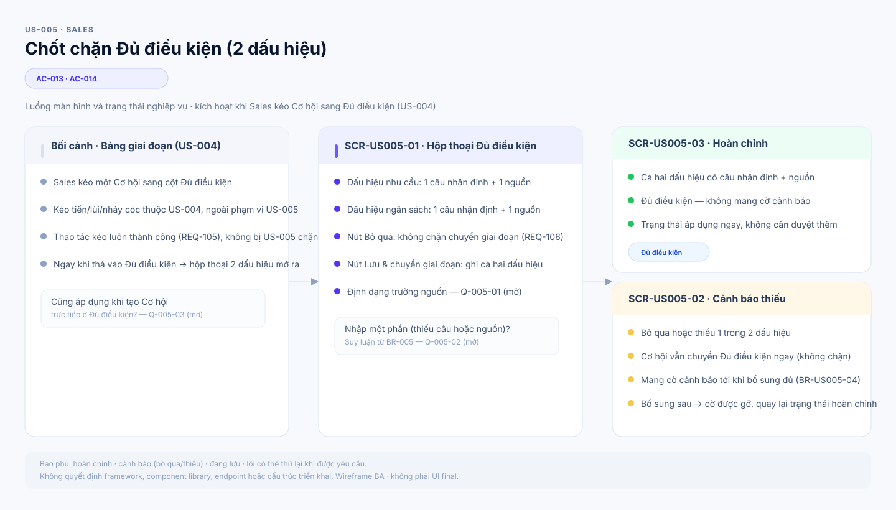
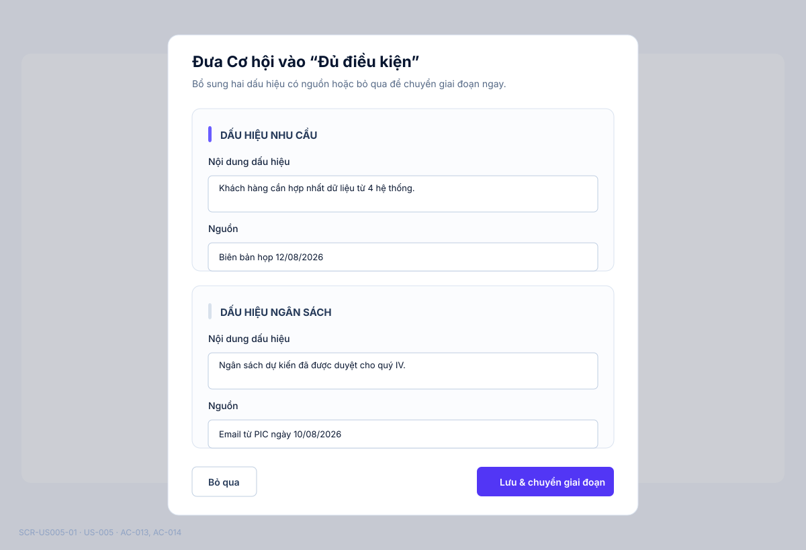
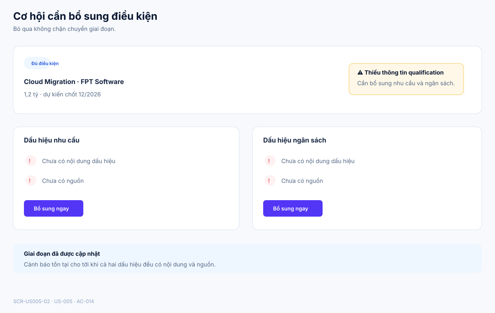
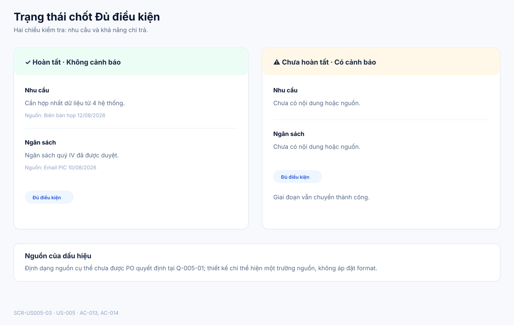

# Business Specification — US-005: Qualification checkpoint
## 1. Document Information
| Field | Value |
|---|---|
| Story / feature | `US-005` / `FEAT-005` (D1) |
| Version | `1.1` |
| Status / sources | `AWAITING_SPECIFICATION_APPROVAL`; `REQ-106`, `BR-005`, `AC-013..014` |
## 2. Purpose
**[CONFIRMED — REQ-106]** Capture need and budget evidence when an opportunity enters Qualified.
## 3. User Story
**[CONFIRMED — US-005]** As Sales, I want to be asked for need and budget signals at Qualified so that I pursue deals with both dimensions checked.
## 4. Business Goal
**[CONFIRMED — BR-005]** Qualification tests both customer need and ability to pay.
## 5. Scope
Prompt on moving to Qualified; each signal is one statement plus source; allow skip while retaining the move and warning until completed. **[CONFIRMED — AC-013..014]**
## 6. Out of Scope
Pipeline dragging is US-004; opportunity data US-003; automation may not change stage. **[CONFIRMED — BR-017]**
## 7. Actor / Permission
Sales moves and completes the checkpoint. **[CONFIRMED — AC-013..014]**
## 8. Business Rules
`BR-US005-01`: need and budget each require sourced fact. `BR-US005-02`: completed pair means no warning. `BR-US005-03`: skip never blocks move but keeps warning. **[CONFIRMED — BR-005; AC-013..014]**
## 9. Business Data Dictionary
Opportunity; Qualified stage; need signal; budget signal; source; missing-qualification warning. **[CONFIRMED — REQ-106]**
## 10. Business Flow
Sales drags to Qualified; provides both signals or skips; opportunity moves; it is warning-free only when both are supplied. **[CONFIRMED — AC-013..014]**
## 11. Acceptance Criteria
### AC-013 — Complete signals
```gherkin
Given a move to Qualified When Sales enters sourced need and budget signals Then the opportunity is Qualified without warning.
```
### AC-014 — Skip
```gherkin
Given a move to Qualified When Sales skips both fields Then the move succeeds and warning remains until completion.
```
## 12. Screen Specification
| Screen ID | Business area | Required behavior | Evidence |
|---|---|---|---|
| `SCR-US005-01` | Hộp thoại Đủ điều kiện | Thu thập dấu hiệu nhu cầu và ngân sách, mỗi dấu hiệu gồm nội dung và nguồn; cho phép bỏ qua. | **[CONFIRMED]** AC-013..014; BR-US005-01 |
| `SCR-US005-02` | Cảnh báo thiếu | Cơ hội đã chuyển Đủ điều kiện nhưng hiển thị cảnh báo cho tới khi đủ hai dấu hiệu có nguồn. | **[CONFIRMED]** AC-014; BR-US005-03 |
| `SCR-US005-03` | Trạng thái Qualification | Phân biệt complete/không cảnh báo và incomplete/có cảnh báo mà không chặn chuyển giai đoạn. | **[CONFIRMED]** AC-013..014 |
## 13. Screen Design

> **UI-DESIGN UPDATE — 2026-08-14:** Wireframe BA dưới đây được tạo từ các US/AC hiện hành và thay thế trạng thái “chưa có asset” được ghi nhận trước bước UI Design.



### `SCR-US005-01` — Hộp thoại Đủ điều kiện


### `SCR-US005-02` — Cảnh báo thiếu dấu hiệu


### `SCR-US005-03` — Trạng thái Qualification


**[ASSUMPTION — A-005-01]** Visual language kế thừa mẫu đã duyệt cho US-001. Asset không áp đặt định dạng nguồn khi Q-005-01 còn mở và không biến hộp thoại thành bước chặn chuyển giai đoạn.
## 14. Screen States
| State | Visible outcome | Screen | Evidence |
|---|---|---|---|
| Complete | Cả hai dấu hiệu có nội dung và nguồn; không còn cảnh báo. | `SCR-US005-01`, `SCR-US005-03` | **[CONFIRMED]** AC-013 |
| Incomplete | Cơ hội mang cảnh báo thiếu qualification. | `SCR-US005-02`, `SCR-US005-03` | **[CONFIRMED]** AC-014 |
| Skip | Cơ hội vẫn chuyển Đủ điều kiện; cảnh báo còn tới khi hoàn tất. | `SCR-US005-01`, `SCR-US005-02` | **[CONFIRMED]** AC-014 |
## 15. Validation
Both dimensions need a statement and source; source format is **[OPEN QUESTION — Q-005-01]**.
## 16. Dependencies
US-004 supplies movement; US-003 supplies opportunity. **[CONFIRMED — US-005 dependency]**
## 17. Business-level NFR Expectations
Manual CRM continues with AI off. **[CONFIRMED — REQ-113]**
## 18. Test Scenarios
| ID | Scenario | AC / rule |
|---|---|---|
| TC-005-01 | Move with two sourced signals. | AC-013; BR-US005-01..02 |
| TC-005-02 | Move while skipping signals. | AC-014; BR-US005-03 |
## 19. Traceability
`REQ-106 → EPIC-02 → FEAT-005 → US-005 → AC-013..014 → TC-005-01..02`. **[CONFIRMED — architect handoff]**
## 20. Assumptions
`A-005-01`: visual language dùng mẫu đã duyệt cho US-001; cách trình bày warning không thay đổi hành vi non-blocking. **[ASSUMPTION]**
## 21. Open Questions
`Q-005-01`: Required source format? **[OPEN QUESTION — PO]**
## 22. Definition of Ready
**READY. [CONFIRMED — dor-review]**
## 23. Technical Handoff
Preserve non-blocking move, sourced two-dimensional qualification, and warning. All automation must use `AutomationPolicyGuard`; no endpoints, schemas, migrations, source tasks, monitoring or prompt logs. **[CONFIRMED — project rules]**
## 24. Change Log
| Version | Date | Change | Author/Approver |
|---|---|---|---|
| 1.1 | 2026-08-14 | Added three detailed SVG screens for qualification input, incomplete warning and complete/incomplete states; source format remains open. | Codex — UI pattern approved; specification approval unchanged |
| 1.0 | 2026-08-14 | Created US-005 specification. | Codex / awaiting human specification approval |
