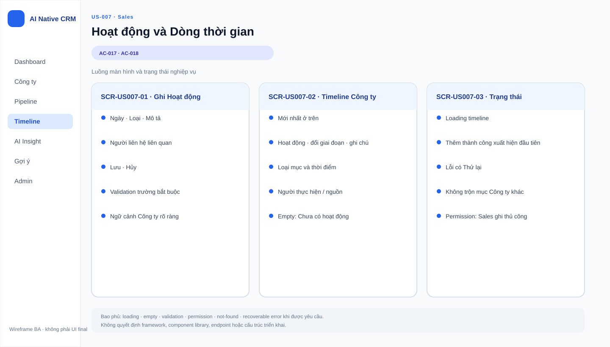
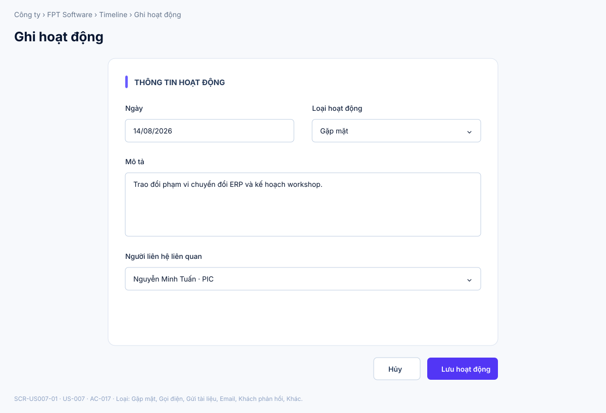
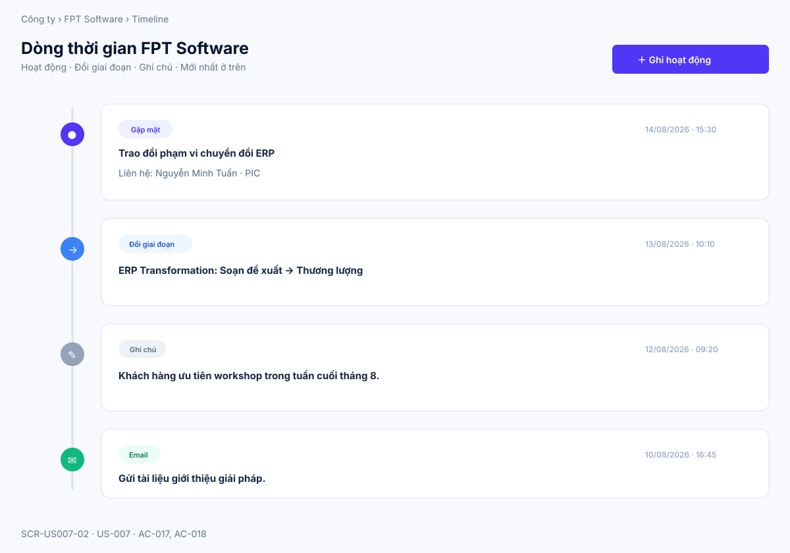
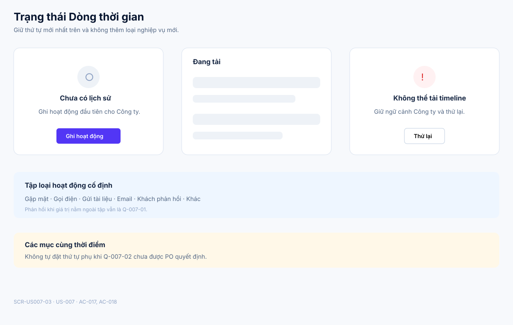

# Business Specification — US-007: Hoạt động & Dòng thời gian công ty

## 1. Document Information

| Field | Value |
|---|---|
| Story | `US-007` — Hoạt động & Dòng thời gian công ty |
| Feature / domain | `FEAT-007` / `D1 — CRM lõi làm tay` / `EPIC-03 — Nhịp làm việc hằng ngày` |
| Version | `1.2` |
| Status | `AWAITING_SPECIFICATION_APPROVAL` |
| Date | `2026-08-15` |
| Priority | Should (14) |
| Sources | `REQ-107`, `REQ-108`; `US-007`, `AC-017..018`; `Q-09` (duyệt: tập loại cố định); `T-1`; DoR review; architect handoff; function-decomposition; backlog-prioritization |

## 2. Purpose

**[CONFIRMED — REQ-107, REQ-108]** Xác định hành vi nghiệp vụ để Sales ghi nhận Hoạt động đã thực hiện với một Công ty, và xem toàn bộ lịch sử của Công ty đó — gồm Hoạt động, lần đổi giai đoạn và Ghi chú — gộp chung trên một dòng thời gian duy nhất, sắp xếp mới nhất ở trên.

## 3. User Story

**[CONFIRMED — US-007]** As a Sales, I want ghi hoạt động và xem chúng cùng đổi giai đoạn/ghi chú trên một dòng thời gian, so that tôi có toàn cảnh lịch sử công ty.

## 4. Business Goal

**[CONFIRMED — US-007]** Sales có toàn cảnh lịch sử Công ty để làm việc và chịu trách nhiệm với khách hàng của mình. **[CONFIRMED — REQ-108]** Một dòng thời gian gộp ba loại nội dung thay vì phân tán theo từng loại sự kiện giúp Sales nắm bối cảnh nhanh trước khi tương tác tiếp theo. **[INFERRED — requirement-analysis BG-1]** Việc gộp lịch sử vào một nơi cũng góp phần giảm rủi ro "hồ sơ luôn cũ" mà PRD nêu là một trong hai nỗi đau gốc.

## 5. Scope

- **[CONFIRMED — REQ-107, AC-017]** Sales ghi Hoạt động cho một Công ty với bốn thông tin: ngày, loại hoạt động, mô tả, người liên hệ liên quan.
- **[CONFIRMED — AC-017, Q-09]** Loại hoạt động chỉ được chọn trong tập cố định đã duyệt gồm sáu giá trị: Gặp mặt, Gọi điện, Gửi tài liệu, Email, Khách phản hồi, Khác.
- **[CONFIRMED — REQ-108, AC-018]** Dòng thời gian Công ty gộp chung ba loại nội dung — Hoạt động, lần đổi giai đoạn, Ghi chú — và sắp xếp theo thời điểm giảm dần (mới nhất ở trên).
- **[CONFIRMED — AC-017]** Hoạt động vừa ghi xuất hiện trên dòng thời gian của đúng Công ty đó.
- **[CONFIRMED — user-stories.md, dòng ghi chú US-007]** Q-09 là một trong các assumption đã được PO duyệt dùng làm cơ sở viết acceptance criteria cho story này (tập loại hoạt động cố định).

## 6. Out of Scope

- **[CONFIRMED — REQ-103, REQ-104, REQ-105, REQ-106; US-003, US-004, US-005]** Tạo/sửa Cơ hội và cơ chế đổi giai đoạn bằng kéo-thả; US-007 chỉ hiển thị lần đổi giai đoạn như một mục lịch sử, không định nghĩa lại cách đổi giai đoạn.
- **[CONFIRMED — REQ-201..211; US-011..017]** Bản lưu (Observation) và Phát hiện (Claim) của Nhóm 2 — các nội dung này thuộc "vùng đọc" riêng của màn hình Công ty, không phải nội dung của dòng thời gian trong story này.
- **[CONFIRMED — REQ-502, REQ-503; US-031]** Mục dòng thời gian do vòng quét công ty Đang theo dõi tự thêm (nhãn "do hệ thống thêm"). Mục này xuất hiện trên cùng dòng thời gian Công ty nhưng việc sinh ra nó thuộc phạm vi US-031, không thuộc phạm vi ghi nhận thủ công của US-007.
- **[INFERRED — không có REQ/US riêng trong 46 story đã duyệt định nghĩa việc tạo Ghi chú]** Cơ chế tạo, sửa hoặc xoá Ghi chú không thuộc phạm vi US-007; US-007 chỉ mô tả rằng Ghi chú là một loại nội dung xuất hiện cùng trên dòng thời gian.
- **[CONFIRMED — REQ-506; US-034, đã bị PO đưa ra ngoài phạm vi (Won't-now) theo dor-review.md]** Xoá một mục do hệ thống tự thêm trên dòng thời gian không thuộc phạm vi US-007.
- **[CONFIRMED — dor-review.md]** Sửa hoặc xoá một mục Hoạt động đã ghi không được bất kỳ AC nào của US-007 mô tả; không thuộc phạm vi story này.

## 7. Actor / Permission

| Actor | Business permission | Evidence |
|---|---|---|
| Sales | Ghi Hoạt động cho một Công ty và xem dòng thời gian gộp của Công ty đó. | **[CONFIRMED]** US-007; AC-017..018 |
| A-AI | Không thực hiện hành vi ghi Hoạt động thủ công của story này; mục "do hệ thống thêm" của vòng quét (US-031) là một hành vi khác, ngoài phạm vi US-007. | **[CONFIRMED]** REQ-113; REQ-502; project rules |

## 8. Business Rules

| ID | Rule | Evidence |
|---|---|---|
| BR-US007-01 | Hoạt động ghi nhận gồm đúng bốn thông tin: ngày, loại hoạt động, mô tả, người liên hệ liên quan. | **[CONFIRMED]** REQ-107; AC-017 |
| BR-US007-02 | Loại hoạt động chỉ thuộc tập cố định gồm sáu giá trị: Gặp mặt, Gọi điện, Gửi tài liệu, Email, Khách phản hồi, Khác. | **[CONFIRMED]** AC-017; Q-09 (duyệt) |
| BR-US007-03 | Dòng thời gian Công ty gộp chung ba loại nội dung — Hoạt động, lần đổi giai đoạn, Ghi chú — và sắp xếp theo thời điểm giảm dần (mới nhất ở trên). | **[CONFIRMED]** REQ-108; AC-018 |
| BR-US007-04 | Bản lưu và Phát hiện (Observation/Claim của Nhóm 2 AI) không phải nội dung của dòng thời gian trong story này. | **[CONFIRMED]** REQ-204; REQ-206 |
| BR-US007-05 | Lần đổi giai đoạn hiển thị trên dòng thời gian được sinh ra bởi hành vi kéo-thả giai đoạn của US-004; US-007 chỉ hiển thị mục này, không định nghĩa lại cách đổi giai đoạn. | **[INFERRED]** REQ-104, REQ-105; AC-018; function-decomposition |
| BR-US007-06 | Ghi chú là một loại nội dung hợp lệ trên dòng thời gian; cơ chế tạo hoặc sửa Ghi chú nằm ngoài phạm vi US-007. | **[INFERRED]** AC-018 liệt kê "ghi chú" là loại có sẵn; không REQ/US nào trong backlog đã duyệt định nghĩa việc tạo Ghi chú |
| BR-US007-07 | Mục do vòng quét tự động thêm (US-031, nhãn "do hệ thống thêm") xuất hiện trên cùng dòng thời gian Công ty nhưng việc sinh ra nó không thuộc phạm vi ghi nhận thủ công của US-007. | **[CONFIRMED]** REQ-502; US-031 |

## 9. Business Data Dictionary

| Business data | Meaning | Applicability / rule | Evidence |
|---|---|---|---|
| Hoạt động | Một việc Sales đã thực hiện với Công ty, được ghi nhận thủ công. | Có ngày, loại, mô tả, người liên hệ liên quan; loại thuộc tập cố định BR-US007-02. | **[CONFIRMED]** REQ-107; AC-017 |
| Ngày hoạt động | Thời điểm hoạt động diễn ra, do Sales nhập. | Dùng làm cơ sở sắp xếp trên dòng thời gian. | **[CONFIRMED]** AC-017 |
| Loại hoạt động | Phân loại hoạt động theo sáu giá trị cố định. | Gặp mặt · Gọi điện · Gửi tài liệu · Email · Khách phản hồi · Khác. | **[CONFIRMED]** AC-017; Q-09 |
| Mô tả | Nội dung tường thuật của hoạt động do Sales nhập. | Định dạng và độ dài không được quy định trong nguồn. | **[CONFIRMED]** AC-017 |
| Người liên hệ liên quan | Người liên hệ (Contact) được gắn với hoạt động. | Thuộc cùng Công ty với hoạt động; danh mục Contact đến từ US-002. | **[INFERRED]** REQ-102; REQ-107 |
| Dòng thời gian | Danh sách lịch sử gộp của một Công ty. | Gồm Hoạt động, lần đổi giai đoạn, Ghi chú; sắp xếp mới nhất ở trên. | **[CONFIRMED]** REQ-108; AC-018 |
| Lần đổi giai đoạn | Một mục lịch sử ghi nhận việc một Cơ hội chuyển giai đoạn. | Sinh ra từ hành vi của US-004; US-007 chỉ hiển thị. | **[INFERRED]** REQ-108; AC-018; US-004 |
| Ghi chú | Một mục lịch sử dạng nội dung tự do xuất hiện trên dòng thời gian. | Cơ chế tạo/sửa ngoài phạm vi US-007. | **[INFERRED]** AC-018 |

## 10. Business Flow

**BF-007-01 — Ghi hoạt động.** **[CONFIRMED — AC-017; REQ-107]** Sales đang ở màn hình một Công ty, mở biểu mẫu ghi hoạt động, nhập ngày, chọn một loại trong sáu loại cố định (BR-US007-02), nhập mô tả và chọn người liên hệ liên quan thuộc Công ty đó, rồi lưu. **[OPEN QUESTION — Q-US007-03]** Trường nào trong bốn thông tin trên là bắt buộc so với tùy chọn, và hệ thống phản hồi ra sao khi thiếu trường (nếu có quy định) chưa được xác định trong nguồn. Khi lưu thành công, hoạt động xuất hiện trên dòng thời gian của Công ty, ở vị trí mới nhất theo BR-US007-03.

**BF-007-02 — Xem dòng thời gian gộp.** **[CONFIRMED — AC-018; REQ-108]** Khi Công ty đã có Hoạt động, lần đổi giai đoạn (sinh ra từ US-004) và Ghi chú, Sales mở dòng thời gian của Công ty. Hệ thống hiển thị cả ba loại nội dung trong cùng một danh sách, sắp xếp theo thời điểm giảm dần sao cho mục mới nhất luôn ở trên cùng. **[OPEN QUESTION — Q-US007-02]** Khi hai hoặc nhiều mục có cùng thời điểm, quy tắc sắp xếp phụ giữa chúng chưa được xác định trong nguồn.

## 11. Acceptance Criteria

**AC-017 — Ghi hoạt động**

```gherkin
Scenario: Ghi hoạt động
  Given tôi ở màn hình một công ty
  When tôi ghi hoạt động với ngày, loại (Gặp mặt/Gọi điện/Gửi tài liệu/Email/Khách phản hồi/Khác), mô tả, người liên hệ liên quan
  Then hoạt động xuất hiện trên dòng thời gian.
```

**AC-018 — Dòng thời gian gộp, mới nhất trên**

```gherkin
Scenario: Dòng thời gian gộp, mới nhất trên
  Given công ty có hoạt động, lần đổi giai đoạn và ghi chú
  When tôi mở dòng thời gian
  Then cả ba loại hiện chung, sắp mới-nhất-ở-trên.
```

**[CONFIRMED — user-stories.md]** Hai acceptance criteria trên được bảo toàn nguyên văn từ nguồn; US-007 không có acceptance criteria bổ sung nào khác được PO duyệt tính tới thời điểm viết specification này.

## 12. Screen Specification

| Screen ID | Business area | Required information / behavior | Evidence |
|---|---|---|---|
| `SCR-US007-01` | Ghi Hoạt động | Thu thập ngày, loại hoạt động (một trong sáu loại cố định), mô tả và người liên hệ liên quan, trong ngữ cảnh một Công ty cụ thể. | **[CONFIRMED]** AC-017; BR-US007-01..02 |
| `SCR-US007-02` | Dòng thời gian Công ty | Hiển thị Hoạt động, lần đổi giai đoạn và Ghi chú gộp chung một danh sách, sắp xếp mới nhất ở trên; mỗi mục cho biết loại, thời điểm và nội dung. | **[CONFIRMED]** AC-018; BR-US007-03 |
| `SCR-US007-03` | Trạng thái Dòng thời gian | Minh hoạ empty (chưa có lịch sử), loading và lỗi có thể thử lại khi tải dòng thời gian; không thêm loại nội dung hay quy tắc sắp xếp ngoài BR-US007-02..03. | **[ASSUMPTION — A-US007-01]**; **[OPEN QUESTION — Q-US007-01, Q-US007-02]** |

## 13. Screen Design

> **UI-DESIGN UPDATE — 2026-08-15:** Wireframe BA dưới đây kế thừa đúng ngôn ngữ hình ảnh đã được người dùng duyệt cho US-001 ngày 2026-08-14 (nền `#f7f9fc`, card bo góc 14px viền `#d9e2ef`, thanh nhấn mục 5px `#695cff`, nút chính tím `#5236f5`, nút phụ viền `#bfcee0`, khối trạng thái rỗng/lỗi dùng icon tròn + tiêu đề + mô tả + nút hành động), chỉ đổi nhãn và nội dung sang miền dữ liệu Hoạt động & Dòng thời gian. Các asset là SVG Git-friendly, không quyết định framework, component library hay cách triển khai.

### 13.1 Tổng quan luồng



### 13.2 `SCR-US007-01` — Ghi Hoạt động



### 13.3 `SCR-US007-02` — Dòng thời gian Công ty



### 13.4 `SCR-US007-03` — Trạng thái Dòng thời gian



Các SVG chỉ hiển thị bốn thông tin đã chốt của Hoạt động (ngày, loại, mô tả, người liên hệ liên quan) và ba loại nội dung đã chốt của dòng thời gian (Hoạt động, đổi giai đoạn, ghi chú); loại hoạt động luôn lấy từ sáu giá trị cố định BR-US007-02.

## 14. Screen States

| State | Visible business outcome | Screen / asset | Evidence |
|---|---|---|---|
| Ghi hoạt động thành công | Hoạt động vừa ghi xuất hiện ở vị trí mới nhất trên dòng thời gian. | `SCR-US007-01` → `SCR-US007-02` | **[CONFIRMED]** AC-017 |
| Công ty có nhiều loại lịch sử | Hoạt động, lần đổi giai đoạn và Ghi chú gộp chung, sắp xếp theo thời điểm giảm dần. | `SCR-US007-02` | **[CONFIRMED]** AC-018 |
| Chưa có lịch sử nào (empty) | Hiển thị empty state với lối vào ghi hoạt động đầu tiên. | `SCR-US007-03` | **[ASSUMPTION]** A-US007-01 |
| Đang tải dòng thời gian (loading) | Hiển thị skeleton, giữ nguyên cấu trúc trang. | `SCR-US007-03` | **[ASSUMPTION]** A-US007-01 |
| Lỗi tải dòng thời gian, có thể thử lại | Giữ ngữ cảnh Công ty và cho phép thử lại thao tác tải. | `SCR-US007-03` | **[ASSUMPTION]** A-US007-01 |
| Loại hoạt động ngoài tập cố định | Hành vi hệ thống chưa được xác định. | — | **[OPEN QUESTION]** Q-US007-01 |
| Nhiều mục cùng thời điểm | Thứ tự hiển thị phụ giữa các mục chưa được xác định. | `SCR-US007-02` | **[OPEN QUESTION]** Q-US007-02 |

## 15. Validation

| Condition | Expected business response | Evidence |
|---|---|---|
| Loại hoạt động thuộc tập cố định (Gặp mặt/Gọi điện/Gửi tài liệu/Email/Khách phản hồi/Khác) | Cho phép ghi hoạt động. | **[CONFIRMED]** BR-US007-02 |
| Loại hoạt động ngoài tập cố định | Hành vi hệ thống chưa được quy định trong nguồn. | **[OPEN QUESTION]** Q-US007-01 |
| Trường nào trong bốn thông tin Hoạt động là bắt buộc / tùy chọn | Chưa được quy định trong nguồn (khác với US-001, nơi ba trường bắt buộc được nêu rõ). | **[OPEN QUESTION]** Q-US007-03 |
| Nhiều mục dòng thời gian có cùng thời điểm | Quy tắc sắp xếp phụ chưa được quy định trong nguồn. | **[OPEN QUESTION]** Q-US007-02 |

## 16. Dependencies

| Direction | Item | Dependency | Evidence |
|---|---|---|---|
| Upstream | US-001 / FEAT-001 | Cần một Công ty đã tồn tại để ghi hoạt động và xem dòng thời gian. | **[CONFIRMED]** US-007 dependency; function-decomposition |
| Related | US-002 / FEAT-002 | Người liên hệ liên quan được chọn từ Người liên hệ thuộc cùng Công ty. | **[INFERRED]** REQ-102; REQ-107 |
| Related | US-004 / FEAT-004 | Lần đổi giai đoạn hiển thị trên dòng thời gian được sinh ra từ hành vi kéo-thả giai đoạn. | **[CONFIRMED]** REQ-108; AC-018 |
| Cross-cutting | US-031 / FEAT-031 | Mục "do hệ thống thêm" của vòng quét công ty Đang theo dõi xuất hiện trên cùng dòng thời gian Công ty, ngoài phạm vi ghi thủ công của US-007. | **[CONFIRMED]** REQ-502; architect handoff (ARQ-7: chống trùng giữa các đường ghi timeline) |
| Acceptance | T-1 | CRM lõi làm tay, gồm Hoạt động và dòng thời gian, hoạt động khi toàn bộ AI tắt. | **[CONFIRMED]** REQ-113; architect handoff |

## 17. Business-level NFR Expectations

- **[CONFIRMED — REQ-113]** Việc ghi Hoạt động và xem dòng thời gian thủ công của US-007 hoạt động khi toàn bộ AI tắt; T-1 bao gồm hành vi này trong điều kiện đó.
- **[CONFIRMED — REQ-704; architecture]** Dữ liệu Hoạt động và dòng thời gian được kỳ vọng bền qua khởi động lại trong triển khai sản phẩm; đây là kỳ vọng cấp hệ thống, không thêm quy tắc dữ liệu riêng cho US-007.
- **[CONFIRMED — dor-review.md]** US-007 không đặt SLA hay ngưỡng thời gian phản hồi riêng; áp dụng kỳ vọng chất lượng chung của hệ thống.

## 18. Test Scenarios

Chưa có `test-scenarios.md` riêng cho US-007. Các tình huống dưới đây là truy vết nghiệp vụ, không phải kiểm thử thực thi; những dòng có cột "Acceptance trace" đóng góp vào bộ nghiệm thu **T-1**. **[CONFIRMED — architect handoff]**

| ID | Business scenario | AC / BR | Expected business result | Acceptance trace |
|---|---|---|---|---|
| TC-007-01 | Sales ghi hoạt động lần lượt với mỗi loại trong sáu loại cố định (Gặp mặt, Gọi điện, Gửi tài liệu, Email, Khách phản hồi, Khác). | AC-017; BR-US007-02 | Mỗi hoạt động được lưu và xuất hiện trên dòng thời gian của đúng Công ty. | T-1 |
| TC-007-02 | Công ty có Hoạt động, lần đổi giai đoạn (từ US-004) và Ghi chú xảy ra ở các thời điểm khác nhau. | AC-018; BR-US007-03 | Dòng thời gian gộp cả ba loại trong một danh sách, sắp xếp mới nhất ở trên. | T-1 |
| TC-007-03 | Sales chọn một Người liên hệ liên quan thuộc đúng Công ty khi ghi hoạt động. | AC-017; dependency US-002 | Hoạt động được lưu kèm đúng người liên hệ đã chọn. | T-1 |
| TC-007-04 | Sales mở dòng thời gian của một Công ty chưa có Hoạt động, lần đổi giai đoạn hay Ghi chú nào. | Screen state; A-US007-01 | Hiển thị empty state kèm lối vào ghi hoạt động đầu tiên. | — |
| TC-007-05 | Dòng thời gian không tải được do lỗi tạm thời. | Screen state; A-US007-01 | Hiển thị lỗi có thể thử lại, không mất ngữ cảnh Công ty đang xem. | — |
| TC-007-06 | Sales chọn một loại hoạt động ngoài sáu loại cố định (nếu giao diện cho phép nhập tự do). | BR-US007-02; Q-US007-01 | Chưa xác định — cần PO chốt trước khi kiểm thử được đầy đủ. | — |

## 19. Traceability

| Chain | Evidence |
|---|---|
| `D1 → EPIC-03 → FEAT-007 → US-007 → AC-017..018 → T-1` | **[CONFIRMED]** function-decomposition; user-stories; architect handoff |
| `REQ-107 → FEAT-007 → US-007 → AC-017 → TC-007-01, TC-007-03` | **[CONFIRMED]** requirement-analysis; user-stories |
| `REQ-108 → FEAT-007 → US-007 → AC-018 → TC-007-02` | **[CONFIRMED]** requirement-analysis; user-stories |
| `Q-09 (duyệt) → BR-US007-02 → AC-017 → TC-007-01` | **[CONFIRMED]** user-stories (dòng ghi chú US-007: "Ref: Q-09 (duyệt: tập loại cố định)") |
| `REQ-113 → T-1 → US-007` | **[CONFIRMED]** requirement-analysis; architect handoff |
| `US-004 → BR-US007-05 → AC-018` | **[INFERRED]** function-decomposition; user-stories |
| `US-002 → Business Data Dictionary "Người liên hệ liên quan"` | **[INFERRED]** requirement-analysis (REQ-102, REQ-107) |
| `US-031 → BR-US007-07 → Dependencies (cross-cutting)` | **[CONFIRMED]** requirement-analysis (REQ-502); architect handoff (ARQ-7) |

## 20. Assumptions

| ID | Assumption | Rationale / status |
|---|---|---|
| A-US007-01 | Bố cục và visual language tiếp tục theo hướng đã duyệt cho US-001 ngày 2026-08-14: nền sáng `#f7f9fc`, card viền mảnh `#d9e2ef`, thanh nhấn mục tím `#695cff`, hành động chính màu tím `#5236f5`, khối trạng thái rỗng/lỗi dùng icon tròn + tiêu đề + mô tả + nút hành động. | **[ASSUMPTION]** Không quyết định framework hay component library; không đóng Q-US007-01..03. |

## 21. Open Questions

| ID | Question | Owner / impact |
|---|---|---|
| Q-US007-01 | Hệ thống phản hồi ra sao nếu Sales chọn (hoặc hệ thống nhận) một loại hoạt động ngoài tập sáu loại cố định? | PO; ảnh hưởng validation của `SCR-US007-01`. |
| Q-US007-02 | Quy tắc sắp xếp phụ khi hai hoặc nhiều mục dòng thời gian có cùng thời điểm là gì? | PO; ảnh hưởng trình bày `SCR-US007-02`. |
| Q-US007-03 | Trong bốn thông tin của Hoạt động (ngày, loại, mô tả, người liên hệ liên quan), trường nào bắt buộc và trường nào tùy chọn khi lưu? | PO; ảnh hưởng validation của `SCR-US007-01`. Chưa có nguồn tương đương AC-002 của US-001 cho story này. |

**[CONFIRMED — dor-review.md]** Ba câu hỏi trên không làm thay đổi kết luận READY đã khoá của `dor-review.md` (2026-08-13); chúng là quan sát tinh chỉnh ở mức đặc tả chi tiết, cần PO chốt trước khi Tech Lead hoàn thiện quy tắc validation, không phải lý do đảo ngược trạng thái DoR đã duyệt.

## 22. Definition of Ready

| Check | Status | Evidence / note |
|---|---|---|
| Actor và giá trị nghiệp vụ rõ ràng | Ready | **[CONFIRMED]** US-007; dor-review.md |
| Phạm vi và AC nguồn truy vết được | Ready | **[CONFIRMED]** REQ-107, REQ-108; AC-017..018; dor-review.md |
| Tập loại hoạt động cố định (BR-US007-02) rõ ràng | Ready | **[CONFIRMED]** Q-09 (duyệt); AC-017 |
| Phụ thuộc và T-1 đã nhận diện | Ready | **[CONFIRMED]** architect handoff; dor-review.md |
| Trường bắt buộc/tùy chọn của Hoạt động và quy tắc thứ tự khi trùng thời điểm | Chưa xác định trong nguồn | **[OPEN QUESTION]** Q-US007-02, Q-US007-03; không đảo ngược DoR đã khoá |
| Đánh giá DoR của nguồn | READY (2026-08-13) | **[CONFIRMED]** `docs/02-analysis/dor-review.md` |

**[CONFIRMED — human-approval rule]** Tài liệu dừng tại `AWAITING_SPECIFICATION_APPROVAL`; chỉ con người có thể đặt `SPECIFICATION_APPROVED`.

## 23. Technical Handoff

| Type | Constraint, touchpoint, risk or decision for Tech Lead | Evidence |
|---|---|---|
| Constraint | Tập loại hoạt động là danh mục cố định gồm sáu giá trị (BR-US007-02); không tự thêm hoặc bớt giá trị khi hiện thực. | **[CONFIRMED]** AC-017; Q-09 (duyệt) |
| Constraint | Dòng thời gian là một view gộp đọc từ ba nguồn nội dung khác nhau (Hoạt động thủ công của US-007, lần đổi giai đoạn của US-004, Ghi chú); sắp xếp theo thời điểm giảm dần là quy tắc nghiệp vụ bắt buộc (BR-US007-03), cách hiện thực (bảng riêng, view hợp nhất, v.v.) do Tech Lead quyết định. | **[CONFIRMED]** REQ-108; AC-018 |
| Touchpoint | Người liên hệ liên quan của Hoạt động phải thuộc cùng Công ty; phụ thuộc danh mục Contact từ US-002. | **[INFERRED]** REQ-102; REQ-107 |
| Touchpoint | Mục "do hệ thống thêm" của vòng quét (US-031) ghi vào cùng dòng thời gian Công ty; Tech Lead cần cơ chế tránh trùng lặp giữa đường ghi thủ công (US-007) và đường ghi tự động (US-031), như đã nêu ở `ARQ-7` trong architect handoff. | **[CONFIRMED]** REQ-502; architect handoff ARQ-7 |
| Acceptance constraint | Hành vi ghi Hoạt động và xem dòng thời gian thủ công vẫn dùng được khi toàn bộ AI tắt, theo T-1. | **[CONFIRMED]** REQ-113; architect handoff |
| Question (không tự quyết) | Q-US007-01 (loại ngoài tập cố định), Q-US007-02 (thứ tự khi cùng thời điểm), Q-US007-03 (trường bắt buộc/tùy chọn của Hoạt động) cần PO chốt trước khi Tech Lead hoàn thiện quy tắc validation và sắp xếp chi tiết. | **[OPEN QUESTION]** Q-US007-01..03 |

## 24. Change Log

| Version | Date | Change | Author/Approver |
|---|---|---|---|
| 1.2 | 2026-08-15 | Viết lại toàn diện theo chuẩn 24 mục US-001 v1.2, đối chiếu docs/02-analysis, chuẩn hoá SVG theo ngôn ngữ hình ảnh đã duyệt. | Codex — comprehensive refinement pass; specification approval unchanged |
| 1.1 | 2026-08-14 | Bổ sung ba SVG chi tiết cho form hoạt động, timeline gộp và trạng thái phục hồi; giữ tập loại cố định và các câu hỏi thứ tự. | Codex — UI pattern approved; specification approval unchanged |
| 1.0 | 2026-08-14 | Tạo specification 24 mục cho US-007. | Codex / awaiting human specification approval |
