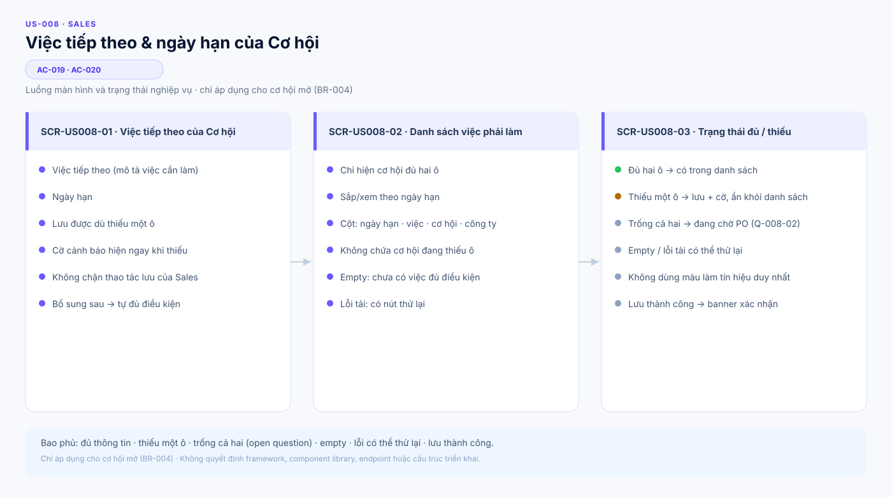
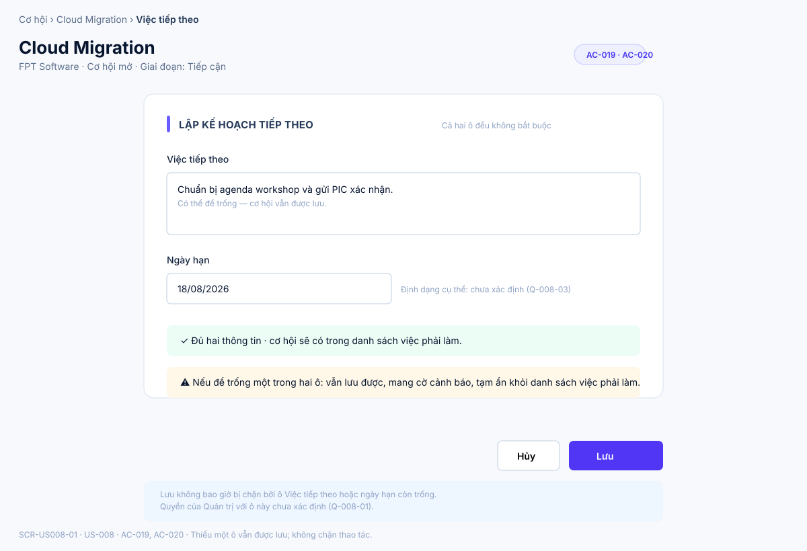
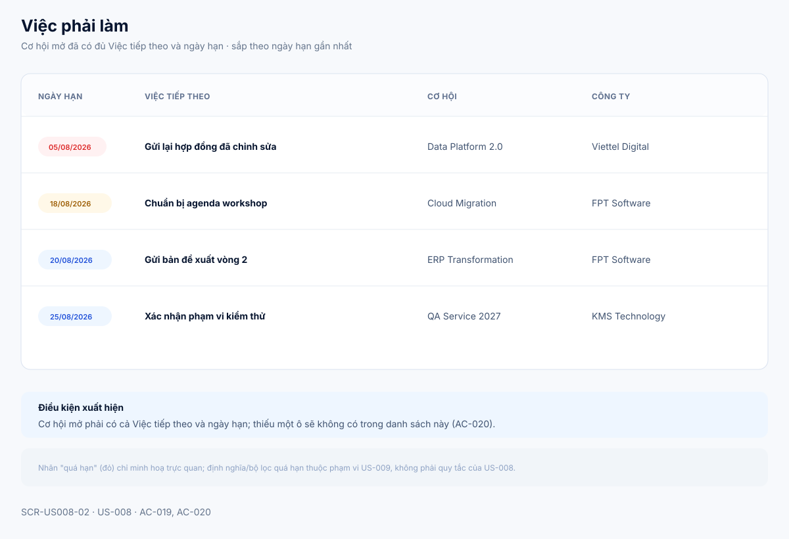
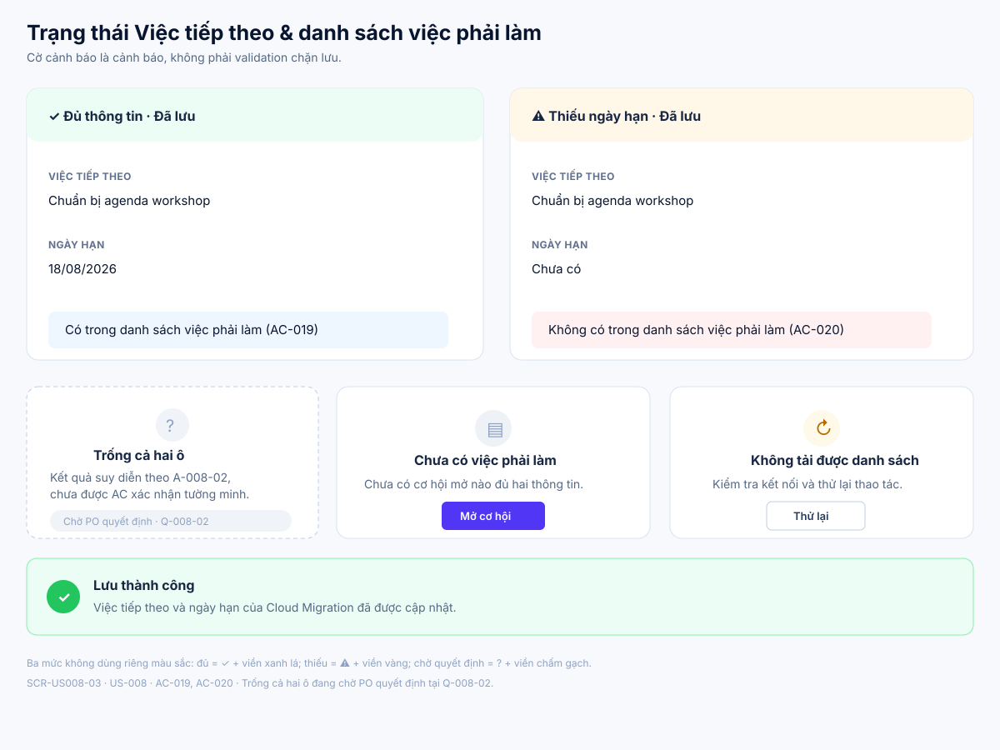

# Business Specification — US-008: Việc tiếp theo & ngày hạn

## 1. Document Information

| Field | Value |
|---|---|
| Story | `US-008` — Việc tiếp theo & ngày hạn |
| Feature / domain | `FEAT-008` / `D1 — CRM lõi làm tay` / `EPIC-03 — Nhịp làm việc hằng ngày` |
| Version | `1.2` |
| Status | `AWAITING_SPECIFICATION_APPROVAL` |
| Date | `2026-08-15` |
| Priority | Must (16) |
| Sources | `REQ-109`; `BR-004` (định nghĩa cơ hội mở/đóng); `US-008`, `AC-019..020`; `T-1`; dor-review; architect-handoff traceability |

## 2. Purpose

**[CONFIRMED — US-008, REQ-109]** Xác định hành vi nghiệp vụ để Sales ghi nhận Việc tiếp theo và ngày hạn cho một cơ hội mở, giúp Sales luôn biết deal nào cần làm gì hôm nay. **[CONFIRMED — AC-020]** Tài liệu làm rõ rằng thiếu một trong hai thông tin là trạng thái cần cảnh báo và loại khỏi danh sách việc phải làm, không phải lỗi chặn lưu.

## 3. User Story

**[CONFIRMED — US-008]** As a Sales, I want mỗi cơ hội có Việc tiếp theo + ngày hạn, so that tôi luôn biết deal nào cần làm gì hôm nay.

## 4. Business Goal

**[CONFIRMED — US-008]** Sales có một danh sách việc phải làm theo hạn khi cơ hội mở đã có đủ Việc tiếp theo và ngày hạn. **[INFERRED — REQ-109]** Cờ cảnh báo cho cơ hội mở thiếu thông tin giúp Sales nhận ra ngay cơ hội nào chưa đủ dữ liệu để lập kế hoạch, trong khi vẫn bảo toàn quyền lưu không bị chặn — tránh việc Sales bỏ dở thao tác chỉ vì thiếu một ô.

## 5. Scope

- **[CONFIRMED — REQ-109, AC-019]** Sales ghi nhận Việc tiếp theo và ngày hạn cho một cơ hội mở.
- **[CONFIRMED — REQ-109, AC-020]** Sales vẫn lưu được cơ hội mở khi thiếu Việc tiếp theo hoặc ngày hạn; thao tác lưu không bị chặn.
- **[CONFIRMED — AC-020]** Cơ hội mở thiếu ít nhất một trong hai thông tin hiển thị cờ cảnh báo.
- **[CONFIRMED — AC-019]** Cơ hội mở đã có đủ Việc tiếp theo và ngày hạn được đưa vào danh sách việc phải làm theo hạn.
- **[CONFIRMED — AC-020]** Cơ hội mở thiếu một hoặc cả hai thông tin bị loại khỏi danh sách việc phải làm cho đến khi được điền đủ.
- **[CONFIRMED — BR-004, requirement-analysis]** Phạm vi áp dụng của hai AC trên chỉ là cơ hội mở (Tiếp cận, Đủ điều kiện, Soạn đề xuất, Thương lượng, Tạm dừng); cơ hội đóng (Thắng, Thua) không được AC-019/020 đề cập.

## 6. Out of Scope

**[CONFIRMED — user-stories, REQ-103..112, function-decomposition]**

- Tạo và quản lý dữ liệu lõi của cơ hội (tên, giá trị, tháng chốt, giai đoạn): US-003.
- Đổi giai đoạn bằng kéo-thả: US-004; kiểm tra dấu hiệu Đủ điều kiện: US-005; ghi lý do Thua: US-006.
- Lọc cơ hội theo tình trạng quá hạn Việc tiếp theo (định nghĩa "quá hạn" thuộc US-009): US-009.
- Hiển thị danh sách Việc tiếp theo quá hạn trên màn hình tổng quan: US-010.
- Tự điền Việc tiếp theo và ngày hạn bằng A-AI theo độ gấp tín hiệu: US-025; quy tắc không đè giá trị thủ công và dấu hiệu do hệ thống đặt: US-026.
- Quy tắc riêng cho cơ hội đã đóng (Thắng/Thua), định dạng/độ dài hợp lệ của nội dung Việc tiếp theo, định dạng ngày hạn, nhắc việc hoặc gửi liên hệ khách, và mọi thay đổi giai đoạn/giá trị cơ hội.

## 7. Actor / Permission

| Actor | Business permission | Evidence |
|---|---|---|
| Sales | Ghi, cập nhật và xem Việc tiếp theo/ngày hạn của cơ hội mở; xem danh sách việc phải làm theo hạn. | **[CONFIRMED]** US-008; AC-019..020 |
| A-AI | Không có hành vi tự động nào trong phạm vi story này; việc tự điền Việc tiếp theo/ngày hạn là US-025 riêng biệt. | **[CONFIRMED]** US-025 dependency; BR-017 / architecture guardrail |
| Quản trị | Quyền thao tác Việc tiếp theo/ngày hạn của Quản trị chưa được nguồn US-008 xác định. | **[OPEN QUESTION]** Q-008-01 |

## 8. Business Rules

| ID | Rule | Evidence |
|---|---|---|
| BR-004 (tham chiếu) | Cơ hội mở gồm 5 giai đoạn: Tiếp cận, Đủ điều kiện, Soạn đề xuất, Thương lượng, Tạm dừng; cơ hội đóng gồm Thắng và Thua. Hai AC của US-008 chỉ áp dụng cho cơ hội mở. | **[CONFIRMED]** requirement-analysis BR-004 |
| BR-US008-01 | Với cơ hội mở, Việc tiếp theo và ngày hạn là hai thông tin cần có đầy đủ để cơ hội được liệt kê trong danh sách việc phải làm theo hạn. | **[CONFIRMED]** REQ-109; AC-019 |
| BR-US008-02 | Với cơ hội mở, thiếu Việc tiếp theo hoặc ngày hạn không được chặn thao tác lưu. | **[CONFIRMED]** REQ-109; AC-020 |
| BR-US008-03 | Cơ hội mở thiếu Việc tiếp theo hoặc thiếu ngày hạn phải mang cờ cảnh báo và không xuất hiện trong danh sách việc phải làm cho đến khi được điền đủ hai thông tin. | **[CONFIRMED]** REQ-109; AC-020 |
| BR-US008-04 | Story này không tự đặt giá trị, không thay đổi giai đoạn/giá trị cơ hội, không xóa dữ liệu và không liên hệ khách; mọi hành vi trong US-008 do Sales chủ động thực hiện. | **[CONFIRMED]** BR-017; architecture / project rules |
| BR-US008-05 | CRM thủ công của story vẫn hoạt động khi toàn bộ AI bị tắt. | **[CONFIRMED]** REQ-113; project rules |

**[INFERRED — AC-020]** Khi Sales bổ sung sau ô còn thiếu, cơ hội trở lại đủ điều kiện và được đưa vào danh sách việc phải làm — đây là hệ quả tự nhiên của cụm "tới khi điền đủ" trong AC-020, không phải quy tắc bổ sung ngoài nguồn.

**[ASSUMPTION — A-008-02]** Trường hợp cả Việc tiếp theo và ngày hạn cùng để trống được suy diễn là xử lý giống trường hợp thiếu một ô (vẫn lưu, có cờ, không vào danh sách); AC-020 chỉ nêu riêng lẻ "để trống ô này hoặc ô kia" nên tổ hợp "trống cả hai" chưa được kiểm chứng tường minh — xem Open Question Q-008-02.

## 9. Business Data Dictionary

| Business data | Meaning | Applicability / rule | Evidence |
|---|---|---|---|
| Cơ hội | Thương vụ bán hàng thuộc một công ty; đối tượng sở hữu Việc tiếp theo và ngày hạn. | Chỉ cơ hội mở thuộc phạm vi AC của story này. | **[CONFIRMED]** US-003; AC-019..020 |
| Cơ hội mở / đóng | Mở = {Tiếp cận, Đủ điều kiện, Soạn đề xuất, Thương lượng, Tạm dừng}; đóng = {Thắng, Thua}. | Xác định phạm vi áp dụng AC-019/020; cơ hội đóng nằm ngoài phạm vi (Q-008-04). | **[CONFIRMED]** BR-004; requirement-analysis |
| Việc tiếp theo | Mô tả việc Sales cần làm tiếp cho cơ hội. | Có thể để trống khi lưu; phải có để cơ hội vào danh sách việc phải làm. | **[CONFIRMED]** REQ-109 |
| Ngày hạn | Hạn hoàn thành Việc tiếp theo. | Có thể để trống khi lưu; phải có để cơ hội vào danh sách việc phải làm theo hạn. | **[CONFIRMED]** REQ-109; AC-019 |
| Cờ cảnh báo thiếu thông tin | Dấu hiệu cho biết cơ hội mở đang thiếu Việc tiếp theo hoặc ngày hạn. | Hiển thị khi thiếu ít nhất một ô; không phải trạng thái chặn lưu. | **[CONFIRMED]** REQ-109; AC-020 |
| Danh sách việc phải làm | Danh sách các cơ hội mở đã đủ Việc tiếp theo và ngày hạn, xem/sắp theo ngày hạn. | Không chứa cơ hội còn thiếu một trong hai ô. | **[CONFIRMED]** AC-019..020 |

## 10. Business Flow

### BF-008-01 — Lưu đủ hai thông tin

1. **[CONFIRMED — AC-019]** Sales mở một cơ hội mở.
2. **[CONFIRMED — AC-019]** Sales điền Việc tiếp theo và ngày hạn.
3. **[CONFIRMED — AC-019]** Sales lưu; hệ thống ghi nhận cả hai thông tin.
4. **[CONFIRMED — AC-019]** Cơ hội xuất hiện trong danh sách việc phải làm theo hạn.

### BF-008-02 — Lưu khi thiếu thông tin

1. **[CONFIRMED — AC-020]** Sales mở một cơ hội mở.
2. **[CONFIRMED — AC-020]** Sales để trống Việc tiếp theo hoặc ngày hạn rồi lưu.
3. **[CONFIRMED — AC-020]** Hệ thống vẫn lưu, hiển thị cờ cảnh báo và không chặn thao tác.
4. **[CONFIRMED — AC-020]** Cơ hội không vào danh sách việc phải làm cho tới khi có đủ cả hai thông tin.

### BF-008-03 — Bổ sung thông tin còn thiếu

1. **[CONFIRMED — AC-020]** Sales mở lại một cơ hội mở đang mang cờ cảnh báo vì thiếu một ô.
2. **[CONFIRMED — AC-020]** Sales điền nốt ô còn thiếu rồi lưu.
3. **[INFERRED — AC-020]** Cờ cảnh báo được gỡ và cơ hội xuất hiện trong danh sách việc phải làm theo hạn, vì cơ hội nay đã đủ hai thông tin.

## 11. Acceptance Criteria

### AC-019 — Đủ hai ô

```gherkin
Scenario: Đủ hai ô
  Given một cơ hội mở
  When tôi điền Việc tiếp theo và ngày hạn
  Then cơ hội xuất hiện trong danh sách việc phải làm theo hạn.
```

### AC-020 — Thiếu một ô vẫn lưu, mang cờ

```gherkin
Scenario: Thiếu một ô vẫn lưu, mang cờ
  Given một cơ hội mở
  When tôi để trống Việc tiếp theo hoặc ngày hạn và lưu
  Then cơ hội vẫn lưu, mang cờ cảnh báo và KHÔNG xuất hiện trong danh sách việc phải làm tới khi điền đủ; thao tác lưu không bị chặn.
```

**[CONFIRMED — user-stories.md]** Hai acceptance criteria trên được bảo toàn nguyên văn từ nguồn; không có AC bổ sung nào được đặt thêm ngoài `AC-019` và `AC-020`.

## 12. Screen Specification

| Screen ID | Business area | Required information / behavior | Evidence |
|---|---|---|---|
| `SCR-US008-01` | Việc tiếp theo của Cơ hội mở | Cho phép Sales ghi/sửa Việc tiếp theo và ngày hạn của một cơ hội mở; lưu được dù thiếu một ô; hiển thị dấu hiệu đủ/thiếu ngay tại chỗ. | **[CONFIRMED]** REQ-109; AC-019..020 |
| `SCR-US008-02` | Danh sách việc phải làm | Chỉ liệt kê cơ hội mở có đủ Việc tiếp theo và ngày hạn, xem/sắp theo ngày hạn. | **[CONFIRMED]** AC-019..020 |
| `SCR-US008-03` | Trạng thái đủ / thiếu | Phân biệt rõ cơ hội đủ thông tin (có trong danh sách) và cơ hội đã lưu nhưng thiếu một hoặc cả hai ô (mang cờ, không có trong danh sách), cùng các trạng thái rỗng/lỗi/thành công của danh sách việc phải làm. | **[CONFIRMED]** AC-019..020 |

## 13. Screen Design

> **UI-DESIGN UPDATE — 2026-08-15:** Wireframe được chuẩn hoá lại theo đúng ngôn ngữ hình ảnh đã được người dùng duyệt cho US-001 v1.2 ngày 2026-08-14 (nền `#f7f9fc`, card bo góc 14px viền `#d9e2ef`, thanh nhấn mục 5px `#695cff`, nút chính tím `#5236f5`, bảng header uppercase `#60718f`, khối trạng thái rỗng/lỗi dùng icon tròn + tiêu đề + mô tả + hành động). Asset chỉ minh hoạ hành vi nghiệp vụ, không quyết định framework, component library hay cách triển khai.

### 13.1 Tổng quan luồng



### 13.2 `SCR-US008-01` — Việc tiếp theo của Cơ hội mở



### 13.3 `SCR-US008-02` — Danh sách việc phải làm



### 13.4 `SCR-US008-03` — Trạng thái đủ / thiếu



**[ASSUMPTION — A-008-01]** Visual language kế thừa nguyên mẫu đã duyệt cho US-001 (v1.2). Asset không tự quyết định trường hợp "trống cả hai" (Q-008-02), định dạng nội dung/ngày hạn (Q-008-03), hành vi với cơ hội đã đóng (Q-008-04) hay múi giờ/ thứ tự hiển thị khi đồng hạn (Q-008-05) — các ô này được đánh dấu rõ trên hình là điểm đang chờ PO quyết định, không trình bày như đã chốt.

## 14. Screen States

| State | Visible business outcome | Screen / asset | Evidence |
|---|---|---|---|
| Đủ thông tin | Cơ hội mở có đủ Việc tiếp theo và ngày hạn; có mặt trong danh sách việc phải làm. | `SCR-US008-01`, `SCR-US008-02`, `SCR-US008-03` | **[CONFIRMED]** AC-019 |
| Thiếu Việc tiếp theo | Vẫn lưu, mang cờ cảnh báo, không có trong danh sách việc phải làm. | `SCR-US008-01`, `SCR-US008-03` | **[CONFIRMED]** AC-020 |
| Thiếu ngày hạn | Vẫn lưu, mang cờ cảnh báo, không có trong danh sách việc phải làm. | `SCR-US008-01`, `SCR-US008-03` | **[CONFIRMED]** AC-020 |
| Bổ sung ô còn thiếu | Cờ cảnh báo được gỡ; cơ hội chuyển sang có mặt trong danh sách việc phải làm. | `SCR-US008-01` → `SCR-US008-02` | **[INFERRED]** AC-020 (BF-008-03) |
| Thiếu cả hai ô | Hành vi được suy diễn giống trường hợp thiếu một ô, nhưng chưa được AC xác nhận tường minh cho tổ hợp này. | `SCR-US008-03` (đánh dấu là điểm chờ quyết định) | **[ASSUMPTION]** A-008-02; **[OPEN QUESTION]** Q-008-02 |
| Danh sách việc phải làm trống | Hiển thị empty state; không có cơ hội nào đủ điều kiện hiện tại. | `SCR-US008-03` | **[ASSUMPTION]** A-008-01 (kế thừa mẫu empty state US-001) |
| Không tải được danh sách | Hiển thị lỗi có thể thử lại; không mất dữ liệu Việc tiếp theo/ngày hạn đã lưu. | `SCR-US008-03` | **[ASSUMPTION]** A-008-01 |
| Lưu thành công | Xác nhận đã ghi nhận Việc tiếp theo/ngày hạn của cơ hội. | `SCR-US008-01`, `SCR-US008-03` | **[CONFIRMED]** AC-019..020 (kết quả lưu) |

## 15. Validation

| Condition | Expected business response | Evidence |
|---|---|---|
| Cơ hội mở có đủ Việc tiếp theo và ngày hạn | Lưu và đủ điều kiện xuất hiện trong danh sách việc phải làm theo hạn. | **[CONFIRMED]** AC-019 |
| Cơ hội mở thiếu Việc tiếp theo hoặc ngày hạn | Vẫn lưu; hiển thị cờ cảnh báo; không xuất hiện trong danh sách việc phải làm; không chặn thao tác lưu. | **[CONFIRMED]** AC-020 |
| Cơ hội mở thiếu cả Việc tiếp theo và ngày hạn | Chưa được AC xác nhận tường minh; tạm suy diễn theo A-008-02. | **[ASSUMPTION]** A-008-02; **[OPEN QUESTION]** Q-008-02 |
| Định dạng/độ dài hợp lệ của nội dung Việc tiếp theo hoặc giá trị ngày hạn | Chưa được nguồn nêu. | **[OPEN QUESTION]** Q-008-03 |
| Cơ hội đã đóng (Thắng/Thua) | Không có quy tắc nào trong phạm vi story này. | **[OPEN QUESTION]** Q-008-04 |

## 16. Dependencies

| Direction | Item | Dependency | Evidence |
|---|---|---|---|
| Upstream | US-003 / FEAT-003 | Cung cấp cơ hội thuộc công ty, bao gồm trạng thái mở/đóng theo BR-004. | **[CONFIRMED]** US-008 dependency; US-003; architect handoff |
| Downstream | US-009 / FEAT-009 | Dùng tình trạng quá hạn của Việc tiếp theo để lọc cơ hội. | **[CONFIRMED]** US-009 AC-023 |
| Downstream | US-010 / FEAT-010 | Hiển thị danh sách Việc tiếp theo quá hạn trên màn hình tổng quan. | **[CONFIRMED]** US-010 AC-024 |
| Downstream | US-025 / FEAT-025 | Tự điền Việc tiếp theo/ngày hạn cho cơ hội mở là use case riêng, phụ thuộc dữ liệu của US-008. | **[CONFIRMED]** US-025 dependency |
| Cross-cutting | US-040 / FEAT-040 | Ràng buộc chặn A-AI tự đổi giai đoạn/giá trị hoặc tự xóa dữ liệu áp dụng khi các story downstream (US-025/US-026) chạm vào Việc tiếp theo; US-008 tự thân không có hành vi tự động nào bị guardrail chi phối. | **[CONFIRMED]** BR-017; architect handoff |
| Acceptance | T-1 | CRM lõi, bao gồm Việc tiếp theo và ngày hạn, hoạt động khi toàn bộ AI tắt. | **[CONFIRMED]** PRD §6; REQ-113; architect handoff |

## 17. Business-level NFR Expectations

- **[CONFIRMED — REQ-113]** Hành vi CRM thủ công của story không phụ thuộc AI và tiếp tục hoạt động khi AI bị tắt.
- **[CONFIRMED — REQ-704; architecture]** Dữ liệu CRM cần bền qua khởi động lại trong triển khai sản phẩm; đây là kỳ vọng cấp hệ thống, không bổ sung quy tắc riêng cho US-008.
- **[CONFIRMED — human decision 2026-08-14 áp dụng US-001]** Không có SLA thời gian phản hồi riêng được nêu cho US-008; áp dụng kỳ vọng chất lượng chung của hệ thống.
- **[OPEN QUESTION — Q-008-05]** Nguồn chưa quy định múi giờ dùng để tính "theo hạn", hay thứ tự hiển thị khi nhiều cơ hội có cùng ngày hạn.

## 18. Test Scenarios

Chưa có `test-scenarios.md` riêng cho US-008. Các tình huống dưới đây là truy vết nghiệp vụ, không phải kiểm thử thực thi; chúng đóng góp vào bộ nghiệm thu **T-1**. **[CONFIRMED — architect handoff; PRD §6]**

| ID | Business scenario | AC / BR | Expected business result | Acceptance trace |
|---|---|---|---|---|
| TC-US008-01 | Sales điền đủ Việc tiếp theo và ngày hạn cho một cơ hội mở. | AC-019; BR-US008-01 | Cơ hội xuất hiện trong danh sách việc phải làm theo hạn. | T-1 |
| TC-US008-02 | Sales để trống Việc tiếp theo, giữ ngày hạn, rồi lưu cơ hội mở. | AC-020; BR-US008-02..03 | Lưu thành công, mang cờ cảnh báo, không có trong danh sách việc phải làm. | T-1 |
| TC-US008-03 | Sales để trống ngày hạn, giữ Việc tiếp theo, rồi lưu cơ hội mở. | AC-020; BR-US008-02..03 | Lưu thành công, mang cờ cảnh báo, không có trong danh sách việc phải làm. | T-1 |
| TC-US008-04 | Sales mở một cơ hội đang mang cờ vì thiếu một ô, bổ sung ô còn thiếu rồi lưu. | AC-020 (BF-008-03) | Cờ cảnh báo được gỡ; cơ hội xuất hiện trong danh sách việc phải làm. | T-1 |
| TC-US008-05 | Sales để trống cả Việc tiếp theo và ngày hạn rồi lưu cơ hội mở. | A-008-02 | Kết quả mong đợi chưa được AC xác nhận tường minh; cần PO quyết định trước khi viết kịch bản thực thi. | Q-008-02 (chặn) |
| TC-US008-06 | Quản trị thao tác Việc tiếp theo/ngày hạn của một cơ hội. | — | Quyền hạn chưa xác định; cần PO quyết định trước khi viết kịch bản thực thi. | Q-008-01 (chặn) |

## 19. Traceability

| Chain | Evidence |
|---|---|
| `D1 → EPIC-03 → FEAT-008 → US-008 → AC-019..020 → T-1` | **[CONFIRMED]** function-decomposition; user-stories; architect handoff |
| `REQ-109 → FEAT-008 → US-008 → AC-019..020` | **[CONFIRMED]** requirement-analysis; user-stories |
| `BR-004 → US-008 (phạm vi cơ hội mở)` | **[CONFIRMED]** requirement-analysis |
| `US-003 → US-008 → US-009 → US-010` | **[CONFIRMED]** US-008 dependency; user-stories |
| `US-008 → US-025 → US-026` | **[CONFIRMED]** US-025/US-026 dependency in user-stories |
| `REQ-113 → BR-US008-05` | **[CONFIRMED]** requirement-analysis; project rules |
| `BR-017 → BR-US008-04` | **[CONFIRMED]** requirement-analysis; architecture / project rules |
| `AC-019 → TC-US008-01`; `AC-020 → TC-US008-02..04` | **[CONFIRMED]** user-stories |

## 20. Assumptions

| ID | Assumption | Rationale / status |
|---|---|---|
| A-008-01 | Visual language dùng nguyên mẫu đã duyệt cho US-001 v1.2; cờ cảnh báo phải dễ nhận biết nhưng không trở thành validation chặn lưu. | **[ASSUMPTION]** Không thay đổi AC. |
| A-008-02 | Khi cả hai ô đều trống, hành vi giống trường hợp thiếu một ô: vẫn lưu, có cờ, không vào danh sách việc phải làm. | **[ASSUMPTION]** Cần PO phê duyệt tại Q-008-02. |

## 21. Open Questions

| ID | Question | Owner / impact |
|---|---|---|
| Q-008-01 | Quản trị có được thao tác Việc tiếp theo/ngày hạn như Sales không? | PO; làm rõ phân quyền nghiệp vụ. |
| Q-008-02 | Khi cả hai ô đều trống, có áp dụng chính xác cùng kết quả AC-020 không? | PO; xác nhận assumption A-008-02. |
| Q-008-03 | Có quy định định dạng, giới hạn độ dài hoặc ý nghĩa hợp lệ cho ngày hạn và nội dung Việc tiếp theo không? | PO; không tự đặt validation ngoài nguồn. |
| Q-008-04 | Cơ hội đã đóng (Thắng/Thua) có được giữ/sửa/hiển thị Việc tiếp theo và ngày hạn không? | PO; ngoài phạm vi AC hiện tại. |
| Q-008-05 | "Theo hạn" dùng múi giờ nào và thứ tự hiển thị khi nhiều cơ hội đồng hạn ra sao? | PO; ảnh hưởng cách trình bày danh sách việc phải làm. |

## 22. Definition of Ready

| Check | Status | Evidence / note |
|---|---|---|
| Actor và giá trị nghiệp vụ rõ ràng | Ready | **[CONFIRMED]** US-008; dor-review |
| Phạm vi và AC nguồn truy vết được | Ready | **[CONFIRMED]** REQ-109; AC-019..020; dor-review |
| Business rules chính rõ ràng | Ready | **[CONFIRMED]** BR-US008-01..05; BR-004 |
| Dependencies và T-1 đã nhận diện | Ready | **[CONFIRMED]** architect handoff; dor-review |
| Câu hỏi nghiệp vụ được quyết định hoặc được PO chấp nhận làm mở | Ready with questions | Q-008-01..05 còn mở; không thay đổi hai AC đã có, không chặn trạng thái DoR READY đã được PO review. |
| Đánh giá DoR của nguồn | READY | **[CONFIRMED]** `docs/02-analysis/dor-review.md` |

**[CONFIRMED — human-approval rule]** Tài liệu dừng tại `AWAITING_SPECIFICATION_APPROVAL`; chỉ con người có thể đặt `SPECIFICATION_APPROVED`.

## 23. Technical Handoff

### Approved constraints

- **[CONFIRMED — AC-020]** Lưu thiếu một ô vẫn phải thành công, hiển thị cờ cảnh báo và loại khỏi danh sách việc phải làm cho tới khi đủ hai ô.
- **[CONFIRMED — REQ-113]** Không tạo phụ thuộc vào AI cho luồng CRM thủ công của story.
- **[CONFIRMED — BR-017; architecture]** Không để bất kỳ tự động hóa nào (kể cả các story downstream US-025/US-026) thay đổi giai đoạn/giá trị cơ hội, xóa dữ liệu do người tạo hay liên hệ khách thông qua trường Việc tiếp theo/ngày hạn; guardrail áp dụng cả khi gọi ngoài giao diện người dùng.

### Touchpoints and risks

- **[CONFIRMED]** Phụ thuộc dữ liệu cơ hội (bao gồm trạng thái mở/đóng) từ US-003; US-009, US-010 và US-025 sử dụng kết quả của story này.
- **[INFERRED — AC-019..020]** Nếu tiêu chí "đủ hai ô" để vào danh sách việc phải làm không được áp dụng nhất quán, Sales có thể bỏ sót việc cần hoàn thiện hoặc thấy sai cơ hội trong danh sách.
- **[INFERRED — REQ-109]** Nếu xử lý trường hợp "chỉ thiếu một ô" và "thiếu cả hai ô" không nhất quán sau khi PO trả lời Q-008-02, cần một lần rà soát lại hành vi hiển thị cờ và danh sách.

### Decisions required from Tech Lead

- Không có quyết định kỹ thuật mới được đề xuất trong specification này. Tech Lead cần bảo đảm các ràng buộc đã phê duyệt được tôn trọng và chuyển các câu hỏi Q-008-01..05 cho PO thay vì tự suy diễn quy tắc nghiệp vụ (đặc biệt Q-008-02 vì ảnh hưởng trực tiếp đến logic đưa/loại cơ hội khỏi danh sách việc phải làm).

## 24. Change Log

| Version | Date | Change | Author/Approver |
|---|---|---|---|
| 1.2 | 2026-08-15 | Viết lại toàn diện theo chuẩn 24 mục US-001 v1.2, đối chiếu docs/02-analysis, chuẩn hoá SVG theo ngôn ngữ hình ảnh đã duyệt. | Codex — comprehensive refinement pass; specification approval unchanged |
| 1.1 | 2026-08-14 | Bổ sung ba SVG chi tiết cho editor, danh sách việc phải làm và trạng thái đủ/thiếu; bảo toàn lưu non-blocking và các open question. | Codex — UI pattern approved; specification approval unchanged |
| 1.0 | 2026-08-14 | Tạo business specification 24 mục cho US-008 từ nguồn đã phê duyệt; giữ nguyên REQ-109, AC-019..020 và dependency US-003. | Codex / awaiting human specification approval |
