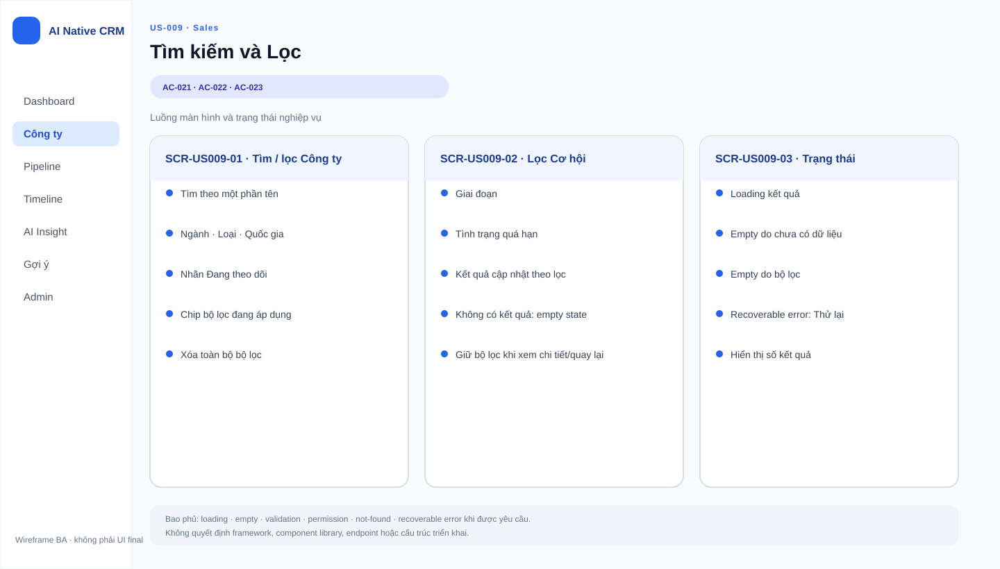
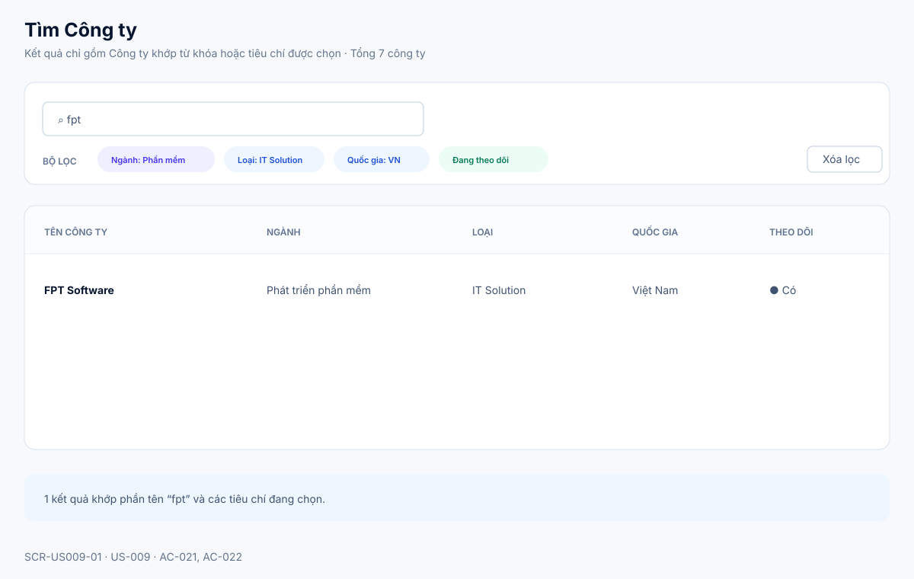
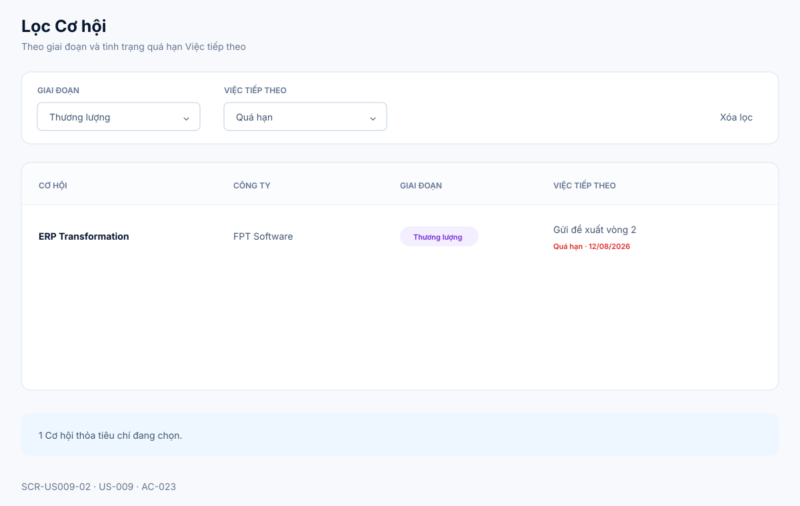
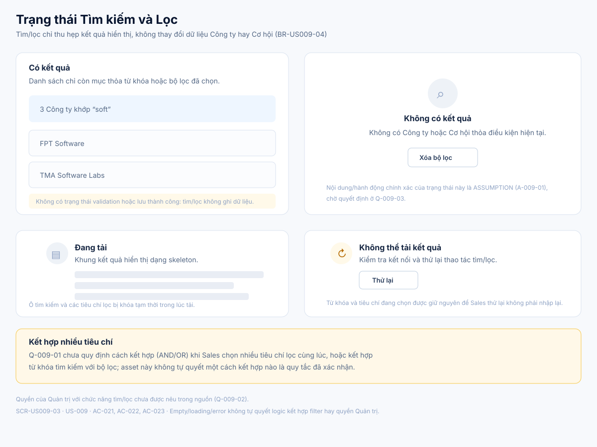

# Business Specification — US-009: Tìm kiếm và Lọc

## 1. Document Information
| Field | Value |
|---|---|
| Story | `US-009` |
| Version | `1.1` |
| Status | `AWAITING_SPECIFICATION_APPROVAL` |
| Sources | `REQ-111`, `FEAT-009`, `AC-021..023`, DoR |
## 2. Purpose
**[CONFIRMED — REQ-111]** Xác định tìm công ty theo tên và lọc danh sách công ty/cơ hội.
## 3. User Story
**[CONFIRMED — US-009]** As a Sales, I want tìm và lọc công ty/cơ hội, so that tôi tìm lại nhanh thứ đã nhập.
## 4. Business Goal
**[CONFIRMED — US-009]** Sales thu hẹp danh sách còn mục thỏa điều kiện cần xem.
## 5. Scope
- **[CONFIRMED — AC-021]** Tìm công ty theo một phần tên.
- **[CONFIRMED — AC-022]** Lọc công ty theo ngành/loại/quốc gia/Đang theo dõi.
- **[CONFIRMED — AC-023]** Lọc cơ hội theo giai đoạn/quá hạn Việc tiếp theo.
## 6. Out of Scope
- **[CONFIRMED — US-001/003/008]** Quản lý dữ liệu công ty, cơ hội, Việc tiếp theo.
- **[OPEN QUESTION — Q-009-01]** Kết hợp bộ lọc, thứ tự và so khớp tên chi tiết chưa nêu.
## 7. Actor / Permission
| Actor | Permission | Evidence |
|---|---|---|
| Sales | Tìm/lọc công ty và cơ hội. | **[CONFIRMED]** US-009 |
| Quản trị | Quyền dùng bộ lọc chưa nêu. | **[OPEN QUESTION]** Q-009-02 |
## 8. Business Rules
| ID | Rule | Evidence |
|---|---|---|
| BR-US009-01 | Gõ phần tên chỉ còn công ty khớp. | **[CONFIRMED]** AC-021 |
| BR-US009-02 | Bộ lọc công ty gồm bốn tiêu chí nguồn nêu. | **[CONFIRMED]** AC-022 |
| BR-US009-03 | Bộ lọc cơ hội gồm giai đoạn và quá hạn. | **[CONFIRMED]** AC-023 |
| BR-US009-04 | Tìm/lọc không thay đổi dữ liệu CRM. | **[INFERRED]** REQ-111 |
## 9. Business Data Dictionary
| Data | Meaning | Evidence |
|---|---|---|
| Tên công ty | Dữ liệu tìm kiếm. | **[CONFIRMED]** AC-021 |
| Ngành/loại/quốc gia/Đang theo dõi | Tiêu chí lọc công ty. | **[CONFIRMED]** AC-022 |
| Giai đoạn/quá hạn | Tiêu chí lọc cơ hội. | **[CONFIRMED]** AC-023 |
## 10. Business Flow
1. **[CONFIRMED — AC-021]** Sales gõ một phần tên; danh sách còn công ty khớp.
2. **[CONFIRMED — AC-022..023]** Sales chọn bộ lọc; danh sách còn mục thỏa bộ lọc.
## 11. Acceptance Criteria
### AC-021 — Tìm công ty theo tên
```gherkin
Given có nhiều công ty
When tôi gõ một phần tên
Then danh sách chỉ còn công ty khớp.
```
### AC-022 — Lọc công ty
```gherkin
Given danh sách công ty
When tôi lọc theo ngành / loại công ty / quốc gia / Đang theo dõi
Then chỉ còn công ty thỏa bộ lọc.
```
### AC-023 — Lọc cơ hội
```gherkin
Given danh sách cơ hội
When tôi lọc theo giai đoạn / quá hạn Việc tiếp theo
Then chỉ còn cơ hội thỏa bộ lọc.
```
## 12. Screen Specification
| Screen ID | Area | Behavior | Evidence |
|---|---|---|---|
| `SCR-US009-01` | Danh sách Công ty | Tìm theo một phần tên và lọc theo ngành, loại, quốc gia, Đang theo dõi. | **[CONFIRMED]** AC-021..022 |
| `SCR-US009-02` | Danh sách Cơ hội | Lọc theo giai đoạn hoặc quá hạn Việc tiếp theo. | **[CONFIRMED]** AC-023 |
| `SCR-US009-03` | Trạng thái Tìm/Lọc | Có kết quả, không kết quả và lỗi phục hồi; không tự quyết cách kết hợp nhiều tiêu chí. | **[ASSUMPTION]** A-009-01; **[OPEN QUESTION]** Q-009-01..03 |
## 13. Screen Design

> **UI-DESIGN UPDATE — 2026-08-14:** Wireframe BA dưới đây được tạo từ các US/AC hiện hành và thay thế trạng thái “chưa có asset” được ghi nhận trước bước UI Design.



### `SCR-US009-01` — Tìm và lọc Công ty


### `SCR-US009-02` — Lọc Cơ hội


### `SCR-US009-03` — Trạng thái Tìm/Lọc


**[ASSUMPTION — A-009-01]** Visual language kế thừa mẫu đã duyệt cho US-001; empty/loading/error không tự quyết logic kết hợp filter hoặc quyền Admin.
## 14. Screen States
| State | Outcome | Screen | Evidence |
|---|---|---|---|
| Có từ khóa | Chỉ còn Công ty khớp. | `SCR-US009-01` | **[CONFIRMED]** AC-021 |
| Có bộ lọc | Chỉ còn mục thỏa tiêu chí. | `SCR-US009-01`, `SCR-US009-02` | **[CONFIRMED]** AC-022..023 |
| Không có kết quả | Hiển thị empty state và cho phép xóa tiêu chí. | `SCR-US009-03` | **[ASSUMPTION]** A-009-01; **[OPEN QUESTION]** Q-009-03 |
## 15. Validation
| Condition | Response | Evidence |
|---|---|---|
| Tiêu chí được chọn | Kết quả thỏa tiêu chí. | **[CONFIRMED]** AC-021..023 |
| Nhiều tiêu chí cùng lúc | Không tự định nghĩa cách kết hợp. | **[OPEN QUESTION]** Q-009-01 |
## 16. Dependencies
| Direction | Item | Evidence |
|---|---|---|
| Upstream | US-001 công ty; US-003 cơ hội; US-008 Việc tiếp theo. | **[CONFIRMED]** user-stories |
| Related | US-030 nhãn Đang theo dõi. | **[CONFIRMED]** REQ-501 |
## 17. Business-level NFR Expectations
- **[CONFIRMED — REQ-111]** Kết quả phản ánh tiêu chí đã chọn.
- **[CONFIRMED — REQ-113]** CRM thủ công không phụ thuộc AI.
## 18. Test Scenarios
| ID | Scenario | AC | Expected result |
|---|---|---|---|
| TC-009-01 | Gõ phần tên khi có nhiều công ty. | AC-021 | Chỉ còn công ty khớp. |
| TC-009-02 | Lọc công ty theo tiêu chí nguồn nêu. | AC-022 | Chỉ còn công ty thỏa lọc. |
| TC-009-03 | Lọc cơ hội theo giai đoạn/quá hạn. | AC-023 | Chỉ còn cơ hội thỏa lọc. |
## 19. Traceability
| Chain | Evidence |
|---|---|
| `REQ-111 → EPIC-03 → FEAT-009 → US-009 → AC-021 → TC-009-01` | **[CONFIRMED]** architect handoff |
| `REQ-111 → EPIC-03 → FEAT-009 → US-009 → AC-022 → TC-009-02` | **[CONFIRMED]** architect handoff |
| `REQ-111 → EPIC-03 → FEAT-009 → US-009 → AC-023 → TC-009-03` | **[CONFIRMED]** architect handoff |
## 20. Assumptions
| ID | Assumption | Status |
|---|---|---|
| A-009-01 | Visual language dùng mẫu đã duyệt cho US-001; cách biểu đạt empty/loading/error không thay đổi tiêu chí nguồn. | **[ASSUMPTION]** Không đóng Q-009-01..03. |
## 21. Open Questions
| ID | Question | Owner |
|---|---|---|
| Q-009-01 | Nhiều bộ lọc kết hợp thế nào? | PO |
| Q-009-02 | Quản trị có quyền tìm/lọc không? | PO |
| Q-009-03 | Hiển thị gì khi không có kết quả? | PO/UX |
## 22. Definition of Ready
| Item | Status | Evidence |
|---|---|---|
| Actor/value, AC, dependency, traceability | READY | REQ-111 → FEAT-009 → US-009 → AC-021..023 → TC |
| DoR nguồn | READY | **[CONFIRMED]** dor-review |
## 23. Technical Handoff
- **[CONFIRMED — AC-021..023]** Bảo toàn tiêu chí tìm/lọc.
- **[CONFIRMED — REQ-113]** Không tạo phụ thuộc AI; không tự quyết Q-009-01..03.
## 24. Change Log
| Version | Date | Change | Author/Approver |
|---|---|---|---|
| 1.1 | 2026-08-14 | Bổ sung ba SVG chi tiết cho tìm/lọc Công ty, lọc Cơ hội và trạng thái kết quả; giữ mở logic kết hợp bộ lọc. | Codex — UI pattern approved; specification approval unchanged |
| 1.0 | 2026-08-14 | Tạo specification 24 mục. | Codex / awaiting human specification approval |
