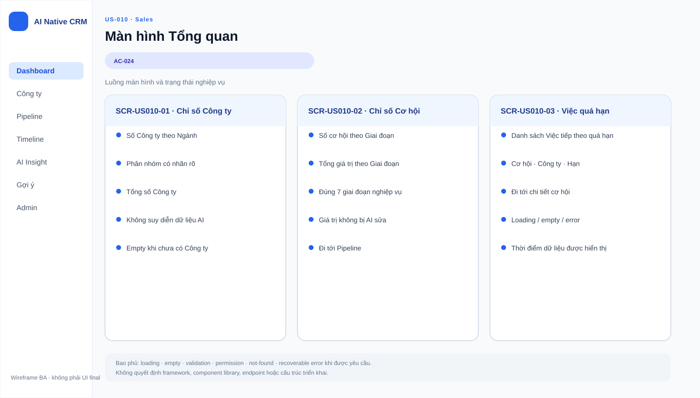
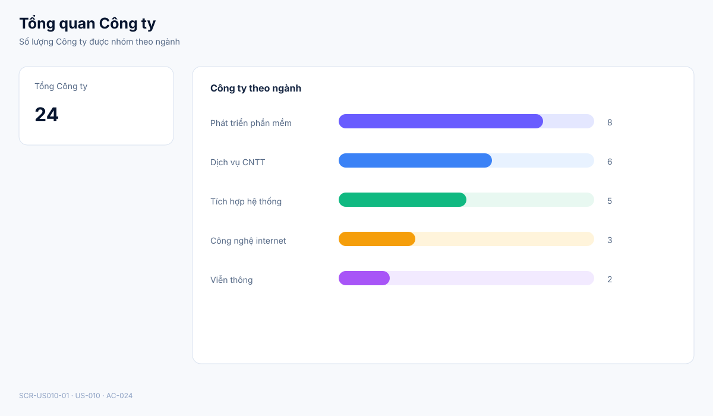
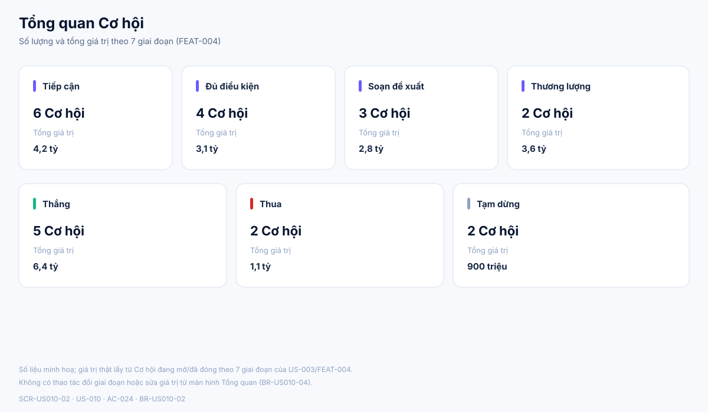
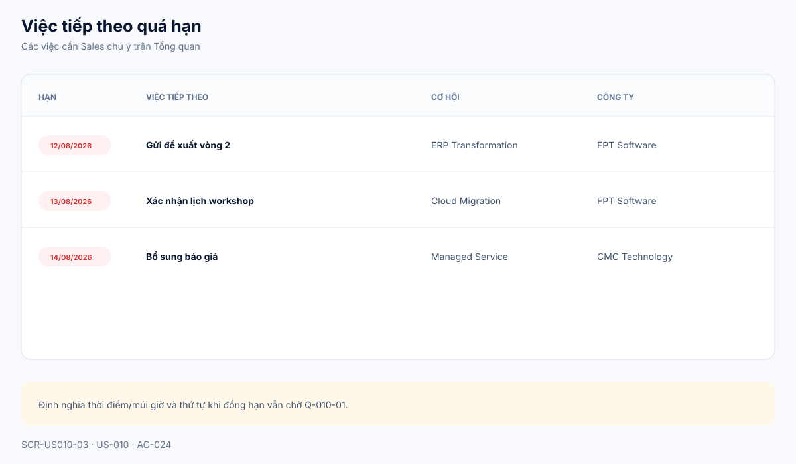
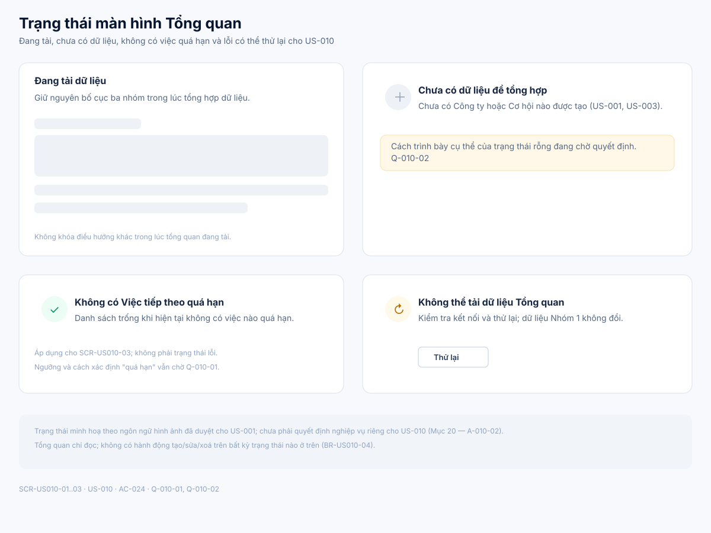

# Business Specification — US-010: Màn hình tổng quan

## 1. Document Information

| Field | Value |
|---|---|
| Story | `US-010` — Màn hình tổng quan |
| Feature / domain | `FEAT-010` / `D1 — CRM lõi làm tay` / `EPIC-03 — Nhịp làm việc hằng ngày` |
| Version | `1.2` |
| Status | `AWAITING_SPECIFICATION_APPROVAL` |
| Date | `2026-08-15` |
| Priority | Could (10, acceptance-mandatory T-1) |
| Sources | `REQ-112`; `US-010`, `AC-024`; `T-1`; DoR review; architect handoff |

## 2. Purpose

**[CONFIRMED — REQ-112, US-010]** Xác định hành vi nghiệp vụ của màn hình tổng quan để Sales xem tại một nơi: số Công ty theo ngành, số và tổng giá trị Cơ hội theo từng giai đoạn, và danh sách Việc tiếp theo quá hạn.

## 3. User Story

**[CONFIRMED — US-010]** As a Sales, I want một màn hình tổng quan, so that tôi nắm nhanh tình hình.

## 4. Business Goal

**[CONFIRMED — REQ-112; AC-024]** Sales xem đồng thời ba nhóm số liệu — phân bố Công ty theo ngành, số/tổng giá trị Cơ hội theo giai đoạn và Việc tiếp theo quá hạn — tại một màn hình duy nhất, không phải mở lần lượt các màn hình nguồn. **[INFERRED — REQ-112; FEAT-010 "thống kê"]** Mục tiêu là giúp Sales phát hiện nhanh việc cần xử lý (đặc biệt việc quá hạn) mà không phải tự tổng hợp bằng tay.

## 5. Scope

- **[CONFIRMED — AC-024]** Hiển thị số Công ty, nhóm theo ngành.
- **[CONFIRMED — AC-024]** Hiển thị số lượng và tổng giá trị Cơ hội, nhóm theo từng giai đoạn trong 7 giai đoạn nghiệp vụ.
- **[CONFIRMED — AC-024]** Hiển thị danh sách Việc tiếp theo quá hạn.
- **[INFERRED — FEAT-010 "thống kê"; REQ-112]** Tổng quan là màn hình chỉ đọc: tổng hợp và hiển thị số liệu, không tạo/sửa/xoá Công ty, Cơ hội hay Việc tiếp theo từ chính màn hình này.
- **[CONFIRMED — REQ-113; T-1; architect handoff]** Tổng quan thuộc Nhóm 1 (CRM làm tay) và phải hoạt động khi toàn bộ AI bị tắt.

## 6. Out of Scope

- **[CONFIRMED — US-001, US-003, US-008]** Tạo, sửa, xoá hoặc xem chi tiết Công ty, Cơ hội và Việc tiếp theo — các thao tác này thuộc các story nguồn dữ liệu, không thuộc US-010.
- **[CONFIRMED — FEAT-035; dor-review, backlog-prioritization]** Bảng đo lường chất lượng AI dành cho Quản trị (FEAT-035) là một tính năng Could riêng, không thuộc phạm vi US-010.
- **[CONFIRMED — function-decomposition, D2..D6]** Các chức năng đọc nguồn, rút phát hiện, gợi ý, tự chủ AI và quản trị AI (Nhóm 2–6) không thuộc US-010.
- **[CONFIRMED — US-009/FEAT-009]** Chức năng tìm kiếm và lọc (Công ty theo tên/ngành/loại/quốc gia, Cơ hội theo giai đoạn/quá hạn) thuộc US-009, không thuộc US-010.
- **[OPEN QUESTION — Q-010-01]** Định nghĩa chính xác "quá hạn" (mốc thời điểm, múi giờ, thứ tự khi đồng hạn) chưa được nêu trong nguồn.
- **[OPEN QUESTION — Q-010-02]** Cách trình bày trạng thái không có dữ liệu (empty state) cho từng nhóm số liệu chưa được nêu trong nguồn.

## 7. Actor / Permission

| Actor | Business permission | Evidence |
|---|---|---|
| Sales | Mở và xem màn hình tổng quan; không có hành động ghi dữ liệu từ màn hình này. | **[CONFIRMED]** US-010; AC-024 |
| Quản trị | Không có số liệu hoặc màn hình tổng quan riêng trong phạm vi US-010; số liệu đo lường Quản trị thuộc FEAT-035 (Could, PO Approval riêng). | **[CONFIRMED]** FEAT-035; backlog-prioritization |
| A-AI | Không có vai trò hoặc hành vi tự động nào trong US-010; tổng quan chỉ tổng hợp dữ liệu Nhóm 1 do Sales/Quản trị tạo qua US-001/003/008. | **[INFERRED]** FEAT-010 "thống kê"; REQ-113; architect handoff |

## 8. Business Rules

| ID | Rule | Evidence |
|---|---|---|
| BR-US010-01 | Tổng quan hiển thị số lượng Công ty, nhóm theo ngành. | **[CONFIRMED]** AC-024 |
| BR-US010-02 | Tổng quan hiển thị số lượng và tổng giá trị Cơ hội, nhóm theo từng giai đoạn. | **[CONFIRMED]** AC-024 |
| BR-US010-03 | Tổng quan hiển thị danh sách Việc tiếp theo quá hạn. | **[CONFIRMED]** AC-024 |
| BR-US010-04 | Tổng quan không tạo, sửa hay xoá dữ liệu Công ty, Cơ hội hay Việc tiếp theo; đây là màn hình tổng hợp chỉ đọc. | **[INFERRED]** REQ-112; FEAT-010 "thống kê" |
| BR-US010-05 | Tổng quan phải hiển thị đúng và đủ ba nhóm số liệu ngay cả khi toàn bộ AI bị tắt, vì US-010 thuộc Nhóm 1 và nằm trong phạm vi nghiệm thu T-1. | **[CONFIRMED]** REQ-113; T-1; architect handoff |

## 9. Business Data Dictionary

| Business data | Meaning | Applicability / rule | Evidence |
|---|---|---|---|
| Số Công ty theo ngành | Số lượng Công ty hiện có, đếm và nhóm theo từng Ngành. | Nguồn từ dữ liệu Công ty của US-001. | **[CONFIRMED]** AC-024; BR-US010-01 |
| Số Cơ hội theo giai đoạn | Số lượng Cơ hội hiện có, đếm và nhóm theo từng giai đoạn trong 7 giai đoạn nghiệp vụ. | Nguồn từ dữ liệu Cơ hội và bảng giai đoạn của US-003/FEAT-004. | **[CONFIRMED]** AC-024; BR-US010-02; FEAT-004 |
| Tổng giá trị Cơ hội theo giai đoạn | Tổng giá trị của các Cơ hội, cộng dồn theo từng giai đoạn. | Cùng nhóm giai đoạn với số lượng Cơ hội. | **[CONFIRMED]** AC-024; BR-US010-02 |
| Việc tiếp theo quá hạn | Một mục Việc tiếp theo (đã đặt ở US-008) mà ngày hạn được xác định là đã qua so với thời điểm hiện tại. | Thời điểm/múi giờ dùng để xác định "đã qua" chưa được xác nhận. | **[CONFIRMED — khái niệm]** REQ-109; REQ-112; **[OPEN QUESTION]** Q-010-01 |
| Cơ hội liên quan (của Việc tiếp theo quá hạn) | Cơ hội mà Việc tiếp theo quá hạn thuộc về, dùng để Sales nhận diện ngữ cảnh. | Hiển thị kèm mỗi dòng Việc tiếp theo quá hạn. | **[CONFIRMED]** AC-024; US-008 |
| Công ty liên quan (của Việc tiếp theo quá hạn) | Công ty mà Cơ hội liên quan thuộc về. | Hiển thị kèm mỗi dòng Việc tiếp theo quá hạn. | **[CONFIRMED]** AC-024; US-001 |

## 10. Business Flow

**BF-010-01 — Xem Tổng quan (luồng chính).** **[CONFIRMED — AC-024]** Sales mở màn hình tổng quan từ điều hướng chính. Hệ thống tổng hợp dữ liệu hiện có từ Công ty (US-001), Cơ hội (US-003) và Việc tiếp theo (US-008), sau đó hiển thị đồng thời ba nhóm: số Công ty theo ngành, số/tổng giá trị Cơ hội theo giai đoạn, và danh sách Việc tiếp theo quá hạn. Sales chỉ xem; không có bước nhập liệu hay ghi dữ liệu trong luồng này.

**BF-010-02 — Chưa có dữ liệu nguồn.** **[OPEN QUESTION — Q-010-02]** Khi chưa có Công ty hoặc Cơ hội nào được tạo, cách trình bày cụ thể của nhóm số liệu tương ứng (thông điệp, hành động gợi ý) chưa được xác nhận trong nguồn.

**BF-010-03 — Không có Việc tiếp theo quá hạn.** **[INFERRED — AC-024; đối lập logic của BR-US010-03]** Khi không có Việc tiếp theo nào quá hạn tại thời điểm xem, danh sách quá hạn hiển thị rỗng; đây không phải là lỗi. **[OPEN QUESTION — Q-010-01, Q-010-02]** Định nghĩa "quá hạn" và cách trình bày rỗng cụ thể chưa được xác nhận.

## 11. Acceptance Criteria

**AC-024 — Hiển thị tổng quan**

```gherkin
Scenario: Hiển thị tổng quan
  Given có dữ liệu công ty và cơ hội
  When tôi mở màn hình tổng quan
  Then thấy số công ty theo ngành, số cơ hội & tổng giá trị theo từng giai đoạn, và danh sách Việc tiếp theo quá hạn.
```

**[CONFIRMED — user-stories]** Nội dung Gherkin trên được bảo toàn nguyên nghĩa từ nguồn; US-010 hiện chỉ có một acceptance criterion duy nhất (AC-024). Không có AC bổ sung nào được xác nhận trong `docs/02-analysis`; mọi hành vi khác (empty state, xác định quá hạn) được xử lý qua Open Questions ở Mục 21, không được thêm thành AC mới.

## 12. Screen Specification

| Screen ID | Business area | Required information / behavior | Evidence |
|---|---|---|---|
| `SCR-US010-01` | Tổng quan Công ty | Hiển thị tổng số Công ty và số lượng theo từng ngành; chỉ đọc, không có hành động chỉnh sửa. | **[CONFIRMED]** AC-024; BR-US010-01, BR-US010-04 |
| `SCR-US010-02` | Tổng quan Cơ hội | Hiển thị số lượng và tổng giá trị Cơ hội theo từng giai đoạn trong 7 giai đoạn nghiệp vụ; chỉ đọc. | **[CONFIRMED]** AC-024; BR-US010-02, BR-US010-04 |
| `SCR-US010-03` | Việc tiếp theo quá hạn | Hiển thị danh sách Việc tiếp theo quá hạn kèm Cơ hội và Công ty liên quan; không tự đặt múi giờ/thứ tự khi đồng hạn. | **[CONFIRMED]** AC-024; BR-US010-03; **[OPEN QUESTION]** Q-010-01 |
| `SCR-US010-04` | Trạng thái tổng quan | Minh hoạ loading, chưa có dữ liệu, không có việc quá hạn và lỗi có thể thử lại cho ba nhóm số liệu trên. | **[ASSUMPTION]** A-010-02; **[OPEN QUESTION]** Q-010-02 |

## 13. Screen Design

> **UI-DESIGN UPDATE — 2026-08-15:** Wireframe BA được đồng bộ theo đúng ngôn ngữ hình ảnh đã duyệt cho US-001 ngày 2026-08-14: nền `#f7f9fc`, card bo góc 14px viền `#d9e2ef`, đường kẻ phân cách `#e6ebf2`, tiêu đề `#07152f`, chữ thân `#3f526f`, chữ phụ `#64748b`/`#8da1c3`, thanh nhấn mục 5px `#695cff` cạnh tiêu đề mục, nút chính tím `#5236f5`, nút phụ viền `#bfcee0`, khối trạng thái rỗng/lỗi dùng icon tròn + tiêu đề + mô tả + nút hành động. Các asset là SVG Git-friendly, không quyết định framework, component library hoặc cách triển khai.

### 13.1 Tổng quan luồng



### 13.2 `SCR-US010-01` — Số Công ty theo ngành



### 13.3 `SCR-US010-02` — Cơ hội theo giai đoạn



### 13.4 `SCR-US010-03` — Việc tiếp theo quá hạn



### 13.5 `SCR-US010-04` — Trạng thái tổng quan



**[ASSUMPTION — A-010-01]** Số liệu minh hoạ trong các SVG (tên ngành, giai đoạn, số lượng, giá trị, tên Công ty/Cơ hội) chỉ mang tính minh hoạ bố cục; không phải dữ liệu hay ngưỡng nghiệp vụ đã chốt.

## 14. Screen States

| State | Visible business outcome | Screen / asset | Evidence |
|---|---|---|---|
| Có đủ dữ liệu nguồn | Hiển thị đủ ba nhóm: Công ty theo ngành, Cơ hội theo giai đoạn, Việc tiếp theo quá hạn. | `SCR-US010-01..03` | **[CONFIRMED]** AC-024 |
| Chưa có Công ty/Cơ hội nào | Cách trình bày cụ thể của nhóm số liệu tương ứng chưa được xác nhận. | `SCR-US010-04` | **[OPEN QUESTION]** Q-010-02 |
| Không có Việc tiếp theo quá hạn | Danh sách quá hạn hiển thị rỗng; không phải trạng thái lỗi. | `SCR-US010-04` | **[INFERRED]** AC-024; **[OPEN QUESTION]** Q-010-02 |
| Đang tải dữ liệu | Giữ nguyên bố cục ba nhóm trong lúc tổng hợp; không khoá điều hướng khác. | `SCR-US010-04` | **[ASSUMPTION]** A-010-02 |
| Lỗi tải dữ liệu, có thể thử lại | Cho phép Sales thử lại thao tác tải; dữ liệu Nhóm 1 không đổi. | `SCR-US010-04` | **[ASSUMPTION]** A-010-02 |

## 15. Validation

US-010 là màn hình chỉ đọc, không có biểu mẫu nhập liệu; do đó không có quy tắc validation dữ liệu đầu vào. Bảng dưới mô tả điều kiện hiển thị.

| Condition | Expected business response | Evidence |
|---|---|---|
| Có dữ liệu Công ty và Cơ hội | Hiển thị đủ ba nhóm theo AC-024. | **[CONFIRMED]** AC-024 |
| Chưa có dữ liệu Công ty hoặc Cơ hội | Cách trình bày cụ thể chưa được xác nhận. | **[OPEN QUESTION]** Q-010-02 |
| Xác định một Việc tiếp theo là "quá hạn" | Không tự đặt múi giờ hay thời điểm; chờ quyết định PO. | **[OPEN QUESTION]** Q-010-01 |
| Thứ tự hiển thị khi nhiều Việc tiếp theo đồng hạn | Không tự đặt thứ tự; chờ quyết định PO. | **[OPEN QUESTION]** Q-010-01 |

## 16. Dependencies

| Direction | Item | Dependency | Evidence |
|---|---|---|---|
| Upstream | US-001 / FEAT-001 | Số Công ty theo ngành lấy từ dữ liệu Công ty đang hoạt động. | **[CONFIRMED]** user-stories; AC-024 |
| Upstream | US-003 / FEAT-003 | Số/tổng giá trị Cơ hội theo giai đoạn lấy từ dữ liệu Cơ hội. | **[CONFIRMED]** user-stories; AC-024 |
| Upstream | US-008 / FEAT-008 | Danh sách Việc tiếp theo quá hạn lấy từ Việc tiếp theo + ngày hạn đã đặt. | **[CONFIRMED]** user-stories; REQ-109 |
| Related | US-009 / FEAT-009 | Cùng thuộc EPIC-03; US-009 dùng khái niệm "quá hạn" để lọc Cơ hội — nếu Q-010-01 được quyết định, cần áp dụng nhất quán cho cả hai story. | **[CONFIRMED]** function-decomposition; FEAT-009 |
| Cross-cutting | REQ-113 | Tổng quan phải hoạt động đầy đủ khi toàn bộ AI bị tắt (Nhóm 1). | **[CONFIRMED]** requirement-analysis; architect handoff |
| Acceptance | T-1 | CRM lõi, bao gồm mở màn hình tổng quan, thuộc bộ nghiệm thu chạy khi toàn bộ AI tắt. | **[CONFIRMED]** architect handoff; requirement-analysis (coverage T-1→…112) |

## 17. Business-level NFR Expectations

- **[CONFIRMED — REQ-112; AC-024]** Tổng quan phải phản ánh đúng và đủ ba nhóm số liệu đã chốt; thiếu một nhóm là không đạt yêu cầu.
- **[CONFIRMED — REQ-113; architect handoff; T-1]** Tổng quan phải hoạt động khi toàn bộ AI bị tắt, vì thuộc Nhóm 1 và nằm trong phạm vi nghiệm thu T-1.
- **[CONFIRMED — human decision 2026-08-13, dor-review]** US-010 là Could (10, acceptance-mandatory T-1): điểm ưu tiên thấp nhưng bắt buộc phải làm vì T-1 neo vào REQ-112.
- **[INFERRED — US-001 §17 pattern; không có quyết định SLA riêng cho US-010]** US-010 không đặt SLA riêng; áp dụng kỳ vọng chất lượng chung của hệ thống (NFR-3 dữ liệu bền qua restart) ở cấp hệ thống, không thêm quy tắc dữ liệu cho story này.

## 18. Test Scenarios

Chưa có `test-scenarios.md` riêng cho US-010. Các tình huống dưới đây là truy vết nghiệp vụ, không phải kiểm thử thực thi; chúng đóng góp vào bộ nghiệm thu **T-1**. **[CONFIRMED — architect handoff; requirement-analysis coverage T-1→…112]**

| ID | Business scenario | AC / BR | Expected business result | Acceptance trace |
|---|---|---|---|---|
| TC-010-01 | Sales mở tổng quan khi đã có dữ liệu ở cả ba nhóm (Công ty đa ngành, Cơ hội ở nhiều giai đoạn, có Việc tiếp theo quá hạn). | AC-024 | Thấy đủ ba nhóm thông tin theo đúng dữ liệu hiện có. | T-1 |
| TC-010-02 | Kiểm tra nhóm số Công ty theo ngành khớp với dữ liệu Công ty đang hoạt động từ US-001. | BR-US010-01 | Số lượng theo từng ngành hiển thị đúng, không gồm Công ty đã xoá mềm. | T-1 |
| TC-010-03 | Kiểm tra nhóm số lượng/tổng giá trị Cơ hội theo giai đoạn khớp với dữ liệu Cơ hội từ US-003. | BR-US010-02 | Số lượng và tổng giá trị theo từng giai đoạn hiển thị đúng. | T-1 |
| TC-010-04 | Kiểm tra danh sách Việc tiếp theo quá hạn khớp với dữ liệu Việc tiếp theo + ngày hạn từ US-008. | BR-US010-03 | Chỉ các việc có ngày hạn đã qua xuất hiện, kèm đúng Cơ hội và Công ty liên quan. | T-1 |
| TC-010-05 | Sales mở tổng quan khi chưa có Công ty hoặc Cơ hội nào. | AC-024 | Hành vi phụ thuộc quyết định Q-010-02; hiện chưa có kỳ vọng cụ thể để kiểm chứng. | T-1 |
| TC-010-06 | Xác nhận màn hình tổng quan không cung cấp hành động tạo/sửa/xoá Công ty, Cơ hội hay Việc tiếp theo. | BR-US010-04 | Không có điều khiển ghi dữ liệu nào khả dụng trên màn hình tổng quan. | T-1 |
| TC-010-07 | Sales mở tổng quan trong điều kiện toàn bộ AI bị tắt. | REQ-113; BR-US010-05 | Ba nhóm số liệu vẫn hiển thị đầy đủ và chính xác. | T-1 |

## 19. Traceability

| Chain | Evidence |
|---|---|
| `D1 → EPIC-03 → FEAT-010 → US-010 → AC-024 → T-1` | **[CONFIRMED]** function-decomposition; user-stories; architect handoff |
| `REQ-112 → FEAT-010 → US-010 → AC-024` | **[CONFIRMED]** requirement-analysis; user-stories |
| `AC-024 → BR-US010-01..03 → TC-010-02..04` | **[CONFIRMED]** user-stories; đây là bảng phân rã |
| `REQ-113 → T-1 → US-010 → TC-010-07` | **[CONFIRMED]** requirement-analysis (coverage T-1→…112/113); architect handoff |
| `US-001/FEAT-001 → US-010`; `US-003/FEAT-003 → US-010`; `US-008/FEAT-008 → US-010` | **[CONFIRMED]** user-stories (Dep: US-001, US-003, US-008) |
| `FEAT-004 (7 giai đoạn) → BR-US010-02` | **[CONFIRMED]** function-decomposition |

## 20. Assumptions

| ID | Assumption | Rationale / status |
|---|---|---|
| A-010-01 | Số liệu minh hoạ trong các SVG (tên ngành, giai đoạn, số lượng, giá trị, tên Công ty/Cơ hội cụ thể) chỉ mang tính minh hoạ bố cục thông tin. | **[ASSUMPTION]** Không phải dữ liệu hay ngưỡng nghiệp vụ đã chốt; visual language kế thừa từ US-001. |
| A-010-02 | Các trạng thái loading, empty và lỗi có thể thử lại được minh hoạ theo mẫu chung đã dùng cho US-001, do chưa có quyết định con người riêng cho US-010 về cách trình bày các trạng thái này. | **[ASSUMPTION]** Không đóng Q-010-01, Q-010-02; chỉ minh hoạ khả năng bố cục. |

## 21. Open Questions

| ID | Question | Owner |
|---|---|---|
| Q-010-01 | "Quá hạn" được xác định dựa trên thời điểm/múi giờ nào, và Việc tiếp theo đồng hạn được sắp xếp theo thứ tự nào? | PO |
| Q-010-02 | Từng nhóm số liệu (Công ty, Cơ hội, Việc tiếp theo quá hạn) trình bày trạng thái không có dữ liệu như thế nào? | PO/UX |

## 22. Definition of Ready

| Check | Status | Evidence / note |
|---|---|---|
| Actor và giá trị nghiệp vụ rõ ràng | Ready | **[CONFIRMED]** US-010; dor-review |
| Phạm vi và AC nguồn truy vết được | Ready | **[CONFIRMED]** REQ-112; AC-024; dor-review |
| Business rules xác định từ AC-024 | Ready | **[CONFIRMED]** BR-US010-01..03; **[INFERRED]** BR-US010-04..05 |
| Phụ thuộc và T-1 đã nhận diện | Ready | **[CONFIRMED]** user-stories (Dep US-001/003/008); architect handoff |
| Câu hỏi nghiệp vụ được quyết định hoặc được PO chấp nhận làm mở | Ready (với ghi chú) | `dor-review.md` xếp US-010 READY dù Q-010-01, Q-010-02 còn mở; PO chấp nhận giữ mở tới khi cần chốt chi tiết hiển thị, không chặn phát triển khung tổng quan. |
| Đánh giá DoR của nguồn | READY | **[CONFIRMED]** `docs/02-analysis/dor-review.md` |

**[CONFIRMED — human-approval rule]** Tài liệu dừng tại `AWAITING_SPECIFICATION_APPROVAL`; chỉ con người có thể đặt `SPECIFICATION_APPROVED`.

## 23. Technical Handoff

| Type | Constraint, touchpoint, risk or decision for Tech Lead | Evidence |
|---|---|---|
| Constraint | Màn hình tổng quan chỉ đọc; không được cung cấp hành động ghi (tạo/sửa/xoá) Công ty, Cơ hội hay Việc tiếp theo từ chính màn hình này. | **[INFERRED]** BR-US010-04; REQ-112 |
| Touchpoint | Ba nhóm số liệu tổng hợp từ dữ liệu nguồn của US-001 (Công ty), US-003 (Cơ hội, 7 giai đoạn của FEAT-004) và US-008 (Việc tiếp theo + ngày hạn); cách tổng hợp (truy vấn trực tiếp hay lớp tổng hợp riêng) là quyết định kỹ thuật của Tech Lead. | **[CONFIRMED]** user-stories (Dep); function-decomposition |
| Acceptance constraint | US-010 nằm trong phạm vi nghiệm thu T-1: phải hoạt động đầy đủ khi toàn bộ AI bị tắt. | **[CONFIRMED]** REQ-113; architect handoff |
| Open question | Định nghĩa "quá hạn" (mốc thời điểm, múi giờ, thứ tự khi đồng hạn) cần PO quyết định trước khi Tech Lead thiết kế logic lọc/tính toán; không giả định giá trị cụ thể. | **[OPEN QUESTION]** Q-010-01 |
| Open question | Cách trình bày trạng thái không có dữ liệu cho từng nhóm số liệu cần PO/UX quyết định trước khi Tech Lead hoàn thiện chi tiết hiển thị. | **[OPEN QUESTION]** Q-010-02 |
| Risk | US-009 (Tìm kiếm & Lọc) cũng dùng khái niệm "quá hạn"; nếu Q-010-01 được quyết định sau khi một trong hai story đã triển khai, cần rà soát tính nhất quán giữa hai story. | **[CONFIRMED]** function-decomposition (cùng EPIC-03) |

## 24. Change Log

| Version | Date | Change | Author/Approver |
|---|---|---|---|
| 1.2 | 2026-08-15 | Viết lại toàn diện theo chuẩn 24 mục US-001 v1.2, đối chiếu docs/02-analysis, chuẩn hoá SVG theo ngôn ngữ hình ảnh đã duyệt. | Codex — comprehensive refinement pass; specification approval unchanged |
| 1.1 | 2026-08-14 | Bổ sung ba SVG chi tiết cho Công ty theo ngành, Cơ hội theo giai đoạn và Việc tiếp theo quá hạn; giữ mở định nghĩa quá hạn/empty state. | Codex — UI pattern approved; specification approval unchanged |
| 1.0 | 2026-08-14 | Tạo specification 24 mục. | Codex / awaiting human specification approval |
