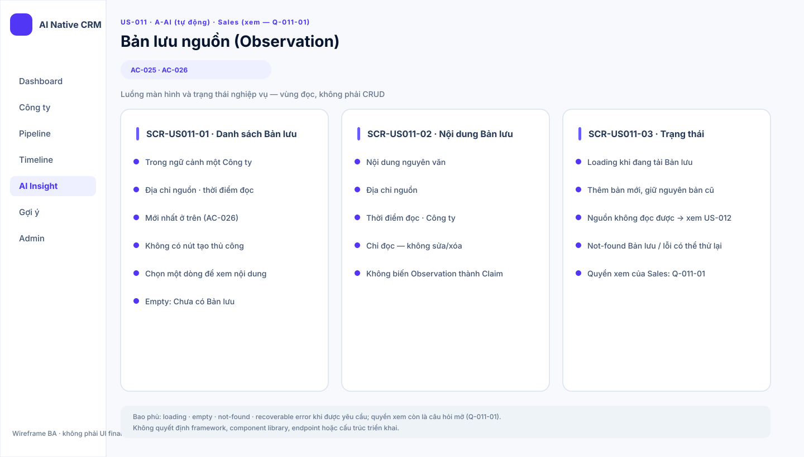
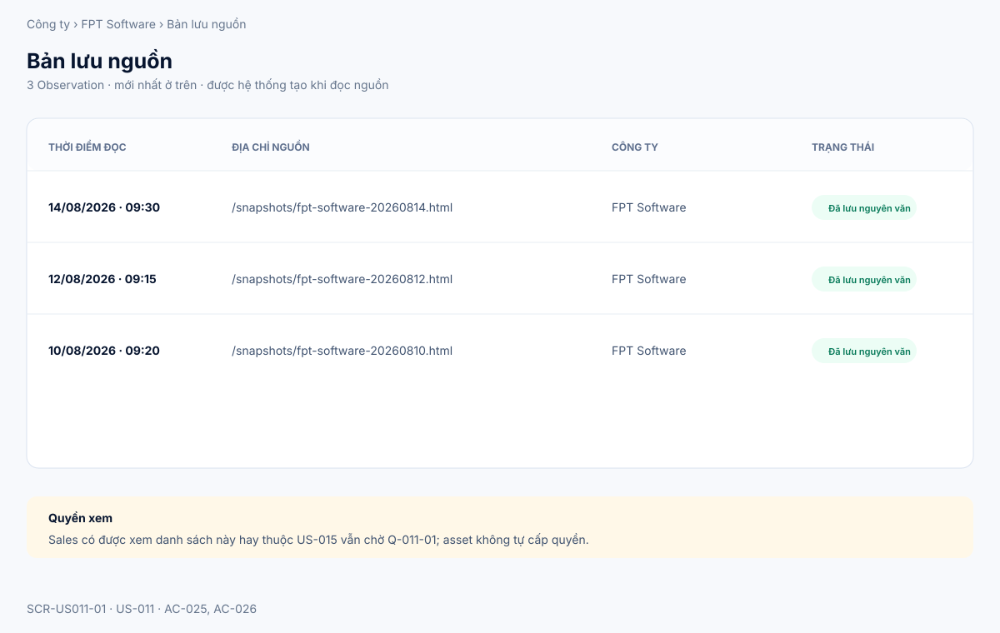
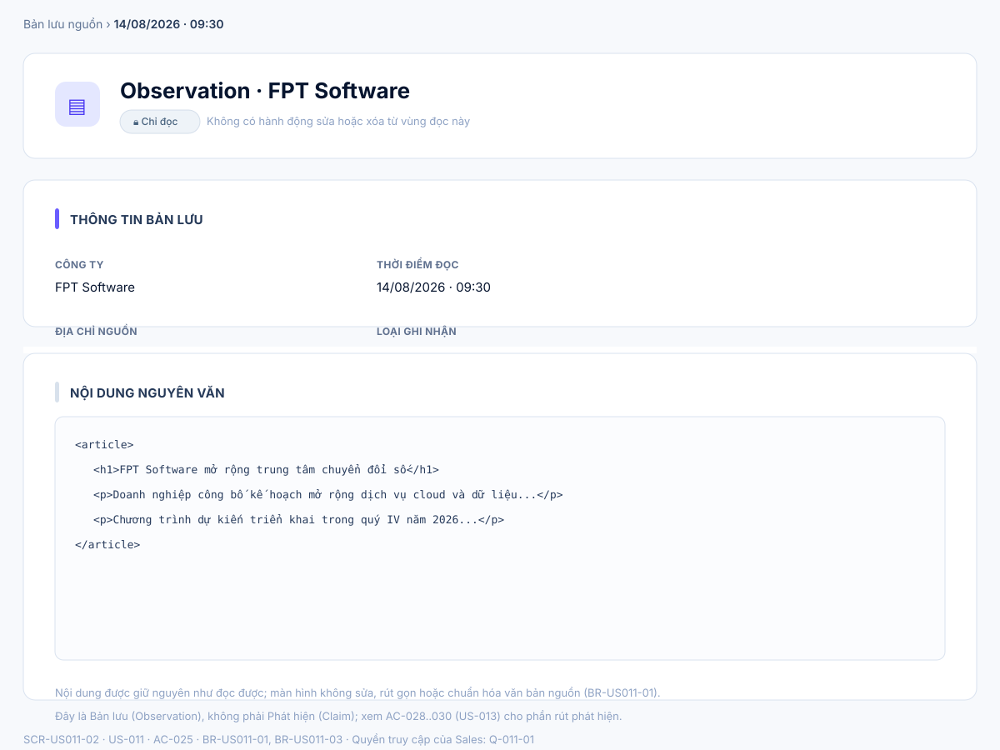
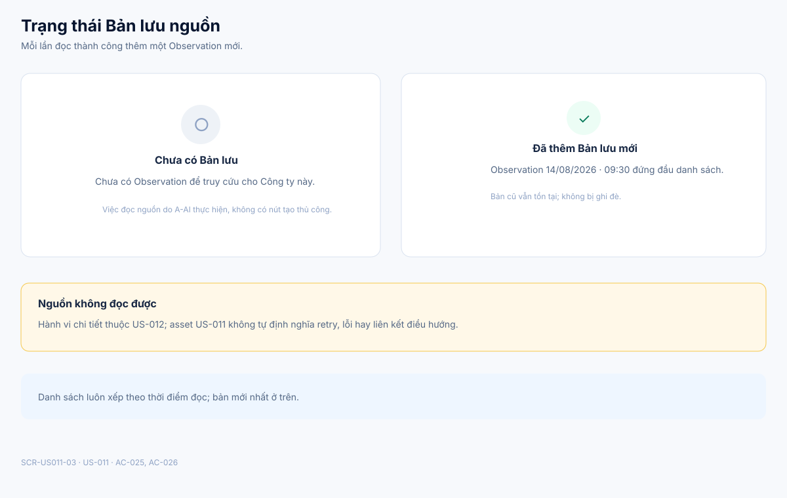

# Business Specification — US-011: Bản lưu nguồn (Observation)

## 1. Document Information

| Field | Value |
|---|---|
| Story | `US-011` — Bản lưu nguồn (Observation) |
| Feature / domain | `FEAT-011` / `D2 — Đọc nguồn & Tri thức (Observation/Claim/Provenance)` / `EPIC-04` |
| Version | `1.2` |
| Status | `AWAITING_SPECIFICATION_APPROVAL` |
| Date | `2026-08-15` |
| Priority | Must (16) |
| Sources | `REQ-201`, `BR-018`; `US-011`, `AC-025..026`; `T-8`; DoR review; architect handoff |

## 2. Purpose

**[CONFIRMED — REQ-201, US-011]** Xác định hành vi nghiệp vụ để A-AI (Tác nhân AI tự chủ) tự đọc nội dung nguồn của một Công ty và lưu lại thành Bản lưu nguyên văn, kèm địa chỉ nguồn và thời điểm đọc, để mọi phát hiện sinh ra sau này đều truy được về đúng nguồn gốc.

## 3. User Story

**[CONFIRMED — US-011]** As a Tác nhân AI tự chủ (A-AI), I want đọc nội dung web công ty và lưu bản lưu nguyên văn, so that mọi phát hiện về sau đều truy được về nguồn.

## 4. Business Goal

**[CONFIRMED — REQ-201]** Tạo nền Observation đáng tin cậy cho chuỗi Observation → Claim → Proposal. **[INFERRED — BR-018]** Không có Bản lưu giữ nguyên văn nội dung, hệ thống AI-native không có gì để trích dẫn khi rút phát hiện (Claim) hay sinh gợi ý (Proposal) ở các story sau.

## 5. Scope

- **[CONFIRMED — REQ-201, AC-025]** A-AI tự đọc nguồn của một Công ty có địa chỉ nguồn (bản chụp HTML) và tạo một Bản lưu giữ nguyên văn nội dung đã đọc.
- **[CONFIRMED — AC-025]** Mỗi Bản lưu được tạo kèm địa chỉ nguồn và thời điểm đọc, và thuộc đúng một Công ty.
- **[CONFIRMED — AC-026]** Khi đọc lại nguồn của một Công ty đã có ít nhất một Bản lưu, một Bản lưu mới được thêm vào và toàn bộ danh sách Bản lưu của Công ty đó được xếp theo thời điểm đọc.
- **[CONFIRMED — AC-026]** Bản lưu cũ không bị ghi đè hay xóa khi có Bản lưu mới được tạo.
- **[CONFIRMED — BR-US011-04; C-DATA-1; AS-02]** Nguồn được đọc là bản chụp HTML nội bộ (snapshot tĩnh), không phải trang web thật ngoài Internet.
- **[CONFIRMED — REQ-201, US-011]** Hành vi đọc nguồn và tạo Bản lưu do A-AI tự khởi động, không do người bấm hay xác nhận.

## 6. Out of Scope

- **[CONFIRMED — REQ-202..210; function-decomposition]** Rút phát hiện (Claim), câu trích, mức chắc chắn và hiển thị provenance chi tiết — xem `US-013`, `US-015`, `US-016`.
- **[CONFIRMED — REQ-211; US-012]** Xử lý và hiển thị khi nguồn không đọc được — xem `US-012` (FEAT-012).
- **[CONFIRMED — REQ-206, BR-017]** Thay đổi hồ sơ Công ty, dòng thời gian, cơ hội, người liên hệ hoặc xóa dữ liệu do người tạo.
- **[INFERRED — REQ-502..503; US-031; ARQ-4]** Việc so sánh nội dung "mới" giữa các lần đọc để quyết định có tự thêm mục vào dòng thời gian — thuộc vòng quét `US-031` (Domain D5), không thuộc US-011. Trong US-011, mỗi lần đọc thành công luôn tạo một Bản lưu mới, bất kể nội dung có thay đổi hay không.
- **[OPEN QUESTION — Q-011-01]** Quyền của Sales được xem danh sách/nội dung Bản lưu — có thể thuộc US-011 hoặc thuộc `US-015` (Vùng đọc & hiển thị mức chắc chắn); chưa được docs/02-analysis xác nhận cho riêng US-011.

## 7. Actor / Permission

| Actor | Business permission | Evidence |
|---|---|---|
| A-AI | Tự đọc địa chỉ nguồn (bản chụp HTML) của một Công ty và tạo Bản lưu; không cần thao tác bấm của người dùng; hoạt động trong vùng "tự do" theo trần tự chủ AI. | **[CONFIRMED]** US-011; AC-025..026; DSG Phần 5 (architect handoff AR-3) |
| Sales | Không có thao tác tạo/sửa/xóa Bản lưu nào được xác định trong story này; việc xem danh sách/nội dung Bản lưu chưa được xác nhận thuộc US-011 hay US-015. | **[OPEN QUESTION]** Q-011-01 |
| Quản trị | Không có hành vi nào được xác định cho vai này trong story này. | Không có bằng chứng trong docs/02-analysis cho US-011. |

## 8. Business Rules

| ID | Rule | Evidence |
|---|---|---|
| BR-018 | Kiến trúc AI-native gồm bốn đối tượng: Observation (=Bản lưu) → Claim (=Phát hiện) → Proposal (=Gợi ý); Provenance (=câu trích + vị trí) là sợi truy vết. | **[INFERRED — DSG]** requirement-analysis |
| BR-US011-01 | Mỗi Bản lưu giữ nguyên văn nội dung đã đọc, kèm địa chỉ nguồn và thời điểm đọc. | **[CONFIRMED]** REQ-201; AC-025 |
| BR-US011-02 | Mỗi Bản lưu thuộc đúng một Công ty; một Công ty có thể có nhiều Bản lưu, xếp theo thời điểm đọc. | **[CONFIRMED]** REQ-201; AC-026 |
| BR-US011-03 | Bản lưu là Observation trong chuỗi Observation → Claim → Proposal; không phải Claim hay dữ liệu hồ sơ Sales. | **[INFERRED]** BR-018 |
| BR-US011-04 | Nguồn được đọc là bản chụp HTML nội bộ, không phải trang web thật. | **[CONFIRMED]** C-DATA-1; AS-02 |
| BR-US011-05 | Story không tự thay đổi dữ liệu Sales (hồ sơ/dòng thời gian/cơ hội/người liên hệ) và không vượt các ranh giới cứng của BR-017. | **[CONFIRMED]** REQ-206; BR-017 |
| BR-US011-06 | Đọc lại nguồn luôn tạo một Bản lưu mới, không ghi đè hay chỉnh sửa Bản lưu trước đó, kể cả khi nội dung đọc được không thay đổi so với lần trước. | **[CONFIRMED]** AC-026 |

## 9. Business Data Dictionary

| Business data | Meaning | Applicability / rule | Evidence |
|---|---|---|---|
| Công ty | Pháp nhân mà nguồn và Bản lưu thuộc về; được quản lý ở `US-001`. | Một Bản lưu thuộc đúng một Công ty. | **[CONFIRMED]** REQ-201; US-011 dependency |
| Bản lưu (Observation) | Bản ghi chứa nội dung nguồn đã đọc nguyên văn tại một thời điểm; là đơn vị Observation trong chuỗi AI-native. | Không phải Phát hiện (Claim) hay dữ liệu hồ sơ Sales; một Công ty có nhiều Bản lưu. | **[CONFIRMED]** REQ-201; BR-018 |
| Nội dung nguyên văn | Toàn bộ nội dung được đọc từ nguồn tại thời điểm đọc, giữ đúng như gốc, không chỉnh sửa hay chuẩn hóa. | Là phần lõi bắt buộc của mỗi Bản lưu. | **[CONFIRMED]** REQ-201; AC-025 |
| Địa chỉ nguồn | Địa chỉ của bản chụp HTML được A-AI đọc. | Lưu cùng Bản lưu; không thay đổi nội dung đã lưu. | **[CONFIRMED]** AC-025; BR-US011-04 |
| Thời điểm đọc | Thời điểm hệ thống thực hiện việc đọc nguồn để tạo Bản lưu. | Dùng để xếp thứ tự nhiều Bản lưu của cùng một Công ty, mới nhất lên trên. | **[CONFIRMED]** REQ-201; AC-026 |

## 10. Business Flow

**BF-011-01 — Đọc nguồn lần đầu.** **[CONFIRMED — AC-025]** A-AI tự đọc địa chỉ nguồn (bản chụp HTML) của một Công ty, không do người bấm. Nếu đọc được, A-AI tạo một Bản lưu giữ nguyên văn nội dung, kèm địa chỉ nguồn và thời điểm đọc, thuộc đúng Công ty đó.

**BF-011-02 — Đọc lại nguồn.** **[CONFIRMED — AC-026]** Khi Công ty đã có ít nhất một Bản lưu, A-AI đọc lại nguồn ở một thời điểm sau. Một Bản lưu mới được thêm vào; Bản lưu cũ được giữ nguyên, không bị ghi đè; toàn bộ danh sách Bản lưu của Công ty được sắp xếp lại theo thời điểm đọc, mới nhất ở trên.

**BF-011-03 — Quan sát Bản lưu.** **[OPEN QUESTION — Q-011-01]** Con người (Sales) có thể cần xem danh sách và nội dung Bản lưu để kiểm chứng hành vi của A-AI; docs/02-analysis chưa xác nhận việc xem này thuộc US-011 hay thuộc `US-015` (Vùng đọc & hiển thị mức chắc chắn, REQ-204). Specification mô tả màn hình đọc tương ứng ở mục 12–13 để làm rõ nơi con người quan sát được hành vi này, nhưng không tự cấp quyền truy cập.

## 11. Acceptance Criteria

**AC-025 — Tạo bản lưu**

```gherkin
Scenario: Tạo bản lưu
  Given một công ty có địa chỉ nguồn (bản chụp HTML)
  When hệ thống đọc nguồn
  Then một bản lưu được tạo, giữ nguyên văn, kèm địa chỉ nguồn và thời điểm đọc, thuộc đúng công ty đó.
```

**AC-026 — Nhiều bản lưu**

```gherkin
Scenario: Nhiều bản lưu một công ty
  Given công ty đã có một bản lưu
  When hệ thống đọc lại nguồn
  Then bản lưu mới được thêm và danh sách xếp theo thời điểm đọc.
```

**[CONFIRMED — user-stories]** Hai acceptance criteria trên được bảo toàn nguyên văn từ nguồn (`docs/02-analysis/user-stories.md`, US-011).

## 12. Screen Specification

| Screen ID | Business area | Required information / behavior | Evidence |
|---|---|---|---|
| `SCR-US011-01` | Danh sách Bản lưu | Hiển thị nhiều Observation của đúng một Công ty, xếp theo thời điểm đọc mới nhất ở trên; không có hành động tạo/sửa/xóa thủ công vì Bản lưu do A-AI tự tạo. | **[CONFIRMED]** AC-025..026; BR-US011-02, BR-US011-06; **[OPEN QUESTION]** Q-011-01 (quyền xem của Sales) |
| `SCR-US011-02` | Nội dung Bản lưu | Hiển thị nguyên văn nội dung, địa chỉ nguồn, thời điểm đọc và Công ty của một Bản lưu; màn hình chỉ đọc, không có hành động sửa/xóa và không biến Observation thành Claim. | **[CONFIRMED]** AC-025; BR-US011-01, BR-US011-03 |
| `SCR-US011-03` | Trạng thái Bản lưu | Minh họa: chưa có Observation (empty), thêm bản mới không ghi đè bản cũ, not-found, lỗi có thể thử lại; ranh giới với việc "nguồn không đọc được" để `US-012` quyết định hành vi chi tiết. | **[CONFIRMED]** AC-026; **[OPEN QUESTION]** Q-011-02 (hành vi lỗi đọc nguồn thuộc US-012) |

## 13. Screen Design

> **UI-DESIGN UPDATE — 2026-08-15:** Wireframe được chuẩn hóa lại theo đúng ngôn ngữ hình ảnh đã duyệt cho US-001 v1.2 (nền `#f7f9fc`, card bo góc 14px viền `#d9e2ef`, đường kẻ phân cách `#e6ebf2`, tiêu đề `#07152f`, chữ thân `#3f526f`, thanh nhấn mục 5px `#695cff`, nút chính tím `#5236f5`, nút phụ viền `#bfcee0`, bảng có header uppercase `#60718f`, khối trạng thái rỗng/lỗi/not-found dùng icon tròn + tiêu đề + mô tả + nút hành động). Vì actor chính là A-AI và không có thao tác CRUD do người bấm, ba màn hình dưới đây là **vùng đọc (read-only)** để con người quan sát/kiểm chứng hành vi tạo Bản lưu, không phải biểu mẫu nhập liệu.

### 13.1 Tổng quan luồng



### 13.2 `SCR-US011-01` — Danh sách Bản lưu



### 13.3 `SCR-US011-02` — Nội dung Bản lưu



### 13.4 `SCR-US011-03` — Trạng thái Bản lưu



Các SVG chỉ minh họa dữ liệu đã chốt: Công ty, Bản lưu, Nội dung nguyên văn, Địa chỉ nguồn, Thời điểm đọc. Asset không tự cấp quyền xem cho Sales (Q-011-01) và không định nghĩa hành vi lỗi đọc nguồn của `US-012` (Q-011-02).

## 14. Screen States

| State | Visible business outcome | Screen / asset | Evidence |
|---|---|---|---|
| Chưa có Bản lưu | Chưa có Observation nào để quan sát cho Công ty; không có nút tạo thủ công vì A-AI tự tạo. | `SCR-US011-03` | **[INFERRED]** REQ-201; AC-025 (trạng thái trước khi có lần đọc đầu tiên) |
| Đọc nguồn lần đầu thành công | Một Bản lưu được tạo, kèm địa chỉ nguồn, thời điểm đọc và đúng Công ty. | `SCR-US011-01`, `SCR-US011-02` | **[CONFIRMED]** AC-025 |
| Có nhiều Bản lưu | Danh sách thể hiện các lần đọc, xếp theo thời điểm đọc, mới nhất ở trên. | `SCR-US011-01` | **[CONFIRMED]** AC-026 |
| Đọc lại nguồn thành công | Bản lưu mới được thêm vào đầu danh sách; Bản lưu cũ vẫn tồn tại nguyên vẹn. | `SCR-US011-03` → `SCR-US011-01` | **[CONFIRMED]** AC-026; BR-US011-06 |
| Xem nội dung một Bản lưu | Hiển thị đủ nội dung nguyên văn, địa chỉ nguồn, thời điểm đọc và Công ty; không có hành động sửa/xóa. | `SCR-US011-02` | **[CONFIRMED]** AC-025; BR-US011-01, BR-US011-03 |
| Không tìm thấy Bản lưu | Bản lưu được yêu cầu không tồn tại (đã bị xóa hoặc mã không hợp lệ); cho phép quay về danh sách. | `SCR-US011-03` | **[INFERRED]** approved design pattern (US-001 not-found precedent); không có AC riêng cho US-011 |
| Lỗi có thể thử lại | Không tải được dữ liệu Bản lưu; cho phép thử lại thao tác. | `SCR-US011-03` | **[INFERRED]** approved design pattern (US-001 not-found/error precedent) |
| Nguồn không đọc được | Hành vi chi tiết (ghi nhận, thông báo) thuộc `US-012`; không có Bản lưu nào được tạo từ lần đọc lỗi. | `SCR-US011-03` | **[OPEN QUESTION]** Q-011-02; **[CONFIRMED]** REQ-211 xác định phạm vi thuộc US-012 |
| Quyền xem của Sales | Chưa xác nhận Sales có được xem `SCR-US011-01`/`SCR-US011-02` trong US-011 hay thuộc US-015. | `SCR-US011-01`, `SCR-US011-02` | **[OPEN QUESTION]** Q-011-01 |

## 15. Validation

| Condition | Expected business response | Evidence |
|---|---|---|
| Công ty có địa chỉ nguồn và đọc được | Tạo một Bản lưu đủ nội dung nguyên văn, địa chỉ nguồn, thời điểm đọc, đúng Công ty. | **[CONFIRMED]** AC-025 |
| Công ty đã có Bản lưu và được đọc lại | Thêm một Bản lưu mới; danh sách Bản lưu của Công ty được xếp lại theo thời điểm đọc; Bản lưu cũ không đổi. | **[CONFIRMED]** AC-026; BR-US011-06 |
| Đọc lại nguồn dù nội dung không đổi so với lần trước | Vẫn tạo một Bản lưu mới trong phạm vi US-011; việc so sánh nội dung "mới" để quyết định ghi thêm dòng thời gian là phạm vi của US-031, không áp dụng ở đây. | **[INFERRED]** AC-026; out of scope US-031 |
| Nguồn không đọc được | Hành vi chi tiết thuộc US-012, không được suy diễn hay quyết định tại US-011. | **[OPEN QUESTION]** Q-011-02 |

## 16. Dependencies

| Direction | Item | Dependency | Evidence |
|---|---|---|---|
| Upstream | `US-001` / `FEAT-001` | Cung cấp thực thể Công ty mà Bản lưu thuộc về. | **[CONFIRMED]** US-011 dependency; function-decomposition |
| Upstream (dữ liệu nguồn) | `C-DATA-2`; `US-041` / `FEAT-041`; `US-042` / `FEAT-042` | **[INFERRED]** Địa chỉ nguồn (bản chụp HTML trước/sau) của mỗi Công ty đến từ dữ liệu mẫu và cơ chế test-harness (nạp dữ liệu, chuyển bản chụp trước→sau), không phải một trường CRUD do Sales nhập trong `US-001`. | C-DATA-2; US-041; US-042 |
| Downstream | `US-013` / `FEAT-013` | Dùng Bản lưu làm nguồn để rút Phát hiện (Claim) kèm câu trích và vị trí. | **[CONFIRMED]** BR-018; D-1 (requirement-analysis) |
| Downstream (liên quan phạm vi) | `US-012` / `FEAT-012` | Xử lý khi nguồn không đọc được; nằm ngoài phạm vi US-011. | **[CONFIRMED]** REQ-211 |
| Downstream (liên quan phạm vi) | `US-015` / `FEAT-015` | Vùng đọc & hiển thị mức chắc chắn cho Sales; có thể là nơi quyền xem Bản lưu được xác nhận (Q-011-01). | **[CONFIRMED]** REQ-204; **[OPEN QUESTION]** Q-011-01 |
| Downstream (liên quan phạm vi) | `US-031` / `FEAT-031` | Vòng quét dùng việc đọc lại nguồn và so sánh nội dung mới để tự thêm mục dòng thời gian; thuật toán "nội dung mới" không thuộc US-011. | **[CONFIRMED]** REQ-502..503; ARQ-4 |
| Acceptance | `T-8` | Nghiệm thu vòng quét công ty Đang theo dõi, có Bản lưu làm nền dữ liệu đầu vào. | **[CONFIRMED]** architect handoff traceability matrix |

## 17. Business-level NFR Expectations

- **[CONFIRMED — REQ-704; architecture]** Dữ liệu Bản lưu được kỳ vọng bền qua khởi động lại trong triển khai sản phẩm; đây là kỳ vọng cấp hệ thống, không thêm quy tắc dữ liệu riêng cho US-011.
- **[CONFIRMED — C-DATA-1; AS-02]** Nội dung nguồn dùng bản chụp tĩnh (HTML nội bộ) để kịch bản đọc có thể lặp lại và kiểm chứng được, không phụ thuộc trạng thái web thật.
- **[CONFIRMED — BR-017; BR-US011-05]** Không có hành vi tự thay đổi hoặc xóa dữ liệu do Sales tạo trong luồng đọc nguồn và tạo Bản lưu.
- **[CONFIRMED — human decision 2026-08-14 (US-001 v1.2 precedent); áp dụng chung]** US-011 không đặt SLA riêng; áp dụng kỳ vọng chất lượng chung của hệ thống.

## 18. Test Scenarios

Chưa có `test-scenarios.md` riêng cho US-011. Các tình huống dưới đây là truy vết nghiệp vụ, không phải kiểm thử thực thi; chúng đóng góp vào bộ nghiệm thu **T-8**. **[CONFIRMED — architect handoff traceability matrix]**

| ID | Business scenario | AC / BR | Expected business result | Acceptance trace |
|---|---|---|---|---|
| TC-011-01 | A-AI đọc nguồn lần đầu của một Công ty có địa chỉ nguồn hợp lệ. | AC-025; BR-US011-01..02 | Một Bản lưu nguyên văn được tạo, kèm địa chỉ nguồn, thời điểm đọc, đúng Công ty. | T-8 |
| TC-011-02 | A-AI đọc lại nguồn cho Công ty đã có một Bản lưu trước đó. | AC-026; BR-US011-02, BR-US011-06 | Có thêm một Bản lưu mới; Bản lưu cũ vẫn còn nguyên; danh sách xếp theo thời điểm đọc, mới nhất trên. | T-8 |
| TC-011-03 | A-AI đọc nguồn liên tiếp từ ba lần trở lên cho cùng một Công ty. | AC-026; BR-US011-02 | Có đủ số Bản lưu tương ứng với số lần đọc; thứ tự hiển thị đúng theo thời điểm đọc. | T-8 |
| TC-011-04 | Hai Công ty khác nhau, mỗi Công ty đều có địa chỉ nguồn và được A-AI đọc. | AC-025; BR-US011-02 | Mỗi Bản lưu chỉ gắn với đúng Công ty của nó; không có Bản lưu nào lẫn giữa hai Công ty. | T-8 |
| TC-011-05 | Con người mở xem nội dung một Bản lưu đã tạo. | AC-025; BR-US011-01, BR-US011-03 | Hiển thị đủ nội dung nguyên văn, địa chỉ nguồn, thời điểm đọc, Công ty; quyền xem còn phụ thuộc Q-011-01. | T-8 |

## 19. Traceability

| Chain | Evidence |
|---|---|
| `D2 → EPIC-04 → FEAT-011 → US-011 → AC-025..026 → TC-011-01..05 (T-8)` | **[CONFIRMED]** function-decomposition; user-stories; architect handoff |
| `REQ-201 → FEAT-011 → US-011 → AC-025..026` | **[CONFIRMED]** requirement-analysis; user-stories |
| `BR-018 → BR-US011-03 → AC-025` | **[INFERRED]** requirement-analysis (DSG) |
| `BR-017, REQ-206 → BR-US011-05` | **[CONFIRMED]** requirement-analysis |
| `C-DATA-1, AS-02 → BR-US011-04` | **[CONFIRMED]** requirement-analysis |
| `US-001 → US-011 → US-013` | **[CONFIRMED]** user-stories dependency chain; architect handoff D-1 |
| `US-011 → US-012, US-015, US-031` (ranh giới phạm vi) | **[CONFIRMED]** user-stories; requirement-analysis |

## 20. Assumptions

| ID | Assumption | Rationale / status |
|---|---|---|
| A-011-01 | Bố cục và visual language kế thừa nguyên vẹn hướng đã duyệt cho US-001 v1.2 (nền sáng, card viền mảnh, bảng dữ liệu, thanh nhấn mục tím, khối trạng thái icon tròn). | **[ASSUMPTION]** Không quyết định framework hoặc component library; khả năng truy cứu không đồng nghĩa Sales đã được cấp quyền xem (không đóng Q-011-01). |
| A-011-02 | Địa chỉ nguồn (bản chụp HTML) của mỗi Công ty được thiết lập qua dữ liệu mẫu và cơ chế test-harness (`C-DATA-2`, `US-041`, `US-042`), không phải một trường do Sales nhập trong biểu mẫu CRUD Công ty của `US-001`. | **[ASSUMPTION]** Suy luận từ việc `US-001` không định nghĩa trường "địa chỉ nguồn" trong sáu trường Công ty đã chốt; cần Tech Lead/Architect xác nhận mô hình dữ liệu cụ thể. |

## 21. Open Questions

| ID | Question | Owner / impact |
|---|---|---|
| Q-011-01 | Sales có được xem danh sách/nội dung Bản lưu trong phạm vi US-011 hay quyền này thuộc US-015 (Vùng đọc & hiển thị mức chắc chắn)? | PO; ảnh hưởng quyền xem của `SCR-US011-01`, `SCR-US011-02`. |
| Q-011-02 | Khi nguồn không đọc được, ranh giới hiển thị/liên kết sang US-012 được thể hiện ra sao trong vùng đọc của US-011? | PO; không tự đặt hành vi lỗi thay cho US-012. |

## 22. Definition of Ready

| Check | Status | Evidence / note |
|---|---|---|
| Actor và giá trị nghiệp vụ rõ ràng | Ready | **[CONFIRMED]** US-011; REQ-201; DoR review |
| Phạm vi và AC nguồn truy vết được | Ready | **[CONFIRMED]** REQ-201; AC-025..026; DoR review |
| Business rules (BR-018, BR-US011-01..06) rõ ràng | Ready | **[CONFIRMED]** requirement-analysis; AC-025..026 |
| Phụ thuộc (US-001 upstream; US-013 downstream) đã nhận diện | Ready | **[CONFIRMED]** architect handoff; DoR review |
| Câu hỏi nghiệp vụ còn mở được PO chấp nhận làm mở | Ready (mở có kiểm soát) | Q-011-01, Q-011-02 chưa có quyết định trong docs/02-analysis; không chặn hành vi lõi của AC-025..026. |
| Đánh giá DoR của nguồn | READY | **[CONFIRMED]** `docs/02-analysis/dor-review.md` |

**[CONFIRMED — human-approval rule]** Tài liệu dừng tại `AWAITING_SPECIFICATION_APPROVAL`; chỉ con người mới có thể đặt `SPECIFICATION_APPROVED`.

## 23. Technical Handoff

| Type | Constraint, touchpoint, risk or decision for Tech Lead | Evidence |
|---|---|---|
| Constraint | Nội dung Bản lưu phải giữ nguyên văn, không được ghi đè khi có lần đọc mới; mỗi lần đọc thành công là một bản ghi Observation độc lập. | **[CONFIRMED]** BR-US011-01, BR-US011-06; AC-025..026 |
| Constraint | Nguồn đọc là bản chụp HTML nội bộ (không crawl web thật); luồng này không được ghi/sửa/xóa dữ liệu Sales, theo ranh giới BR-017. | **[CONFIRMED]** C-DATA-1; AS-02; BR-017 |
| Touchpoint | Observation (Bản lưu) là nền dữ liệu đầu vào cho Claim (Phát hiện) ở `US-013`; cần bảo toàn liên kết nghiệp vụ Observation → Claim và khả năng trỏ vị trí câu trích (provenance). | **[INFERRED — BR-018]** architect handoff AR-2, ARQ-2, ARQ-6 |
| Touchpoint | Địa chỉ nguồn của Công ty (bản chụp trước/sau) đến từ dữ liệu mẫu/test-harness (`US-041`, `US-042`), không phải trường CRUD của `US-001`; Tech Lead cần xác nhận mô hình lưu trữ. | **[INFERRED]** C-DATA-2; A-011-02 |
| Risk | Nếu vòng quét (`US-031`) và luồng đọc thủ công của US-011 cùng tạo Bản lưu cho một Công ty, cần cơ chế tránh trùng lặp hoặc hiểu nhầm giữa hai đường ghi. | **[CONFIRMED]** ARQ-7 (architect handoff) |
| Question | Việc xác nhận quyền xem của Sales (Q-011-01) và ranh giới hiển thị lỗi đọc nguồn với US-012 (Q-011-02) cần PO quyết định trước khi khóa thiết kế màn hình cuối cùng; không có quyết định kỹ thuật, endpoint, schema hay kế hoạch triển khai nào trong specification này. | **[CONFIRMED]** Q-011-01; Q-011-02 |

## 24. Change Log

| Version | Date | Change | Author/Approver |
|---|---|---|---|
| 1.2 | 2026-08-15 | Viết lại toàn diện theo chuẩn 24 mục US-001 v1.2, đối chiếu docs/02-analysis, chuẩn hoá SVG theo ngôn ngữ hình ảnh đã duyệt. | Codex — comprehensive refinement pass; specification approval unchanged |
| 1.1 | 2026-08-14 | Bổ sung ba SVG chi tiết cho danh sách, nội dung và trạng thái Observation; không tự cấp quyền Sales hoặc định nghĩa lỗi đọc nguồn. | Codex — UI pattern approved; specification approval unchanged |
| 1.0 | 2026-08-14 | Tạo specification 24 mục cho US-011. | Codex / awaiting human specification approval |
