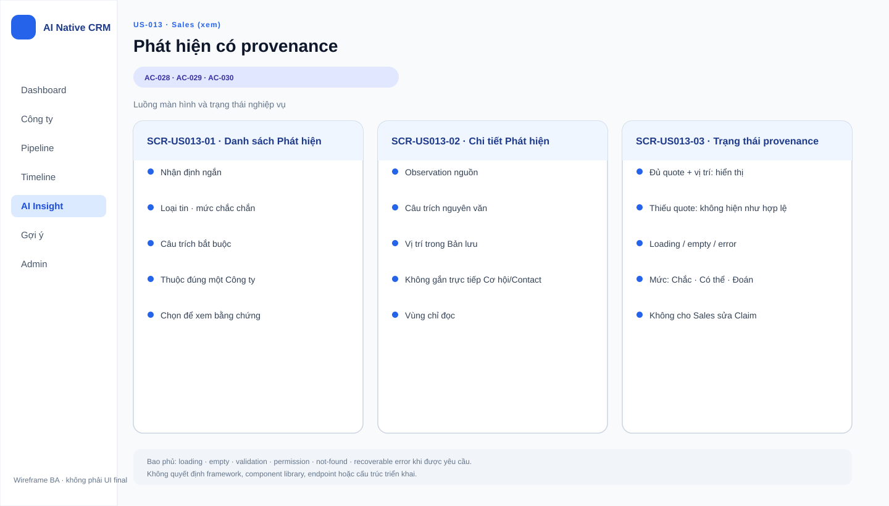

# Business Specification — US-013: Rút phát hiện có provenance (Claim)

## 1. Document Information

| Field | Value |
|---|---|
| Story | `US-013` — Rút phát hiện có provenance (Claim) |
| Feature / domain | `FEAT-013` / `D2 — Đọc nguồn & Tri thức` / `EPIC-05 — Rút phát hiện (Claim) & Truy nguồn (Provenance)` |
| Version | `1.0` |
| Status | `AWAITING_SPECIFICATION_APPROVAL` |
| Date | `2026-08-14` |
| Priority | Must (19) |
| Sources | `REQ-202`, `REQ-203`, `REQ-207`; `BR-006`, `BR-007`, `BR-018`; `US-013`, `AC-028..030`; `T-2`, `T-3`; DoR review; architect handoff traceability |

## 2. Purpose

**[CONFIRMED — US-013; REQ-202]** Xác định phát hiện (Claim) được rút từ bản lưu (Observation) phải có bằng chứng truy nguồn để Sales có cơ sở tin và kiểm chứng thông tin về công ty.

**[CONFIRMED — REQ-203; BR-018]** Tài liệu bảo toàn quan hệ nghiệp vụ Claim thừa kế Company qua Observation và không xác lập liên kết trực tiếp đến cơ hội, người liên hệ hoặc hoạt động.

## 3. User Story

**[CONFIRMED — US-013]** As a Tác nhân AI tự chủ (A-AI), I want rút phát hiện từ bản lưu, luôn kèm câu trích và vị trí, so that Sales tin được vì có bằng chứng.

## 4. Business Goal

**[CONFIRMED — PRD §1; requirement-analysis BG-1..4]** Giảm việc Sales phải tự đọc lại nguồn công khai, đồng thời giữ nguyên nguyên tắc bằng chứng trước, khẳng định sau.

**[INFERRED — REQ-202, REQ-203, REQ-207]** Claim có thể kiểm chứng là nguyên liệu đáng tin cậy cho các use case AI phía sau mà không tự thay đổi dữ liệu CRM.

## 5. Scope

**[CONFIRMED — REQ-202, REQ-203, REQ-207; AC-028..030]**

- Rút một hoặc nhiều Claim từ một Observation đã có nội dung tín hiệu.
- Ghi nhận cho mỗi Claim: nhận định ngắn, loại tin, câu trích nguyên văn, vị trí câu trích trong Observation và mức chắc chắn.
- Gắn Claim với đúng Company bằng quan hệ thừa kế qua Observation.
- Từ chối Claim thiếu câu trích, kể cả khi có cố gắng ghi trực tiếp.
- Không gắn trực tiếp Claim vào Opportunity, Contact hoặc Activity.

## 6. Out of Scope

**[CONFIRMED — user-stories; architect handoff]**

- Đọc nguồn và tạo Observation: US-011.
- Diễn giải Claim theo loại Company: US-014.
- Vùng đọc, cách phân biệt trực quan mức chắc chắn: US-015.
- Thao tác bấm Claim để mở và đánh dấu đoạn nguồn: US-016.
- Giữ Claim cũ khi đọc lại nguồn: US-017.
- Sinh Proposal hoặc thay đổi hồ sơ, dòng thời gian hay Opportunity: các use case sau US-013; REQ-206 và BR-017.
- Quy định danh mục giá trị cụ thể của loại tin: không thuộc các REQ/AC được phân bổ cho US-013 trong phạm vi đặc tả này.

## 7. Actor / Permission

| Actor | Business permission | Evidence |
|---|---|---|
| A-AI | Rút Claim từ Observation trong vùng tự chủ được phép; chỉ tạo tri thức nguồn, không thay đổi dữ liệu CRM trong story này. | **[CONFIRMED]** US-013; REQ-206; architect handoff AR-3 |
| Sales | Là người nhận giá trị kiểm chứng Claim; quyền xem hoặc thao tác cụ thể thuộc các story hiển thị và truy nguồn riêng. | **[CONFIRMED]** US-013; US-015; US-016 |
| Admin | Quyền thao tác Claim cụ thể chưa được nguồn của US-013 xác định. | **[OPEN QUESTION]** Q-013-01 |

## 8. Business Rules

| ID | Rule | Evidence |
|---|---|---|
| BR-006 | Claim phải có câu trích; không có nguồn/bằng chứng trích dẫn thì không được lưu hoặc hiển thị như Claim hợp lệ. | **[CONFIRMED]** requirement-analysis; REQ-207; T-2 |
| BR-007 | Mức chắc chắn của Claim là Chắc, Có thể hoặc Đoán; lần lượt biểu thị trích thẳng, suy một bước từ nguồn cụ thể, hoặc không có bằng chứng trực tiếp. | **[CONFIRMED]** requirement-analysis |
| BR-018 | Chuỗi nghiệp vụ AI-native là Observation → Claim → Proposal; provenance gồm câu trích và vị trí trong Observation là sợi truy vết. | **[INFERRED]** requirement-analysis; architect handoff AR-2 |
| BR-US013-01 | Claim thừa kế đúng một Company qua Observation đã sinh ra nó. | **[CONFIRMED]** REQ-203; AC-028; architecture |
| BR-US013-02 | Claim không được gắn trực tiếp vào Opportunity, Contact hoặc Activity. | **[CONFIRMED]** REQ-203; AC-030; architecture |
| BR-US013-03 | Câu trích và vị trí phải cùng quy chiếu đến Observation nguồn của Claim. | **[INFERRED]** REQ-202; BR-018; T-3 |
| BR-US013-04 | Việc rút Claim không tự thay đổi hồ sơ Company, dòng thời gian hoặc Opportunity. | **[CONFIRMED]** REQ-206; PRD Nhóm 2 |

## 9. Business Data Dictionary

| Business data | Meaning | Applicability / rule | Evidence |
|---|---|---|---|
| Company | Công ty mà Claim có quan hệ nghiệp vụ gián tiếp thông qua Observation. | Mỗi Claim thừa kế đúng một Company; không là liên kết trực tiếp. | **[CONFIRMED]** REQ-203; architecture |
| Observation (Bản lưu) | Nội dung nguồn đã đọc, giữ nguyên văn, thuộc đúng một Company. | Là nguồn sinh Claim và nơi provenance được quy chiếu. | **[CONFIRMED]** REQ-201; BR-018; architecture |
| Claim (Phát hiện) | Nhận định ngắn rút từ Observation. | Chỉ là tri thức nguồn; không tự sửa dữ liệu CRM. | **[CONFIRMED]** REQ-202; REQ-206 |
| Loại tin | Nhóm ý nghĩa của Claim. | Mỗi Claim theo AC-028 có một loại tin; danh mục giá trị chưa được chốt trong phạm vi này. | **[CONFIRMED]** REQ-202; AC-028 |
| Câu trích nguyên văn | Đoạn văn từ Observation làm bằng chứng cho Claim. | Bắt buộc; thiếu thì từ chối Claim. | **[CONFIRMED]** REQ-202; REQ-207; BR-006 |
| Vị trí câu trích | Vị trí của câu trích trong Observation. | Bắt buộc để provenance có thể được truy nguồn. | **[CONFIRMED]** REQ-202; BR-018; T-3 |
| Mức chắc chắn | Cách phân loại độ chắc chắn của Claim. | Là Chắc, Có thể hoặc Đoán theo BR-007. | **[CONFIRMED]** REQ-202; BR-007 |

## 10. Business Flow

### BF-013-01 — Rút Claim có provenance

1. **[CONFIRMED — AC-028]** A-AI có một Observation chứa nội dung tín hiệu.
2. **[CONFIRMED — AC-028]** Hệ thống rút Claim với nhận định ngắn, loại tin, câu trích nguyên văn, vị trí câu trích và mức chắc chắn.
3. **[CONFIRMED — AC-028; REQ-203]** Claim thừa kế Company của Observation.
4. **[CONFIRMED — REQ-206]** Việc rút Claim không làm thay đổi hồ sơ Company, dòng thời gian hoặc Opportunity.

### BF-013-02 — Từ chối Claim thiếu câu trích

1. **[CONFIRMED — AC-029]** Có một Claim không có câu trích.
2. **[CONFIRMED — AC-029; T-2]** Khi hệ thống thử lưu Claim, kể cả ghi trực tiếp, thao tác bị từ chối.
3. **[CONFIRMED — BR-006]** Claim đó không được coi là dữ liệu nghiệp vụ hợp lệ để hiển thị.

### BF-013-03 — Duy trì quan hệ Claim–Company qua Observation

1. **[CONFIRMED — AC-030]** Một Claim vừa được sinh từ Observation.
2. **[CONFIRMED — REQ-203]** Claim chỉ thừa kế Company qua Observation.
3. **[CONFIRMED — AC-030]** Claim không gắn trực tiếp vào Opportunity, Contact hoặc Activity.

## 11. Acceptance Criteria

### AC-028 — Rút phát hiện hợp lệ

```gherkin
Scenario: Rút phát hiện hợp lệ
  Given một bản lưu có nội dung tín hiệu
  When hệ thống rút phát hiện
  Then mỗi phát hiện có nhận định ngắn, loại tin, câu trích nguyên văn,
       vị trí câu trích trong bản lưu và mức chắc chắn
  And phát hiện thuộc đúng công ty của bản lưu
```

### AC-029 — Chặn phát hiện thiếu câu trích

```gherkin
Scenario: Chặn phát hiện thiếu câu trích
  Given một phát hiện không có câu trích
  When hệ thống thử lưu nó, kể cả ghi thẳng
  Then thao tác bị từ chối
```

### AC-030 — Không gắn thẳng vào thực thể khác

```gherkin
Scenario: Không gắn thẳng vào thực thể khác
  Given một phát hiện vừa sinh
  Then nó chỉ gắn với công ty
  And không gắn thẳng vào cơ hội, người liên hệ hoặc hoạt động
```

**[CONFIRMED — user-stories]** AC-028..030 được bảo toàn nguyên nghĩa từ user story nguồn.

## 12. Screen Specification

| Business area | Required information / behavior | Evidence |
|---|---|---|
| Claim khi được hiển thị | Claim phải cho phép nhận biết nhận định, loại tin, mức chắc chắn, câu trích và quan hệ với Company qua Observation. | **[CONFIRMED]** REQ-202; REQ-203 |
| Provenance | Câu trích và vị trí phải giữ được khả năng quy chiếu về đúng đoạn trong Observation. | **[CONFIRMED]** REQ-202; T-3 |
| Dữ liệu không hợp lệ | Claim thiếu câu trích không được hiển thị như dữ liệu hợp lệ. | **[CONFIRMED]** BR-006; REQ-207 |

## 13. Screen Design

> **UI-DESIGN UPDATE — 2026-08-14:** Wireframe BA dưới đây được tạo từ các US/AC hiện hành và thay thế trạng thái “chưa có asset” được ghi nhận trước bước UI Design.



**[CONFIRMED — user-stories]** Không có asset wireframe được phê duyệt trong đầu vào của US-013; vùng đọc và thao tác truy nguồn là phạm vi của US-015 và US-016.

**[OPEN QUESTION — Q-013-02]** Cần PO/UX xác nhận cách biểu đạt trực quan mức chắc chắn và provenance, với điều kiện không thay đổi hành vi của AC-028..030.

## 14. Screen States

| State | Visible business outcome | Evidence |
|---|---|---|
| Claim hợp lệ | Claim có đủ các thông tin của AC-028 và thừa kế Company qua Observation. | **[CONFIRMED]** AC-028; REQ-203 |
| Claim thiếu câu trích | Không được lưu hoặc hiển thị như Claim hợp lệ. | **[CONFIRMED]** AC-029; BR-006 |
| Truy nguồn Claim | Khi use case US-016 được thực hiện, provenance cho phép mở đúng đoạn nguồn và đánh dấu vị trí. | **[CONFIRMED]** T-3; US-016 AC-034 |

## 15. Validation

| Condition | Expected business response | Evidence |
|---|---|---|
| Claim có nhận định, loại tin, câu trích, vị trí và mức chắc chắn | Đủ thông tin nghiệp vụ theo AC-028; thuộc Company của Observation. | **[CONFIRMED]** AC-028; REQ-203 |
| Claim thiếu câu trích | Từ chối lưu, kể cả ghi trực tiếp; không coi là Claim hợp lệ. | **[CONFIRMED]** AC-029; REQ-207; T-2 |
| Claim gắn trực tiếp Opportunity, Contact hoặc Activity | Không được chấp nhận là quan hệ của Claim. | **[CONFIRMED]** AC-030; REQ-203 |
| Câu trích không thể quy chiếu về Observation hoặc vị trí không xác định | Nguồn chưa quy định phản hồi nghiệp vụ cụ thể ngoài yêu cầu provenance. | **[OPEN QUESTION]** Q-013-03 |

## 16. Dependencies

| Direction | Item | Dependency | Evidence |
|---|---|---|---|
| Upstream | US-011 / FEAT-011 | Cung cấp Observation (bản lưu) thuộc Company để US-013 rút Claim. | **[CONFIRMED]** US-013 dependency; BR-018 |
| Downstream | US-014 / FEAT-014 | Dùng Claim để diễn giải tín hiệu theo loại Company. | **[CONFIRMED]** user-stories |
| Downstream | US-015 / FEAT-015 | Hiển thị Claim trong vùng đọc và phân biệt trực quan mức chắc chắn. | **[CONFIRMED]** user-stories |
| Downstream | US-016 / FEAT-016 | Dùng provenance của Claim để nhảy tới và đánh dấu đoạn nguồn; neo T-3. | **[CONFIRMED]** US-016 AC-034; architect handoff |
| Downstream | US-018 / FEAT-018 | Claim là nguyên liệu để sinh Proposal chờ quyết định của Sales. | **[CONFIRMED]** BR-018; user-stories |

## 17. Business-level NFR Expectations

- **[CONFIRMED — BR-006; T-2]** Tính toàn vẹn provenance là bắt buộc: Claim thiếu câu trích phải bị từ chối cả khi cố gắng ghi trực tiếp.
- **[CONFIRMED — T-3; US-016]** Provenance phải giữ được khả năng truy nguồn đến đúng đoạn Observation khi use case xem nguồn được thực hiện.
- **[CONFIRMED — REQ-206; architecture]** Rút Claim không được tự làm thay đổi dữ liệu CRM.
- **[OPEN QUESTION — Q-013-04]** Nguồn không quy định chỉ tiêu thời gian phản hồi, dung lượng Observation hay số lượng Claim cho mỗi Observation.

## 18. Test Scenarios

Chưa có tài liệu `test-scenarios.md` riêng cho US-013. Các tình huống sau là kịch bản nghiệp vụ để QC truy chiếu, không phải hướng dẫn kiểm thử thực thi.

| ID | Business scenario | AC / BR | Expected result | System acceptance trace |
|---|---|---|---|---|
| TC-013-01 | Rút Claim từ Observation có nội dung tín hiệu. | AC-028; BR-007; BR-018 | Claim có nhận định, loại tin, câu trích, vị trí, mức chắc chắn và thừa kế Company qua Observation. | T-2/T-3 support |
| TC-013-02 | Thử lưu Claim thiếu câu trích, kể cả ghi trực tiếp. | AC-029; BR-006 | Thao tác bị từ chối; Claim không là dữ liệu hợp lệ. | T-2 direct |
| TC-013-03 | Xác nhận Claim không được nối trực tiếp đến Opportunity, Contact hoặc Activity. | AC-030; BR-US013-02 | Claim chỉ có Company thừa kế qua Observation. | T-2/T-3 support |
| TC-013-04 | Dùng Claim hợp lệ trong use case xem nguồn gốc. | BR-US013-03; BR-018 | US-016 có thể mở đúng đoạn nguồn và đánh dấu vị trí. | T-3 via US-016 |

## 19. Traceability

| Chain | Evidence |
|---|---|
| `D2 → EPIC-05 → FEAT-013 → US-013 → AC-028..030 → T-2` | **[CONFIRMED]** function-decomposition; architect handoff traceability matrix |
| `REQ-202 → FEAT-013 → US-013 → AC-028 → TC-013-01` | **[CONFIRMED]** requirement-analysis; user-stories |
| `REQ-203 → FEAT-013 → US-013 → AC-028, AC-030 → TC-013-01, TC-013-03` | **[CONFIRMED]** requirement-analysis; user-stories |
| `REQ-207 → FEAT-013 → US-013 → AC-029 → TC-013-02 → T-2` | **[CONFIRMED]** requirement-analysis; user-stories; PRD §6 |
| `BR-006 → AC-029 → TC-013-02 → T-2` | **[CONFIRMED]** requirement-analysis; PRD §6 |
| `BR-007 → AC-028 → TC-013-01` | **[CONFIRMED]** requirement-analysis; user-stories |
| `BR-018 → US-013 → TC-013-01, TC-013-04 → US-016 AC-034 → T-3` | **[INFERRED]** BR-018 defines provenance chain; architect handoff assigns T-3 to US-016 |

## 20. Assumptions

| ID | Assumption | Rationale / status |
|---|---|---|
| A-013-01 | Một Claim hợp lệ theo AC-028 có thể được dùng bởi US-016 để truy nguồn mà không bổ sung liên kết trực tiếp đến thực thể CRM khác. | **[ASSUMPTION]** Phù hợp BR-018 và T-3; cần được xác nhận khi đặc tả US-016 được phê duyệt. |

## 21. Open Questions

| ID | Question | Owner / impact |
|---|---|---|
| Q-013-01 | Admin có quyền xem hay thao tác Claim nào ngoài quyền của Sales không? | PO; làm rõ phân quyền nghiệp vụ. |
| Q-013-02 | Cách biểu đạt trực quan mức chắc chắn và provenance nào được UX/PO chấp thuận? | PO/UX; không được thay đổi AC-028..030. |
| Q-013-03 | Khi câu trích hoặc vị trí không quy chiếu được về Observation, ngoài việc không coi Claim là hợp lệ thì có thông báo nghiệp vụ nào cần cho Sales không? | PO; làm rõ hành vi quan sát được. |
| Q-013-04 | Có quy định nghiệp vụ nào về giới hạn số Claim rút từ một Observation không? | PO; chưa tự đặt giới hạn. |

## 22. Definition of Ready

| DoR item | Status | Evidence / note |
|---|---|---|
| Actor, business value và mô tả rõ | READY | A-AI và mục tiêu nêu trong US-013. |
| Acceptance criteria có thể quan sát | READY | AC-028..030. |
| Dependency xác định | READY | Upstream US-011; downstream US-014..016 và US-018. |
| Traceability rõ | READY | REQ-202/203/207 → FEAT-013 → US-013 → AC-028..030 → T-2; T-3 qua US-016. |
| Priority / backlog được phê duyệt | READY | Must (19); dor-review đánh dấu US-013 READY. |
| Ambiguities không thay đổi AC được ghi nhận | READY WITH QUESTIONS | Q-013-01..004 không thay đổi AC nguồn. |

**[CONFIRMED — dor-review]** US-013 được đánh dấu `READY`; business specification này dừng tại cổng phê duyệt của con người với trạng thái `AWAITING_SPECIFICATION_APPROVAL`.

## 23. Technical Handoff

### Approved constraints

- **[CONFIRMED — REQ-202; BR-006; REQ-207]** Claim chỉ hợp lệ khi có câu trích nguyên văn và vị trí trong Observation; thiếu câu trích phải bị từ chối cả khi ghi trực tiếp.
- **[CONFIRMED — REQ-203; BR-018; architecture]** Claim thừa kế Company qua Observation và không nối trực tiếp Opportunity, Contact hoặc Activity.
- **[CONFIRMED — REQ-206]** Rút Claim không tự thay đổi hồ sơ Company, dòng thời gian hoặc Opportunity.

### Touchpoints and risks

- **[CONFIRMED]** US-011 cung cấp Observation; US-014, US-015, US-016 và US-018 sử dụng Claim hoặc provenance của Claim.
- **[INFERRED — BR-006; T-2]** Nếu provenance không được giữ như điều kiện bắt buộc, Sales mất khả năng tin và kiểm chứng Claim.
- **[INFERRED — REQ-203]** Nếu quan hệ thừa kế Company bị phá vỡ, Claim có thể bị hiểu sai là dữ liệu của Opportunity, Contact hoặc Activity.

### Decisions required from Tech Lead

- **[CONFIRMED — architect handoff ARQ-2]** Làm rõ cách bảo đảm provenance hỗ trợ hành vi mở đúng đoạn nguồn có đánh dấu của US-016/T-3, mà không làm thay đổi các quy tắc nghiệp vụ tại đây.
- **[OPEN QUESTION]** Các câu hỏi Q-013-01..004 cần chuyển PO/UX quyết định; không tự suy diễn thành quy tắc nghiệp vụ.

## 24. Change Log

| Version | Date | Change | Author/Approver |
|---|---|---|---|
| 1.0 | 2026-08-14 | Chuẩn hóa business specification 24 mục theo nguồn truy vết; bảo toàn US-013, FEAT-013, REQ-202/203/207, BR-006/007/018, AC-028..030, T-2/T-3 và provenance. | Codex / awaiting human specification approval |
