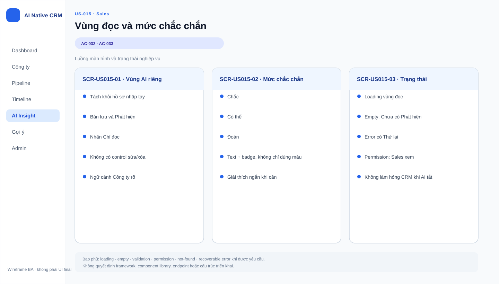

# Business Specification — US-015: Vùng đọc & hiển thị mức chắc chắn

## 1. Document Information

| Field | Value |
|---|---|
| Story | `US-015` — Vùng đọc & hiển thị mức chắc chắn |
| Feature / domain | `FEAT-015` / `D2 — Đọc nguồn & Tri thức (Observation/Claim/Provenance)` / `EPIC-05` |
| Version | `1.1` |
| Status | `AWAITING_SPECIFICATION_APPROVAL` |
| Date | `2026-08-15` |
| Priority | Should (12) |
| Sources | `REQ-204`, `REQ-209`; `BR-007`; `FEAT-015`; `US-015`, `AC-032..033`; dor-review; architect handoff |

## 2. Purpose

**[CONFIRMED — REQ-204, REQ-209]** Xác định hành vi nghiệp vụ để Sales xem Bản lưu và Phát hiện trong một khu riêng (vùng đọc) tách biệt khỏi Hồ sơ và Dòng thời gian của Công ty, đồng thời nhận biết ba mức chắc chắn (Chắc/Có thể/Đoán) bằng ký hiệu hoặc màu mà không cần đọc nhãn chữ.

## 3. User Story

**[CONFIRMED — US-015]** As a Sales, I want xem bản lưu & phát hiện ở khu riêng với mức chắc chắn nhìn-là-biết, so that tôi đánh giá độ tin cậy trước cả khi đọc chữ.

## 4. Business Goal

**[CONFIRMED — US-015]** Sales không nhầm dữ liệu do A-AI đọc được (Bản lưu, Phát hiện) với hồ sơ do mình nhập tay hoặc với dòng thời gian, và phân biệt được mức tin cậy của từng Phát hiện trước cả khi đọc nội dung chữ.
**[INFERRED — requirement-analysis BG-4 "Fact/suy luận phân biệt bằng mắt"]** Story này hiện thực hoá nguyên tắc vàng của sản phẩm: bằng chứng và suy luận phải phân biệt được bằng mắt, không chỉ bằng chữ, để Sales giữ quyền tự đánh giá thay vì tin tuyệt đối vào AI.

## 5. Scope

- **[CONFIRMED — REQ-204; AC-032]** Bản lưu và Phát hiện của một Công ty hiển thị trong một khu riêng (vùng đọc) trong màn hình Công ty, tách khỏi khu Hồ sơ và khu Dòng thời gian.
- **[CONFIRMED — REQ-209; AC-033]** Ba mức chắc chắn của Phát hiện — Chắc, Có thể, Đoán — phân biệt được bằng ký hiệu hoặc màu, không chỉ bằng nhãn chữ.
- **[CONFIRMED — REQ-206]** Vùng đọc chỉ hiển thị; không phải là đường để Sales sửa Hồ sơ, Dòng thời gian hay Cơ hội.
- **[CONFIRMED — BR-007]** Ba mức chắc chắn có định nghĩa nghiệp vụ cố định: Chắc = trích thẳng; Có thể = suy một bước; Đoán = không bằng chứng trực tiếp.

## 6. Out of Scope

- **[CONFIRMED — US-011, FEAT-011, REQ-201]** Tạo Bản lưu (đọc nguồn và lưu nguyên văn) — thuộc US-011.
- **[CONFIRMED — US-013, FEAT-013, REQ-202/203/207]** Rút Phát hiện từ Bản lưu, kèm chặn lưu khi thiếu câu trích — thuộc US-013.
- **[CONFIRMED — US-016, FEAT-016, REQ-208]** Bấm vào Phát hiện để nhảy tới đúng đoạn gốc có đánh dấu vị trí (provenance jump) — thuộc US-016.
- **[CONFIRMED — dor-review.md danh sách loại khỏi phạm vi]** Đọc Phát hiện theo góc loại công ty (US-014/FEAT-014) và tích luỹ Phát hiện qua nhiều lần đọc, không xoá cái cũ (US-017/FEAT-017) — cả hai đã bị đưa ra ngoài phạm vi 32 story tính năng đã PO duyệt.
- **[CONFIRMED — REQ-206]** Mọi thay đổi dữ liệu Hồ sơ, Dòng thời gian hoặc Cơ hội của Sales — vùng đọc không tạo ra các thay đổi này.
- **[CONFIRMED — US-038, FEAT-038, REQ-604]** Hiển thị trạng thái "AI đang tắt" cho Sales — thuộc US-038, không phải hành vi của vùng đọc.

## 7. Actor / Permission

| Actor | Business permission | Evidence |
|---|---|---|
| Sales | Xem Bản lưu và Phát hiện trong vùng đọc của một Công ty; nhận biết mức chắc chắn của từng Phát hiện; không có control sửa hoặc xoá Hồ sơ/Dòng thời gian/Cơ hội từ vùng đọc. | **[CONFIRMED]** US-015; REQ-206 |
| A-AI | Tạo Bản lưu và Phát hiện được hiển thị trong vùng đọc (hành vi thuộc US-011/US-013); không thao tác trực tiếp qua giao diện vùng đọc trong phạm vi story này. | **[CONFIRMED]** US-011; US-013; requirement-analysis (ghi chú actor A-AI) |

**[OPEN QUESTION — Q-015-02]** docs/02-analysis không nêu rõ Quản trị có xem được vùng đọc của Công ty giống Sales hay không; US-015 chỉ nêu Sales là actor. Chưa có cơ sở để khẳng định hoặc loại trừ quyền xem của Quản trị.

## 8. Business Rules

| ID | Rule | Evidence |
|---|---|---|
| BR-US015-01 | Bản lưu và Phát hiện của một Công ty hiển thị trong một khu riêng (vùng đọc) trong màn hình Công ty, tách khỏi khu Hồ sơ và khu Dòng thời gian. | **[CONFIRMED]** REQ-204; AC-032 |
| BR-US015-02 | Mức chắc chắn của Phát hiện chỉ gồm đúng ba giá trị: Chắc (trích thẳng), Có thể (suy một bước), Đoán (không bằng chứng trực tiếp). | **[CONFIRMED]** BR-007 |
| BR-US015-03 | Ba mức chắc chắn phải phân biệt được bằng ký hiệu hoặc màu; không được chỉ dựa vào nhãn chữ. | **[CONFIRMED]** REQ-209; AC-033 |
| BR-US015-04 | Vùng đọc không tự thay đổi Hồ sơ, Dòng thời gian hay Cơ hội của Công ty. | **[CONFIRMED]** REQ-206 |

## 9. Business Data Dictionary

| Business data | Meaning | Applicability / rule | Evidence |
|---|---|---|---|
| Vùng đọc | Khu vực hiển thị riêng cho Bản lưu và Phát hiện trong màn hình Công ty. | Tách biệt khỏi khu Hồ sơ và khu Dòng thời gian theo BR-US015-01. | **[CONFIRMED]** REQ-204; AC-032 |
| Bản lưu | Nội dung nguyên văn đọc được từ nguồn của Công ty, kèm địa chỉ nguồn và thời điểm đọc. | Thuộc đúng một Công ty; nhiều bản lưu xếp theo thời điểm (tạo ở US-011, hiển thị trong vùng đọc của US-015). | **[CONFIRMED]** REQ-201; US-011 AC-025..026 |
| Phát hiện | Nhận định ngắn rút từ Bản lưu, gồm loại tin, câu trích nguyên văn, vị trí câu trích trong Bản lưu và mức chắc chắn. | Thuộc đúng một Công ty, thừa kế từ Bản lưu; không gắn thẳng vào Cơ hội/Người liên hệ/Hoạt động (tạo ở US-013, hiển thị trong vùng đọc của US-015). | **[CONFIRMED]** REQ-202, REQ-203; US-013 AC-028 |
| Mức chắc chắn | Thuộc tính của Phát hiện, nhận một trong ba giá trị. | Bắt buộc phải có trên mỗi Phát hiện; phải phân biệt trực quan theo BR-US015-03. | **[CONFIRMED]** BR-007; REQ-209 |
| Chắc | Mức chắc chắn: Phát hiện có câu trích thẳng từ nguồn. | Một trong ba giá trị hợp lệ. | **[CONFIRMED]** BR-007 |
| Có thể | Mức chắc chắn: Phát hiện suy luận một bước từ câu trích. | Một trong ba giá trị hợp lệ. | **[CONFIRMED]** BR-007 |
| Đoán | Mức chắc chắn: Phát hiện không có bằng chứng trực tiếp. | Một trong ba giá trị hợp lệ. | **[CONFIRMED]** BR-007 |
| Hồ sơ | Thông tin Công ty do Sales nhập/quản lý trực tiếp (ví dụ Tên công ty, Ngành, Loại công ty — US-001). | Nằm ngoài vùng đọc; là điểm đối chiếu để chứng minh vùng đọc tách biệt. | **[CONFIRMED]** US-001; dùng làm tham chiếu ranh giới theo REQ-204 |
| Dòng thời gian | Dòng gộp Hoạt động, đổi giai đoạn và ghi chú của Công ty, mới nhất trên. | Nằm ngoài vùng đọc; là điểm đối chiếu để chứng minh vùng đọc tách biệt. | **[CONFIRMED]** REQ-108; dùng làm tham chiếu ranh giới theo REQ-204 |

## 10. Business Flow

**BF-015-01 — Mở vùng đọc.** **[CONFIRMED — AC-032; REQ-204]** Sales mở màn hình một Công ty. Nếu Công ty có Bản lưu và/hoặc Phát hiện, hệ thống hiển thị chúng trong một khu riêng (vùng đọc), tách biệt khỏi khu Hồ sơ (thông tin Sales nhập tay) và khu Dòng thời gian.

**BF-015-02 — Nhận biết mức chắc chắn.** **[CONFIRMED — AC-033; REQ-209]** Trong vùng đọc, mỗi Phát hiện hiển thị kèm mức Chắc, Có thể hoặc Đoán; ba mức được phân biệt bằng ký hiệu hoặc màu, Sales nhận biết được sự khác biệt mà không cần đọc nhãn chữ.

**BF-015-03 — Ranh giới không chỉnh sửa.** **[CONFIRMED — REQ-206; BR-US015-04]** Vùng đọc chỉ hiển thị. Sales không dùng vùng đọc để thay đổi Hồ sơ, Dòng thời gian hay Cơ hội; các thay đổi đó, nếu cần, thực hiện qua chức năng CRUD tương ứng nằm ngoài vùng đọc (US-001/US-002/US-003 và các story CRUD liên quan).

## 11. Acceptance Criteria

**AC-032 — Vùng đọc tách biệt**

```gherkin
Scenario: Vùng đọc tách biệt
  Given tôi mở màn hình một công ty
  Then bản lưu & phát hiện hiện ở khu riêng (vùng đọc), tách khỏi hồ sơ và dòng thời gian.
```

**AC-033 — Ba mức phân biệt không cần đọc chữ**

```gherkin
Scenario: Ba mức phân biệt không cần đọc chữ
  Given các phát hiện có mức Chắc/Có thể/Đoán
  Then ba mức phân biệt được bằng ký hiệu hoặc màu, không chỉ bằng nhãn chữ.
```

**[CONFIRMED — user-stories.md]** Hai acceptance criteria trên được bảo toàn nguyên văn từ nguồn; US-015 không có thêm AC nào khác trong docs/02-analysis.

## 12. Screen Specification

| Screen ID | Business area | Required information / behavior | Evidence |
|---|---|---|---|
| `SCR-US015-01` | Vùng đọc trong màn hình Công ty | Hiển thị Bản lưu và Phát hiện của Công ty trong một khu riêng, có ranh giới thị giác rõ với khu Hồ sơ và khu Dòng thời gian; không có control sửa/xoá dữ liệu CRM trong khu này. | **[CONFIRMED]** AC-032; REQ-204; BR-US015-01; BR-US015-04 |
| `SCR-US015-02` | Mức chắc chắn của Phát hiện | Mỗi Phát hiện hiển thị mức Chắc/Có thể/Đoán bằng ký hiệu và màu riêng biệt cho từng mức, không chỉ bằng nhãn chữ. | **[CONFIRMED]** AC-033; REQ-209; BR-US015-02; BR-US015-03 |
| `SCR-US015-03` | Trạng thái vùng đọc | Minh hoạ vùng đọc khi đang tải, khi Công ty chưa có Bản lưu/Phát hiện nào (empty), khi tải lỗi có thể thử lại, và khi Công ty không tồn tại. | **[ASSUMPTION — A-015-02]** Nhất quán với chuẩn trạng thái loading/empty/error/not-found đã áp dụng cho US-001; docs/02-analysis không mô tả các trạng thái này riêng cho US-015. |

## 13. Screen Design

> **UI-DESIGN UPDATE — 2026-08-15:** Wireframe dưới đây áp dụng đúng ngôn ngữ hình ảnh đã được người dùng duyệt ngày 2026-08-14 cho US-001 (nền `#f7f9fc`, card bo góc 14px viền `#d9e2ef`, thanh nhấn mục 5px `#695cff`, nút chính tím `#5236f5`, badge bo góc viền theo phân loại, khối trạng thái rỗng/lỗi/not-found dùng icon tròn + tiêu đề + mô tả + nút hành động). Chỉ nhãn, dữ liệu ví dụ và màu/ký hiệu phân loại mức chắc chắn được đổi cho đúng miền nghiệp vụ của US-015. Các asset là SVG Git-friendly, không quyết định framework, component library hay cách triển khai.

### 13.1 Tổng quan luồng



### 13.2 `SCR-US015-01` — Vùng đọc trong màn hình Công ty


### 13.3 `SCR-US015-02` — Mức chắc chắn của Phát hiện


### 13.4 `SCR-US015-03` — Trạng thái vùng đọc


**[ASSUMPTION — A-015-01]** Ký hiệu và màu cụ thể minh hoạ trong các SVG (✓ xanh cho Chắc, ∼ vàng cam cho Có thể, ? xám cho Đoán) chỉ có tính minh hoạ để chứng minh "phân biệt không cần đọc chữ"; đây chưa phải bảng màu/ký hiệu chính thức đã duyệt — xem Open Question Q-015-01.

## 14. Screen States

| State | Visible business outcome | Screen / asset | Evidence |
|---|---|---|---|
| Công ty có Bản lưu và Phát hiện | Vùng đọc hiện Bản lưu và Phát hiện, tách khỏi Hồ sơ và Dòng thời gian. | `SCR-US015-01` | **[CONFIRMED]** AC-032 |
| Phát hiện có đủ ba mức chắc chắn | Chắc/Có thể/Đoán phân biệt bằng ký hiệu và màu, không cần đọc nhãn chữ. | `SCR-US015-02` | **[CONFIRMED]** AC-033 |
| Vùng đọc đang tải dữ liệu | Hiển thị trạng thái loading, giữ nguyên khung vùng đọc, không lẫn với khu Hồ sơ/Dòng thời gian. | `SCR-US015-03` | **[ASSUMPTION — A-015-02]** |
| Công ty chưa có Bản lưu/Phát hiện nào | Vùng đọc hiện empty state cùng mô tả và không có dữ liệu để phân mức. | `SCR-US015-03` | **[ASSUMPTION — A-015-02]** |
| Không tải được vùng đọc | Hiển thị lỗi có thể thử lại; khu Hồ sơ/Dòng thời gian không bị ảnh hưởng. | `SCR-US015-03` | **[ASSUMPTION — A-015-02]** |
| Công ty không tồn tại | Vùng đọc không hiển thị; áp dụng trạng thái not-found chung của màn hình Công ty. | `SCR-US015-03` | **[ASSUMPTION — A-015-02]**, nhất quán US-001 `SCR-US001-05` |

## 15. Validation

| Condition | Expected business response | Evidence |
|---|---|---|
| Sales thao tác trong vùng đọc (xem Bản lưu/Phát hiện) | Không có control nào cho phép sửa/xoá Hồ sơ, Dòng thời gian hoặc Cơ hội từ vùng đọc. | **[CONFIRMED]** REQ-206; BR-US015-04 |
| Phát hiện hiển thị trong vùng đọc | Mức chắc chắn phải là một trong ba giá trị Chắc/Có thể/Đoán; không có giá trị thứ tư. | **[CONFIRMED]** BR-007; BR-US015-02 |
| Phân biệt giữa các mức chắc chắn | Không được chỉ dựa vào nhãn chữ; phải có ký hiệu hoặc màu riêng cho từng mức. | **[CONFIRMED]** REQ-209; AC-033 |
| Chọn bảng màu/ký hiệu cụ thể và đối chiếu accessibility (mù màu) | Chưa có chuẩn nguồn trong docs/02-analysis. | **[OPEN QUESTION]** Q-015-01 |

## 16. Dependencies

| Direction | Item | Dependency | Evidence |
|---|---|---|---|
| Upstream | US-011 / FEAT-011 | Bản lưu phải tồn tại trước khi vùng đọc có nội dung để hiển thị. | **[CONFIRMED]** REQ-201; function-decomposition |
| Upstream | US-013 / FEAT-013 | Phát hiện (gồm mức chắc chắn) phải tồn tại trước khi vùng đọc hiển thị Phát hiện; user-stories.md ghi nhận trực tiếp `Dep: US-013`. | **[CONFIRMED]** REQ-202/203/207; user-stories.md |
| Related | US-016 / FEAT-016 | Bấm vào một Phát hiện trong vùng đọc để nhảy tới đoạn gốc là hành vi riêng của US-016, không thuộc US-015. | **[CONFIRMED]** REQ-208; function-decomposition |
| Excluded (deferred) | US-014 / FEAT-014 | Đọc Phát hiện theo góc loại công ty — đã loại khỏi phạm vi 32 story đã PO duyệt; không ảnh hưởng nội dung vùng đọc của US-015. | **[CONFIRMED]** dor-review.md |
| Excluded (deferred) | US-017 / FEAT-017 | Tích luỹ Phát hiện qua nhiều lần đọc — đã loại khỏi phạm vi 32 story đã PO duyệt; vùng đọc của US-015 chỉ hiển thị dữ liệu đang có, không tự đảm bảo giữ lịch sử phát hiện cũ. | **[CONFIRMED]** dor-review.md |
| Cross-cutting | BR-017 / US-040 | Ranh giới chặn A-AI tự xoá dữ liệu người tạo áp dụng chung toàn hệ thống; vùng đọc không phải là đường ghi dữ liệu nên không phát sinh xung đột với ranh giới này. | **[CONFIRMED]** BR-017; architect handoff |

## 17. Business-level NFR Expectations

- **[CONFIRMED — REQ-209]** Ba mức chắc chắn phải phân biệt được mà không cần đọc nhãn chữ; đây là kỳ vọng nghiệp vụ cốt lõi của story, không phải một NFR kỹ thuật.
- **[CONFIRMED — BR-016]** Khi AI bị tắt (kill switch), dữ liệu Bản lưu/Phát hiện đã sinh không bị xoá; do đó vùng đọc vẫn hiển thị được các bản ghi đã có, dù không có bản ghi mới nào được tạo thêm trong lúc AI tắt.
- **[INFERRED — architect handoff, ma trận truy vết US-015 → T: "—"]** US-015 không được ánh xạ tới bất kỳ kịch bản nghiệm thu T-1..T-10 nào trong bộ hồ sơ hiện có; do đó story không mang một SLA/NFR nghiệm thu riêng ngoài kỳ vọng chất lượng chung của hệ thống.
- **[CONFIRMED — human decision 2026-08-14, áp dụng chung toàn hệ thống]** US-015 không đặt SLA riêng; áp dụng kỳ vọng chất lượng chung của hệ thống như đã thống nhất cho US-001.

## 18. Test Scenarios

Chưa có `test-scenarios.md` riêng cho US-015. Các tình huống dưới đây là truy vết nghiệp vụ, không phải kiểm thử thực thi; US-015 không được ánh xạ tới bộ T-1..T-10 trong architect handoff (`—`). **[CONFIRMED — architect handoff]**

| ID | Business scenario | AC / BR | Expected business result | Acceptance trace |
|---|---|---|---|---|
| TC-015-01 | Sales mở màn hình một Công ty đã có Bản lưu và Phát hiện. | AC-032; BR-US015-01 | Bản lưu và Phát hiện hiện trong vùng đọc riêng, tách khỏi Hồ sơ và Dòng thời gian. | AC-032 |
| TC-015-02 | Sales thử tìm control sửa/xoá Hồ sơ, Dòng thời gian hoặc Cơ hội bên trong vùng đọc. | BR-US015-04; REQ-206 | Không có control nào như vậy trong vùng đọc. | AC-032 |
| TC-015-03 | Sales xem một Phát hiện có mức Chắc, một Phát hiện mức Có thể và một Phát hiện mức Đoán. | AC-033; BR-US015-02..03 | Ba mức phân biệt được bằng ký hiệu hoặc màu, không cần đọc nhãn chữ. | AC-033 |
| TC-015-04 | Đối chiếu định nghĩa từng mức chắc chắn hiển thị với BR-007 (trích thẳng / suy một bước / không bằng chứng trực tiếp). | BR-007; BR-US015-02 | Nhãn và ý nghĩa hiển thị đúng ba định nghĩa của BR-007, không thêm/bớt mức. | AC-033 |
| TC-015-05 | Sales mở một Công ty chưa có Bản lưu/Phát hiện nào. | Screen State (empty) | Vùng đọc hiển thị empty state, không gây hiểu nhầm là lỗi. | **[ASSUMPTION — A-015-02]** |
| TC-015-06 | Vùng đọc không tải được dữ liệu (lỗi tạm thời). | Screen State (recoverable error) | Hiển thị lỗi có thể thử lại; Hồ sơ và Dòng thời gian của Công ty không bị ảnh hưởng. | **[ASSUMPTION — A-015-02]** |

## 19. Traceability

| Chain | Evidence |
|---|---|
| `D2 → EPIC-05 → FEAT-015 → US-015 → AC-032..033` | **[CONFIRMED]** function-decomposition; user-stories |
| `REQ-204 → FEAT-015 → US-015 → AC-032 → TC-015-01` | **[CONFIRMED]** requirement-analysis; user-stories; architect handoff |
| `REQ-209 → FEAT-015 → US-015 → AC-033 → TC-015-03` | **[CONFIRMED]** requirement-analysis; user-stories; architect handoff |
| `BR-007 → BR-US015-02 → AC-033 → TC-015-04` | **[CONFIRMED]** requirement-analysis; user-stories |
| `REQ-206 → BR-US015-04 → US-015 → TC-015-02` | **[CONFIRMED]** requirement-analysis |
| `US-011 → US-013 → US-015` (Dep) | **[CONFIRMED]** user-stories.md (`Dep: US-013`); function-decomposition |
| `US-015 —(Related)→ US-016` | **[CONFIRMED]** function-decomposition; requirement-analysis |
| `FEAT-015 → Should (12) → dor-review READY` | **[CONFIRMED]** backlog-prioritization; dor-review |

## 20. Assumptions

| ID | Assumption | Rationale / status |
|---|---|---|
| A-015-01 | Ký hiệu và màu cụ thể trong wireframe (✓ xanh / ∼ vàng cam / ? xám) chỉ minh hoạ nguyên tắc "phân biệt không cần đọc chữ", chưa phải bảng màu chính thức. | **[ASSUMPTION]** Chờ quyết định người dùng/UX; xem Q-015-01. |
| A-015-02 | Vùng đọc áp dụng cùng chuẩn trạng thái loading/empty/recoverable-error/not-found đã duyệt cho US-001, thay vì tự định nghĩa bộ trạng thái riêng. | **[ASSUMPTION]** docs/02-analysis không mô tả các trạng thái này riêng cho US-015; suy ra từ nhất quán trải nghiệm toàn hệ thống. |
| A-015-03 | Ví dụ minh hoạ dùng lại Công ty "FPT Software" đã xuất hiện trong US-001 để giữ nhất quán dữ liệu mẫu giữa các specification, không hàm ý một business rule mới. | **[ASSUMPTION]** Chỉ phục vụ minh hoạ wireframe. |

## 21. Open Questions

| ID | Question | Owner |
|---|---|---|
| Q-015-01 | Chuẩn ký hiệu/màu cụ thể cho ba mức Chắc/Có thể/Đoán là gì, và có yêu cầu accessibility (mù màu, tương phản) nào cần tuân theo không? | PO / UX |
| Q-015-02 | Quản trị có được xem vùng đọc của Công ty giống Sales hay không? docs/02-analysis chỉ nêu Sales là actor của US-015. | PO |

## 22. Definition of Ready

| Check | Status | Evidence / note |
|---|---|---|
| Actor và giá trị nghiệp vụ rõ ràng | Ready | **[CONFIRMED]** US-015; dor-review.md |
| Phạm vi và AC nguồn truy vết được | Ready | **[CONFIRMED]** REQ-204/209; AC-032..033; dor-review.md |
| Business rules (BR-007, ranh giới REQ-206) xác định | Ready | **[CONFIRMED]** requirement-analysis; AC-032..033 |
| Phụ thuộc US-011/US-013 đã nhận diện | Ready | **[CONFIRMED]** user-stories.md (`Dep: US-013`); function-decomposition |
| Câu hỏi nghiệp vụ còn mở không chặn READY | Ready — đã đánh giá | Q-015-01 (bảng màu/ký hiệu) và Q-015-02 (quyền Quản trị) là câu hỏi thiết kế/chi tiết, không thay đổi hành vi cốt lõi của AC-032..033. |
| Đánh giá DoR của nguồn | READY | **[CONFIRMED]** `docs/02-analysis/dor-review.md` — "US-015 \| FEAT-015 \| Should (12) \| READY" |

**[CONFIRMED — human-approval rule]** Tài liệu dừng tại `AWAITING_SPECIFICATION_APPROVAL`; chỉ con người có thể đặt `SPECIFICATION_APPROVED`.

## 23. Technical Handoff

| Type | Constraint, touchpoint, risk or decision for Tech Lead | Evidence |
|---|---|---|
| Constraint | Vùng đọc là khu vực chỉ đọc (read-only); không được cung cấp bất kỳ đường ghi nào vào Hồ sơ, Dòng thời gian hay Cơ hội từ giao diện này, kể cả gián tiếp. | **[CONFIRMED]** REQ-206; BR-US015-04 |
| Touchpoint | Vùng đọc hiển thị dữ liệu do US-011 (Bản lưu) và US-013 (Phát hiện) tạo ra; cấu trúc dữ liệu hiển thị phụ thuộc vào các trường đã xác định ở hai story đó (nguyên văn/nguồn/thời điểm; nhận định/loại tin/câu trích/vị trí/mức). | **[CONFIRMED]** REQ-201..203; US-011 AC-025..026; US-013 AC-028 |
| Touchpoint | Bấm vào một Phát hiện trong vùng đọc là điểm khởi đầu cho hành vi nhảy provenance của US-016; US-015 chỉ cần đảm bảo Phát hiện có thể được nhận diện/chọn, hành vi nhảy tới đoạn gốc thuộc US-016. | **[CONFIRMED]** REQ-208; function-decomposition |
| Question | Chưa có chuẩn ký hiệu/màu chính thức cho ba mức Chắc/Có thể/Đoán, kể cả yêu cầu accessibility; cần PO/UX quyết định trước khi tối ưu hoá thị giác cuối cùng. | **[OPEN QUESTION]** Q-015-01 |
| Question | Chưa rõ Quản trị có cùng quyền xem vùng đọc như Sales hay không. | **[OPEN QUESTION]** Q-015-02 |

## 24. Change Log

| Version | Date | Change | Author/Approver |
|---|---|---|---|
| 1.1 | 2026-08-15 | Viết lại toàn diện theo chuẩn 24 mục US-001 v1.2, đối chiếu docs/02-analysis, chuẩn hoá SVG theo ngôn ngữ hình ảnh đã duyệt. | Codex — comprehensive refinement pass; specification approval unchanged |
| 1.0 | 2026-08-14 | Tạo specification 24 mục. | Codex / awaiting human specification approval |
