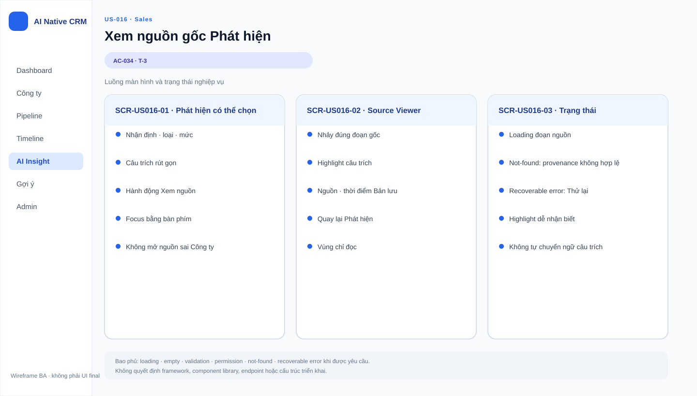

# Business Specification — US-016: View source excerpt for a finding

## 1. Document Information
| Field | Value |
|---|---|
| Story | `US-016` |
| Feature / domain | `FEAT-016` / D2 — Source reading and knowledge |
| Version / status | `1.0` / `AWAITING_SPECIFICATION_APPROVAL` |
| Date / priority | `2026-08-14` / Should (13) |
| Sources | `REQ-208`; `BR-018`; `US-016`; `AC-034`; architect handoff |

## 2. Purpose
**[CONFIRMED — REQ-208]** Enable Sales to verify a finding against its exact quoted source passage without manually searching the whole source.

## 3. User Story
**[CONFIRMED — US-016]** As Sales, I want to click a finding and jump to its exact original passage so that I can verify it immediately.

## 4. Business Goal
**[CONFIRMED — US-016]** Findings are trustworthy because their evidence can be inspected at the point of decision.

## 5. Scope
**[CONFIRMED — REQ-208, AC-034]** A finding displayed anywhere can be selected; the system opens its source snapshot at the exact quoted passage and marks that passage.

## 6. Out of Scope
**[CONFIRMED — REQ-201..207, 209..211]** Capturing snapshots, creating findings, confidence display, or repairing missing provenance are separate stories. This story does not change a finding or CRM data.

## 7. Actor / Permission
| Actor | Permission | Evidence |
|---|---|---|
| Sales | Open the supporting source for a displayed finding. | **[CONFIRMED]** AC-034 |
| A-AI | Produces provenance in US-013; it has no click action here. | **[CONFIRMED]** REQ-202; US-013 |

## 8. Business Rules
| ID | Rule | Evidence |
|---|---|---|
| BR-US016-01 | Selection must work wherever the finding is displayed. | **[CONFIRMED]** AC-034 |
| BR-US016-02 | The destination is the exact original passage in the source snapshot and it is marked. | **[CONFIRMED]** REQ-208; AC-034 |
| BR-US016-03 | Finding provenance is the thread Observation → Claim; missing quote/provenance must not be silently substituted. | **[CONFIRMED]** BR-018; REQ-207 |
| BR-US016-04 | Viewing is read-only and must not alter company, timeline, opportunity, or finding data. | **[CONFIRMED]** REQ-206; project rules |

## 9. Business Data Dictionary
| Data | Meaning | Rule | Evidence |
|---|---|---|---|
| Source snapshot / Observation | Preserved source content for one company. | Contains original passage. | **[CONFIRMED]** REQ-201; BR-018 |
| Finding / Claim | Short conclusion derived from a snapshot. | Carries quote and location. | **[CONFIRMED]** REQ-202; BR-018 |
| Quote location | Position of the quoted passage within its snapshot. | Enables exact jump and marking. | **[CONFIRMED]** REQ-202; REQ-208 |

## 10. Business Flow
1. **[CONFIRMED — AC-034]** Sales sees a finding anywhere it is displayed.
2. **[CONFIRMED — AC-034]** Sales selects the finding.
3. **[CONFIRMED — AC-034]** The exact source passage opens and its quote location is marked.

## 11. Acceptance Criteria
### AC-034 — Jump to quoted passage
```gherkin
Scenario: Open provenance for a finding
  Given a finding displayed anywhere
  When Sales selects it
  Then the source snapshot opens at the exact original passage and marks the quote location.
```
**[CONFIRMED — user-stories.md]** This is the approved acceptance criterion.

## 12. Screen Specification
| Area | Required behavior | Evidence |
|---|---|---|
| Finding display | Selection is available wherever a finding appears. | **[CONFIRMED]** AC-034 |
| Source view | Opens the precise original passage with a visible mark. | **[CONFIRMED]** AC-034 |

## 13. Screen Design

> **UI-DESIGN UPDATE — 2026-08-14:** Wireframe BA dưới đây được tạo từ các US/AC hiện hành và thay thế trạng thái “chưa có asset” được ghi nhận trước bước UI Design.


No approved wireframe asset exists. **[ASSUMPTION — A-016-01]** Visual navigation and marking treatment are UX decisions that must preserve AC-034.

## 14. Screen States
| State | Outcome | Evidence |
|---|---|---|
| Finding available | Sales can select it. | **[CONFIRMED]** AC-034 |
| Provenance open | Exact quote is visible and marked. | **[CONFIRMED]** AC-034 |
| Provenance unavailable | Behavior is not specified because invalid findings are prohibited. | **[OPEN QUESTION]** Q-016-01 |

## 15. Validation
| Condition | Response | Evidence |
|---|---|---|
| Finding has valid provenance | Open exact marked passage. | **[CONFIRMED]** AC-034 |
| Finding lacks quote/location | It must not be a persisted/displayed finding. | **[CONFIRMED]** REQ-207; BR-US016-03 |

## 16. Dependencies
| Direction | Item | Dependency | Evidence |
|---|---|---|---|
| Upstream | US-013 | Provides finding with required provenance. | **[CONFIRMED]** US-016 dependency |
| Upstream | US-011 | Provides source snapshots. | **[INFERRED]** REQ-201; BR-018 |
| Cross-cutting | US-040 | Automation guardrails remain applicable. | **[CONFIRMED]** BR-017 |

## 17. Business-level NFR Expectations
- **[CONFIRMED — REQ-208]** Evidence must be directly inspectable rather than requiring manual reading of an entire source.
- **[OPEN QUESTION — Q-016-02]** No response-time or behavior for deleted/unavailable source content is specified.

## 18. Test Scenarios
| ID | Scenario | AC / rule | Expected result |
|---|---|---|---|
| TC-016-01 | Select a finding in one display context. | AC-034; BR-US016-01..02 | Exact quote opens and is marked. |
| TC-016-02 | Select the same finding in another display context. | AC-034; BR-US016-01 | The same exact quote opens. |
| TC-016-03 | Attempt to use a finding without provenance. | BR-US016-03 | Such a finding is not available to view. |

## 19. Traceability
| Chain | Evidence |
|---|---|
| `REQ-208 → EPIC-05 → FEAT-016 → US-016 → AC-034 → TC-016-01..02` | **[CONFIRMED]** architect handoff matrix |
| `BR-018 → BR-US016-03 → TC-016-03` | **[CONFIRMED]** requirement-analysis |

## 20. Assumptions
| ID | Assumption | Status |
|---|---|---|
| A-016-01 | Marking/navigation presentation is a UX choice. | **[ASSUMPTION]** Human approval required. |

## 21. Open Questions
| ID | Question | Owner / impact |
|---|---|---|
| Q-016-01 | What message is shown if historical provenance cannot be opened? | PO; exception behavior. |
| Q-016-02 | Is a performance target required for source opening? | PO; NFR. |

## 22. Definition of Ready
| Item | Status | Evidence |
|---|---|---|
| Actor/value/AC | READY | US-016; AC-034. |
| Dependencies and traceability | READY | US-013; REQ-208 → FEAT-016 → AC → TC. |
| Open ambiguity recorded | READY WITH QUESTIONS | Q-016-01..002 do not alter AC. |
**[CONFIRMED — dor-review]** US-016 is `READY`; status remains awaiting human specification approval.

## 23. Technical Handoff
### Approved constraints
- **[CONFIRMED — REQ-208]** Preserve exact jump and visible marking.
- **[CONFIRMED — BR-018; project rules]** Preserve provenance; do not create monitoring, telemetry, log shipping, or prompt logs.
### Touchpoints and risks
- **[CONFIRMED]** Depends on snapshot/finding provenance from US-011/US-013.
- **[INFERRED]** Inexact location would undermine Sales’ ability to verify a finding.
### Decisions required from Tech Lead
No endpoints, schemas, migrations, frameworks, source files, coding tasks, or implementation plan are proposed. Resolve only technical realization without changing Q-016-01..002 or the business constraints.

## 24. Change Log
| Version | Date | Change | Author/Approver |
|---|---|---|---|
| 1.0 | 2026-08-14 | Created 24-section business specification for US-016. | Codex / awaiting human specification approval |
