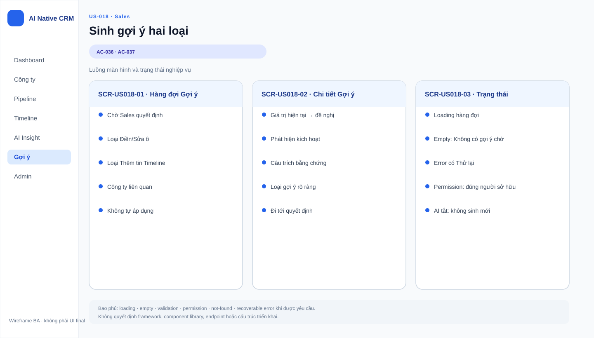

# Business Specification — US-018: Sinh gợi ý vào hàng đợi chờ duyệt

## 1. Document Information
| Field | Value |
|---|---|
| Story | US-018 |
| Version | 1.0 |
| Status | AWAITING_SPECIFICATION_APPROVAL |
| Sources | REQ-301, BR-018, US-018, architect handoff, DoR review |

## 2. Purpose
**[CONFIRMED — REQ-301]** Biến phát hiện mới thành gợi ý trong hàng đợi để Sales xem xét trước khi thay đổi dữ liệu.

## 3. User Story
**[CONFIRMED — US-018]** As a A-AI, I want sinh gợi ý từ phát hiện mới vào hàng đợi của người sở hữu, so that Sales chỉ việc bấm thay vì tự gõ.

## 4. Business Goal
**[CONFIRMED — REQ-301]** Giảm thao tác gõ của Sales nhưng giữ con người kiểm soát quyết định.

## 5. Scope
- **[CONFIRMED — AC-036]** Sinh gợi ý “thêm tin mới vào dòng thời gian” từ phát hiện mới vào hàng đợi chờ duyệt.
- **[CONFIRMED — AC-037]** Sinh gợi ý “điền/sửa ô” khi phát hiện Chắc/Có thể bổ sung hoặc mâu thuẫn ô hồ sơ trống/đã cũ.
- **[CONFIRMED — Q-01]** Với công ty Đang theo dõi, gợi ý thêm tin do US-031 tự thực hiện; hàng đợi chỉ giữ gợi ý sửa ô.

## 6. Out of Scope
- **[CONFIRMED — REQ-302]** Nội dung thẻ bốn phần; US-019.
- **[CONFIRMED — REQ-303..305]** Duyệt, sửa-rồi-duyệt, bỏ gợi ý; US-020..021.
- **[CONFIRMED — BR-017]** Tự áp dụng, tự duyệt, thay đổi stage/tiền/liên hệ hoặc xóa dữ liệu.

## 7. Actor / Permission
| Actor | Business permission | Evidence |
|---|---|---|
| A-AI | Sinh gợi ý từ phát hiện mới vào hàng đợi. | **[CONFIRMED]** US-018, AC-036..037 |
| Sales | Là người sở hữu hàng đợi; quyết định thuộc US-020. | **[CONFIRMED]** US-018 dependencies |

## 8. Business Rules
| ID | Rule | Evidence |
|---|---|---|
| BR-US018-01 | Phát hiện mới có thể sinh hai loại gợi ý: thêm tin timeline hoặc điền/sửa ô hồ sơ. | **[CONFIRMED]** REQ-301 |
| BR-US018-02 | Gợi ý chỉ xuất hiện trong hàng đợi chờ duyệt; không tự đổi hồ sơ/timeline. | **[CONFIRMED]** REQ-301, REQ-304, BR-011 |
| BR-US018-03 | Gợi ý điền/sửa ô áp dụng cho phát hiện Chắc hoặc Có thể bổ sung/mâu thuẫn ô trống/đã cũ. | **[CONFIRMED]** AC-037, Q-06 |
| BR-US018-04 | Với công ty Đang theo dõi, đường “thêm tin” do US-031 xử lý; một phát hiện tương ứng đúng một mục timeline. | **[CONFIRMED]** Q-01 |
| BR-US018-05 | Gợi ý là Proposal, truy vết từ Claim/Observation theo BR-018. | **[INFERRED]** BR-018 |

## 9. Business Data Dictionary
| Business data | Meaning | Rule | Evidence |
|---|---|---|---|
| Phát hiện mới | Claim về công ty có provenance. | Đầu vào của gợi ý. | **[CONFIRMED]** REQ-301, BR-018 |
| Gợi ý | Proposal chờ Sales quyết định. | Thuộc một trong hai loại. | **[CONFIRMED]** REQ-301 |
| Hàng đợi chờ duyệt | Nơi tập hợp gợi ý trước khi Sales hành động. | Không phải hành động tự áp dụng. | **[CONFIRMED]** AC-036..037, REQ-304 |
| Ô hồ sơ trống/đã cũ | Ô có thể cần điền hoặc sửa bởi đề nghị. | “Đã cũ” theo Q-06 đã duyệt trong story. | **[CONFIRMED]** AC-037, Q-06 |

## 10. Business Flow
### BF-018-01 — Gợi ý thêm tin
1. **[CONFIRMED — AC-036]** Có phát hiện mới về công ty.
2. **[CONFIRMED — AC-036]** A-AI sinh gợi ý thêm tin vào timeline.
3. **[CONFIRMED — AC-036]** Gợi ý xuất hiện trong hàng đợi chờ duyệt, trừ nhánh công ty Đang theo dõi theo Q-01.

### BF-018-02 — Gợi ý điền/sửa ô
1. **[CONFIRMED — AC-037]** Có phát hiện Chắc/Có thể bổ sung hoặc mâu thuẫn ô hồ sơ trống/đã cũ.
2. **[CONFIRMED — AC-037]** A-AI sinh gợi ý điền/sửa ô.
3. **[CONFIRMED — AC-037]** Gợi ý xuất hiện trong hàng đợi chờ duyệt, không tự đổi ô.

## 11. Acceptance Criteria
### AC-036 — Gợi ý thêm tin
```gherkin
Scenario: Gợi ý thêm tin
  Given có phát hiện mới về một công ty
  When hệ thống sinh gợi ý loại "thêm tin mới vào dòng thời gian"
  Then gợi ý xuất hiện trong hàng đợi chờ duyệt.
```
### AC-037 — Gợi ý điền/sửa ô
```gherkin
Scenario: Gợi ý điền/sửa ô hồ sơ
  Given có phát hiện Chắc hoặc Có thể bổ sung hoặc mâu thuẫn một ô hồ sơ trống hoặc đã cũ
  When hệ thống sinh gợi ý loại "điền/sửa ô"
  Then gợi ý xuất hiện trong hàng đợi chờ duyệt.
```

## 12. Screen Specification
| Area | Required behavior | Evidence |
|---|---|---|
| Hàng đợi người sở hữu | Cho phép thấy gợi ý chờ duyệt. | **[CONFIRMED]** US-018, AC-036..037 |
| Gợi ý điền/sửa ô | Phân biệt với gợi ý thêm tin. | **[CONFIRMED]** REQ-301 |

## 13. Screen Design

> **UI-DESIGN UPDATE — 2026-08-14:** Wireframe BA dưới đây được tạo từ các US/AC hiện hành và thay thế trạng thái “chưa có asset” được ghi nhận trước bước UI Design.


Không có asset wireframe được phê duyệt. **[ASSUMPTION — A-018-01]** Bố cục hàng đợi do UX quyết định, còn nội dung bắt buộc của thẻ thuộc US-019.

## 14. Screen States
| State | Outcome | Evidence |
|---|---|---|
| Có gợi ý thêm tin chờ duyệt | Gợi ý nằm trong hàng đợi. | **[CONFIRMED]** AC-036 |
| Có gợi ý điền/sửa chờ duyệt | Gợi ý nằm trong hàng đợi; hồ sơ chưa đổi. | **[CONFIRMED]** AC-037, REQ-304 |
| Công ty Đang theo dõi, gợi ý thêm tin | US-031 tự thêm timeline; không giữ loại này ở hàng đợi. | **[CONFIRMED]** Q-01 |

## 15. Validation
| Condition | Response | Evidence |
|---|---|---|
| Phát hiện mới | Có thể sinh đúng loại gợi ý phù hợp. | **[CONFIRMED]** REQ-301 |
| Phát hiện chỉ ở mức Đoán | Không có quy tắc gợi ý sửa ô trong AC-037. | **[OPEN QUESTION]** Q-018-01 |
| Gợi ý chưa được Sales duyệt | Không thay đổi dữ liệu. | **[CONFIRMED]** REQ-304, BR-011 |

## 16. Dependencies
| Direction | Item | Dependency | Evidence |
|---|---|---|---|
| Upstream | US-013 | Cung cấp phát hiện mới có provenance. | **[CONFIRMED]** US-018 dependency |
| Downstream | US-020, US-021 | Cung cấp gợi ý để Sales quyết định / không quyết định. | **[CONFIRMED]** REQ-303..304 |
| Parallel | US-031 | Tự xử lý gợi ý thêm tin cho công ty Đang theo dõi. | **[CONFIRMED]** Q-01 |

## 17. Business-level NFR Expectations
- **[CONFIRMED — BR-017]** Automation phải đi qua AutomationPolicyGuard và không được tự thay đổi dữ liệu cấm.
- **[CONFIRMED — REQ-304]** Việc sinh gợi ý không làm suy giảm quyền quyết định của Sales.
- **[CONFIRMED — REQ-704]** Dữ liệu CRM và gợi ý cần bền qua khởi động lại.

## 18. Test Scenarios
| TC | Business scenario | AC / rule | Expected result |
|---|---|---|---|
| TC-018-01 | Phát hiện mới sinh gợi ý thêm tin cho công ty không Đang theo dõi. | AC-036, BR-US018-01 | Có một gợi ý thêm tin trong hàng đợi. |
| TC-018-02 | Phát hiện Chắc/Có thể bổ sung/mâu thuẫn ô hồ sơ. | AC-037, BR-US018-03 | Có gợi ý điền/sửa; hồ sơ chưa thay đổi. |
| TC-018-03 | Gợi ý chưa thao tác qua ba chu kỳ. | BR-US018-02, BR-011 | Không tự áp dụng. |

## 19. Traceability
| Chain | Evidence |
|---|---|
| `REQ-301 → EPIC-06 → FEAT-018 → US-018 → AC-036..037 → TC-018-01..03 (T-4/T-5)` | **[CONFIRMED]** architect handoff |
| `BR-018 → BR-US018-05 → AC-036..037` | **[INFERRED]** requirement analysis |
| `Q-01 → BR-US018-04 → TC-018-01` | **[CONFIRMED]** approved story note |

## 20. Assumptions
| ID | Assumption | Status |
|---|---|---|
| A-018-01 | Hình thức bố trí hàng đợi chưa được chốt. | **[ASSUMPTION]** Không thay đổi các loại gợi ý. |

## 21. Open Questions
| ID | Question | Owner / impact |
|---|---|---|
| Q-018-01 | Phát hiện mức Đoán có được tạo loại gợi ý nào không? | PO; phạm vi tạo gợi ý. |
| Q-018-02 | Trạng thái “mới” của phát hiện được xác định thế nào ngoài quy tắc vòng quét? | PO/Tech Lead; chống tạo lặp. |

## 22. Definition of Ready
| DoR item | Status | Evidence |
|---|---|---|
| Actor, giá trị và scope rõ | READY | US-018, REQ-301 |
| AC quan sát được | READY | AC-036..037 |
| Dependencies xác định | READY | US-013, US-020..021 |
| Traceability rõ | READY | REQ-301 → FEAT-018 → US-018 → AC → TC |
| Human approval | AWAITING_SPECIFICATION_APPROVAL | Gate 1 |

## 23. Technical Handoff
**[CONFIRMED — REQ-304, BR-017]** Chỉ sinh Proposal chờ duyệt; mọi lệnh tự động phải qua AutomationPolicyGuard, không thêm đường tắt. **[INFERRED — BR-018]** Bảo toàn chuỗi nguồn nghiệp vụ Observation → Claim → Proposal. Tech Lead quyết định cơ chế tránh lặp và các chi tiết kỹ thuật.

## 24. Change Log
| Version | Date | Change | Author/Approver |
|---|---|---|---|
| 1.0 | 2026-08-14 | Tạo specification 24 mục cho US-018. | Codex / awaiting human specification approval |
