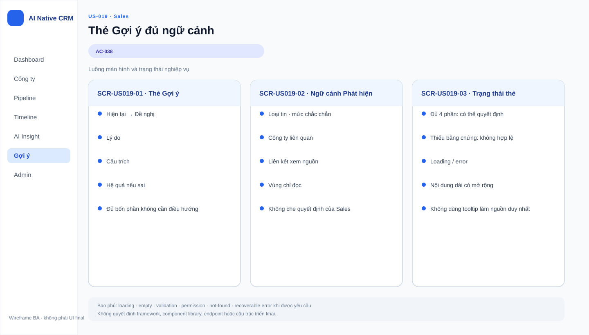

# Business Specification — US-019: Evidence-complete proposal card
## 1. Document Information
| Field | Value |
|---|---|
| Story / feature | `US-019` / `FEAT-019` (D3) |
| Status / sources | `AWAITING_SPECIFICATION_APPROVAL`; `REQ-302`, `AC-038` |
## 2. Purpose
**[CONFIRMED — REQ-302]** Put decision evidence together for Sales.
## 3. User Story
**[CONFIRMED — US-019]** As Sales, I want each proposal to show all evidence in place so I can decide without switching screens.
## 4. Business Goal
**[CONFIRMED — US-019]** Human review is informed and fast without losing evidence.
## 5. Scope
Show current→proposed content, supporting quote, confidence, and consequence-if-wrong together. **[CONFIRMED — AC-038]**
## 6. Out of Scope
Proposal generation is US-018; decision is US-020; provenance jump is US-016. **[CONFIRMED — user-stories]**
## 7. Actor / Permission
Sales views proposal evidence. **[CONFIRMED — AC-038]**
## 8. Business Rules
`BR-US019-01`: all four elements are co-located. `BR-US019-02`: the consequence-if-wrong line is required. **[CONFIRMED — REQ-302; AC-038]**
## 9. Business Data Dictionary
Proposal; current→proposed content; quote; confidence; consequence-if-wrong. **[CONFIRMED — REQ-302]**
## 10. Business Flow
Sales opens a queued proposal and sees all four elements in place. **[CONFIRMED — AC-038]**
## 11. Acceptance Criteria
### AC-038 — Four elements together
```gherkin
Given a queued proposal When Sales opens it Then current→proposed content, quote, confidence, and consequence-if-wrong are shown together.
```
## 12. Screen Specification
Proposal view provides the four listed elements without requiring navigation. **[CONFIRMED — AC-038]**
## 13. Screen Design

> **UI-DESIGN UPDATE — 2026-08-14:** Wireframe BA dưới đây được tạo từ các US/AC hiện hành và thay thế trạng thái “chưa có asset” được ghi nhận trước bước UI Design.


No asset. **[ASSUMPTION — A-019-01]** Layout is UX-owned but all four elements remain co-located.
## 14. Screen States
Queued proposal open: all four elements visible. **[CONFIRMED — AC-038]** Missing element: proposal is incomplete. **[INFERRED — REQ-302]**
## 15. Validation
Presence/content rules beyond the four elements are **[OPEN QUESTION — Q-019-01]**.
## 16. Dependencies
US-018 supplies queued proposals; US-020 consumes the card for a decision. **[CONFIRMED — US-019 dependency]**
## 17. Business-level NFR Expectations
No evidence is hidden behind a required screen switch. **[CONFIRMED — US-019]**
## 18. Test Scenarios
| ID | Scenario | AC / rule |
|---|---|---|
| TC-019-01 | Open queued proposal. | AC-038; BR-US019-01..02 |
## 19. Traceability
`REQ-302 → EPIC-06 → FEAT-019 → US-019 → AC-038 → TC-019-01`. **[CONFIRMED — architect handoff]**
## 20. Assumptions
`A-019-01`: visual hierarchy is a UX decision. **[ASSUMPTION]**
## 21. Open Questions
`Q-019-01`: Is template wording for consequence-if-wrong approved beyond the current assumption Q-07? **[OPEN QUESTION — PO]**
## 22. Definition of Ready
**READY. [CONFIRMED — dor-review]**
## 23. Technical Handoff
Preserve co-location and provenance evidence; no endpoints, schemas, migrations, coding tasks, monitoring, telemetry, log shipping, or prompt logs. **[CONFIRMED — project rules]**
## 24. Change Log
| Version | Date | Change | Author/Approver |
|---|---|---|---|
| 1.0 | 2026-08-14 | Created US-019 specification. | Codex / awaiting human specification approval |
