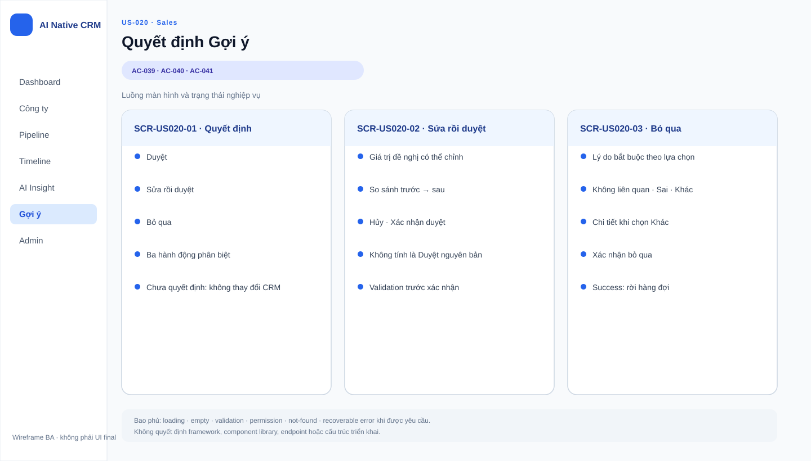

# Business Specification — US-020: Decide a proposal
## 1. Document Information
| Field | Value |
|---|---|
| Story / feature | `US-020` / `FEAT-020` (D3) |
| Status / version | `AWAITING_SPECIFICATION_APPROVAL` / `1.0` |
| Sources | `REQ-303`, `REQ-305`, `BR-009`, `BR-010`, `AC-039..041` |
## 2. Purpose
**[CONFIRMED — REQ-303]** Give Sales control over whether a proposal changes CRM data.
## 3. User Story
**[CONFIRMED — US-020]** As Sales, I want to approve, edit-and-approve, or discard a proposal so that I control data entering the profile.
## 4. Business Goal
**[CONFIRMED — US-020]** Human review precedes any proposal-led CRM change.
## 5. Scope
**[CONFIRMED — AC-039..041]** Approve applies the proposed change; edit-and-approve applies edited content and records an edit; discard requires one of five reasons with no more actions than approve.
## 6. Out of Scope
**[CONFIRMED — REQ-301..302,304,306..308]** Generation/card display, non-decision behavior, decision audit, suppression, and badges belong to US-018/019/021/022 and deferred stories.
## 7. Actor / Permission
| Actor | Permission | Evidence |
|---|---|---|
| Sales | Decide a pending proposal. | **[CONFIRMED]** AC-039..041 |
| A-AI | May propose but may not decide or auto-apply. | **[CONFIRMED]** REQ-304; BR-017 |
## 8. Business Rules
| ID | Rule | Evidence |
|---|---|---|
| BR-US020-01 | Approval applies the change and records `approved`. | **[CONFIRMED]** AC-039 |
| BR-US020-02 | Edit-and-approve applies edited content and records `edited`, not `approved`. | **[CONFIRMED]** REQ-305; BR-010; AC-040 |
| BR-US020-03 | Discard needs a reason from {incorrect, correct-but-irrelevant, outdated, misunderstood-context, other}; its actions are no more than approval. | **[CONFIRMED]** REQ-303; BR-009; AC-041 |
| BR-US020-04 | A proposal without human approval must not change CRM data. | **[CONFIRMED]** REQ-304 |
## 9. Business Data Dictionary
| Data | Meaning | Evidence |
|---|---|---|
| Proposal | Pending suggested CRM/timeline change. | **[CONFIRMED]** REQ-301 |
| Decision | Approved, edited-and-approved, or discarded outcome. | **[CONFIRMED]** AC-039..041 |
| Discard reason | Required classification for discard. | **[CONFIRMED]** BR-US020-03 |
## 10. Business Flow
**[CONFIRMED — AC-039..041]** Sales opens a proposal, chooses approve, edits then approves, or discards with a listed reason; only either approval path applies a change.
## 11. Acceptance Criteria
### AC-039 — Approve
```gherkin
Given a proposal When Sales approves Then its change is applied and recorded as approved.
```
### AC-040 — Edit then approve
```gherkin
Given a proposal When Sales edits then approves Then edited content is applied and recorded as edited, not approved.
```
### AC-041 — Discard
```gherkin
Given a proposal When Sales discards Then a listed reason is chosen and discard needs no more actions than approval.
```
## 12. Screen Specification
**[CONFIRMED — AC-039..041]** The proposal area exposes all three decisions, editing before approval, and the required discard reasons.
## 13. Screen Design

> **UI-DESIGN UPDATE — 2026-08-14:** Wireframe BA dưới đây được tạo từ các US/AC hiện hành và thay thế trạng thái “chưa có asset” được ghi nhận trước bước UI Design.


No approved asset exists. **[ASSUMPTION — A-020-01]** Interaction presentation is UX-owned while preserving the action-count constraint.
## 14. Screen States
| State | Outcome | Evidence |
|---|---|---|
| Approved | Proposed change applied. | **[CONFIRMED]** AC-039 |
| Edited and approved | Edited change applied; separate count. | **[CONFIRMED]** AC-040 |
| Discarded | Reason selected; no CRM change. | **[CONFIRMED]** AC-041; REQ-304 |
## 15. Validation
**[CONFIRMED — BR-US020-03]** Discard cannot complete without a permitted reason; values/content validation is **[OPEN QUESTION — Q-020-01]**.
## 16. Dependencies
**[CONFIRMED]** US-019 supplies an inspectable proposal; US-022 records decision history; US-040 guardrails apply to AI, while this is a human action.
## 17. Business-level NFR Expectations
**[CONFIRMED — REQ-304]** No automatic approval/application. **[OPEN QUESTION — Q-020-02]** No decision response-time target is specified.
## 18. Test Scenarios
| ID | Scenario | AC / rule |
|---|---|---|
| TC-020-01 | Approve a proposal. | AC-039; BR-US020-01 |
| TC-020-02 | Edit then approve. | AC-040; BR-US020-02 |
| TC-020-03 | Discard with each permitted reason. | AC-041; BR-US020-03 |
## 19. Traceability
`REQ-303 → EPIC-06 → FEAT-020 → US-020 → AC-039 → TC-020-01`; `REQ-305 → FEAT-020 → US-020 → AC-040 → TC-020-02`; `REQ-303 → FEAT-020 → US-020 → AC-041 → TC-020-03`. **[CONFIRMED — architect handoff]**
## 20. Assumptions
**[ASSUMPTION — A-020-01]** UX determines visual controls without adding decisions or reasons.
## 21. Open Questions
`Q-020-01`: Are edited proposal contents subject to any additional business validation? `Q-020-02`: Is a decision time target required? **[OPEN QUESTION — PO]**
## 22. Definition of Ready
**READY. [CONFIRMED — dor-review]** Actor, AC-039..041, dependencies, and `REQ→FEAT→US→AC→TC` are known; Q-020-01..002 do not change AC.
## 23. Technical Handoff
**[CONFIRMED — REQ-303..305]** Preserve separate approval/edit accounting, required discard reasons, and no auto-apply. Do not add endpoints, schemas, migrations, source tasks, monitoring, telemetry, log shipping, or prompt logs. Tech Lead must retain `AutomationPolicyGuard` for automation paths.
## 24. Change Log
| Version | Date | Change | Author/Approver |
|---|---|---|---|
| 1.0 | 2026-08-14 | Created US-020 specification. | Codex / awaiting human specification approval |
