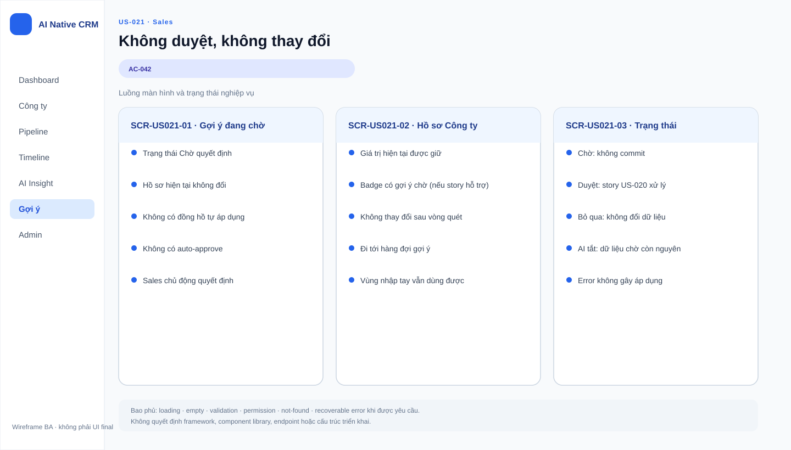

# Business Specification — US-021: Không-duyệt-không-đổi

## 1. Document Information
| Field | Value |
|---|---|
| Story | US-021 |
| Version | 1.0 |
| Status | AWAITING_SPECIFICATION_APPROVAL |
| Sources | REQ-304, BR-011, US-021, architect handoff, DoR review |

## 2. Purpose
**[CONFIRMED — REQ-304]** Đảm bảo gợi ý không làm thay đổi hồ sơ khi Sales chưa quyết định.

## 3. User Story
**[CONFIRMED — US-021]** As a Sales, I want hồ sơ không đổi khi tôi chưa duyệt, so that tôi giữ toàn quyền với dữ liệu của mình.

## 4. Business Goal
**[CONFIRMED — REQ-304]** Duy trì human-in-the-loop thật: gợi ý là đề nghị, không phải lệnh tự thực hiện.

## 5. Scope
- **[CONFIRMED — AC-042]** Sau ít nhất ba chu kỳ vòng quét, một gợi ý không được thao tác không tự áp dụng, không tự hết hạn thành hành động, không tự duyệt.
- **[CONFIRMED — BR-011]** Bảo vệ hồ sơ công ty khỏi mọi thay đổi tự động từ gợi ý chưa duyệt.

## 6. Out of Scope
- **[CONFIRMED — REQ-301]** Sinh gợi ý; US-018.
- **[CONFIRMED — REQ-303, REQ-305]** Duyệt, sửa-rồi-duyệt, bỏ; US-020.
- **[CONFIRMED — REQ-401..406]** Tự đặt/hoàn tác Việc tiếp theo là luồng riêng, không phải auto-apply gợi ý.

## 7. Actor / Permission
| Actor | Business permission | Evidence |
|---|---|---|
| Sales | Giữ quyền quyết định; không hành động thì hồ sơ giữ nguyên. | **[CONFIRMED]** US-021, AC-042 |
| A-AI | Không tự áp dụng, tự duyệt hoặc biến hết hạn thành hành động. | **[CONFIRMED]** REQ-304, BR-011 |

## 8. Business Rules
| ID | Rule | Evidence |
|---|---|---|
| BR-US021-01 | Không duyệt nghĩa là không đổi hồ sơ. | **[CONFIRMED]** REQ-304, AC-042 |
| BR-US021-02 | Gợi ý không được tự áp dụng qua thời gian hoặc chu kỳ vòng quét. | **[CONFIRMED]** AC-042, BR-011 |
| BR-US021-03 | Không có chế độ tự duyệt. | **[CONFIRMED]** AC-042, BR-011 |
| BR-US021-04 | Ranh giới này không cấp quyền AI tự đổi stage/tiền/liên hệ/xóa dữ liệu. | **[CONFIRMED]** BR-017 |

## 9. Business Data Dictionary
| Business data | Meaning | Rule | Evidence |
|---|---|---|---|
| Gợi ý | Proposal chờ Sales quyết định. | Không phải thay đổi hồ sơ. | **[CONFIRMED]** REQ-301, REQ-304 |
| Hồ sơ công ty | Dữ liệu Sales có thể bị tác động bởi gợi ý sau duyệt. | Giữ nguyên khi chưa duyệt. | **[CONFIRMED]** AC-042 |
| Chu kỳ vòng quét | Một lần hoạt động của vòng tự chủ. | Ba chu kỳ không làm gợi ý tự áp dụng. | **[CONFIRMED]** AC-042 |

## 10. Business Flow
### BF-021-01 — Không thao tác gợi ý
1. **[CONFIRMED — AC-042]** Hệ thống đã sinh một gợi ý.
2. **[CONFIRMED — AC-042]** Sales không thao tác.
3. **[CONFIRMED — AC-042]** Ít nhất ba chu kỳ vòng quét trôi qua.
4. **[CONFIRMED — AC-042]** Hồ sơ vẫn y nguyên; gợi ý không tự áp dụng, tự hết hạn thành hành động hay tự duyệt.

## 11. Acceptance Criteria
### AC-042 — Không làm gì sau ≥3 chu kỳ
```gherkin
Scenario: Không làm gì sau ít nhất ba chu kỳ
  Given một gợi ý được sinh ra và tôi không thao tác
  When ít nhất ba chu kỳ vòng quét trôi qua
  Then hồ sơ công ty vẫn y nguyên; gợi ý không tự áp dụng, không tự hết hạn thành hành động và không tự duyệt.
```

## 12. Screen Specification
| Area | Required behavior | Evidence |
|---|---|---|
| Hàng đợi gợi ý | Gợi ý chưa được quyết định không được biến thành thay đổi tự động. | **[CONFIRMED]** AC-042 |
| Hồ sơ công ty | Không đổi chỉ vì thời gian/chạy vòng quét. | **[CONFIRMED]** REQ-304 |

## 13. Screen Design

> **UI-DESIGN UPDATE — 2026-08-14:** Wireframe BA dưới đây được tạo từ các US/AC hiện hành và thay thế trạng thái “chưa có asset” được ghi nhận trước bước UI Design.


Không có asset wireframe được phê duyệt. **[ASSUMPTION — A-021-01]** Cách thể hiện gợi ý đang chờ do UX quyết định; không được ngụ ý rằng hệ thống đã áp dụng.

## 14. Screen States
| State | Outcome | Evidence |
|---|---|---|
| Gợi ý chờ, chưa thao tác | Hồ sơ giữ nguyên. | **[CONFIRMED]** REQ-304 |
| Qua ít nhất ba chu kỳ | Vẫn giữ nguyên; không tự duyệt. | **[CONFIRMED]** AC-042 |
| Gợi ý được Sales duyệt | Hành vi thuộc US-020, không phải story này. | **[CONFIRMED]** REQ-303 |

## 15. Validation
| Condition | Response | Evidence |
|---|---|---|
| Không có thao tác Sales | Không tự áp dụng dưới mọi chu kỳ quan sát. | **[CONFIRMED]** AC-042 |
| Gợi ý quá lâu hơn ba chu kỳ | Không có quy tắc xóa/ẩn/trạng thái riêng. | **[OPEN QUESTION]** Q-021-01 |

## 16. Dependencies
| Direction | Item | Dependency | Evidence |
|---|---|---|---|
| Upstream | US-018 | Cung cấp gợi ý để chờ duyệt. | **[CONFIRMED]** US-021 dependency |
| Related | US-020 | Cung cấp hành vi khi Sales chọn quyết định. | **[CONFIRMED]** REQ-303 |
| Related | US-031 | Cung cấp chu kỳ quan sát trong AC-042. | **[CONFIRMED]** AC-042 |

## 17. Business-level NFR Expectations
- **[CONFIRMED — REQ-304]** Quyền kiểm soát của Sales không phụ thuộc thời gian hoặc vòng quét.
- **[CONFIRMED — BR-017]** Automation vẫn phải qua AutomationPolicyGuard và không vượt ranh giới cứng.
- **[INFERRED — AC-042]** Nếu mỗi đường tự động không cùng tôn trọng trạng thái chờ duyệt, Sales có thể mất niềm tin vào dữ liệu hồ sơ.

## 18. Test Scenarios
| TC | Business scenario | AC / rule | Expected result |
|---|---|---|---|
| TC-021-01 | Không thao tác một gợi ý trong ba chu kỳ. | AC-042, BR-US021-01..03 | Hồ sơ y nguyên, gợi ý không tự áp dụng/dự duyệt. |
| TC-021-02 | Kiểm tra gợi ý sau nhiều hơn ba chu kỳ. | BR-011 | Không có tự hết hạn thành hành động. |

## 19. Traceability
| Chain | Evidence |
|---|---|
| `REQ-304 → EPIC-06 → FEAT-021 → US-021 → AC-042 → TC-021-01..02 (T-4)` | **[CONFIRMED]** architect handoff |
| `BR-011 → BR-US021-01..03 → AC-042` | **[CONFIRMED]** requirement analysis |

## 20. Assumptions
| ID | Assumption | Status |
|---|---|---|
| A-021-01 | Nhãn trực quan của gợi ý chờ chưa được chốt. | **[ASSUMPTION]** Không thay đổi nguyên tắc không-duyệt-không-đổi. |

## 21. Open Questions
| ID | Question | Owner / impact |
|---|---|---|
| Q-021-01 | Gợi ý chờ rất lâu có bị ẩn/xóa/đánh dấu theo chính sách nào không? | PO; không tự tạo expiry. |

## 22. Definition of Ready
| DoR item | Status | Evidence |
|---|---|---|
| Actor, giá trị và scope rõ | READY | US-021, REQ-304 |
| AC quan sát được | READY | AC-042 |
| Dependencies xác định | READY | US-018, US-020, US-031 |
| Traceability rõ | READY | REQ → FEAT → US → AC → TC |
| Human approval | AWAITING_SPECIFICATION_APPROVAL | Gate 1 |

## 23. Technical Handoff
**[CONFIRMED — REQ-304, BR-011]** Bất cứ Proposal chưa có quyết định Sales nào đều không thể tự ghi vào hồ sơ, dù qua nhiều chu kỳ. **[CONFIRMED — BR-017]** Automation phải qua AutomationPolicyGuard. Tech Lead cần bảo toàn invariant này ở mọi đường gọi, không tự suy diễn lifecycle cho gợi ý cũ.

## 24. Change Log
| Version | Date | Change | Author/Approver |
|---|---|---|---|
| 1.0 | 2026-08-14 | Tạo specification 24 mục cho US-021. | Codex / awaiting human specification approval |
