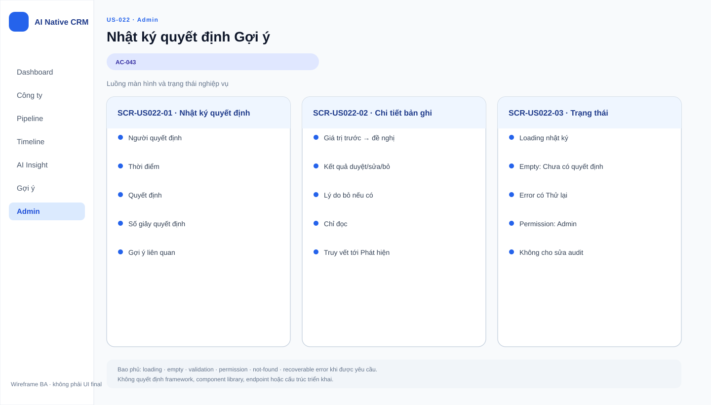

# Business Specification — US-022: Proposal decision history and decision time
## 1. Document Information
| Field | Value |
|---|---|
| Story / feature | `US-022` / `FEAT-022` (D3) |
| Status / sources | `AWAITING_SPECIFICATION_APPROVAL`; `REQ-306`, `AC-043`, `AS-05` |
## 2. Purpose
**[CONFIRMED — REQ-306]** Preserve proposal decisions and measure time from opening to decision.
## 3. User Story
**[CONFIRMED — US-022]** As Admin, I want every proposal and decision recorded with decision time so that I can measure quality and trust.
## 4. Business Goal
**[CONFIRMED — US-022]** Admin has functional decision history to assess human use of proposals.
## 5. Scope
Record proposal content, decider, time, decision, discard reason where applicable, and seconds from open to click. **[CONFIRMED — AC-043]**
## 6. Out of Scope
Making decisions is US-020; proposal display is US-019; external telemetry/log shipping and prompt logs are prohibited. **[CONFIRMED — project rules]**
## 7. Actor / Permission
Sales makes decisions; Admin accesses the recorded history. **[CONFIRMED — AC-043; US-022]**
## 8. Business Rules
`BR-US022-01`: every proposal/decision records specified fields. `BR-US022-02`: decision time is open→click seconds. `BR-US022-03`: discard includes reason. **[CONFIRMED — REQ-306; AC-043; AS-05]**
## 9. Business Data Dictionary
Decision record; proposal content; decider; decision timestamp; decision; discard reason; decision seconds. **[CONFIRMED — REQ-306]**
## 10. Business Flow
Sales opens then decides a proposal; the complete decision record is retained for Admin. **[CONFIRMED — AC-043]**
## 11. Acceptance Criteria
### AC-043 — Record a decision
```gherkin
Given Sales opens and decides a proposal When Sales approves, edits-and-approves, or discards Then proposal content, decider, time, decision, discard reason if any, and open-to-click seconds are recorded.
```
## 12. Screen Specification
Admin can access functional decision records with the AC-043 fields. **[CONFIRMED — US-022]**
## 13. Screen Design

> **UI-DESIGN UPDATE — 2026-08-14:** Wireframe BA dưới đây được tạo từ các US/AC hiện hành và thay thế trạng thái “chưa có asset” được ghi nhận trước bước UI Design.


No approved asset. **[ASSUMPTION — A-022-01]** Record presentation is UX-owned, not an observability dashboard.
## 14. Screen States
Proposal opened; decision recorded; discarded decision includes reason. **[CONFIRMED — AC-043]**
## 15. Validation
Discard reason is required; timing behavior for reopened proposals is **[OPEN QUESTION — Q-022-01]**.
## 16. Dependencies
US-020 produces decisions; US-019 provides view context. **[CONFIRMED — US-022 dependency]**
## 17. Business-level NFR Expectations
This is CRM functional audit, not monitoring, telemetry, log shipping, or prompt logging. **[CONFIRMED — architecture/project rules]**
## 18. Test Scenarios
| ID | Scenario | AC / rule |
|---|---|---|
| TC-022-01 | Approve a viewed proposal. | AC-043; BR-US022-01..02 |
| TC-022-02 | Discard a viewed proposal. | AC-043; BR-US022-01..03 |
## 19. Traceability
`REQ-306 → EPIC-06 → FEAT-022 → US-022 → AC-043 → TC-022-01..02`. **[CONFIRMED — architect handoff]**
## 20. Assumptions
`A-022-01`: visual presentation is separate from monitoring. **[ASSUMPTION]**
## 21. Open Questions
`Q-022-01`: Does reopening reset, resume, or retain the decision-time clock? **[OPEN QUESTION — PO]**
## 22. Definition of Ready
**READY. [CONFIRMED — dor-review]**
## 23. Technical Handoff
Preserve specified business audit fields and open-to-click measure. No endpoints, schemas, migrations, coding tasks, monitoring, telemetry, log shipping, or prompt logs; do not bypass `AutomationPolicyGuard` for automated paths. **[CONFIRMED — project rules]**
## 24. Change Log
| Version | Date | Change | Author/Approver |
|---|---|---|---|
| 1.0 | 2026-08-14 | Created US-022 specification. | Codex / awaiting human specification approval |
