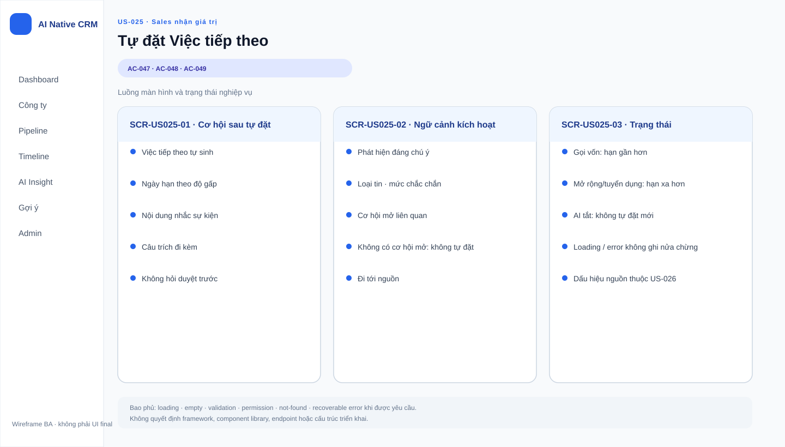

# Business Specification — US-025: Tự điền Việc tiếp theo theo độ gấp

> Evidence labels: **CONFIRMED** = yêu cầu/AC nêu trực tiếp; **INFERRED** = suy luận có dẫn chiếu; **ASSUMPTION** = tạm thời, cần người duyệt; **OPEN QUESTION** = thiếu thông tin, ký hiệu `Q-xxx`.

## 1. Document Information

| Field | Value |
|---|---|
| Story | US-025 — Tự điền Việc tiếp theo theo độ gấp |
| Feature / Epic | FEAT-025 / EPIC-07 |
| Version | 1.0 |
| Status | **AWAITING_SPECIFICATION_APPROVAL** |
| Date | 2026-08-14 |
| Sources | **CONFIRMED:** PRD §4 Nhóm 4, §5, §6 T-6; requirement-analysis REQ-401..403, BR-004, BR-006, BR-007, BR-012, BR-017; user-stories US-025/AC-047..049; function-decomposition FEAT-025; backlog-prioritization; dor-review; architect-handoff; architecture; project-rules. |

## 2. Purpose

**CONFIRMED:** Đặc tả hành vi nghiệp vụ để A-AI tự điền Việc tiếp theo và ngày hạn ngay khi một phát hiện đáng chú ý xuất hiện cho công ty có cơ hội mở, giúp Sales hành động trong đúng cửa sổ thời gian. Tài liệu không quyết định API, lưu trữ, cấu trúc mã hay công việc triển khai.

## 3. User Story

**CONFIRMED:** *As a* Tác nhân AI tự chủ (A-AI), *I want* tự điền Việc tiếp theo và ngày hạn cho cơ hội mở khi có tín hiệu đáng chú ý, *so that* Sales liên hệ đúng cửa sổ thời gian mà không phải chờ mở hàng đợi.

## 4. Business Goal

- **CONFIRMED:** Rút ngắn độ trễ phản hồi Sales đối với một tín hiệu quan trọng của công ty đang có cơ hội mở.
- **CONFIRMED:** Nội dung tự điền phải cho Sales thấy sự kiện kích hoạt và câu trích bằng chứng, thay vì chỉ một lời nhắc mơ hồ.
- **CONFIRMED:** Độ sát của hạn phải khác theo loại tín hiệu, không dùng một hạn cố định cho mọi tình huống.

## 5. Scope

- **CONFIRMED:** Phản ứng ngay khi phát hiện đáng chú ý được sinh cho công ty có ít nhất một cơ hội mở.
- **CONFIRMED:** Tự điền cả Việc tiếp theo và ngày hạn, không chờ người phê duyệt.
- **CONFIRMED:** Nội dung Việc tiếp theo nhắc sự kiện kích hoạt và chứa chính câu trích của phát hiện.
- **CONFIRMED:** Áp dụng độ gấp theo loại tín hiệu theo AC-048 và Q-04 được tham chiếu trong US-025.
- **CONFIRMED:** Không tự điền nếu công ty không có cơ hội mở.
- **CONFIRMED:** Luồng là một phần của nghiệm thu T-6 cùng với chuyển nguồn trước→sau, dấu hiệu ô hệ thống và thông báo trong sản phẩm.

## 6. Out of Scope

- **CONFIRMED:** Đánh dấu hiển thị rằng ô do hệ thống đặt và chính sách không đè Việc tiếp theo do người nhập tay chưa tới hạn — US-026 / REQ-404, REQ-409.
- **CONFIRMED:** Thông báo cho người sở hữu và thời điểm thông báo được xem — US-027 / REQ-405.
- **CONFIRMED:** Hoàn tác, thời hạn bảy ngày và ghi nhận hoàn tác — US-028 / REQ-406, BR-013.
- **CONFIRMED:** Ghi vết lần tự đặt và số liệu Quản trị — US-029 / REQ-407, REQ-408.
- **CONFIRMED:** Sinh bản lưu hay phát hiện; US-025 chỉ sử dụng phát hiện đã hợp lệ từ US-011 và US-013.
- **CONFIRMED:** Tự đổi giai đoạn, Thắng/Thua, giá trị cơ hội, liên hệ khách hoặc xoá dữ liệu do người tạo — BR-017 cấm tuyệt đối.

## 7. Actor / Permission

| Actor | Business permission / limitation |
|---|---|
| A-AI | **CONFIRMED:** Là tác nhân nội bộ thực hiện tự điền trong vùng tự chủ được phép; chỉ được hành động theo chính sách Next Step và các ranh giới BR-017. |
| Sales | **CONFIRMED:** Nhận giá trị nghiệp vụ để thực hiện liên hệ; không phải người phê duyệt trước hành động US-025. Quyền nhận thông báo và hoàn tác thuộc US-027/US-028. |
| Admin | **INFERRED:** Không có thao tác trực tiếp trong US-025; quản trị trạng thái AI thuộc US-037 và số liệu thuộc REQ-601. |

## 8. Business Rules

| ID | Rule |
|---|---|
| BR-025-01 | **CONFIRMED — REQ-401/BR-012:** Chỉ tự điền khi công ty có từ một cơ hội mở trở lên. “Mở” là các giai đoạn trong BR-004. |
| BR-025-02 | **CONFIRMED — REQ-402:** Việc tiếp theo tự điền phải nhắc sự kiện kích hoạt và kèm đúng câu trích của phát hiện. |
| BR-025-03 | **CONFIRMED — REQ-403:** Ngày hạn phản ánh độ gấp theo loại tín hiệu, không cố định. |
| BR-025-04 | **CONFIRMED — Q-03, US-025/AC-047:** Tín hiệu đáng chú ý là gọi vốn, nhân sự cấp cao, mở rộng hoặc tuyển dụng, với mức chắc chắn Chắc hoặc Có thể. |
| BR-025-05 | **CONFIRMED — Q-04, US-025/AC-048:** Mốc hạn là gọi vốn +2 ngày, nhân sự cấp cao +5 ngày, mở rộng +10 ngày, tuyển dụng +10 ngày; mảng kinh doanh mới/khác +14 ngày. |
| BR-025-06 | **CONFIRMED — BR-006:** Phát hiện thiếu câu trích không hợp lệ, nên không được làm căn cứ cho nội dung tự điền. |
| BR-025-07 | **CONFIRMED — BR-017:** Tự điền Next Step không được kéo theo việc tự đổi giai đoạn, giá trị tiền, trạng thái Thắng/Thua, liên hệ khách hoặc xoá dữ liệu do người tạo. |

## 9. Business Data Dictionary

| Business data | Meaning and rule |
|---|---|
| Công ty | **CONFIRMED:** Chủ thể của phát hiện và cơ hội; điều kiện đầu vào là công ty có ít nhất một cơ hội mở. |
| Cơ hội mở | **CONFIRMED:** Cơ hội ở một trong các giai đoạn mở của BR-004; là mục tiêu nhận Việc tiếp theo và ngày hạn. |
| Phát hiện kích hoạt | **CONFIRMED:** Phát hiện hợp lệ thuộc công ty qua bản lưu, có loại tin, mức chắc chắn và câu trích; không gắn trực tiếp vào cơ hội. |
| Loại tín hiệu | **CONFIRMED — Q-03/Q-04, AC-047/AC-048:** Phân loại xác định tính đáng chú ý và độ gấp theo quyết định đã được phê duyệt trong user story. |
| Việc tiếp theo | **CONFIRMED:** Câu mô tả việc sắp làm cho cơ hội; giá trị tự điền phải nói đến sự kiện kích hoạt và câu trích. |
| Ngày hạn | **CONFIRMED:** Ngày Sales cần hoàn thành Việc tiếp theo; được xác định theo độ gấp loại tín hiệu. |
| Câu trích | **CONFIRMED:** Đoạn nguyên văn làm bằng chứng cho phát hiện và phải xuất hiện cùng nội dung tự điền. |

## 10. Business Flow

### BF-025-01 — Tự điền cho công ty có cơ hội mở

1. **CONFIRMED:** Một phát hiện hợp lệ được sinh cho công ty.
2. **CONFIRMED — Q-03/AC-047:** Hệ thống đánh giá phát hiện là đáng chú ý theo nhóm loại tin và mức chắc chắn đã nêu.
3. **CONFIRMED:** Hệ thống xác định công ty có ít nhất một cơ hội mở.
4. **CONFIRMED:** Hệ thống tự điền Việc tiếp theo và ngày hạn ngay, không hỏi hay chờ duyệt.
5. **CONFIRMED:** Việc tiếp theo nêu sự kiện kích hoạt và kèm câu trích.
6. **CONFIRMED — Q-04/AC-048:** Ngày hạn được tính theo độ gấp của loại tín hiệu.
7. **CONFIRMED:** Các hành vi liên quan dấu hiệu hệ thống, thông báo, hoàn tác và audit được chuyển sang các story phụ thuộc US-026..029; chúng không mở rộng quy tắc của US-025.

### BF-025-02 — Không có cơ hội mở

1. **CONFIRMED:** Một phát hiện đáng chú ý xuất hiện cho công ty.
2. **CONFIRMED:** Hệ thống xác định công ty không có cơ hội mở.
3. **CONFIRMED:** Không tự đặt Việc tiếp theo hoặc ngày hạn.

## 11. Acceptance Criteria

### AC-047 — Tự đặt khi có cơ hội mở (T-6)

```gherkin
Scenario: Tự đặt Việc tiếp theo từ phát hiện đáng chú ý
  Given một công ty có ít nhất một cơ hội mở
  And xuất hiện phát hiện đáng chú ý thuộc gọi vốn, nhân sự cấp cao, mở rộng hoặc tuyển dụng
  And mức chắc chắn của phát hiện là Chắc hoặc Có thể
  When phát hiện được sinh ra
  Then hệ thống tự điền Việc tiếp theo và ngày hạn cho cơ hội ngay, không hỏi ai
  And nội dung nhắc sự kiện kích hoạt và kèm chính câu trích
```

**Evidence: CONFIRMED** — AC-047; các loại tín hiệu và mức chắc chắn được trình bày theo chính AC này.

### AC-048 — Ngày hạn phản ánh độ gấp

```gherkin
Scenario: Hạn gọi vốn sát hơn hạn mở rộng hoặc tuyển dụng
  Given phát hiện gọi vốn và phát hiện mở rộng hoặc tuyển dụng
  When hệ thống đặt ngày hạn
  Then hạn của gọi vốn sát hơn hạn của mở rộng hoặc tuyển dụng
```

**Evidence: CONFIRMED** — AC-048 nêu bảng độ gấp đã duyệt Q-04; user-stories ghi Q-04 là “(duyệt)”.

### AC-049 — Không có cơ hội mở thì không tự đặt

```gherkin
Scenario: Không tự đặt khi công ty không có cơ hội mở
  Given một công ty không có cơ hội mở nào
  When có phát hiện đáng chú ý
  Then hệ thống không tự đặt Việc tiếp theo
  And hệ thống không tự đặt ngày hạn
```

**Evidence: CONFIRMED** — AC-049; “ngày hạn” được làm rõ vì REQ-401 yêu cầu hai giá trị được đặt cùng nhau.

## 12. Screen Specification

| Screen / area | Business information required |
|---|---|
| Chi tiết cơ hội | **CONFIRMED:** Hiển thị Việc tiếp theo và ngày hạn là dữ liệu nghiệp vụ của cơ hội theo REQ-109; US-025 thay đổi hai giá trị này khi đủ điều kiện. |
| Bề mặt hiển thị hành động tự động | **CONFIRMED:** T-6 yêu cầu ô mang dấu hiệu do hệ thống đặt và có thông báo; đặc tả thành phần/dấu hiệu thuộc US-026 và US-027. |
| Nguồn phát hiện | **CONFIRMED:** Câu trích là chứng cứ cho nội dung tự điền; vùng xem phát hiện/provenance thuộc US-015/US-016. |

## 13. Screen Design

> **UI-DESIGN UPDATE — 2026-08-14:** Wireframe BA dưới đây được tạo từ các US/AC hiện hành và thay thế trạng thái “chưa có asset” được ghi nhận trước bước UI Design.



**OPEN QUESTION Q-025-01:** Chưa có asset/wireframe đã được phê duyệt cho US-025. Vì vậy không nhúng thiết kế cục bộ và không suy đoán bố cục, nhãn hay màu. Thiết kế màn hình phải bảo toàn các thông tin nghiệp vụ ở Mục 12 và phối hợp với US-026, US-027, US-028.

## 14. Screen States

| State | Expected business presentation |
|---|---|
| Đã tự điền | **CONFIRMED:** Việc tiếp theo và ngày hạn phản ánh kết quả tự động; trạng thái phân biệt ô hệ thống được US-026 quy định. |
| Không đủ điều kiện | **CONFIRMED:** Khi không có cơ hội mở, không xuất hiện giá trị tự điền do US-025. |
| Phát hiện không hợp lệ | **CONFIRMED:** Thiếu câu trích thì không là căn cứ hợp lệ theo BR-006. |
| AI tắt | **CONFIRMED:** Không tự đặt Việc tiếp theo; hành vi và thông báo trạng thái thuộc US-037/US-038. |

## 15. Validation

- **CONFIRMED:** Chỉ phát hiện có câu trích hợp lệ mới đủ điều kiện làm căn cứ (BR-006).
- **CONFIRMED:** Công ty phải có ít nhất một cơ hội mở (REQ-401, BR-012).
- **CONFIRMED — Q-03/AC-047:** Chỉ bốn nhóm tín hiệu và hai mức chắc chắn đã nêu mới kích hoạt tự điền.
- **CONFIRMED:** Nếu không có cơ hội mở, phải từ chối hành vi tự đặt thay vì tạo dữ liệu ở thực thể khác (AC-049).
- **CONFIRMED:** Các giới hạn không đè Next Step nhập tay là validation của US-026; không được giả định rằng US-025 thay thế quy tắc đó.

## 16. Dependencies

| Dependency | Why it matters |
|---|---|
| US-008 | **CONFIRMED:** Cung cấp khái niệm Việc tiếp theo và ngày hạn của cơ hội. |
| US-013 | **CONFIRMED:** Cung cấp phát hiện có loại tin, mức chắc chắn và câu trích hợp lệ. |
| US-003 / BR-004 | **INFERRED:** Cần trạng thái cơ hội để xác định “mở”. |
| US-026..029 | **CONFIRMED:** Cung cấp dấu hiệu, không đè tay, thông báo, hoàn tác và audit; T-6 chạm US-026/US-027. |
| US-037 | **CONFIRMED:** Kill switch phải dừng mọi hoạt động AI, gồm tự đặt Việc tiếp theo. |
| US-041 | **CONFIRMED:** Test-harness chuyển nguồn trước→sau kích hoạt T-6. |

## 17. Business-level NFR Expectations

- **CONFIRMED:** Hành động phải diễn ra “ngay”, không cần người chờ duyệt (REQ-401); không có ngưỡng thời gian định lượng được nguồn cung cấp.
- **CONFIRMED:** AI bị tắt không được tự đặt thêm; dữ liệu đã sinh không bị xoá (REQ-603, project-rules 5).
- **CONFIRMED:** Bằng chứng câu trích phải duy trì để Sales có thể hiểu lý do hành động (REQ-402, BR-006).
- **CONFIRMED:** Ba ranh giới AI và cấm xoá dữ liệu người tạo vẫn áp dụng cả khi tự động hóa được kích hoạt (BR-017).

## 18. Test Scenarios

**CONFIRMED:** Nguồn hiện chỉ có kịch bản nghiệp vụ AC-047..049 và nghiệm thu T-6; chưa có artifact `test-scenarios.md` riêng cho US-025 để liên kết. QC sẽ cần tạo scenario nghiệp vụ truy vết AC-047, AC-048, AC-049 và BR-012 sau Gate 1; tài liệu này không chứa kiểm thử thực thi.

## 19. Traceability

| Source | Evidence | Specification coverage | Downstream scenario |
|---|---|---|---|
| REQ-401 | **CONFIRMED:** Phát hiện đáng chú ý + ≥1 cơ hội mở → tự điền ngay | 5, 8, 9, 10, 11, 15 | AC-047, AC-049; T-6 |
| REQ-402 | **CONFIRMED:** Nêu sự kiện + câu trích | 8, 9, 10, 11 | AC-047; T-6 |
| REQ-403 | **CONFIRMED:** Hạn theo độ gấp loại tín hiệu | 8, 9, 10, 11 | AC-048; T-6 |
| BR-012 | **CONFIRMED:** Chỉ công ty có cơ hội mở; không đè tay chưa tới hạn | 8, 15, 16 | AC-047, AC-049; US-026 |
| BR-006 / BR-007 | **CONFIRMED:** Claim có provenance và mức chắc chắn | 8, 9, 14, 15 | AC-047; US-013 |
| BR-017 | **CONFIRMED:** Ranh giới tự động hóa cứng | 6, 8, 17, 23 | T-10 (ràng buộc chéo) |
| AC-047..049 | **CONFIRMED:** AC nguồn của US-025 | 11 | T-6 |
| Q-03 / Q-04 | **CONFIRMED:** Quyết định tín hiệu đáng chú ý và mốc hạn cụ thể, được user story/AC tham chiếu là đã duyệt | 8, 9, 10, 11, 15 | AC-047, AC-048 |

## 20. Assumptions

| ID | Assumption | Basis / approval needed |
|---|---|---|
| — | Không có giả định nghiệp vụ đang mở cho Q-03/Q-04. | **CONFIRMED:** User-stories ghi hai quyết định “(duyệt)”; AC-048 gọi Q-04 là bảng độ gấp đã duyệt; US-025 có DoR READY trong backlog PO APPROVED. Các điều chưa rõ được giữ tại Q-025-01..03. |

## 21. Open Questions

| ID | Question | Impact |
|---|---|---|
| Q-025-01 | Bố cục, nhãn và cách thể hiện Việc tiếp theo do hệ thống đặt là gì? | Cần phối hợp US-026/US-027 để hoàn thiện UX; không đổi nghiệp vụ US-025. |
| Q-025-02 | Với nhiều cơ hội mở của cùng công ty, phát hiện sẽ áp dụng cho một, nhiều hay cơ hội nào? | Chặn việc diễn giải sai REQ-401 và ảnh hưởng trực tiếp giá trị bị thay đổi. |
| Q-025-03 | Ngày hạn tính từ thời điểm phát hiện được sinh hay một mốc nghiệp vụ khác? | Cần để áp dụng Q-04 một cách xác định. |

## 22. Definition of Ready

| Check | Status |
|---|---|
| Actor, giá trị nghiệp vụ, phạm vi, dependency và AC nguồn rõ | **CONFIRMED — PASS:** US-025 được `dor-review.md` đánh giá READY. |
| Traceability REQ → FEAT → US → AC → T | **CONFIRMED — PASS:** architect-handoff neo REQ-401/402/403, BR-012, AC-047..049 và T-6. |
| Ranh giới tự động hóa | **CONFIRMED — PASS:** BR-017, architecture và project-rules áp dụng. |
| Chính sách tín hiệu và mốc hạn | **CONFIRMED — PASS:** Q-03/Q-04 là quyết định đã duyệt trong user-stories; AC-048 xác nhận bảng độ gấp đã duyệt; US-025 READY trong backlog PO APPROVED. |
| Chọn cơ hội khi có nhiều cơ hội mở | **AWAITING HUMAN APPROVAL:** Q-025-02. |

**Status:** `AWAITING_SPECIFICATION_APPROVAL`. Chỉ người có thẩm quyền có thể đổi trạng thái này theo Gate 1.

## 23. Technical Handoff

- **CONFIRMED constraint:** Giữ mô hình nghiệp vụ Company → Observation → Claim; Claim có provenance bắt buộc và không gắn trực tiếp Opportunity.
- **CONFIRMED constraint:** Mọi tự động hóa phải tuân thủ `AutomationPolicyGuard` tại application service; không tạo đường bypass guardrail.
- **CONFIRMED constraint:** Kill switch phải được tôn trọng trước hành động AI; AI tắt không ảnh hưởng CRM thủ công.
- **CONFIRMED touchpoint:** Cần phối hợp ranh giới với US-008, US-013, US-026..029, US-037 và harness US-041.
- **Business risk:** Hạn sai độ gấp làm mất “right timing”; thiếu câu trích làm giảm niềm tin; chọn sai cơ hội khi có nhiều cơ hội mở sẽ tác động dữ liệu Sales.
- **Decision required:** Cần người có thẩm quyền chốt Q-025-02 và Q-025-03; Tech Lead không quyết định thay PO các quy tắc nghiệp vụ này.

## 24. Change Log

| Version | Date | Change | Author/Approver |
|---|---|---|---|
| 1.0 | 2026-08-14 | Tạo business specification 24 mục cho US-025, bảo toàn traceability và tách rõ assumption/open question. | BA — awaiting human approval |
