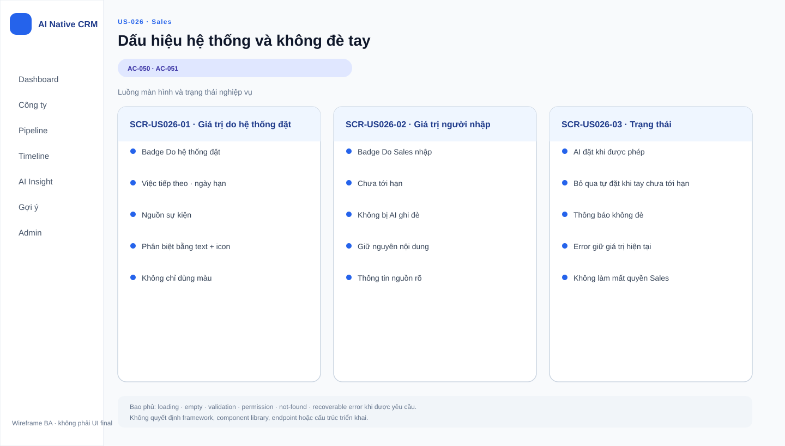

# Business Specification — US-026: Dấu hiệu hệ thống & không đè tay

## 1. Document Information
| Field | Value |
|---|---|
| Story | US-026 |
| Version | 1.0 |
| Status | AWAITING_SPECIFICATION_APPROVAL |
| Sources | REQ-404, REQ-409, BR-012, US-026, architect handoff, DoR review |

## 2. Purpose
**[CONFIRMED — REQ-404, REQ-409]** Làm rõ giá trị do A-AI đặt và bảo vệ Việc tiếp theo do Sales nhập tay chưa tới hạn.

## 3. User Story
**[CONFIRMED — US-026]** As a Sales, I want phân biệt ô do A-AI đặt và A-AI không đè lên việc tôi đang làm, so that tôi tin tưởng phần tự động.

## 4. Business Goal
**[CONFIRMED — REQ-404, REQ-409]** Giữ khả năng nhận biết nguồn gốc tự động và quyền ưu tiên công việc thủ công đang còn hiệu lực.

## 5. Scope
- **[CONFIRMED — AC-050]** Dấu hiệu phân biệt ô Việc tiếp theo do hệ thống đặt với ô người gõ.
- **[CONFIRMED — AC-051]** Không tự đặt đè Việc tiếp theo do người nhập tay chưa tới hạn dù có phát hiện đáng chú ý.

## 6. Out of Scope
- **[CONFIRMED — REQ-401..403]** Điều kiện/nội dung/ngày hạn của lần tự đặt; US-025.
- **[CONFIRMED — REQ-405..408]** Thông báo, hoàn tác và ghi lịch sử; US-027..029.
- **[CONFIRMED — BR-017]** Tự đổi stage/tiền, liên hệ khách hoặc xóa dữ liệu.

## 7. Actor / Permission
| Actor | Business permission | Evidence |
|---|---|---|
| Sales | Nhận biết giá trị do hệ thống đặt và được bảo vệ giá trị tay chưa tới hạn. | **[CONFIRMED]** AC-050..051 |
| A-AI | Có thể tự đặt theo US-025 nhưng không đè giá trị tay chưa tới hạn. | **[CONFIRMED]** AC-051, BR-012 |

## 8. Business Rules
| ID | Rule | Evidence |
|---|---|---|
| BR-US026-01 | Ô do hệ thống đặt phải có dấu hiệu phân biệt được với ô do người gõ. | **[CONFIRMED]** REQ-404, AC-050 |
| BR-US026-02 | Không tự đặt đè Next step do người nhập tay chưa tới hạn. | **[CONFIRMED]** REQ-409, AC-051 |
| BR-US026-03 | Auto next-step chỉ dành cho công ty có ít nhất một cơ hội mở. | **[CONFIRMED]** BR-012 |
| BR-US026-04 | Các automation này không được vượt các ranh giới cứng BR-017. | **[CONFIRMED]** BR-017 |

## 9. Business Data Dictionary
| Business data | Meaning | Rule | Evidence |
|---|---|---|---|
| Việc tiếp theo | Mô tả công việc tiếp theo cho cơ hội. | Có thể do Sales hoặc hệ thống đặt. | **[CONFIRMED]** REQ-109, REQ-404 |
| Ô do hệ thống đặt | Giá trị Next step do A-AI tự điền. | Phải phân biệt được. | **[CONFIRMED]** AC-050 |
| Ô do người gõ | Giá trị Next step Sales nhập tay. | Không bị A-AI đè khi chưa tới hạn. | **[CONFIRMED]** AC-051 |
| Chưa tới hạn | Trạng thái ngày hạn của giá trị tay. | Là điều kiện bảo vệ không đè. | **[CONFIRMED]** REQ-409 |

## 10. Business Flow
### BF-026-01 — Nhận biết giá trị hệ thống
1. **[CONFIRMED — AC-050]** A-AI đã đặt Việc tiếp theo.
2. **[CONFIRMED — AC-050]** Sales xem ô.
3. **[CONFIRMED — AC-050]** Sales nhận biết được đây là ô do hệ thống đặt.

### BF-026-02 — Bảo vệ giá trị tay
1. **[CONFIRMED — AC-051]** Cơ hội có Next step do Sales nhập tay và chưa tới hạn.
2. **[CONFIRMED — AC-051]** Có phát hiện đáng chú ý.
3. **[CONFIRMED — AC-051]** A-AI không tự đặt đè giá trị đó.

## 11. Acceptance Criteria
### AC-050 — Dấu hiệu phân biệt
```gherkin
Scenario: Dấu hiệu phân biệt
  Given một Việc tiếp theo do hệ thống đặt
  Then ô mang dấu hiệu phân biệt được với ô do người gõ.
```
### AC-051 — Không đè Next step tay chưa tới hạn
```gherkin
Scenario: Không đè Next step tay chưa tới hạn
  Given một cơ hội có Việc tiếp theo do người nhập tay và chưa tới hạn
  When có phát hiện đáng chú ý
  Then hệ thống không tự đặt đè lên ô đó.
```

## 12. Screen Specification
| Area | Required behavior | Evidence |
|---|---|---|
| Ô Việc tiếp theo | Hiển thị dấu hiệu đủ để phân biệt nguồn gốc tự đặt. | **[CONFIRMED]** AC-050 |
| Ô nhập tay chưa tới hạn | Không bị hiển thị/áp dụng giá trị tự động thay thế. | **[CONFIRMED]** AC-051 |

## 13. Screen Design

> **UI-DESIGN UPDATE — 2026-08-14:** Wireframe BA dưới đây được tạo từ các US/AC hiện hành và thay thế trạng thái “chưa có asset” được ghi nhận trước bước UI Design.


Không có asset wireframe được phê duyệt. **[ASSUMPTION — A-026-01]** UX sẽ chọn hình thức dấu hiệu (nhãn, biểu tượng hoặc tương đương) miễn Sales phân biệt được.

## 14. Screen States
| State | Outcome | Evidence |
|---|---|---|
| Giá trị do hệ thống đặt | Có dấu hiệu phân biệt. | **[CONFIRMED]** AC-050 |
| Giá trị tay chưa tới hạn + phát hiện đáng chú ý | Giá trị tay không bị ghi đè. | **[CONFIRMED]** AC-051 |
| Giá trị tay đã tới hạn | Hành vi tự động chưa được xác định trong story. | **[OPEN QUESTION]** Q-026-01 |

## 15. Validation
| Condition | Response | Evidence |
|---|---|---|
| Giá trị có nguồn hệ thống | Hiển thị dấu hiệu phân biệt. | **[CONFIRMED]** AC-050 |
| Giá trị tay chưa tới hạn | Chặn tự đặt đè. | **[CONFIRMED]** AC-051 |
| Không có cơ hội mở | Auto next-step không áp dụng. | **[CONFIRMED]** BR-012 |
| Giá trị tay đã tới hạn | Không tự suy diễn hành vi. | **[OPEN QUESTION]** Q-026-01 |

## 16. Dependencies
| Direction | Item | Dependency | Evidence |
|---|---|---|---|
| Upstream | US-025 | Cung cấp hành vi tự đặt Next step. | **[CONFIRMED]** US-026 dependency |
| Upstream | US-008 | Cung cấp khái niệm Việc tiếp theo/ngày hạn. | **[CONFIRMED]** REQ-109 |
| Downstream | US-028 | Hoàn tác giá trị do hệ thống đặt. | **[CONFIRMED]** REQ-406 |

## 17. Business-level NFR Expectations
- **[CONFIRMED — REQ-404]** Dấu hiệu phải đủ rõ để Sales phân biệt nguồn gốc.
- **[CONFIRMED — REQ-409]** Automation không làm mất công việc Sales đang có hạn.
- **[CONFIRMED — BR-017]** Automation bắt buộc qua AutomationPolicyGuard, không có đường tắt guardrail.
- **[INFERRED — AC-050..051]** Dấu hiệu nguồn gốc và quy tắc không đè giúp Sales kiểm tra và tin vào hành vi tự động.

## 18. Test Scenarios
| TC | Business scenario | AC / rule | Expected result |
|---|---|---|---|
| TC-026-01 | Sales mở cơ hội có Next step do hệ thống đặt. | AC-050, BR-US026-01 | Thấy dấu hiệu phân biệt với ô nhập tay. |
| TC-026-02 | Có phát hiện đáng chú ý khi Next step tay chưa tới hạn. | AC-051, BR-US026-02 | Giá trị tay vẫn nguyên. |
| TC-026-03 | Thử auto next-step cho công ty không có cơ hội mở. | BR-US026-03 | Không áp dụng auto next-step. |

## 19. Traceability
| Chain | Evidence |
|---|---|
| `REQ-404/409 → EPIC-07 → FEAT-026 → US-026 → AC-050..051 → TC-026-01..03 (T-6)` | **[CONFIRMED]** architect handoff |
| `BR-012 → BR-US026-02..03 → AC-051` | **[CONFIRMED]** requirement analysis |

## 20. Assumptions
| ID | Assumption | Status |
|---|---|---|
| A-026-01 | Hình thức dấu hiệu phân biệt chưa được quyết định. | **[ASSUMPTION]** Không giảm khả năng nhận biết. |

## 21. Open Questions
| ID | Question | Owner / impact |
|---|---|---|
| Q-026-01 | Khi Next step tay đã tới hạn, A-AI có thể thay thế theo điều kiện nào? | PO; ranh giới automation. |
| Q-026-02 | Dấu hiệu hệ thống còn hiển thị sau khi Sales sửa tay ô không? | PO; nguồn gốc giá trị. |

## 22. Definition of Ready
| DoR item | Status | Evidence |
|---|---|---|
| Actor, giá trị và scope rõ | READY | US-026, REQ-404/409 |
| AC quan sát được | READY | AC-050..051 |
| Dependencies xác định | READY | US-025, US-008, US-028 |
| Traceability rõ | READY | REQ → FEAT → US → AC → TC |
| Human approval | AWAITING_SPECIFICATION_APPROVAL | Gate 1 |

## 23. Technical Handoff
**[CONFIRMED — REQ-404, REQ-409]** Bảo toàn nguồn gốc business của giá trị tự đặt và invariant không ghi đè giá trị tay chưa tới hạn. **[CONFIRMED — BR-017]** Mọi automation phải qua AutomationPolicyGuard. Tech Lead cần giải quyết Q-026-01..02 trước khi mở rộng hành vi ngoài AC.

## 24. Change Log
| Version | Date | Change | Author/Approver |
|---|---|---|---|
| 1.0 | 2026-08-14 | Tạo specification 24 mục cho US-026. | Codex / awaiting human specification approval |
