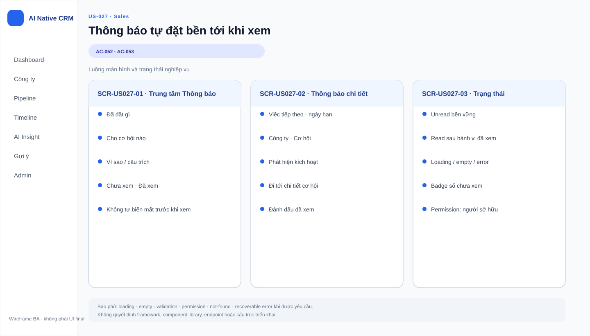

# Business Specification — US-027: Thông báo bền tới khi xem

## 1. Document Information
| Field | Value |
|---|---|
| Story | `US-027` |
| Version | `1.0` |
| Status | `AWAITING_SPECIFICATION_APPROVAL` |
| Sources | `REQ-405`, `FEAT-027`, `AC-052..053`, `Q-08`, DoR |
## 2. Purpose
**[CONFIRMED — REQ-405]** Xác định thông báo trong sản phẩm khi hệ thống tự đặt Việc tiếp theo.
## 3. User Story
**[CONFIRMED — US-027]** As a Sales, I want được báo ngay khi hệ thống tự đặt, so that tôi biết chuyện vừa xảy ra với cơ hội của mình.
## 4. Business Goal
**[CONFIRMED — REQ-405]** Sales biết đặt gì, cơ hội nào, vì sao; thông báo chưa xem không mất sớm.
## 5. Scope
- **[CONFIRMED — AC-052]** Thông báo nêu giá trị đặt, cơ hội và lý do.
- **[CONFIRMED — AC-053]** Thông báo còn khi chưa mở cơ hội và chưa bấm “Đã hiểu”.
## 6. Out of Scope
- **[CONFIRMED — US-025/026/028]** Tự đặt, không đè thủ công và hoàn tác.
- **[CONFIRMED — BR-017]** Gửi thư/nhắn hoặc liên hệ khách hàng.
## 7. Actor / Permission
| Actor | Permission | Evidence |
|---|---|---|
| Sales (người sở hữu) | Nhận và xem thông báo. | **[CONFIRMED]** REQ-405 |
| Quản trị | Quyền xem chưa được nêu. | **[OPEN QUESTION]** Q-027-01 |
## 8. Business Rules
| ID | Rule | Evidence |
|---|---|---|
| BR-US027-01 | Thông báo nêu giá trị, cơ hội, lý do. | **[CONFIRMED]** AC-052 |
| BR-US027-02 | Chưa mở cơ hội và chưa bấm “Đã hiểu” thì thông báo còn. | **[CONFIRMED]** AC-053; Q-08 |
| BR-US027-03 | Không dùng thông báo để liên hệ khách. | **[CONFIRMED]** BR-017 |
## 9. Business Data Dictionary
| Data | Meaning | Evidence |
|---|---|---|
| Thông báo tự đặt | Thông báo trong sản phẩm về lần tự đặt. | **[CONFIRMED]** REQ-405 |
| Giá trị/cơ hội/lý do | Ba nội dung bắt buộc trong thông báo. | **[CONFIRMED]** AC-052 |
| Đã xem | Đã mở cơ hội hoặc bấm “Đã hiểu”. | **[CONFIRMED]** AC-053; Q-08 |
## 10. Business Flow
1. **[CONFIRMED — AC-052]** A-AI tự đặt Việc tiếp theo; Sales nhận thông báo đủ ba nội dung.
2. **[CONFIRMED — AC-053]** Khi chưa thỏa điều kiện đã xem, thông báo vẫn còn.
## 11. Acceptance Criteria
### AC-052 — Thông báo nội dung rõ
```gherkin
Given hệ thống vừa tự đặt Việc tiếp theo
Then tôi nhận thông báo trong sản phẩm nói rõ đặt gì, cho cơ hội nào, vì sao.
```
### AC-053 — Không tự biến mất trước khi xem
```gherkin
Given có thông báo chưa xem
When tôi chưa mở cơ hội đó và chưa bấm "Đã hiểu"
Then thông báo vẫn còn.
```
## 12. Screen Specification
| Area | Behavior | Evidence |
|---|---|---|
| Thông báo trong sản phẩm | Hiển thị ba nội dung bắt buộc, bền tới khi xem. | **[CONFIRMED]** AC-052..053 |
## 13. Screen Design

> **UI-DESIGN UPDATE — 2026-08-14:** Wireframe BA dưới đây được tạo từ các US/AC hiện hành và thay thế trạng thái “chưa có asset” được ghi nhận trước bước UI Design.


Không có asset đã phê duyệt. **[ASSUMPTION — A-027-01]** UI design quyết vị trí/hình thức mà không đổi AC.
## 14. Screen States
| State | Outcome | Evidence |
|---|---|---|
| Chưa xem | Hiện giá trị, cơ hội, lý do. | **[CONFIRMED]** AC-052 |
| Chưa mở/chưa “Đã hiểu” | Vẫn còn. | **[CONFIRMED]** AC-053 |
| Đã xem | Hành vi sau đó chưa được nêu. | **[OPEN QUESTION]** Q-027-02 |
## 15. Validation
| Condition | Response | Evidence |
|---|---|---|
| Thiếu một nội dung thông báo | Không đạt AC-052. | **[CONFIRMED]** AC-052 |
| Nhiều thông báo cùng lúc | Thứ tự/gộp chưa nêu. | **[OPEN QUESTION]** Q-027-03 |
## 16. Dependencies
| Direction | Item | Evidence |
|---|---|---|
| Upstream | US-025 cung cấp tự đặt và lý do. | **[CONFIRMED]** user-stories |
| Related | US-026, US-028. | **[CONFIRMED]** function decomposition |
## 17. Business-level NFR Expectations
- **[CONFIRMED — REQ-405]** Thông báo bền tới khi xem theo Q-08.
- **[CONFIRMED — BR-017]** Không tạo liên hệ khách hàng.
## 18. Test Scenarios
| ID | Scenario | AC | Expected result |
|---|---|---|---|
| TC-027-01 | A-AI tự đặt cho cơ hội. | AC-052 | Sales nhận đủ giá trị/cơ hội/lý do. |
| TC-027-02 | Sales chưa mở và chưa “Đã hiểu”. | AC-053 | Thông báo vẫn còn. |
## 19. Traceability
| Chain | Evidence |
|---|---|
| `REQ-405 → EPIC-07 → FEAT-027 → US-027 → AC-052 → TC-027-01` | **[CONFIRMED]** architect handoff |
| `REQ-405 → EPIC-07 → FEAT-027 → US-027 → AC-053 → TC-027-02` | **[CONFIRMED]** architect handoff |
## 20. Assumptions
| ID | Assumption | Status |
|---|---|---|
| A-027-01 | Không tạo asset trước ui-design. | **[ASSUMPTION]** |
## 21. Open Questions
| ID | Question | Owner |
|---|---|---|
| Q-027-01 | Quản trị có xem thông báo Sales không? | PO |
| Q-027-02 | Sau đã xem, thông báo ẩn hay có lịch sử? | PO |
| Q-027-03 | Nhiều thông báo được sắp/gộp thế nào? | PO |
## 22. Definition of Ready
| Item | Status | Evidence |
|---|---|---|
| Actor/value, AC, dependency, traceability | READY | REQ-405 → FEAT-027 → US-027 → AC-052..053 → TC |
| DoR nguồn | READY | **[CONFIRMED]** dor-review |
## 23. Technical Handoff
- **[CONFIRMED — AC-052..053]** Bảo toàn ba nội dung và độ bền trước khi xem.
- **[CONFIRMED — BR-017]** Không gửi ra ngoài sản phẩm/liên hệ khách.
## 24. Change Log
| Version | Date | Change | Author/Approver |
|---|---|---|---|
| 1.0 | 2026-08-14 | Tạo specification 24 mục. | Codex / awaiting human specification approval |
