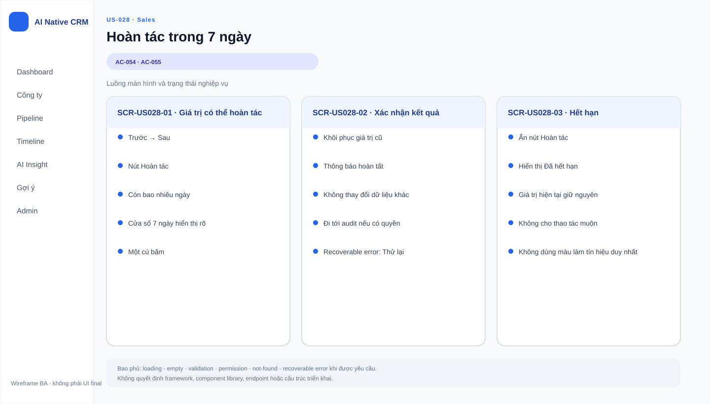

# Business Specification — US-028: Hoàn tác 1-cú-bấm trong 7 ngày

## 1. Document Information
| Field | Value |
|---|---|
| Story | US-028 |
| Version | 1.0 |
| Status | AWAITING_SPECIFICATION_APPROVAL |
| Sources | REQ-406, BR-013, US-028, architect handoff, DoR review |

## 2. Purpose
**[CONFIRMED — REQ-406]** Cho Sales hoàn tác giá trị do hệ thống tự đặt trong cửa sổ 7 ngày.

## 3. User Story
**[CONFIRMED — US-028]** As a Sales, I want hoàn tác việc hệ thống tự đặt bằng một cú bấm trong 7 ngày, so that sai thì sửa dễ hơn cả lúc máy làm.

## 4. Business Goal
**[CONFIRMED — REQ-406]** Bảo vệ quyền kiểm soát của Sales bằng cách khôi phục chính xác giá trị trước tự động hóa.

## 5. Scope
- **[CONFIRMED — AC-054]** Hoàn tác một cú bấm về Việc tiếp theo và ngày hạn trước đó trong 7 ngày.
- **[CONFIRMED — AC-055]** Hiển thị rõ cửa sổ 7 ngày; hết hạn thì nút Hoàn tác biến mất và ô được sửa tay như bình thường.

## 6. Out of Scope
- **[CONFIRMED — REQ-401..405]** Quyết định và thao tác tự đặt; US-025..027.
- **[CONFIRMED — REQ-407..408]** Ghi lịch sử tự đặt/hoàn tác và đo lường quản trị; US-029.
- **[CONFIRMED — BR-017]** Hệ thống tự xóa dữ liệu người tạo hoặc thay đổi stage/tiền/liên hệ khách.

## 7. Actor / Permission
| Actor | Business permission | Evidence |
|---|---|---|
| Sales | Hoàn tác một lần tự đặt trong cửa sổ 7 ngày. | **[CONFIRMED]** US-028, AC-054 |
| A-AI | Là nguồn của giá trị tự đặt, không thực hiện thao tác hoàn tác. | **[CONFIRMED]** US-025, AC-054 |

## 8. Business Rules
| ID | Rule | Evidence |
|---|---|---|
| BR-US028-01 | Cửa sổ hoàn tác là 7 ngày. | **[CONFIRMED]** BR-013, AC-055 |
| BR-US028-02 | Hoàn tác phải khôi phục đúng Việc tiếp theo và ngày hạn trước đó. | **[CONFIRMED]** AC-054 |
| BR-US028-03 | Khi hết cửa sổ, nút Hoàn tác biến mất; ô vẫn sửa tay như ô bình thường. | **[CONFIRMED]** AC-055 |
| BR-US028-04 | Chỉ áp dụng cho giá trị do hệ thống tự đặt. | **[CONFIRMED]** US-028, REQ-406 |

## 9. Business Data Dictionary
| Business data | Meaning | Rule | Evidence |
|---|---|---|---|
| Giá trị trước đó | Việc tiếp theo và ngày hạn trước tự đặt. | Đích khôi phục khi hoàn tác. | **[CONFIRMED]** AC-054 |
| Giá trị tự đặt | Việc tiếp theo/ngày hạn do hệ thống đặt. | Điều kiện để có cửa sổ hoàn tác. | **[CONFIRMED]** REQ-406 |
| Cửa sổ hoàn tác | Khoảng thời gian Sales có thể hoàn tác. | 7 ngày, hiển thị rõ. | **[CONFIRMED]** BR-013, AC-055 |

## 10. Business Flow
### BF-028-01 — Hoàn tác còn hạn
1. **[CONFIRMED — AC-054]** Sales thấy giá trị do hệ thống tự đặt trong 7 ngày.
2. **[CONFIRMED — AC-054]** Sales bấm Hoàn tác một lần.
3. **[CONFIRMED — AC-054]** Việc tiếp theo và ngày hạn về đúng giá trị trước đó.

### BF-028-02 — Hết hạn
1. **[CONFIRMED — AC-055]** Cửa sổ 7 ngày kết thúc.
2. **[CONFIRMED — AC-055]** Nút Hoàn tác biến mất; Sales sửa tay ô như bình thường.

## 11. Acceptance Criteria
### AC-054 — Hoàn tác về nguyên trạng
```gherkin
Scenario: Hoàn tác về nguyên trạng
  Given một Việc tiếp theo do hệ thống đặt
  When tôi bấm Hoàn tác trong vòng 7 ngày
  Then Việc tiếp theo và ngày hạn trở về đúng giá trị trước đó.
```
### AC-055 — Cửa sổ 7 ngày
```gherkin
Scenario: Cửa sổ hiển thị và hết hạn
  Given một ô do hệ thống đặt
  Then cửa sổ 7 ngày hiện rõ; sau 7 ngày nút Hoàn tác biến mất và ô sửa tay như bình thường.
```

## 12. Screen Specification
| Area | Required behavior | Evidence |
|---|---|---|
| Ô Việc tiếp theo/ngày hạn tự đặt | Phân biệt và cho Sales thấy cửa sổ hoàn tác. | **[CONFIRMED]** AC-055 |
| Hành động Hoàn tác | Một cú bấm khi còn hạn. | **[CONFIRMED]** AC-054 |

## 13. Screen Design

> **UI-DESIGN UPDATE — 2026-08-14:** Wireframe BA dưới đây được tạo từ các US/AC hiện hành và thay thế trạng thái “chưa có asset” được ghi nhận trước bước UI Design.


Không có asset wireframe được phê duyệt. **[ASSUMPTION — A-028-01]** Cách biểu đạt thời gian còn lại do UX quyết định, miễn cửa sổ 7 ngày “hiện rõ”.

## 14. Screen States
| State | Outcome | Evidence |
|---|---|---|
| Còn trong 7 ngày | Có hành động Hoàn tác và thông tin cửa sổ hiển thị rõ. | **[CONFIRMED]** AC-054..055 |
| Đã hoàn tác | Hai giá trị trở về giá trị trước đó. | **[CONFIRMED]** AC-054 |
| Hết 7 ngày | Không còn nút Hoàn tác; sửa tay bình thường. | **[CONFIRMED]** AC-055 |

## 15. Validation
| Condition | Response | Evidence |
|---|---|---|
| Giá trị tự đặt còn hạn | Cho hoàn tác một cú bấm. | **[CONFIRMED]** AC-054 |
| Giá trị tự đặt hết hạn | Ẩn nút hoàn tác. | **[CONFIRMED]** AC-055 |
| Giá trị do người nhập tay | Không có quy tắc hoàn tác trong story. | **[OPEN QUESTION]** Q-028-01 |

## 16. Dependencies
| Direction | Item | Dependency | Evidence |
|---|---|---|---|
| Upstream | US-025 | Cung cấp giá trị do hệ thống tự đặt. | **[CONFIRMED]** US-028 dependency |
| Downstream | US-029 | Ghi nhận lần hoàn tác. | **[CONFIRMED]** REQ-408 |

## 17. Business-level NFR Expectations
- **[CONFIRMED — AC-054]** Khôi phục phải đúng giá trị trước đó, tránh làm Sales mất dữ liệu.
- **[CONFIRMED — BR-017]** Không tự xóa dữ liệu người tạo hoặc vượt guardrail AI.
- **[INFERRED — AC-054]** Nếu cặp giá trị trước đó không được bảo toàn nhất quán, hoàn tác sẽ không đạt mục tiêu khôi phục nguyên trạng.

## 18. Test Scenarios
| TC | Business scenario | AC / rule | Expected result |
|---|---|---|---|
| TC-028-01 | Sales hoàn tác giá trị tự đặt vào ngày thứ 7 hoặc sớm hơn. | AC-054, BR-US028-01 | Hai trường trở về đúng giá trị trước đó. |
| TC-028-02 | Sales xem giá trị sau khi hết 7 ngày. | AC-055, BR-US028-03 | Cửa sổ không còn nút Hoàn tác; vẫn sửa tay được. |

## 19. Traceability
| Chain | Evidence |
|---|---|
| `REQ-406 → EPIC-07 → FEAT-028 → US-028 → AC-054..055 → TC-028-01..02 (T-7)` | **[CONFIRMED]** architect handoff |
| `BR-013 → BR-US028-01 → AC-055` | **[CONFIRMED]** requirement analysis |

## 20. Assumptions
| ID | Assumption | Status |
|---|---|---|
| A-028-01 | UX có thể chọn cách hiện thời gian còn lại. | **[ASSUMPTION]** Không đổi cửa sổ 7 ngày. |

## 21. Open Questions
| ID | Question | Owner / impact |
|---|---|---|
| Q-028-01 | Giá trị tay có bao giờ được gắn cửa sổ hoàn tác không? | PO; xác định ranh giới. |
| Q-028-02 | Sau khi hoàn tác, có cho hoàn tác lần nữa không? | PO; không suy diễn từ “một cú bấm”. |

## 22. Definition of Ready
| DoR item | Status | Evidence |
|---|---|---|
| Actor, giá trị và scope rõ | READY | US-028, REQ-406 |
| AC quan sát được | READY | AC-054..055 |
| Dependency xác định | READY | US-025 |
| Traceability rõ | READY | REQ-406 → FEAT-028 → US-028 → AC → TC |
| Human approval | AWAITING_SPECIFICATION_APPROVAL | Gate 1 |

## 23. Technical Handoff
**[CONFIRMED — AC-054..055]** Bảo toàn cặp giá trị trước đó để khôi phục chính xác và bảo đảm cửa sổ 7 ngày thấy rõ. **[CONFIRMED — BR-017]** Mọi tự động hóa vẫn qua AutomationPolicyGuard và không có đường tắt guardrail. Các chi tiết kỹ thuật còn lại là quyết định Tech Lead.

## 24. Change Log
| Version | Date | Change | Author/Approver |
|---|---|---|---|
| 1.0 | 2026-08-14 | Tạo specification 24 mục cho US-028. | Codex / awaiting human specification approval |
