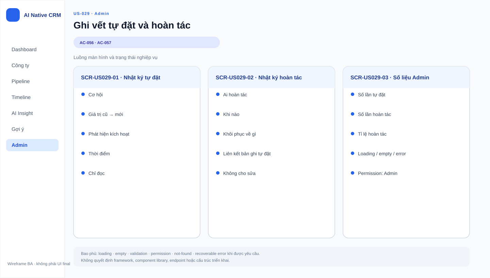

# Business Specification — US-029: Record autonomous next-step actions and undo
## 1. Document Information
| Field | Value |
|---|---|
| Story / feature | `US-029` / `FEAT-029` (D4) |
| Status / sources | `AWAITING_SPECIFICATION_APPROVAL`; `REQ-407..408`, `AC-056..057` |
## 2. Purpose
**[CONFIRMED — REQ-407..408]** Provide Admin with functional audit information for autonomous next-step setting and human undo.
## 3. User Story
**[CONFIRMED — US-029]** As Admin, I want every autonomous setting and undo recorded so that I can measure the undo rate.
## 4. Business Goal
**[CONFIRMED — US-029]** Admin can assess whether automatic next steps are being reversed.
## 5. Scope
**[CONFIRMED — AC-056..057]** Record autonomous setting with opportunity, old/new values, triggering finding, time; record undo with actor, time, restored value; show count and undo/total rate to Admin.
## 6. Out of Scope
**[CONFIRMED — user-stories]** Setting next steps is US-025; undo action/window is US-028; quality dashboard expansion is deferred US-035. This is business audit, not monitoring/log shipping.
## 7. Actor / Permission
| Actor | Permission | Evidence |
|---|---|---|
| A-AI | Causes autonomous setting under policy. | **[CONFIRMED]** AC-056; US-025 |
| Sales | Performs undo. | **[CONFIRMED]** AC-057; US-028 |
| Admin | Views count and undo rate. | **[CONFIRMED]** AC-057 |
## 8. Business Rules
| ID | Rule | Evidence |
|---|---|---|
| BR-US029-01 | Each autonomous setting records opportunity, prior/new values, triggering finding, and time. | **[CONFIRMED]** REQ-407 |
| BR-US029-02 | Each undo records actor, time, and restored value. | **[CONFIRMED]** REQ-408 |
| BR-US029-03 | Admin can view undo count and undo-to-total-autoset rate. | **[CONFIRMED]** AC-057 |
| BR-US029-04 | Records are functional CRM audit data, not observability, telemetry, or prompt logs. | **[CONFIRMED]** architecture; project rules |
## 9. Business Data Dictionary
| Data | Meaning | Evidence |
|---|---|---|
| Autoset record | Record of an AI-set next step. | **[CONFIRMED]** REQ-407 |
| Undo record | Record of a human reversal. | **[CONFIRMED]** REQ-408 |
| Undo rate | Undo count divided by total autosets. | **[CONFIRMED]** AC-057 |
## 10. Business Flow
**[CONFIRMED — AC-056..057]** An approved automation sets a next step and creates an autoset record; Sales undoes it and creates an undo record; Admin views the aggregate.
## 11. Acceptance Criteria
### AC-056 — Record autoset
```gherkin
Given the system autosets a next step Then opportunity, old/new values, finding, and time are recorded.
```
### AC-057 — Record undo and measure
```gherkin
Given Sales undoes an autoset Then actor, time, restored value, count, and undo rate are available to Admin.
```
## 12. Screen Specification
**[CONFIRMED — AC-057]** Admin has a business view of autoset/undo count and rate; individual records contain the AC fields.
## 13. Screen Design

> **UI-DESIGN UPDATE — 2026-08-14:** Wireframe BA dưới đây được tạo từ các US/AC hiện hành và thay thế trạng thái “chưa có asset” được ghi nhận trước bước UI Design.


No approved wireframe. **[ASSUMPTION — A-029-01]** Visual aggregation is UX/Admin design, not a monitoring dashboard.
## 14. Screen States
Autoset recorded; undo recorded; Admin aggregate visible. **[CONFIRMED — AC-056..057]**
## 15. Validation
Required record fields are those enumerated in AC-056..057. Formula edge cases for zero autosets are **[OPEN QUESTION — Q-029-01]**.
## 16. Dependencies
**[CONFIRMED]** US-025 creates autosets; US-028 creates undo; US-040/`AutomationPolicyGuard` constrains automation.
## 17. Business-level NFR Expectations
**[CONFIRMED — project rules]** Keep functional audit without monitoring, telemetry, log shipping, or prompt logs.
## 18. Test Scenarios
| ID | Scenario | AC / rule |
|---|---|---|
| TC-029-01 | System autosets a next step. | AC-056; BR-US029-01 |
| TC-029-02 | Sales undoes it and Admin reviews rate. | AC-057; BR-US029-02..03 |
## 19. Traceability
`REQ-407 → EPIC-07 → FEAT-029 → US-029 → AC-056 → TC-029-01`; `REQ-408 → FEAT-029 → US-029 → AC-057 → TC-029-02`. **[CONFIRMED — architect handoff]**
## 20. Assumptions
**[ASSUMPTION — A-029-01]** Display format is not prescribed.
## 21. Open Questions
`Q-029-01`: How is undo rate represented when total autosets is zero? **[OPEN QUESTION — PO]**
## 22. Definition of Ready
**READY. [CONFIRMED — dor-review]** Actor, AC, dependencies, and traceability are complete; Q-029-01 does not alter AC.
## 23. Technical Handoff
Preserve approved functional audit and Admin visibility. **[CONFIRMED — architecture/project rules]** Do not convert it into monitoring/log shipping or add endpoints, schemas, migrations, implementation tasks, or source structure; all automation continues through `AutomationPolicyGuard`.
## 24. Change Log
| Version | Date | Change | Author/Approver |
|---|---|---|---|
| 1.0 | 2026-08-14 | Created US-029 specification. | Codex / awaiting human specification approval |
