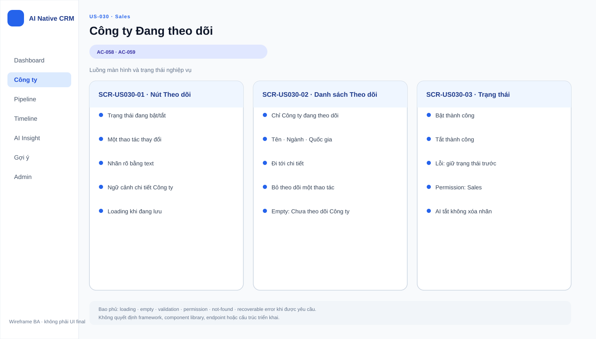

# Business Specification — US-030: Following label and dedicated list

## 1. Document Information

| Field | Value |
|---|---|
| Story | `US-030` |
| Feature / domain | `FEAT-030` / D5 — Follow-up loop |
| Version | `1.0` |
| Status | `AWAITING_SPECIFICATION_APPROVAL` |
| Date | `2026-08-14` |
| Priority | Should (14) |
| Sources | `REQ-501`; `US-030`; `AC-058..059`; DoR; architect handoff |

## 2. Purpose

**[CONFIRMED — REQ-501, US-030]** Let Sales explicitly mark important companies as being followed and access that group in its own list.

## 3. User Story

**[CONFIRMED — US-030]** As a Sales user, I want to turn the Following label on or off and have a dedicated list, so that I can hand off the monitoring of important companies.

## 4. Business Goal

**[CONFIRMED — US-030]** Sales can identify companies requiring continued attention. **[INFERRED — REQ-501]** The label provides the input population for the subsequent follow-up loop without requiring Sales to maintain a separate manual list.

## 5. Scope

**[CONFIRMED — REQ-501, AC-058..059]** A Sales user can change the Following label in one action and view a dedicated list containing companies with that label.

## 6. Out of Scope

**[CONFIRMED — user-stories, REQ-502..506]** Reading sources, automatic scanning, generating findings, adding timeline entries, scan cadence, and deletion of system timeline entries belong to US-031..033 and deferred US-034. Company CRUD belongs to US-001.

## 7. Actor / Permission

| Actor | Business permission | Evidence |
|---|---|---|
| Sales | Turn Following on/off and view the dedicated list. | **[CONFIRMED]** US-030, AC-058..059 |
| A-AI | May consume the resulting followed-company population only in its separate loop use case; it does not choose the label here. | **[CONFIRMED]** REQ-501; US-031 |
| Admin | This story does not define an Admin-specific permission. | **[OPEN QUESTION]** Q-030-01 |

## 8. Business Rules

| ID | Rule | Evidence |
|---|---|---|
| BR-US030-01 | Following is a company label that Sales can toggle in one action. | **[CONFIRMED]** REQ-501; AC-058 |
| BR-US030-02 | A dedicated list exists for companies whose Following label is on. | **[CONFIRMED]** REQ-501; AC-059 |
| BR-US030-03 | Toggling this label neither changes CRM profile data nor initiates an AI action by itself. | **[INFERRED]** REQ-501 separates label/list from REQ-502 loop behavior |
| BR-US030-04 | The label is a manual CRM capability and remains usable when AI is disabled. | **[CONFIRMED]** REQ-113; project rules |

## 9. Business Data Dictionary

| Business data | Meaning | Applicability / rule | Evidence |
|---|---|---|---|
| Company | Customer or prospect legal entity. | Subject of the label. | **[CONFIRMED]** PRD §2; US-001 |
| Following label | On/off indication that Sales wants the company followed. | Changed by one action. | **[CONFIRMED]** REQ-501 |
| Followed-company list | Separate list of companies carrying the Following label. | Exists when one or more labelled companies are present. | **[CONFIRMED]** AC-059 |

## 10. Business Flow

### BF-030-01 — Toggle following

1. **[CONFIRMED — AC-058]** Sales selects a company and turns the Following label on or off.
2. **[CONFIRMED — AC-058]** The company’s label state changes immediately in that one action.

### BF-030-02 — View followed companies

1. **[CONFIRMED — AC-059]** At least one company has Following enabled.
2. **[CONFIRMED — AC-059]** Sales opens the dedicated list and sees the followed group.

## 11. Acceptance Criteria

### AC-058 — Toggle in one action

```gherkin
Scenario: Toggle the Following label
  Given a company
  When Sales turns the Following label on or off
  Then the state changes immediately in one action.
```

### AC-059 — Dedicated list

```gherkin
Scenario: View followed companies
  Given companies with the Following label on
  Then a dedicated list is available for that group.
```

**[CONFIRMED — user-stories.md]** The acceptance criteria preserve the approved source meaning.

## 12. Screen Specification

| Business area | Required information / behavior | Evidence |
|---|---|---|
| Company context | Make the current Following state visible and allow the one-action change. | **[CONFIRMED]** AC-058 |
| Followed-company list | Provide a distinct view for companies with the label on. | **[CONFIRMED]** AC-059 |

## 13. Screen Design

> **UI-DESIGN UPDATE — 2026-08-14:** Wireframe BA dưới đây được tạo từ các US/AC hiện hành và thay thế trạng thái “chưa có asset” được ghi nhận trước bước UI Design.



No approved wireframe asset is available. **[ASSUMPTION — A-030-01]** Layout, wording, and visual treatment remain a UX decision, provided the behaviors in section 12 and AC-058..059 remain observable.

## 14. Screen States

| State | Visible business outcome | Evidence |
|---|---|---|
| Following on | Company is included in the followed group. | **[INFERRED]** REQ-501; AC-059 |
| Following off | Company is not part of the followed group. | **[INFERRED]** Toggle semantics in AC-058; PO confirmation needed at Q-030-02 |
| Dedicated list | Sales can reach the separately identified followed group. | **[CONFIRMED]** AC-059 |

## 15. Validation

| Condition | Expected business response | Evidence |
|---|---|---|
| Sales toggles a company label | Change occurs in one action. | **[CONFIRMED]** AC-058 |
| Followed companies exist | Dedicated list is available. | **[CONFIRMED]** AC-059 |
| No followed companies exist | Empty-list behavior is not specified. | **[OPEN QUESTION]** Q-030-03 |

## 16. Dependencies

| Direction | Item | Dependency | Evidence |
|---|---|---|---|
| Upstream | US-001 | Provides company context. | **[CONFIRMED]** US-030 dependency |
| Downstream | US-031 | Uses followed companies for the autonomous scan loop. | **[CONFIRMED]** REQ-501..502; feature decomposition |
| Cross-cutting | US-040 | Guardrail applies to any automation downstream of the label. | **[CONFIRMED]** BR-017; architect handoff |

## 17. Business-level NFR Expectations

- **[CONFIRMED — REQ-113]** The manual label/list works with AI disabled.
- **[CONFIRMED — REQ-704]** CRM data is expected to persist across product restarts at system level.
- **[OPEN QUESTION — Q-030-04]** No response-time, ordering, or scale expectation for the dedicated list is specified.

## 18. Test Scenarios

| ID | Business scenario | AC / rule | Expected result |
|---|---|---|---|
| TC-030-01 | Sales turns Following on. | AC-058; BR-US030-01 | The company changes to followed in one action. |
| TC-030-02 | Sales turns Following off. | AC-058; BR-US030-01 | The state changes in one action. |
| TC-030-03 | Sales has followed companies. | AC-059; BR-US030-02 | A dedicated followed-company list is available. |

## 19. Traceability

| Chain | Evidence |
|---|---|
| `REQ-501 → EPIC-08 → FEAT-030 → US-030 → AC-058 → TC-030-01..02` | **[CONFIRMED]** architect handoff matrix |
| `REQ-501 → EPIC-08 → FEAT-030 → US-030 → AC-059 → TC-030-03` | **[CONFIRMED]** architect handoff matrix |
| `REQ-113 → BR-US030-04` | **[CONFIRMED]** requirement-analysis; project rules |

## 20. Assumptions

| ID | Assumption | Rationale / status |
|---|---|---|
| A-030-01 | The presentation of the label/list is left to UX. | **[ASSUMPTION]** Requires human approval; does not alter AC. |

## 21. Open Questions

| ID | Question | Owner / impact |
|---|---|---|
| Q-030-01 | Does Admin have the same manual toggle/list permission as Sales? | PO; role behavior. |
| Q-030-02 | Is a company immediately excluded from the dedicated list when Following is turned off? | PO; confirms inferred toggle semantics. |
| Q-030-03 | What should the dedicated list show when no company is followed? | PO/UX; empty state only. |
| Q-030-04 | Is ordering of the dedicated list required? | PO; display behavior. |

## 22. Definition of Ready

| DoR item | Status | Evidence / note |
|---|---|---|
| Actor and business value | READY | US-030 defines Sales and monitoring value. |
| Observable acceptance criteria | READY | AC-058..059. |
| Dependencies | READY | US-001 upstream; US-031 downstream. |
| Traceability | READY | REQ-501 → FEAT-030 → US-030 → AC → TC. |
| Ambiguities recorded | READY WITH QUESTIONS | Q-030-01..004 do not change approved AC. |

**[CONFIRMED — dor-review]** US-030 is marked `READY`; this specification stops awaiting human specification approval.

## 23. Technical Handoff

### Approved constraints

- **[CONFIRMED — REQ-501]** The label must be changed in one action and a distinct list must exist.
- **[CONFIRMED — REQ-113]** This manual CRM behavior must not depend on AI.
- **[CONFIRMED — project rules]** Do not introduce monitoring, telemetry, log shipping, or prompt logging.

### Touchpoints and risks

- **[CONFIRMED]** Company data comes from US-001; US-031 consumes the followed-company set.
- **[INFERRED — REQ-501..502]** Incorrect label state could cause the autonomous loop to process the wrong population.

### Decisions required from Tech Lead

No endpoint, schema, migration, framework, source structure, or coding task is proposed. Tech Lead should preserve the approved business constraints and return Q-030-01..004 to the PO where needed.

## 24. Change Log

| Version | Date | Change | Author/Approver |
|---|---|---|---|
| 1.0 | 2026-08-14 | Created 24-section business specification for US-030. | Codex / awaiting human specification approval |
