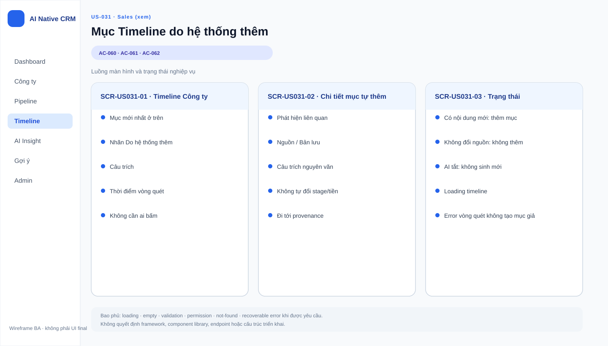

# Business Specification — US-031: Vòng lặp tự đọc→so→rút→thêm timeline

## 1. Document Information

| Field | Value |
|---|---|
| Story | US-031 |
| Feature / Epic | FEAT-031 / EPIC-08 — Theo dõi & vòng quét khép kín |
| Version | 1.0 |
| Status | **AWAITING_SPECIFICATION_APPROVAL** |
| Priority / DoR | Must (17) / READY |
| Primary actor | A-AI (tác nhân nội bộ, không phải người dùng đăng nhập) |
| Sources | REQ-502, REQ-503, BR-006, BR-017, US-031, AC-060..062, T-8 |
| Evidence convention | `CONFIRMED`, `INFERRED`, `ASSUMPTION`, `OPEN QUESTION` theo nguồn nêu tại từng mục |

## 2. Purpose

**[CONFIRMED — REQ-502/503]** Đặc tả hành vi vòng quét dành cho các công ty mang nhãn **Đang theo dõi**: tự đọc lại nguồn, nhận biết có nội dung mới theo chính sách đã được xác định, rút Phát hiện, rồi tự ghi một mục timeline có provenance mà không chờ người dùng phê duyệt.

Đặc tả này chỉ làm rõ nghiệp vụ của US-031; không quyết định thuật toán xác định “nội dung mới”.

## 3. User Story

**[CONFIRMED — US-031]** As a Tác nhân AI tự chủ (A-AI), I want tự chạy vòng lặp khép kín trên công ty Đang theo dõi, so that tin mới tự được ghi mà không cần ai bấm.

## 4. Business Goal

**[CONFIRMED — PRD Nhóm 5; REQ-502]** Giúp Sales theo dõi thay đổi đáng chú ý của công ty ưu tiên mà không cần kiểm tra nguồn thủ công, đồng thời vẫn thấy được câu trích làm bằng chứng cho từng mục do hệ thống thêm.

## 5. Scope

**[CONFIRMED — REQ-502/503; AC-060..062]** US-031 bao gồm:

- Chỉ quét công ty đang mang nhãn Đang theo dõi.
- Đọc lại nguồn của công ty và đối chiếu với bản lưu gần nhất để quyết định ở mức nghiệp vụ liệu có nội dung mới.
- Khi có nội dung mới, rút Phát hiện có provenance, rồi tự thêm mục vào dòng thời gian của đúng công ty.
- Hiển thị nhãn **“do hệ thống thêm”** và câu trích kèm mục timeline tự thêm.
- Tự quyết ghi hoặc không ghi theo kết quả “có mới hay không”; không tạo hàng đợi chờ duyệt cho hành vi này.
- Áp dụng đầy đủ các ranh giới cứng của BR-017 cho mọi hành vi tự động trong vòng quét.

## 6. Out of Scope

**[CONFIRMED — phân rã FEAT và các US liên quan]** US-031 không bao gồm:

- Bật/tắt nhãn Đang theo dõi hoặc màn hình danh sách theo dõi (US-030).
- Cấu hình chu kỳ quét và giá trị mặc định 60 giây (US-032).
- Nhật ký tổng kết từng vòng và tổng hợp mỗi mười vòng (US-033).
- Cho Sales xóa mục do hệ thống thêm (US-034; hiện deferred).
- Gợi ý chờ Sales duyệt hoặc cập nhật hồ sơ công ty (US-018..022).
- Tự đặt Việc tiếp theo (US-025..029).
- Bật/tắt AI toàn cục (US-037), dù trạng thái đó là điều kiện vận hành của vòng quét.
- Thay đổi giai đoạn, kết quả Thắng/Thua, giá trị tiền, liên hệ khách, hoặc tự xóa dữ liệu người tạo (BR-017).
- Chọn hoặc mô tả thuật toán/tiêu chí kỹ thuật để so sánh nội dung mới (Q-05, ARQ-4).

## 7. Actor / Permission

| Actor | Business permission / responsibility | Evidence |
|---|---|---|
| A-AI | Tự chạy vòng quét, đọc nguồn, rút Phát hiện và tự thêm mục timeline trong phạm vi US-031. | CONFIRMED — US-031, REQ-502/503 |
| Sales | Không cần thao tác để kích hoạt từng lần ghi; là người thụ hưởng thông tin trên timeline. Quyền xóa mục hệ thống là story khác. | CONFIRMED — AC-060; REQ-506/US-034 |
| Admin | Không phải actor trực tiếp của US-031; quản trị chu kỳ, nhật ký và công tắc AI thuộc story riêng. | CONFIRMED — US-032/033/037 |

**[CONFIRMED — BR-017]** A-AI không có quyền tự thay đổi giai đoạn hoặc tiền/Thắng/Thua, liên hệ khách, hay xóa dữ liệu người tạo. Mọi automation phải chịu `AutomationPolicyGuard` theo ràng buộc kiến trúc dự án.

## 8. Business Rules

| ID | Rule | Evidence |
|---|---|---|
| BR-US031-01 | Chỉ công ty mang nhãn Đang theo dõi mới là đối tượng của vòng quét. | CONFIRMED — REQ-501/502 |
| BR-US031-02 | Vòng quét tuân theo chuỗi nghiệp vụ: đọc lại nguồn → so với bản lưu gần nhất → nếu có nội dung mới thì rút Phát hiện → tự thêm mục timeline → tiếp tục lặp. | CONFIRMED — REQ-502 |
| BR-US031-03 | Khi không có nội dung mới, không được thêm mục vào timeline. | CONFIRMED — AC-061 |
| BR-US031-04 | Mỗi mục timeline được tự thêm phải có nhãn “do hệ thống thêm” và câu trích làm bằng chứng. Không có provenance thì không được lưu/hiển thị Phát hiện. | CONFIRMED — AC-060; BR-006 |
| BR-US031-05 | Quyết định tự thêm hay không thêm không chờ ai duyệt ở bất kỳ bước nào của vòng lặp. | CONFIRMED — REQ-503; AC-062 |
| BR-US031-06 | Vòng quét chỉ được tự ghi mục timeline trong phạm vi này; không tự đổi stage, tiền, Thắng/Thua, liên hệ khách hoặc xóa dữ liệu người tạo. | CONFIRMED — BR-017; ghi chú US-031 |
| BR-US031-07 | Việc rút Phát hiện không tự sửa hồ sơ, cơ hội hay timeline; riêng hành vi tự thêm timeline ở US-031 được thực hiện sau khi có nội dung mới và Phát hiện đủ provenance. | CONFIRMED — REQ-206, REQ-502; INFERRED — trình tự nghiệp vụ |

## 9. Business Data Dictionary

| Business data | Meaning in US-031 | Required for | Evidence |
|---|---|---|---|
| Công ty | Hồ sơ khách hàng/tổ chức được theo dõi. | Xác định đúng ngữ cảnh quét và timeline nhận kết quả. | CONFIRMED — PRD §2; REQ-502 |
| Nhãn Đang theo dõi | Trạng thái cho biết công ty thuộc phạm vi vòng quét. | Điều kiện bắt đầu xử lý. | CONFIRMED — REQ-501 |
| Nguồn / Bản lưu | Nội dung nguồn được đọc lại và bản lưu gần nhất làm mốc nghiệp vụ để so sánh. | Xác định có nội dung mới và bảo toàn nguồn gốc. | CONFIRMED — REQ-201, REQ-502 |
| Nội dung mới | Nội dung được xác định là mới khi so với bản lưu gần nhất theo quyết định kỹ thuật còn mở. | Điều kiện để rút Phát hiện và tự thêm timeline. | OPEN QUESTION — Q-05, ARQ-4 |
| Phát hiện | Nhận định ngắn rút từ bản lưu, gắn đúng công ty và có provenance. | Cầu nối giữa nội dung mới và mục timeline. | CONFIRMED — REQ-202/203 |
| Câu trích / provenance | Câu nguyên văn và vị trí trong bản lưu chứng minh Phát hiện. | Bắt buộc với Phát hiện và phải đi kèm mục tự thêm. | CONFIRMED — BR-006; AC-060 |
| Mục timeline do hệ thống thêm | Bản ghi thông tin mới trong dòng thời gian công ty, có nhãn nhận diện và câu trích. | Kết quả nghiệp vụ được US-031 cho phép tự tạo. | CONFIRMED — REQ-502; AC-060 |

## 10. Business Flow

| Step | Business flow | Evidence |
|---|---|---|
| BF-US031-01 | Vòng quét nhận diện các công ty đang mang nhãn Đang theo dõi. | CONFIRMED — REQ-501/502 |
| BF-US031-02 | Với từng công ty trong phạm vi, hệ thống đọc lại nguồn và có bản lưu làm căn cứ đối chiếu. | CONFIRMED — REQ-201/502 |
| BF-US031-03 | Hệ thống đánh giá ở mức nghiệp vụ liệu nguồn có nội dung mới so với bản lưu gần nhất. Cách thực hiện phép đánh giá chưa được chốt trong BA spec. | CONFIRMED — REQ-502; OPEN QUESTION — Q-05/ARQ-4 |
| BF-US031-04 | Nếu không có nội dung mới, không tạo mục timeline; vòng quét tiếp tục. | CONFIRMED — AC-061 |
| BF-US031-05 | Nếu có nội dung mới, hệ thống rút Phát hiện có câu trích/provenance. | CONFIRMED — REQ-202/207, REQ-502 |
| BF-US031-06 | Sau Phát hiện đủ provenance, hệ thống tự thêm mục timeline cho đúng công ty, hiển thị nhãn “do hệ thống thêm” và câu trích. | CONFIRMED — REQ-502; AC-060 |
| BF-US031-07 | Vòng quét không chờ phê duyệt trước khi tự ghi hoặc quyết định không ghi; đồng thời guardrail loại bỏ mọi hành động bị cấm. | CONFIRMED — REQ-503, BR-017; INFERRED — áp dụng guardrail xuyên suốt |

## 11. Acceptance Criteria

| AC | Observable business outcome | Evidence |
|---|---|---|
| AC-060 | Khi hai công ty Đang theo dõi đổi sang bản chụp “sau” và vòng quét phát hiện nội dung mới, hệ thống rút Phát hiện và tự thêm mục timeline có nhãn “do hệ thống thêm” cùng câu trích, không cần ai bấm. | CONFIRMED — user-stories.md |
| AC-061 | Khi công ty Đang theo dõi không đổi nội dung nguồn và vòng quét chạy, không có mục timeline nào được thêm. | CONFIRMED — user-stories.md |
| AC-062 | Vòng lặp tự quyết ghi/không ghi dựa trên có nội dung mới hay không và không dừng chờ phê duyệt ở bất kỳ bước nào. | CONFIRMED — user-stories.md |

## 12. Screen Specification

**[INFERRED — AC-060; REQ-108/204]** US-031 không yêu cầu màn hình độc lập. Kết quả nghiệp vụ cần được nhìn thấy trên dòng thời gian của trang chi tiết công ty để Sales phân biệt được mục tự thêm và đọc câu trích chứng minh.

| Area | Required business information | Evidence |
|---|---|---|
| Timeline công ty | Mục tin mới do hệ thống thêm, nhãn “do hệ thống thêm”, câu trích. | CONFIRMED — AC-060 |
| Vùng đọc / provenance | Khả năng hiển thị nguồn gốc của Phát hiện tuân theo US-015/016; US-031 không tự mở rộng hành vi điều hướng nguồn. | CONFIRMED — REQ-204/208; INFERRED — touchpoint |

## 13. Screen Design

> **UI-DESIGN UPDATE — 2026-08-14:** Wireframe BA dưới đây được tạo từ các US/AC hiện hành và thay thế trạng thái “chưa có asset” được ghi nhận trước bước UI Design.

**[CONFIRMED — phạm vi nguồn]** Không có wireframe hoặc screen asset đã được phê duyệt cho US-031. Không tạo tài sản thiết kế mới trong tài liệu này.

**[INFERRED — AC-060]** Thiết kế chi tiết cần bảo đảm nhãn “do hệ thống thêm” và câu trích có thể nhận biết ngay trên timeline. Màu sắc, biểu tượng, bố cục và cách mở provenance là quyết định UI/UX sau khi có phê duyệt specification.

## 14. Screen States

| State | Required presentation | Evidence |
|---|---|---|
| Có mục do hệ thống thêm | Timeline hiển thị nhãn “do hệ thống thêm” và câu trích đi kèm. | CONFIRMED — AC-060 |
| Không có nội dung mới | Timeline không có mục mới do lần quét đó tạo ra. | CONFIRMED — AC-061 |
| AI bị tắt | Không có trạng thái UI riêng trong US-031; Sales thấy trạng thái AI tắt theo US-038 và vòng quét dừng theo US-037. | CONFIRMED — US-037/038; OUT OF SCOPE — US-031 |
| Không đọc được nguồn | Không tạo suy đoán; cách ghi nhận nguồn không đọc được thuộc US-012. | CONFIRMED — REQ-211; OUT OF SCOPE — US-031 |

## 15. Validation

| Validation | Expected business result | Evidence |
|---|---|---|
| Company scope | Không xử lý một công ty không mang nhãn Đang theo dõi trong vòng quét này. | CONFIRMED — REQ-501/502 |
| New-content decision | Chỉ đi tiếp tới rút Phát hiện/timeline khi chính sách xác định nội dung mới cho kết quả “có”. Chính sách/thuật toán là quyết định mở. | CONFIRMED — REQ-502; OPEN QUESTION — Q-05/ARQ-4 |
| Provenance | Không lưu/hiển thị Phát hiện thiếu câu trích; vì vậy không tự thêm timeline dựa trên Phát hiện đó. | CONFIRMED — BR-006, REQ-207; INFERRED — chuỗi phụ thuộc |
| Guardrail | Automation bị từ chối nếu dẫn tới hành vi BR-017 bị cấm, kể cả ngoài UI. | CONFIRMED — BR-017; AR-1 |
| Kill switch | Khi AI đã bị tắt, vòng quét không tiếp tục tạo kết quả mới; dữ liệu đã sinh vẫn giữ nguyên. | CONFIRMED — REQ-603, BR-016; dependency US-037 |

## 16. Dependencies

| Dependency | Why it is needed | Evidence |
|---|---|---|
| US-011 — Bản lưu nguồn | Cung cấp nội dung đã đọc và bản lưu gần nhất cho vòng quét. | CONFIRMED — US-031 dependency; REQ-201/502 |
| US-013 — Rút Phát hiện + provenance | Cung cấp Phát hiện và câu trích bắt buộc trước khi tự thêm timeline. | CONFIRMED — US-031 dependency; REQ-202/207 |
| US-030 — Đang theo dõi | Xác định tập công ty được quét. | CONFIRMED — US-031 dependency; REQ-501 |
| US-032 — Chu kỳ quét | Điều phối khi vòng quét chạy; không thuộc scope chức năng của US-031. | CONFIRMED — US-032 |
| US-033 — Nhật ký vòng quét | Ghi tổng kết vận hành sau mỗi vòng; tách khỏi kết quả timeline của US-031. | CONFIRMED — US-033 |
| US-037 — Kill switch AI | Có thể dừng vòng quét ngay mà không xóa kết quả đã sinh. | CONFIRMED — REQ-603; architect-handoff AR-4 |
| US-040 — Guardrail | Bảo vệ ranh giới BR-017 cho automation. | CONFIRMED — BR-017; US-040 |
| US-041 — Chuyển bản chụp trước/sau | Test-harness để kích hoạt nội dung mới cho kịch bản T-8, không phải chức năng người dùng của US-031. | CONFIRMED — REQ-703; AC-078 |

## 17. Business-level NFR Expectations

| Expectation | Statement | Evidence |
|---|---|---|
| Tự chủ có kiểm soát | Sau khi vòng quét chạy, không yêu cầu thao tác hay phê duyệt của con người để ghi/không ghi mục timeline. | CONFIRMED — REQ-503; AC-062 |
| Minh bạch nguồn gốc | Mục tự thêm luôn mang câu trích để Sales hiểu căn cứ thông tin. | CONFIRMED — AC-060; BR-006 |
| An toàn nghiệp vụ | Vòng quét không được vượt bốn ranh giới BR-017. | CONFIRMED — BR-017 |
| Tính tách biệt | AI bị tắt không được làm hỏng các chức năng CRM làm tay. | CONFIRMED — REQ-113; AC-077 |
| Chu kỳ vận hành | Chu kỳ là cấu hình riêng, mặc định 60 giây; US-031 không tự đặt giá trị hay cơ chế áp dụng. | CONFIRMED — REQ-504, BR-014; OUT OF SCOPE — US-032 |

## 18. Test Scenarios

Các scenario nghiệp vụ dưới đây là đầu vào truy vết cho `test-scenarios.md` được tạo theo workflow QC; chúng không phải test thực thi.

| TC | Scenario nghiệp vụ | AC / BR trace |
|---|---|---|
| TC-US031-01 | Hai công ty Đang theo dõi được chuyển sang bản chụp sau; sau vòng quét, mỗi kết quả có nội dung mới tạo mục timeline mang nhãn và câu trích. | AC-060; BR-US031-01/04 |
| TC-US031-02 | Công ty Đang theo dõi giữ nguyên nội dung nguồn; vòng quét hoàn tất mà không thêm mục timeline. | AC-061; BR-US031-03 |
| TC-US031-03 | Vòng quét có nội dung mới hoàn tất tự động mà không cần đưa qua hàng đợi phê duyệt. | AC-062; BR-US031-05 |
| TC-US031-04 | Một hành vi automation cố đổi stage, tiền/Thắng/Thua, liên hệ khách hoặc xóa dữ liệu bị chặn; mục timeline hợp lệ vẫn là hành vi được phép của US-031. | BR-017; BR-US031-06 |
| TC-US031-05 | Phát hiện thiếu câu trích không dẫn tới mục timeline tự thêm. | BR-006; BR-US031-04 |

## 19. Traceability

| Requirement chain | Specification coverage | Acceptance / test evidence |
|---|---|---|
| REQ-502 → EPIC-08 → FEAT-031 → US-031 | Purpose, Scope, Rules, Data, Flow BF-US031-01..06 | AC-060/061; TC-US031-01/02; T-8 |
| REQ-503 → EPIC-08 → FEAT-031 → US-031 | Scope, Rule BR-US031-05, BF-US031-07 | AC-062; TC-US031-03 |
| BR-006 → US-013/US-031 | Rule BR-US031-04; Validation provenance | TC-US031-05 |
| BR-017 → US-040 → US-031 | Rule BR-US031-06; Validation guardrail | TC-US031-04; T-10 cross-cutting |
| REQ-501 → US-030 → US-031 | Scope and company selection | TC-US031-01/02; T-8 |
| REQ-603 / BR-016 → US-037 → US-031 | Dependency and validation of stop condition | T-9 cross-cutting |
| REQ-703 → US-041 → US-031 | Test-harness dependency for new-source scenario | T-8 |
| Q-05 / ARQ-4 | Boundary of the business “new content” decision; no algorithm specified here. | Open Question Q-US031-01 |

## 20. Assumptions

| ID | Assumption | Evidence / approval needed |
|---|---|---|
| AS-US031-01 | Các phụ thuộc US-011, US-013 và US-030 đã cung cấp hành vi nghiệp vụ như backlog đã duyệt trước khi US-031 vận hành đầy đủ. | INFERRED — dependency chain; cần xác nhận trong kế hoạch delivery |
| AS-US031-02 | “Câu trích” trên mục timeline là provenance của Phát hiện đã dẫn tới việc tự thêm, không phải nội dung do hệ thống tự tạo không có căn cứ. | INFERRED — REQ-202, BR-006, AC-060 |
| AS-US031-03 | Quyết định hướng Q-01/Q-02 đã giới hạn đường tự động của Nhóm 5 vào timeline, tránh tự sửa hồ sơ công ty. | INFERRED — Q-01/Q-02 được tham chiếu là “duyệt” tại US-031; cần giữ khi tích hợp |

## 21. Open Questions

| ID | Question | Impact / owner |
|---|---|---|
| Q-US031-01 | Thuật toán hay cơ chế cụ thể nào xác định “nội dung mới” từ nguồn và bản lưu gần nhất? Q-05 chỉ nêu hướng so sánh; ARQ-4 xác định đây là quyết định của Architect/Dev, không do PO/BA chốt. | High — Architect/Dev; chặn quyết định kỹ thuật, không thay đổi AC-060..062 |
| Q-US031-02 | Khi một nguồn có nhiều Phát hiện mới hợp lệ, quy tắc nhóm thành mục timeline cần được hiểu và kiểm soát như thế nào để không tạo trùng giữa đường Nhóm 3 và Nhóm 5? | High — Architect/Dev; ARQ-7, Q-01/Q-02 |
| Q-US031-03 | Cơ chế dừng an toàn khi kill switch thay đổi giữa một vòng quét cần được chốt thế nào để không để lại tác dụng phụ? | High — Architect/Dev; ARQ-3, US-037 |
| Q-US031-04 | UI sẽ thể hiện provenance của mục tự thêm theo cách nào ngoài nhãn và câu trích tối thiểu? | Medium — PO/UI; không chặn hành vi AC-060 |

## 22. Definition of Ready

| DoR check | Status | Evidence |
|---|---|---|
| Story, actor, value, priority và dependencies xác định | Ready | CONFIRMED — US-031; backlog-prioritization.md |
| REQ, BR và AC truy vết được | Ready | CONFIRMED — REQ-502/503, BR-017, AC-060..062 |
| Kịch bản nghiệm thu có neo T-8 | Ready | CONFIRMED — architect-handoff.md |
| Thuật toán diff chưa bị giả định là quy tắc nghiệp vụ | Ready with technical decision open | CONFIRMED — dor-review.md; OPEN QUESTION — Q-US031-01 |
| BA specification được người có thẩm quyền phê duyệt | Pending | Required by Gate 1 |

**Current outcome:** `AWAITING_SPECIFICATION_APPROVAL`. Chỉ người phê duyệt có thẩm quyền được đổi trạng thái thành `SPECIFICATION_APPROVED`.

## 23. Technical Handoff

| Category | Constraint / touchpoint / risk / decision for Tech Lead |
|---|---|
| Approved business constraints | Automation chỉ tự thêm timeline khi có nội dung mới và Phát hiện có provenance; không chờ duyệt; luôn tuân BR-017. |
| Required touchpoints | Nhãn Đang theo dõi, nguồn/bản lưu gần nhất, Phát hiện/provenance, timeline công ty, kill switch AI, và chu kỳ quét. |
| Guardrail | Mọi automation đi qua `AutomationPolicyGuard`; quyền tự động không được mở rộng sang stage, tiền/Thắng/Thua, liên hệ khách hoặc xóa dữ liệu người tạo. |
| Primary risk | Nhận diện quá rộng hoặc quá hẹp về nội dung mới sẽ làm sai kỳ vọng AC-060/061; trùng lặp có thể phát sinh ở ranh giới Nhóm 3 duyệt và Nhóm 5 tự thêm. |
| Decisions required | Chốt Q-US031-01 / ARQ-4 về cơ chế xác định nội dung mới, Q-US031-02 / ARQ-7 về tránh trùng liên đường, và Q-US031-03 / ARQ-3 về dừng an toàn. |

Không có endpoint, schema, migration, cấu trúc mã nguồn, thuật toán, hay kế hoạch coding trong phần bàn giao này.

## 24. Change Log

| Version | Date | Change | Author/Approver |
|---|---|---|---|
| 1.0 | 2026-08-14 | Tạo business specification US-031 với 24 section, truy vết REQ→FEAT→US→AC→TC và giữ Q-05/ARQ-4 là quyết định kỹ thuật mở. | BA Agent / Awaiting human approval |
