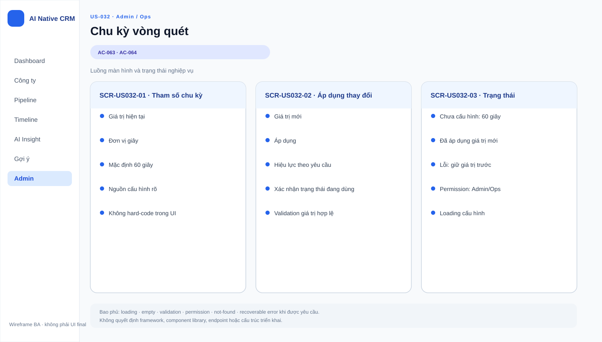

# Business Specification — US-032: Chu kỳ vòng quét cấu hình

## 1. Document Information
| Field | Value |
|---|---|
| Story | `US-032` |
| Version | `1.0` |
| Status | `AWAITING_SPECIFICATION_APPROVAL` |
| Sources | `REQ-504`, `BR-014`, `FEAT-032`, `AC-063..064`, DoR |
## 2. Purpose
**[CONFIRMED — REQ-504]** Xác định chu kỳ của vòng quét: mặc định 60 giây, cấu hình được.
## 3. User Story
**[CONFIRMED — US-032]** As a A-AI, I want chu kỳ quét cấu hình được, mặc định 60s, so that demo và vận hành dùng được.
## 4. Business Goal
**[CONFIRMED — REQ-504]** Vòng quét chạy nhịp 60 giây khi chưa cấu hình và dùng giá trị mới khi đã áp dụng.
## 5. Scope
- **[CONFIRMED — AC-063]** Mặc định 60 giây khi chưa cấu hình.
- **[CONFIRMED — AC-064]** Áp dụng chu kỳ mới sau khi thay đổi có hiệu lực.
## 6. Out of Scope
- **[CONFIRMED — US-031/033/036/037]** Nội dung quét, nhật ký, quyền chỉnh tham số và kill switch.
- **[OPEN QUESTION — Q-032-01]** Giới hạn giá trị/giá trị không hợp lệ chưa được nêu.
## 7. Actor / Permission
| Actor | Permission | Evidence |
|---|---|---|
| A-AI | Chạy vòng quét theo chu kỳ có hiệu lực. | **[CONFIRMED]** US-032 |
| Quản trị | Đổi chu kỳ thuộc US-036. | **[CONFIRMED]** AC-064 |
## 8. Business Rules
| ID | Rule | Evidence |
|---|---|---|
| BR-US032-01 | Không có cấu hình thì chu kỳ là 60 giây. | **[CONFIRMED]** REQ-504; BR-014; AC-063 |
| BR-US032-02 | Giá trị mới đã áp dụng điều khiển các vòng tiếp theo. | **[CONFIRMED]** BR-014; AC-064 |
| BR-US032-03 | Chu kỳ không cấp quyền vượt BR-017. | **[CONFIRMED]** BR-017 |
## 9. Business Data Dictionary
| Data | Meaning | Evidence |
|---|---|---|
| Chu kỳ vòng quét | Khoảng thời gian giữa các vòng. | **[CONFIRMED]** REQ-504 |
| Giá trị mặc định | 60 giây khi chưa cấu hình. | **[CONFIRMED]** AC-063 |
| Giá trị có hiệu lực | Chu kỳ mới đã được áp dụng. | **[CONFIRMED]** AC-064 |
## 10. Business Flow
1. **[CONFIRMED — AC-063]** Khi chưa cấu hình, A-AI chạy theo chu kỳ 60 giây.
2. **[CONFIRMED — AC-064]** Khi giá trị mới được áp dụng, các vòng tiếp theo chạy theo giá trị đó.
## 11. Acceptance Criteria
### AC-063 — Mặc định 60s
```gherkin
Given chưa cấu hình gì
Then chu kỳ vòng quét là 60 giây.
```
### AC-064 — Đổi chu kỳ có hiệu lực
```gherkin
Given chu kỳ được đổi và giá trị mới được áp
Then vòng quét chạy theo chu kỳ mới.
```
## 12. Screen Specification
| Area | Behavior | Evidence |
|---|---|---|
| Tham số vận hành | Nếu trình bày cho Quản trị, phản ánh giá trị đã áp dụng. | **[CONFIRMED]** AC-064; US-036 |
## 13. Screen Design

> **UI-DESIGN UPDATE — 2026-08-14:** Wireframe BA dưới đây được tạo từ các US/AC hiện hành và thay thế trạng thái “chưa có asset” được ghi nhận trước bước UI Design.


Không có asset đã phê duyệt. **[ASSUMPTION — A-032-01]** Không tạo asset khi chưa có ui-design.
## 14. Screen States
| State | Outcome | Evidence |
|---|---|---|
| Chưa cấu hình | Dùng 60 giây. | **[CONFIRMED]** AC-063 |
| Giá trị mới đã áp | Dùng chu kỳ mới. | **[CONFIRMED]** AC-064 |
## 15. Validation
| Condition | Response | Evidence |
|---|---|---|
| Không có cấu hình | Dùng 60 giây. | **[CONFIRMED]** AC-063 |
| Giá trị sai/ngoài phạm vi | Không tự đặt quy tắc. | **[OPEN QUESTION]** Q-032-01 |
## 16. Dependencies
| Direction | Item | Evidence |
|---|---|---|
| Upstream | US-031 cung cấp vòng quét. | **[CONFIRMED]** user-stories |
| Related | US-036 chỉnh chu kỳ; US-037 dừng AI. | **[CONFIRMED]** function decomposition |
## 17. Business-level NFR Expectations
- **[CONFIRMED — REQ-504]** Giá trị mặc định ổn định khi chưa cấu hình.
- **[CONFIRMED — project-rules]** Không thêm monitoring, telemetry, log shipping hay prompt log.
## 18. Test Scenarios
| ID | Scenario | AC | Expected result |
|---|---|---|---|
| TC-032-01 | Chưa cấu hình chu kỳ. | AC-063 | Vòng quét dùng 60 giây. |
| TC-032-02 | Áp dụng giá trị mới. | AC-064 | Vòng tiếp theo dùng giá trị mới. |
## 19. Traceability
| Chain | Evidence |
|---|---|
| `REQ-504 → EPIC-08 → FEAT-032 → US-032 → AC-063 → TC-032-01` | **[CONFIRMED]** architect handoff |
| `REQ-504 → EPIC-08 → FEAT-032 → US-032 → AC-064 → TC-032-02` | **[CONFIRMED]** architect handoff |
## 20. Assumptions
| ID | Assumption | Status |
|---|---|---|
| A-032-01 | Không tạo screen asset trước ui-design. | **[ASSUMPTION]** |
## 21. Open Questions
| ID | Question | Owner |
|---|---|---|
| Q-032-01 | Giá trị hợp lệ và giới hạn chu kỳ là gì? | PO |
## 22. Definition of Ready
| Item | Status | Evidence |
|---|---|---|
| Actor/value, AC, dependency, traceability | READY | US-032; AC-063..064; REQ-504 → FEAT-032 → US-032 → AC → TC |
| DoR nguồn | READY | **[CONFIRMED]** dor-review |
## 23. Technical Handoff
- **[CONFIRMED — BR-014]** Bảo toàn mặc định 60 giây và hiệu lực giá trị mới.
- **[CONFIRMED — architecture]** Tech Lead quyết cách áp dụng an toàn, không tự suy diễn Q-032-01.
## 24. Change Log
| Version | Date | Change | Author/Approver |
|---|---|---|---|
| 1.0 | 2026-08-14 | Tạo specification 24 mục. | Codex / awaiting human specification approval |
