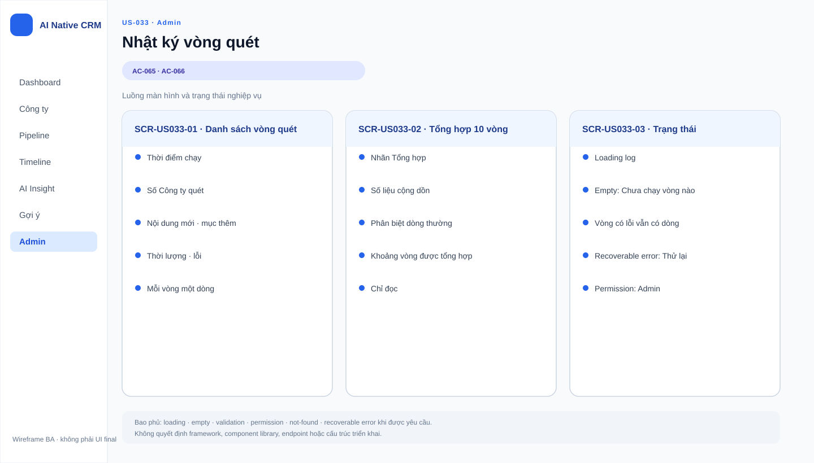

# Business Specification — US-033: Nhật ký vòng quét

## 1. Document Information
| Field | Value |
|---|---|
| Story | `US-033` |
| Version | `1.0` |
| Status | `AWAITING_SPECIFICATION_APPROVAL` |
| Sources | `REQ-505`, `BR-015`, `FEAT-033`, `AC-065..066`, DoR |
## 2. Purpose
**[CONFIRMED — REQ-505]** Quy định tổng kết vòng quét để Quản trị biết kết quả mà không đọc từng mục.
## 3. User Story
**[CONFIRMED — US-033]** As a Quản trị, I want mỗi vòng ghi một dòng tổng kết, so that tôi thấy vòng quét đang làm gì.
## 4. Business Goal
**[CONFIRMED — REQ-505]** Quản trị có một dòng mỗi vòng và dòng cộng dồn sau mỗi 10 vòng.
## 5. Scope
- **[CONFIRMED — AC-065]** Ghi thời điểm, số công ty, nội dung mới, mục thêm, thời lượng, lỗi sau mỗi vòng.
- **[CONFIRMED — AC-066]** Thêm một dòng tổng hợp cộng dồn mỗi 10 vòng.
## 6. Out of Scope
- **[CONFIRMED — US-031/032]** Xử lý bên trong và nhịp của vòng quét.
- **[CONFIRMED — project-rules]** Không có monitoring, telemetry, log shipping hoặc prompt/log agent.
## 7. Actor / Permission
| Actor | Permission | Evidence |
|---|---|---|
| Quản trị | Xem nhật ký tổng kết vòng quét. | **[CONFIRMED]** US-033 |
| Sales | Quyền xem chưa được nêu. | **[OPEN QUESTION]** Q-033-01 |
## 8. Business Rules
| ID | Rule | Evidence |
|---|---|---|
| BR-US033-01 | Mỗi vòng hoàn tất có một dòng gồm sáu nhóm thông tin. | **[CONFIRMED]** REQ-505; AC-065 |
| BR-US033-02 | Mỗi 10 vòng có thêm dòng cộng dồn. | **[CONFIRMED]** BR-015; AC-066 |
| BR-US033-03 | Đây là nhật ký nghiệp vụ, không là telemetry/prompt log. | **[CONFIRMED]** project-rules |
## 9. Business Data Dictionary
| Data | Meaning | Evidence |
|---|---|---|
| Dòng tổng kết | Tóm tắt kết quả một vòng quét. | **[CONFIRMED]** AC-065 |
| Số công ty/nội dung mới/mục thêm | Các lượng kết quả vòng. | **[CONFIRMED]** AC-065 |
| Thời lượng/lỗi | Thời gian và lỗi của vòng. | **[CONFIRMED]** AC-065 |
| Dòng cộng dồn | Tổng hợp sau 10 vòng. | **[CONFIRMED]** AC-066 |
## 10. Business Flow
1. **[CONFIRMED — AC-065]** Khi vòng quét xong, tạo một dòng tổng kết.
2. **[CONFIRMED — AC-066]** Khi đủ 10 vòng, thêm dòng cộng dồn.
## 11. Acceptance Criteria
### AC-065 — Dòng tổng kết mỗi vòng
```gherkin
Given vòng quét chạy xong một vòng
Then nhật ký có thời điểm, số công ty, nội dung mới, mục thêm, thời lượng và lỗi.
```
### AC-066 — Dòng cộng dồn mỗi 10 vòng
```gherkin
Given đã chạy 10 vòng
Then có thêm một dòng tổng hợp cộng dồn.
```
## 12. Screen Specification
| Area | Behavior | Evidence |
|---|---|---|
| Khu vực Quản trị | Hiển thị dòng từng vòng và dòng cộng dồn. | **[CONFIRMED]** AC-065..066 |
## 13. Screen Design

> **UI-DESIGN UPDATE — 2026-08-14:** Wireframe BA dưới đây được tạo từ các US/AC hiện hành và thay thế trạng thái “chưa có asset” được ghi nhận trước bước UI Design.


Không có asset đã phê duyệt. **[ASSUMPTION — A-033-01]** UI design quyết bố cục, miễn đủ AC.
## 14. Screen States
| State | Outcome | Evidence |
|---|---|---|
| Vòng hoàn tất | Có dòng tổng kết. | **[CONFIRMED]** AC-065 |
| Vòng có lỗi | Dòng nêu lỗi. | **[CONFIRMED]** AC-065 |
| Đủ 10 vòng | Có dòng cộng dồn. | **[CONFIRMED]** AC-066 |
## 15. Validation
| Condition | Response | Evidence |
|---|---|---|
| Một vòng hoàn tất | Có đủ sáu nhóm thông tin. | **[CONFIRMED]** AC-065 |
| Vòng chưa hoàn tất | Có tạo dòng hay không chưa được nêu. | **[OPEN QUESTION]** Q-033-02 |
## 16. Dependencies
| Direction | Item | Evidence |
|---|---|---|
| Upstream | US-031 cung cấp vòng và kết quả. | **[CONFIRMED]** user-stories |
| Related | US-032 nhịp quét; US-037 dừng AI. | **[CONFIRMED]** function decomposition |
## 17. Business-level NFR Expectations
- **[CONFIRMED — REQ-505]** Dòng tổng kết đủ để Quản trị hiểu kết quả.
- **[CONFIRMED — project-rules]** Không mở rộng thành log shipping/monitoring/prompt log.
## 18. Test Scenarios
| ID | Scenario | AC | Expected result |
|---|---|---|---|
| TC-033-01 | Vòng quét hoàn tất, kể cả có lỗi. | AC-065 | Có dòng đủ sáu nhóm thông tin. |
| TC-033-02 | Vòng thứ mười hoàn tất. | AC-066 | Có thêm dòng cộng dồn. |
## 19. Traceability
| Chain | Evidence |
|---|---|
| `REQ-505 → EPIC-08 → FEAT-033 → US-033 → AC-065 → TC-033-01` | **[CONFIRMED]** architect handoff |
| `REQ-505 → EPIC-08 → FEAT-033 → US-033 → AC-066 → TC-033-02` | **[CONFIRMED]** architect handoff |
## 20. Assumptions
| ID | Assumption | Status |
|---|---|---|
| A-033-01 | Không tạo asset trước ui-design. | **[ASSUMPTION]** |
## 21. Open Questions
| ID | Question | Owner |
|---|---|---|
| Q-033-01 | Sales có quyền xem không? | PO |
| Q-033-02 | Vòng dừng bất thường có dòng tổng kết không? | PO |
## 22. Definition of Ready
| Item | Status | Evidence |
|---|---|---|
| Actor/value, AC, dependency, traceability | READY | REQ-505 → FEAT-033 → US-033 → AC-065..066 → TC |
| DoR nguồn | READY | **[CONFIRMED]** dor-review |
## 23. Technical Handoff
- **[CONFIRMED — AC-065..066]** Bảo toàn một dòng mỗi vòng và dòng cộng dồn sau 10 vòng.
- **[CONFIRMED — project-rules]** Không biến nhật ký nghiệp vụ thành monitoring/log shipping/prompt log.
## 24. Change Log
| Version | Date | Change | Author/Approver |
|---|---|---|---|
| 1.0 | 2026-08-14 | Tạo specification 24 mục. | Codex / awaiting human specification approval |
