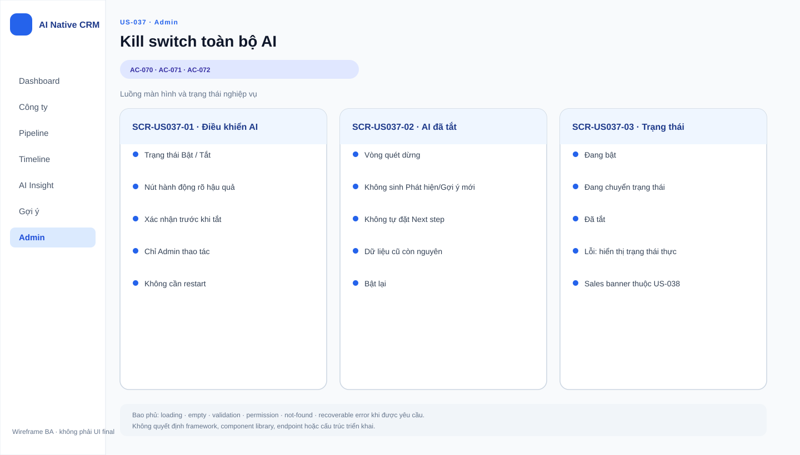

# Business Specification — US-037: Kill switch toàn bộ AI

## 1. Document Information
| Field | Value |
|---|---|
| Story | US-037 |
| Version | 1.0 |
| Status | AWAITING_SPECIFICATION_APPROVAL |
| Sources | REQ-603, BR-016, US-037, architect handoff, DoR review |

## 2. Purpose
**[CONFIRMED — REQ-603]** Cung cấp phanh vận hành để Quản trị dừng toàn bộ hoạt động AI ngay lập tức.

## 3. User Story
**[CONFIRMED — US-037]** As a Quản trị, I want một nút tắt toàn bộ AI, so that tôi có phanh khi mọi thứ đi sai.

## 4. Business Goal
**[CONFIRMED — REQ-603]** Ngăn hoạt động AI mới mà không làm mất dữ liệu đã tạo hay dừng CRM thủ công.

## 5. Scope
- **[CONFIRMED — AC-070]** Tắt AI hiệu lực ngay không restart; trong hai chu kỳ sau dừng vòng quét, phát hiện, gợi ý và tự đặt Việc tiếp theo.
- **[CONFIRMED — AC-071]** Giữ nguyên dữ liệu đã sinh trước khi tắt.
- **[CONFIRMED — AC-072]** Bật lại để vòng quét chạy tiếp.

## 6. Out of Scope
- **[CONFIRMED — REQ-604]** Thông báo AI đang tắt cho Sales; US-038.
- **[CONFIRMED — REQ-605]** Ghi vết bật/tắt; US-039.
- **[CONFIRMED — REQ-113, US-040]** Chi tiết chứng minh CRM Nhóm 1 hoạt động khi AI tắt.

## 7. Actor / Permission
| Actor | Business permission | Evidence |
|---|---|---|
| Quản trị | Tắt và bật lại toàn bộ AI. | **[CONFIRMED]** US-037, AC-070..072 |
| Sales | Không có quyền bật/tắt được nêu trong story. | **[OPEN QUESTION]** Q-037-01 |

## 8. Business Rules
| ID | Rule | Evidence |
|---|---|---|
| BR-US037-01 | Kill switch có hiệu lực ngay, không cần chạy lại sản phẩm. | **[CONFIRMED]** REQ-603, AC-070 |
| BR-US037-02 | Khi tắt, mọi hoạt động AI dừng: vòng quét, phát hiện mới, gợi ý mới, tự đặt Việc tiếp theo. | **[CONFIRMED]** AC-070 |
| BR-US037-03 | Dữ liệu đã sinh không bị xóa khi tắt. | **[CONFIRMED]** AC-071, BR-016 |
| BR-US037-04 | Khi bật lại, vòng quét chạy tiếp. | **[CONFIRMED]** AC-072 |
| BR-US037-05 | Ranh giới BR-017 vẫn áp dụng khi AI bật hay tắt. | **[CONFIRMED]** BR-017 |

## 9. Business Data Dictionary
| Business data | Meaning | Rule | Evidence |
|---|---|---|---|
| Trạng thái AI | Trạng thái toàn bộ AI đang bật hoặc tắt. | Quản trị thay đổi bằng kill switch. | **[CONFIRMED]** AC-070..072 |
| Dữ liệu đã sinh | Dữ liệu tạo trước khi tắt AI. | Không bị xóa. | **[CONFIRMED]** AC-071 |
| Hoạt động AI | Vòng quét, phát hiện, gợi ý, tự đặt Next step. | Dừng khi AI tắt. | **[CONFIRMED]** AC-070 |

## 10. Business Flow
### BF-037-01 — Tắt AI
1. **[CONFIRMED — AC-070]** AI đang chạy.
2. **[CONFIRMED — AC-070]** Quản trị bấm tắt toàn bộ AI.
3. **[CONFIRMED — AC-070]** Ngay không restart, trong hai chu kỳ kế tiếp không có hoạt động AI mới.
4. **[CONFIRMED — AC-071]** Dữ liệu đã sinh vẫn còn.

### BF-037-02 — Bật lại AI
1. **[CONFIRMED — AC-072]** AI đang tắt.
2. **[CONFIRMED — AC-072]** Quản trị bật lại.
3. **[CONFIRMED — AC-072]** Vòng quét chạy tiếp.

## 11. Acceptance Criteria
### AC-070 — Tắt AI hiệu lực ngay
```gherkin
Scenario: Tắt AI có hiệu lực ngay
  Given AI đang chạy
  When Quản trị tắt toàn bộ AI
  Then trong hai chu kỳ kế tiếp không có vòng quét, phát hiện, gợi ý hay tự đặt Việc tiếp theo mới và không cần restart.
```
### AC-071 — Giữ dữ liệu
```gherkin
Scenario: Dữ liệu đã sinh còn nguyên
  Given Quản trị vừa tắt AI
  Then dữ liệu đã sinh trước đó không bị xóa.
```
### AC-072 — Bật lại
```gherkin
Scenario: Bật lại chạy tiếp
  Given AI đang tắt
  When Quản trị bật lại
  Then vòng quét chạy tiếp.
```

## 12. Screen Specification
| Area | Required behavior | Evidence |
|---|---|---|
| Điều khiển Quản trị | Có thao tác tắt/bật toàn bộ AI. | **[CONFIRMED]** AC-070, AC-072 |
| Trạng thái sau tắt | Sales notification thuộc US-038. | **[CONFIRMED]** REQ-604 |

## 13. Screen Design

> **UI-DESIGN UPDATE — 2026-08-14:** Wireframe BA dưới đây được tạo từ các US/AC hiện hành và thay thế trạng thái “chưa có asset” được ghi nhận trước bước UI Design.


Không có asset wireframe được phê duyệt. **[ASSUMPTION — A-037-01]** UX quyết định vị trí/nhãn điều khiển, phải làm Quản trị thực hiện được AC-070..072.

## 14. Screen States
| State | Outcome | Evidence |
|---|---|---|
| AI đang bật | Các hoạt động AI được phép theo use case riêng và guardrails. | **[INFERRED]** AC-072, BR-017 |
| AI đang tắt | Không tạo hoạt động AI mới; dữ liệu cũ còn nguyên. | **[CONFIRMED]** AC-070..071 |

## 15. Validation
| Condition | Response | Evidence |
|---|---|---|
| Quản trị tắt AI đang chạy | Hiệu lực không restart, quan sát hai chu kỳ sau. | **[CONFIRMED]** AC-070 |
| AI đã tắt | Không xóa dữ liệu. | **[CONFIRMED]** AC-071 |
| Bật lại | Vòng quét chạy tiếp. | **[CONFIRMED]** AC-072 |

## 16. Dependencies
| Direction | Item | Dependency | Evidence |
|---|---|---|---|
| Controlled | US-013, US-018, US-025, US-031 | Các use case AI chịu trạng thái kill switch. | **[CONFIRMED]** US-037 dependency, AC-070 |
| Downstream | US-038, US-039 | Hiển thị trạng thái và ghi vết thay đổi. | **[CONFIRMED]** REQ-604..605 |

## 17. Business-level NFR Expectations
- **[CONFIRMED — REQ-603]** Kill switch có hiệu lực ngay, không restart.
- **[CONFIRMED — REQ-113]** Tắt AI không làm hỏng CRM Nhóm 1.
- **[CONFIRMED — BR-017]** Automation không được vượt guardrail, kể cả quanh thời điểm đổi trạng thái.

## 18. Test Scenarios
| TC | Business scenario | AC / rule | Expected result |
|---|---|---|---|
| TC-037-01 | Tắt AI khi vòng quét đang chạy, theo dõi hai chu kỳ sau. | AC-070, BR-US037-02 | Không có hoạt động AI mới, không restart. |
| TC-037-02 | Kiểm tra dữ liệu đã sinh ngay sau khi tắt. | AC-071, BR-US037-03 | Dữ liệu vẫn còn nguyên. |
| TC-037-03 | Bật lại AI sau khi tắt. | AC-072, BR-US037-04 | Vòng quét chạy tiếp. |

## 19. Traceability
| Chain | Evidence |
|---|---|
| `REQ-603 → EPIC-10 → FEAT-037 → US-037 → AC-070..072 → TC-037-01..03 (T-9)` | **[CONFIRMED]** architect handoff |
| `BR-016 → BR-US037-03 → AC-071` | **[CONFIRMED]** requirement analysis |

## 20. Assumptions
| ID | Assumption | Status |
|---|---|---|
| A-037-01 | Cách biểu diễn điều khiển quản trị chưa được chốt. | **[ASSUMPTION]** Không đổi quyền/hành vi AC. |

## 21. Open Questions
| ID | Question | Owner / impact |
|---|---|---|
| Q-037-01 | Có vai trò nào ngoài Quản trị được bật/tắt AI không? | PO; phân quyền. |
| Q-037-02 | Hành vi của tác vụ đang dở tại thời điểm tắt được quan sát thế nào ngoài hai chu kỳ kế tiếp? | Tech Lead; an toàn giữa chu kỳ. |

## 22. Definition of Ready
| DoR item | Status | Evidence |
|---|---|---|
| Actor, giá trị và scope rõ | READY | US-037, REQ-603 |
| AC quan sát được | READY | AC-070..072 |
| Dependencies xác định | READY | US-013, US-018, US-025, US-031 |
| Traceability rõ | READY | REQ-603 → FEAT-037 → US-037 → AC → TC |
| Human approval | AWAITING_SPECIFICATION_APPROVAL | Gate 1 |

## 23. Technical Handoff
**[CONFIRMED — REQ-603, AR-4]** Kill switch phải hiệu lực ngay, không restart, và dừng mọi hoạt động AI nhưng không xóa dữ liệu. **[OPEN QUESTION — Q-037-02]** Tech Lead cần quyết cách chuyển trạng thái an toàn giữa chu kỳ; mọi automation vẫn phải qua AutomationPolicyGuard. Không đề xuất cơ chế kỹ thuật cụ thể.

## 24. Change Log
| Version | Date | Change | Author/Approver |
|---|---|---|---|
| 1.0 | 2026-08-14 | Tạo specification 24 mục cho US-037. | Codex / awaiting human specification approval |
