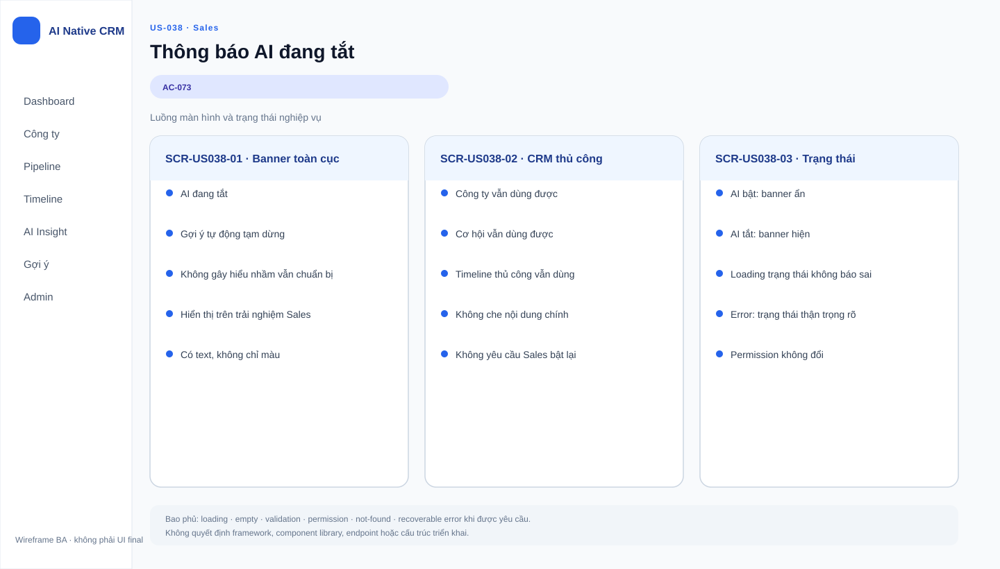

# Business Specification — US-038: Trạng thái AI tắt cho Sales

## 1. Document Information
| Field | Value |
|---|---|
| Story | `US-038` |
| Version | `1.0` |
| Status | `AWAITING_SPECIFICATION_APPROVAL` |
| Sources | `REQ-604`, `FEAT-038`, `AC-073`, DoR |
## 2. Purpose
**[CONFIRMED — REQ-604]** Xác định thông báo rõ cho Sales khi Quản trị đã tắt AI.
## 3. User Story
**[CONFIRMED — US-038]** As a Sales, I want thấy khi AI đang tắt, so that tôi không tưởng nhầm hệ thống vẫn chuẩn bị cho mình.
## 4. Business Goal
**[CONFIRMED — REQ-604]** Sales nhận biết AI tắt thay vì hệ thống im lặng; CRM thủ công vẫn chạy.
## 5. Scope
- **[CONFIRMED — AC-073]** Hiện dòng thông báo rõ tính năng gợi ý đang tắt.
- **[CONFIRMED — AC-073]** Trạng thái không im lặng biến mất khi Sales dùng sản phẩm.
## 6. Out of Scope
- **[CONFIRMED — US-037/039]** Kill switch và audit trail bật/tắt.
- **[CONFIRMED — REQ-113]** Thay đổi hành vi CRM thủ công.
## 7. Actor / Permission
| Actor | Permission | Evidence |
|---|---|---|
| Sales | Xem trạng thái AI tắt. | **[CONFIRMED]** AC-073 |
| Quản trị | Tắt AI là điều kiện upstream. | **[CONFIRMED]** US-037 |
## 8. Business Rules
| ID | Rule | Evidence |
|---|---|---|
| BR-US038-01 | AI tắt phải có dòng thông báo rõ cho Sales. | **[CONFIRMED]** REQ-604; AC-073 |
| BR-US038-02 | Trạng thái không tự im lặng biến mất. | **[CONFIRMED]** AC-073 |
| BR-US038-03 | CRM thủ công vẫn hoạt động khi AI tắt. | **[CONFIRMED]** REQ-113 |
## 9. Business Data Dictionary
| Data | Meaning | Evidence |
|---|---|---|
| Trạng thái AI tắt | AI đã bị Quản trị tắt. | **[CONFIRMED]** REQ-603 |
| Dòng thông báo | Nêu rõ tính năng gợi ý đang tắt. | **[CONFIRMED]** REQ-604 |
## 10. Business Flow
1. **[CONFIRMED — AC-073]** Quản trị đã tắt AI.
2. **[CONFIRMED — AC-073]** Sales dùng sản phẩm và thấy thông báo rõ.
## 11. Acceptance Criteria
### AC-073 — Dòng thông báo đang tắt
```gherkin
Given Quản trị đã tắt AI
When tôi dùng sản phẩm
Then tôi thấy dòng thông báo rõ tính năng gợi ý đang tắt; trạng thái không im lặng biến mất.
```
## 12. Screen Specification
| Area | Behavior | Evidence |
|---|---|---|
| Trải nghiệm Sales | Khi AI tắt, hiện dòng thông báo rõ. | **[CONFIRMED]** AC-073 |
## 13. Screen Design

> **UI-DESIGN UPDATE — 2026-08-14:** Wireframe BA dưới đây được tạo từ các US/AC hiện hành và thay thế trạng thái “chưa có asset” được ghi nhận trước bước UI Design.


Không có asset đã phê duyệt. **[ASSUMPTION — A-038-01]** UI design chọn biểu đạt miễn trạng thái vẫn rõ.
## 14. Screen States
| State | Outcome | Evidence |
|---|---|---|
| AI tắt | Sales thấy thông báo. | **[CONFIRMED]** AC-073 |
| AI bật | Nội dung trạng thái chưa được story quy định. | **[OPEN QUESTION]** Q-038-01 |
## 15. Validation
| Condition | Response | Evidence |
|---|---|---|
| AI tắt và Sales dùng sản phẩm | Hiện thông báo rõ. | **[CONFIRMED]** AC-073 |
| Không có thông báo | Không đạt REQ-604. | **[CONFIRMED]** REQ-604 |
## 16. Dependencies
| Direction | Item | Evidence |
|---|---|---|
| Upstream | US-037 cung cấp trạng thái tắt. | **[CONFIRMED]** user-stories |
| Related | US-039 ghi vết thay đổi. | **[CONFIRMED]** function decomposition |
## 17. Business-level NFR Expectations
- **[CONFIRMED — REQ-604]** Trạng thái nhận biết được khi Sales dùng sản phẩm.
- **[CONFIRMED — REQ-113]** CRM thủ công tiếp tục chạy.
## 18. Test Scenarios
| ID | Scenario | AC | Expected result |
|---|---|---|---|
| TC-038-01 | Tắt AI, sau đó Sales dùng sản phẩm. | AC-073 | Sales thấy dòng thông báo rõ. |
## 19. Traceability
| Chain | Evidence |
|---|---|
| `REQ-604 → EPIC-10 → FEAT-038 → US-038 → AC-073 → TC-038-01` | **[CONFIRMED]** architect handoff |
## 20. Assumptions
| ID | Assumption | Status |
|---|---|---|
| A-038-01 | Không tạo asset trước ui-design. | **[ASSUMPTION]** |
## 21. Open Questions
| ID | Question | Owner |
|---|---|---|
| Q-038-01 | Khi AI bật có cần trạng thái hiển thị không? | PO |
## 22. Definition of Ready
| Item | Status | Evidence |
|---|---|---|
| Actor/value, AC, dependency, traceability | READY | REQ-604 → FEAT-038 → US-038 → AC-073 → TC-038-01 |
| DoR nguồn | READY | **[CONFIRMED]** dor-review |
## 23. Technical Handoff
- **[CONFIRMED — REQ-604]** Không để Sales im lặng về trạng thái tắt.
- **[CONFIRMED — REQ-113]** Không làm CRM thủ công ngừng hoạt động.
## 24. Change Log
| Version | Date | Change | Author/Approver |
|---|---|---|---|
| 1.0 | 2026-08-14 | Tạo specification 24 mục. | Codex / awaiting human specification approval |
