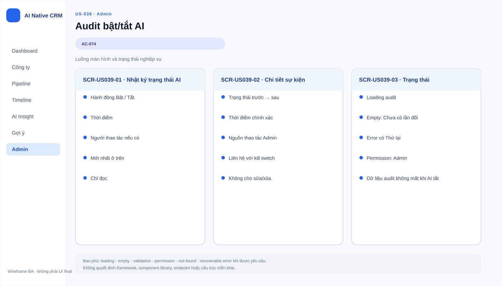

# Business Specification — US-039: Ghi vết bật/tắt AI

## 1. Document Information
| Field | Value |
|---|---|
| Story | `US-039` |
| Version | `1.0` |
| Status | `AWAITING_SPECIFICATION_APPROVAL` |
| Sources | `REQ-605`, `BR-016`, `FEAT-039`, `AC-074`, DoR |
## 2. Purpose
**[CONFIRMED — REQ-605]** Xác định audit trail nghiệp vụ cho mỗi lần bật/tắt AI.
## 3. User Story
**[CONFIRMED — US-039]** As a Quản trị, I want mỗi lần tắt/bật được ghi vết, so that có audit trail.
## 4. Business Goal
**[CONFIRMED — REQ-605]** Quản trị có bằng chứng cho lần tắt, lần bật và thời điểm mỗi thao tác.
## 5. Scope
- **[CONFIRMED — AC-074]** Ghi vết tắt AI kèm thời điểm.
- **[CONFIRMED — AC-074]** Ghi vết bật lại AI kèm thời điểm.
## 6. Out of Scope
- **[CONFIRMED — US-037/038]** Kill switch và thông báo Sales.
- **[CONFIRMED — project-rules]** Monitoring, telemetry, log shipping, prompt/log agent.
## 7. Actor / Permission
| Actor | Permission | Evidence |
|---|---|---|
| Quản trị | Bật/tắt AI, tạo sự kiện cần ghi vết. | **[CONFIRMED]** US-039 |
| Sales | Quyền xem audit trail chưa nêu. | **[OPEN QUESTION]** Q-039-01 |
## 8. Business Rules
| ID | Rule | Evidence |
|---|---|---|
| BR-US039-01 | Mỗi lần tắt có ghi vết và thời điểm. | **[CONFIRMED]** AC-074 |
| BR-US039-02 | Mỗi lần bật lại có ghi vết và thời điểm. | **[CONFIRMED]** AC-074 |
| BR-US039-03 | Tắt AI không xóa dữ liệu AI đã sinh. | **[CONFIRMED]** BR-016; REQ-603 |
| BR-US039-04 | Audit trail không là log shipping/monitoring/prompt log. | **[CONFIRMED]** project-rules |
## 9. Business Data Dictionary
| Data | Meaning | Evidence |
|---|---|---|
| Sự kiện bật/tắt | Thao tác Quản trị đổi trạng thái AI. | **[CONFIRMED]** AC-074 |
| Thời điểm | Thời gian gắn từng thao tác. | **[CONFIRMED]** REQ-605 |
| Audit trail | Tập ghi vết nghiệp vụ bật/tắt. | **[CONFIRMED]** US-039 |
## 10. Business Flow
1. **[CONFIRMED — AC-074]** Quản trị bấm tắt AI; hệ thống ghi vết/thời điểm.
2. **[CONFIRMED — AC-074]** Quản trị bật lại AI; hệ thống ghi vết/thời điểm.
## 11. Acceptance Criteria
### AC-074 — Ghi vết
```gherkin
Given tôi bấm tắt hoặc bật lại AI
Then hệ thống ghi vết kèm thời điểm cho cả hai lần bấm.
```
## 12. Screen Specification
| Area | Behavior | Evidence |
|---|---|---|
| Audit trail Quản trị | Cho biết bật/tắt và thời điểm. | **[CONFIRMED]** AC-074 |
## 13. Screen Design

> **UI-DESIGN UPDATE — 2026-08-14:** Wireframe BA dưới đây được tạo từ các US/AC hiện hành và thay thế trạng thái “chưa có asset” được ghi nhận trước bước UI Design.


Không có asset đã phê duyệt. **[ASSUMPTION — A-039-01]** UI design quyết bố cục audit trail.
## 14. Screen States
| State | Outcome | Evidence |
|---|---|---|
| Sau tắt | Có ghi vết tắt/thời điểm. | **[CONFIRMED]** AC-074 |
| Sau bật | Có ghi vết bật/thời điểm. | **[CONFIRMED]** AC-074 |
## 15. Validation
| Condition | Response | Evidence |
|---|---|---|
| Bấm bật/tắt | Có hành động và thời điểm tương ứng. | **[CONFIRMED]** AC-074 |
| Thông tin audit bổ sung | Chưa được nguồn nêu. | **[OPEN QUESTION]** Q-039-02 |
## 16. Dependencies
| Direction | Item | Evidence |
|---|---|---|
| Upstream | US-037 cung cấp thao tác bật/tắt. | **[CONFIRMED]** user-stories |
| Downstream | US-038 hiển thị trạng thái tắt. | **[CONFIRMED]** function decomposition |
## 17. Business-level NFR Expectations
- **[CONFIRMED — REQ-605]** Mỗi thay đổi bật/tắt có bằng chứng thời điểm.
- **[CONFIRMED — project-rules]** Không thêm telemetry, monitoring, log shipping hay prompt log.
## 18. Test Scenarios
| ID | Scenario | AC | Expected result |
|---|---|---|---|
| TC-039-01 | Quản trị tắt rồi bật lại AI. | AC-074 | Có ghi vết thời điểm cho cả hai. |
## 19. Traceability
| Chain | Evidence |
|---|---|
| `REQ-605 → EPIC-10 → FEAT-039 → US-039 → AC-074 → TC-039-01` | **[CONFIRMED]** architect handoff |
## 20. Assumptions
| ID | Assumption | Status |
|---|---|---|
| A-039-01 | Không tạo asset trước ui-design. | **[ASSUMPTION]** |
## 21. Open Questions
| ID | Question | Owner |
|---|---|---|
| Q-039-01 | Sales có quyền xem audit trail không? | PO |
| Q-039-02 | Có cần ghi ai thao tác/chính sách lưu giữ không? | PO |
## 22. Definition of Ready
| Item | Status | Evidence |
|---|---|---|
| Actor/value, AC, dependency, traceability | READY | REQ-605 → FEAT-039 → US-039 → AC-074 → TC-039-01 |
| DoR nguồn | READY | **[CONFIRMED]** dor-review |
## 23. Technical Handoff
- **[CONFIRMED — AC-074]** Bảo toàn ghi vết bật/tắt và thời điểm.
- **[CONFIRMED — BR-016]** Không xóa dữ liệu AI đã sinh; không mở rộng audit trail thành monitoring/log shipping/prompt log.
## 24. Change Log
| Version | Date | Change | Author/Approver |
|---|---|---|---|
| 1.0 | 2026-08-14 | Tạo specification 24 mục. | Codex / awaiting human specification approval |
