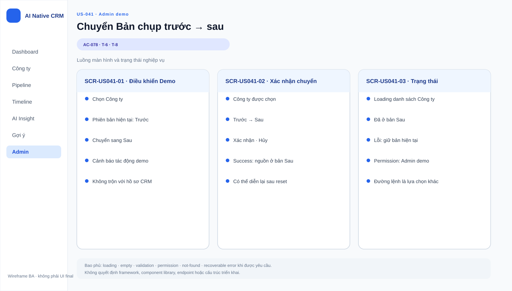

# BA Specification — US-041: Chuyển bản chụp trước→sau

> Sản phẩm: AI Native CRM — Sales B2B ITO  
> Phiên bản: 1.0  
> Ngày: 2026-08-14  
> Trạng thái: AWAITING_SPECIFICATION_APPROVAL  
> Ngôn ngữ giao diện: Tiếng Việt  
> Story: US-041 · Feature: FEAT-041 · Epic: EPIC-12 · Domain: D7 — Ranh giới, Nghiệm thu & Vận hành

## 1. Mục đích tài liệu

Tài liệu này mô tả hành vi nghiệp vụ của US-041:

- cho phép chuyển một công ty từ bản chụp “trước” sang “sau”;
- kích hoạt kịch bản AI liên quan đến nguồn mới;
- phục vụ demo và test-harness;
- làm điểm phụ thuộc cho các test scenario T-6 và T-8.

Story này không phải tính năng CRM người dùng cuối, mà là cơ chế điều khiển demo/nghiệm thu.

## 2. Thông tin User Story

| Thuộc tính | Giá trị |
|---|---|
| User Story | US-041 — Chuyển bản chụp trước→sau |
| Actor chính | A-Admin / người vận hành demo |
| User story statement | Là quản trị viên hoặc người vận hành demo, tôi muốn chuyển một công ty từ bản chụp trước sang sau để kích hoạt và diễn lại các kịch bản AI. |
| Business value | Cho phép dựng lại đúng bối cảnh demo khi nguồn thay đổi giữa hai phiên bản. |
| Priority | Must — 17/20 |
| Dependency đầu vào | US-011 |
| Downstream dependency | US-013, US-031, US-032, US-037 và các kịch bản demo liên quan |
| Requirement | REQ-703 |
| Business assumption | AS-02 |
| Acceptance test cấp hệ thống | T-6, T-8 |
| DoR | Draft trong nguồn, chờ chuẩn hóa theo spec này |

## 3. Mục tiêu và tiêu chí thành công

### 3.1 Mục tiêu nghiệp vụ

- Một công ty có thể được chuyển từ trạng thái dữ liệu trước sang sau.
- Sau khi chuyển, lần đọc kế tiếp phải thấy nội dung mới.
- Có thể thực hiện từ UI hoặc từ một lệnh.
- Kịch bản demo AI có thể được kích hoạt lại ổn định.

### 3.2 Tiêu chí thành công

- Chuyển đúng công ty cần chuyển.
- Sau chuyển, nguồn của công ty phản ánh bản chụp “sau”.
- Người vận hành không phải chỉnh tay từng nội dung nguồn.
- Story này hoạt động như một công tắc demo, không làm vỡ dữ liệu các công ty khác.

## 4. Phạm vi

### 4.1 Trong phạm vi

- Chọn một công ty ở bản chụp “trước”.
- Chuyển công ty đó sang bản chụp “sau”.
- Cho phép thao tác từ UI hoặc lệnh.
- Đánh dấu trạng thái nguồn để lần đọc sau lấy nội dung mới.

### 4.2 Ngoài phạm vi

- Đọc nguồn từ web — US-011.
- Rút phát hiện từ bản lưu — US-013.
- Vòng quét tự thêm nội dung — US-031.
- Kiểm thử tự động — US-043.
- Bất kỳ chỉnh sửa thủ công từng dòng nguồn nào trong story này.

## 5. Vai trò và quyền

| Hành động | A-Admin / vận hành demo | Sales | A-AI |
|---|---:|---:|---:|
| Chuyển trước→sau | Có | Không | Không |
| Xem kết quả sau chuyển | Có | Có | Có |
| Tự kích hoạt lại nguồn cho mục đích demo | Có, trong ngữ cảnh test-harness | Không | Không |

## 6. Mô hình nghiệp vụ

### 6.1 Khái niệm chính

- Bản chụp trước: trạng thái nguồn cũ của một công ty.
- Bản chụp sau: trạng thái nguồn mới của cùng công ty.
- Chuyển bản chụp: thao tác đổi trạng thái nguồn đang được dùng cho công ty.

### 6.2 Quan hệ nghiệp vụ

- Một công ty chỉ có một trạng thái nguồn đang active tại một thời điểm.
- Sau khi chuyển, lần đọc kế tiếp phải nhận bản chụp sau.
- Chuyển bản chụp là bề mặt điều khiển demo, không phải nghiệp vụ bán hàng.

## 7. Từ điển dữ liệu nghiệp vụ

| Trường | Ý nghĩa nghiệp vụ | Bắt buộc | Quy tắc |
|---|---|---:|---|
| Công ty | Đối tượng được chuyển bản chụp | Có | Phải đúng công ty cần diễn kịch bản |
| Trạng thái bản chụp | Trước hoặc sau | Có | Chỉ dùng đúng hai trạng thái này |
| Nội dung bản chụp | Nguồn dữ liệu mà lần đọc kế tiếp sẽ thấy | Có | Phải phản ánh đúng phiên bản nguồn |
| Thời điểm chuyển | Dấu mốc cho demo và kiểm thử | Có | Dùng để xác nhận chuyển đã diễn ra |

## 8. Luồng nghiệp vụ

### BF-01 — Chuyển từ giao diện

1. Người vận hành mở công ty đang ở bản chụp trước.
2. Người vận hành yêu cầu chuyển sang bản chụp sau.
3. Hệ thống cập nhật trạng thái nguồn.
4. Lần đọc kế tiếp của công ty đó hiển thị nội dung mới.

### BF-02 — Chuyển bằng lệnh

1. Người vận hành chạy lệnh chuyển bản chụp.
2. Hệ thống thực hiện cùng ý nghĩa nghiệp vụ như từ giao diện.
3. Công ty được đánh dấu sang bản chụp sau.

### BF-03 — Dùng lại cho demo

1. Sau khi chuyển, kịch bản AI được kích hoạt lại.
2. Nguồn mới được đọc ở lần tiếp theo.
3. Demo có thể được diễn lại theo đúng bối cảnh mới.

## 9. Quy tắc nghiệp vụ

| ID | Quy tắc | Mức |
|---|---|---|
| BR-US041-01 | Chỉ được chuyển giữa hai trạng thái “trước” và “sau”. | Bắt buộc |
| BR-US041-02 | Chuyển phải tác động đúng công ty được chọn. | Bắt buộc |
| BR-US041-03 | Sau khi chuyển, lần đọc kế tiếp phải thấy nội dung mới. | Bắt buộc |
| BR-US041-04 | Story này phục vụ demo/test-harness, không phải luồng CRM nghiệp vụ thường ngày. | Bắt buộc |

## 10. Acceptance Criteria chi tiết

### AC-078 — Chuyển từ UI hoặc lệnh

```gherkin
Scenario: Chuyển một công ty từ bản chụp trước sang sau
  Given một công ty ở bản chụp trước
  When tôi chuyển sang bản chụp sau từ giao diện hoặc bằng một lệnh
  Then nguồn của công ty đổi sang phiên bản sau
  And lần đọc kế tiếp thấy nội dung mới
```

## 11. Màn hình/hiển thị dự kiến

> **UI-DESIGN UPDATE — 2026-08-14:** Wireframe BA dưới đây mô tả màn hình điều khiển demo theo AC-078.



### 11.1 Hiển thị điều khiển demo

| Khu vực | Nội dung |
|---|---|
| Trạng thái hiện tại | Đang ở trước hay sau |
| Hành động | Chuyển sang trạng thái còn lại |
| Xác nhận | Thông báo đã chuyển thành công |

### 11.2 Quy tắc hiển thị

- Cần cho người vận hành biết công ty đang ở bản chụp nào.
- Sau khi chuyển, phải nhìn ra ngay rằng trạng thái đã thay đổi.
- Không biến control demo thành chức năng chỉnh sửa nội dung thủ công.

## 12. Handoff kỹ thuật

### 12.1 Ràng buộc cho Tech Lead

- Phải hỗ trợ cả giao diện và lệnh với cùng ý nghĩa nghiệp vụ.
- Không để thao tác này làm ảnh hưởng sang công ty khác.
- Phải bảo đảm lần đọc sau thấy đúng trạng thái mới.

### 12.2 Điểm cần quyết định khi thiết kế

- Cách xác nhận công ty đang ở trước hay sau.
- Cách phản hồi cho người vận hành biết việc chuyển đã thành công.
- Cách giữ cho story này gọn như một test-harness thay vì biến thành nghiệp vụ mới.

### 12.3 Rủi ro nghiệp vụ

- Nếu chuyển không đúng công ty, demo sẽ lệch bối cảnh.
- Nếu lần đọc sau vẫn thấy bản cũ, các kịch bản T-6/T-8 sẽ sai.
- Nếu story bị trộn với logic CRM thật, tính chất test-harness sẽ mất.

## 13. Truy vết

| Nguồn | Nội dung | Được cụ thể hóa tại | Test |
|---|---|---|---|
| REQ-703 | Chuyển bản chụp trước→sau từ UI hoặc lệnh | Mục 6, 8, 9, 10 | T-6, T-8 |
| AS-02 | Nguồn HTML nội bộ cho bài toán demo | Mục 2, 6 | T-6, T-8 |
| FEAT-041 | Chuyển bản chụp trước→sau | Toàn bộ tài liệu | T-6, T-8 |

## 14. Bộ tình huống kiểm thử tối thiểu

| ID | Tình huống | Kỳ vọng |
|---|---|---|
| TC-041-01 | Chuyển từ UI | Nguồn đổi sang bản sau |
| TC-041-02 | Chuyển bằng lệnh | Nguồn đổi sang bản sau |
| TC-041-03 | Đọc lại sau khi chuyển | Thấy nội dung mới |
| TC-041-04 | Chuyển đúng công ty | Chỉ công ty đó bị ảnh hưởng |

## 15. Definition of Ready

- [x] Actor rõ: A-Admin / vận hành demo.
- [x] Nguồn trace rõ: REQ-703 và AS-02.
- [x] Story là test-harness, không lẫn CRM nghiệp vụ.
- [x] AC nguồn rõ ràng và đủ tối thiểu.
- [ ] PO xác nhận từ UI và từ lệnh có cùng mức ưu tiên nếu cần tách trải nghiệm.

## 16. Definition of Done đề xuất

- [ ] Chuyển được từ UI hoặc lệnh.
- [ ] Lần đọc kế tiếp thấy bản chụp sau.
- [ ] Không ảnh hưởng công ty khác.
- [ ] T-6 và T-8 pass.

## 17. Giả định và câu hỏi mở

- Giả định: “trước” và “sau” là hai trạng thái duy nhất của nguồn trong test-harness.
- Q-041-01: Có cần cho phép chuyển ngược lại từ “sau” về “trước” trong cùng story hay không?
- Q-041-02: Có cần ghi rõ người vận hành nào đã thực hiện chuyển bản chụp hay chỉ cần thời điểm chuyển?

## 18. Change log

| Version | Date | Nội dung |
|---|---|---|
| 1.0 | 2026-08-14 | Tạo BA specification cho US-041 dựa trên REQ-703 và AS-02. |
