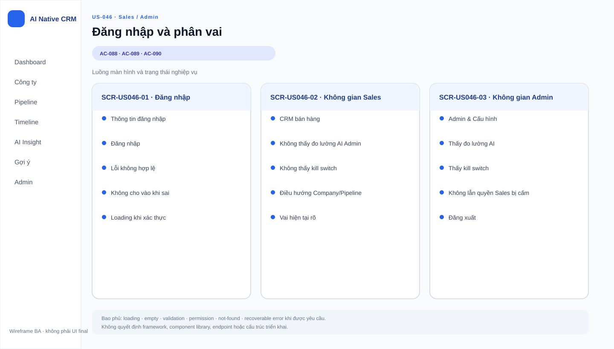

# Business Specification — US-046: Đăng nhập & phân vai Sales/Quản trị

## 1. Document Information

| Field | Value |
|---|---|
| Story | `US-046` — Đăng nhập & phân vai Sales/Quản trị |
| Feature / domain | `FEAT-046` / `D8 — Truy cập & Phân vai` |
| Version | `1.0` |
| Status | `AWAITING_SPECIFICATION_APPROVAL` |
| Date | `2026-08-14` |
| Priority | Must |
| Sources | `REQ-704`; `PRD §2`; `US-046`, `AC-088..090`; DoR; architect handoff traceability |

## 2. Purpose

**[CONFIRMED — US-046, REQ-704]** Xác định trải nghiệm đăng nhập cho hai vai Sales và Quản trị, để người dùng chỉ vào được CRM với vai hợp lệ và chỉ thấy phần phù hợp với vai đó.

## 3. User Story

**[CONFIRMED — US-046]** As a người dùng (Sales hoặc Quản trị), I want đăng nhập bằng tài khoản của mình và chỉ thấy đúng phần được phép, so that dữ liệu và công cụ vận hành được bảo vệ theo vai.

## 4. Business Goal

**[CONFIRMED — US-046, PRD §2]** Sales thực hiện công việc bán hàng thường ngày mà không thấy phần đo lường chất lượng AI hoặc nút tắt AI; Quản trị có thể thấy các phần vận hành đó sau khi đăng nhập. **[CONFIRMED — REQ-704]** Giám khảo có thể đăng nhập thật bằng hai tài khoản Sales và Quản trị để tự kiểm tra sản phẩm.

## 5. Scope

**[CONFIRMED — US-046, AC-088..090, PRD §2]**

- Cho Sales và Quản trị đăng nhập bằng thông tin hợp lệ để vào CRM đúng vai.
- Từ chối thông tin đăng nhập không hợp lệ và không cho vào CRM.
- Với Sales, không hiển thị bảng đo lường chất lượng AI và nút tắt AI của Quản trị.
- Với Quản trị, hiển thị bảng đo lường chất lượng AI và nút tắt AI.
- Dùng hai tài khoản mẫu do US-042 nạp để hỗ trợ kịch bản này.

## 6. Out of Scope

**[CONFIRMED — user-stories.md, PRD §2, US-044]**

- Bản dựng production, cấu hình môi trường, persistence, khởi động và đầu ra vận hành: US-044.
- Nạp/reset dữ liệu và tạo dữ liệu mẫu: US-042; US-046 chỉ sử dụng kết quả là hai tài khoản Sales/Quản trị.
- Nội dung, các chỉ số, điều chỉnh chu kỳ quét và hành vi của bảng điều khiển Quản trị: các use case quản trị riêng; story này chỉ phân biệt khả năng nhìn thấy phần được nêu trong AC-089.
- Phân quyền theo người sở hữu công ty/cơ hội; dữ liệu mẫu chỉ có một tài khoản Sales nên PRD không yêu cầu loại phân quyền này.
- Đăng xuất, khôi phục/đổi mật khẩu, tạo/sửa/vô hiệu hóa tài khoản, chính sách mật khẩu, giới hạn lần thử, hay quản lý phiên đăng nhập; nguồn chưa giao cho US-046.
- Monitoring, telemetry, log shipping, Grafana hoặc lưu prompt/log agent.

## 7. Actor / Permission

| Actor | Business permission | Evidence |
|---|---|---|
| Sales | Đăng nhập với tài khoản hợp lệ; vào CRM với vai Sales; không thấy bảng đo lường chất lượng AI và nút tắt AI của Quản trị. | **[CONFIRMED — AC-088..089, PRD §2]** |
| Quản trị | Đăng nhập với tài khoản hợp lệ; vào CRM với vai Quản trị; thấy bảng đo lường chất lượng AI và nút tắt AI. | **[CONFIRMED — AC-088..089, PRD §2]** |
| A-AI | Không đăng nhập CRM và không phải vai được cấp quyền trong story này. | **[CONFIRMED — requirement-analysis.md, dor-review.md]** |

## 8. Business Rules

| ID | Rule | Evidence |
|---|---|---|
| BR-US046-01 | Chỉ thông tin đăng nhập hợp lệ mới cho phép người dùng vào CRM, với vai của tài khoản đó. | **[CONFIRMED — AC-088, AC-090]** |
| BR-US046-02 | Thông tin đăng nhập không hợp lệ phải bị từ chối và không cho người dùng vào CRM. | **[CONFIRMED — AC-090]** |
| BR-US046-03 | Sales không được thấy bảng đo lường chất lượng AI hoặc nút tắt AI của Quản trị. | **[CONFIRMED — AC-089, PRD §2]** |
| BR-US046-04 | Quản trị phải thấy bảng đo lường chất lượng AI và nút tắt AI. | **[CONFIRMED — AC-089, PRD §2]** |
| BR-US046-05 | Không phân quyền theo người sở hữu; dữ liệu mẫu có một tài khoản Sales và mọi công ty thuộc tài khoản đó. | **[CONFIRMED — PRD §2; architect-handoff.md]** |
| BR-US046-06 | Các giới hạn tự động hóa của CRM vẫn áp dụng, bất kể vai hiển thị; story này không tạo đường vượt `AutomationPolicyGuard`. | **[CONFIRMED — architecture.md, project-rules.md]** |

## 9. Business Data Dictionary

| Business data / concept | Meaning | Applicability / rule | Evidence |
|---|---|---|---|
| Tài khoản | Danh tính mà Sales hoặc Quản trị dùng để đăng nhập CRM. | Cần có thông tin hợp lệ để vào CRM; nguồn không quy định dạng thông tin đăng nhập. | **[CONFIRMED — AC-088, REQ-704; OPEN QUESTION — Q-046-01]** |
| Vai | Phân loại quyền truy cập của tài khoản: Sales hoặc Quản trị. | Xác định phần người dùng thấy sau khi đăng nhập hợp lệ. | **[CONFIRMED — AC-088..089]** |
| Thông tin đăng nhập | Thông tin người dùng cung cấp để yêu cầu vào CRM. | Hợp lệ: được vào đúng vai; không hợp lệ: bị từ chối. | **[CONFIRMED — AC-088, AC-090]** |
| Bảng đo lường chất lượng AI | Phần thông tin vận hành về chất lượng AI dành cho Quản trị. | Sales không thấy; Quản trị thấy. Các chỉ số chi tiết không do story này xác định. | **[CONFIRMED — AC-089, PRD §2]** |
| Nút tắt AI | Điều khiển dành cho Quản trị để tắt phần AI. | Sales không thấy; Quản trị thấy. Hành vi khi sử dụng thuộc phạm vi quản trị/AI riêng. | **[CONFIRMED — AC-089, PRD §4 Nhóm 6]** |

## 10. Business Flow

### BF-046-01 — Sales đăng nhập hợp lệ

1. **[CONFIRMED — AC-088]** Một tài khoản Sales tồn tại.
2. **[CONFIRMED — AC-088]** Người dùng nhập đúng thông tin đăng nhập.
3. **[CONFIRMED — AC-088]** Người dùng vào CRM với vai Sales.
4. **[CONFIRMED — AC-089]** Bảng đo lường chất lượng AI và nút tắt AI của Quản trị không xuất hiện với Sales.

### BF-046-02 — Quản trị đăng nhập hợp lệ

1. **[CONFIRMED — AC-088]** Một tài khoản Quản trị tồn tại.
2. **[CONFIRMED — AC-088]** Người dùng nhập đúng thông tin đăng nhập.
3. **[CONFIRMED — AC-088]** Người dùng vào CRM với vai Quản trị.
4. **[CONFIRMED — AC-089]** Bảng đo lường chất lượng AI và nút tắt AI xuất hiện với Quản trị.

### BF-046-03 — Đăng nhập không hợp lệ

1. **[CONFIRMED — AC-090]** Người dùng có thông tin đăng nhập không hợp lệ.
2. **[CONFIRMED — AC-090]** Người dùng thử đăng nhập.
3. **[CONFIRMED — AC-090]** Hệ thống từ chối và người dùng không vào được CRM.

## 11. Acceptance Criteria

### AC-088 — Đăng nhập hợp lệ

```gherkin
Scenario: Đăng nhập hợp lệ
  Given có tài khoản Sales và Quản trị
  When tôi nhập đúng thông tin đăng nhập
  Then tôi vào được hệ thống đúng với vai của mình.
```

### AC-089 — Phân vai hiển thị

```gherkin
Scenario: Phân vai hiển thị
  Given tôi đăng nhập vai Sales
  Then tôi KHÔNG thấy bảng đo lường chất lượng AI và nút tắt AI của Quản trị;
  And khi đăng nhập vai Quản trị thì thấy các phần đó.
```

### AC-090 — Đăng nhập sai bị từ chối

```gherkin
Scenario: Đăng nhập sai bị từ chối
  Given thông tin đăng nhập không hợp lệ
  When tôi thử đăng nhập
  Then hệ thống từ chối, không cho vào.
```

**[CONFIRMED — user-stories.md]** Ba criterion trên được bảo toàn nguyên nghĩa từ nguồn.

## 12. Screen Specification

| Business area | Required information / behavior | Evidence |
|---|---|---|
| Điểm đăng nhập | Cho người dùng cung cấp thông tin đăng nhập và nhận kết quả được vào hoặc bị từ chối. Không quy định bố cục hay dạng trường. | **[CONFIRMED — AC-088, AC-090]** |
| CRM sau đăng nhập Sales | Hiển thị CRM theo vai Sales; không hiển thị bảng đo lường chất lượng AI và nút tắt AI của Quản trị. | **[CONFIRMED — AC-088..089]** |
| CRM sau đăng nhập Quản trị | Hiển thị CRM theo vai Quản trị, gồm bảng đo lường chất lượng AI và nút tắt AI. | **[CONFIRMED — AC-088..089, PRD §2]** |

## 13. Screen Design

> **UI-DESIGN UPDATE — 2026-08-14:** Wireframe BA dưới đây được tạo từ các US/AC hiện hành và thay thế trạng thái “chưa có asset” được ghi nhận trước bước UI Design.



Không có asset hoặc wireframe được phê duyệt trong đầu vào hiện có. **[ASSUMPTION — AS-US046-01]** Bố cục điểm đăng nhập và cách phân biệt các phần theo vai được quyết định ở giai đoạn thiết kế sau, miễn quan sát được đầy đủ hành vi trong AC-088..090.

## 14. Screen States

| State | Visible business outcome | Evidence |
|---|---|---|
| Chưa đăng nhập | Người dùng chưa được xác nhận vào CRM. Nội dung hiển thị cụ thể chưa được nguồn quy định. | **[INFERRED — AC-088, AC-090]** |
| Đăng nhập bị từ chối | Người dùng không vào được CRM vì thông tin không hợp lệ. | **[CONFIRMED — AC-090]** |
| Đã đăng nhập Sales | Người dùng vào CRM với vai Sales; không thấy hai phần dành cho Quản trị nêu tại AC-089. | **[CONFIRMED — AC-088..089]** |
| Đã đăng nhập Quản trị | Người dùng vào CRM với vai Quản trị; thấy hai phần nêu tại AC-089. | **[CONFIRMED — AC-088..089]** |

## 15. Validation

| Condition | Expected business response | Evidence |
|---|---|---|
| Thông tin đăng nhập hợp lệ của Sales | Cho vào CRM với vai Sales và không hiển thị hai phần dành cho Quản trị. | **[CONFIRMED — AC-088..089]** |
| Thông tin đăng nhập hợp lệ của Quản trị | Cho vào CRM với vai Quản trị và hiển thị hai phần dành cho Quản trị. | **[CONFIRMED — AC-088..089]** |
| Thông tin đăng nhập không hợp lệ | Từ chối và không cho vào CRM. Thông điệp, số lần thử và xử lý tiếp theo chưa được nêu. | **[CONFIRMED — AC-090; OPEN QUESTION — Q-046-02]** |
| Người dùng cố tiếp cận phần chỉ Quản trị khi đang là Sales | Kết quả nghiệp vụ ngoài yêu cầu “không thấy” chưa được nguồn xác định. | **[OPEN QUESTION — Q-046-03]** |

## 16. Dependencies

| Direction | Item | Dependency | Evidence |
|---|---|---|---|
| Upstream | US-042 | Nạp/reset dữ liệu mẫu tạo hai tài khoản Sales và Quản trị để có thể thực hiện AC-088..090. | **[CONFIRMED — US-046 dependency; US-042 AC-079]** |
| Related, separate scope | US-044 | Cùng neo `REQ-704`, nhưng US-044 chỉ là NFR/Ops; đăng nhập và phân vai đã tách hoàn toàn sang US-046. | **[CONFIRMED — user-stories.md; function-decomposition.md; US-044 specification]** |
| Related | Chức năng bảng điều khiển Quản trị | Cung cấp nội dung của bảng đo lường và nút tắt AI; US-046 chỉ quyết định ai thấy hai phần đó. | **[CONFIRMED — PRD §4 Nhóm 6; AC-089]** |

## 17. Business-level NFR Expectations

- **[CONFIRMED — REQ-704]** Có đăng nhập thật bằng hai tài khoản Sales và Quản trị để giám khảo tự vào kiểm tra.
- **[CONFIRMED — architecture.md, project-rules.md]** Không bổ sung monitoring, telemetry, log shipping, Grafana, hoặc lưu prompt/log agent để phục vụ khả năng truy cập hay phân vai.
- **[CONFIRMED — project-rules.md]** Các ràng buộc tự động hóa vẫn được bảo vệ tại application service, không chỉ theo phần hiển thị của vai.
- **[OPEN QUESTION — Q-046-04]** Nguồn chưa nêu kỳ vọng thời hạn phiên, thời gian phản hồi hoặc quy tắc khả dụng chi tiết cho đăng nhập.

## 18. Test Scenarios

Chưa có artifact `test-scenarios.md` riêng cho US-046. Các scenario dưới đây là scenario nghiệp vụ truy vết AC, không phải test code hay chỉ dẫn hiện thực.

| ID | Business scenario | AC / BR traced | Expected result |
|---|---|---|---|
| TC-US046-01 | Sales dùng thông tin hợp lệ đăng nhập CRM | AC-088, BR-US046-01 | Vào CRM với vai Sales. |
| TC-US046-02 | Sales đã đăng nhập quan sát các phần theo vai | AC-089, BR-US046-03 | Không thấy bảng đo lường chất lượng AI và nút tắt AI. |
| TC-US046-03 | Quản trị dùng thông tin hợp lệ đăng nhập và quan sát phần theo vai | AC-088, AC-089, BR-US046-01, BR-US046-04 | Vào CRM với vai Quản trị và thấy bảng đo lường chất lượng AI cùng nút tắt AI. |
| TC-US046-04 | Người dùng thử thông tin không hợp lệ | AC-090, BR-US046-02 | Bị từ chối và không vào CRM. |

## 19. Traceability

| Canonical chain | Source / target | Evidence |
|---|---|---|
| REQ → EPIC → FEAT → US | `REQ-704 → EPIC-14 → FEAT-046 → US-046` | **[CONFIRMED — requirement-analysis.md; function-decomposition.md; user-stories.md]** |
| Source context → US | `PRD §2 → FEAT-046 / US-046` | **[CONFIRMED — function-decomposition.md; architect-handoff.md]** |
| US → AC | `US-046 → AC-088, AC-089, AC-090` | **[CONFIRMED — user-stories.md]** |
| AC → TC | `AC-088 → TC-US046-01, TC-US046-03`; `AC-089 → TC-US046-02, TC-US046-03`; `AC-090 → TC-US046-04` | **[CONFIRMED source / INFERRED scenario mapping]** |
| Dependency | `US-042 → US-046`; `US-044` is a separate sibling scope under `REQ-704` | **[CONFIRMED — user-stories.md; US-044 specification]** |

## 20. Assumptions

| ID | Assumption | Rationale / approval need |
|---|---|---|
| AS-US046-01 | Bố cục điểm đăng nhập và vị trí trực quan của các phần theo vai không được nguồn ấn định, nhưng phải cho phép quan sát được AC-088..090. | **[ASSUMPTION — cần PO phê duyệt; không thay đổi AC]** |
| AS-US046-02 | Hai tài khoản mẫu do US-042 tạo là đủ để chứng minh hai vai trong AC-088..090; không suy ra quy trình quản trị tài khoản. | **[ASSUMPTION — dependency US-042; cần PO xác nhận]** |

## 21. Open Questions

| ID | Question | Owner / impact |
|---|---|---|
| Q-046-01 | “Thông tin đăng nhập” gồm những thông tin nào và quy tắc cấp phát hai tài khoản mẫu là gì? | PO; tránh tự suy ra định danh hoặc cơ chế xác thực. |
| Q-046-02 | Khi đăng nhập không hợp lệ, thông điệp người dùng thấy, giới hạn số lần thử và hành vi sau đó là gì? | PO; AC-090 chỉ quy định bị từ chối. |
| Q-046-03 | Ngoài việc không hiển thị, Sales có yêu cầu bị từ chối như thế nào nếu cố tiếp cận phần chỉ Quản trị bằng một đường khác? | PO / Tech Lead; làm rõ phạm vi enforcement của phân vai mà không tự đặt cơ chế. |
| Q-046-04 | Có yêu cầu nghiệp vụ nào về đăng xuất, thời hạn phiên hoặc xử lý khi phiên hết hạn không? | PO; hiện ngoài phạm vi US-046. |

## 22. Definition of Ready

| DoR item | Status | Evidence / note |
|---|---|---|
| Actor, mục tiêu và phạm vi truy cập rõ | READY | **[CONFIRMED — US-046, PRD §2]** |
| AC-088..090 quan sát được và được bảo toàn | READY | **[CONFIRMED — user-stories.md]** |
| Feature và canonical traceability rõ | READY | **[CONFIRMED — REQ-704 → EPIC-14 → FEAT-046 → US-046]** |
| Dependency hai tài khoản mẫu xác định | READY | **[CONFIRMED — US-042]** |
| US-044 được tách scope rõ ràng | READY | **[CONFIRMED — user-stories.md, function-decomposition.md]** |
| Chi tiết chưa quyết định không thay đổi AC được ghi nhận | READY WITH QUESTIONS | **[OPEN QUESTION — Q-046-01..004]** |

**[CONFIRMED — human-approval.md]** Tài liệu dừng ở trạng thái `AWAITING_SPECIFICATION_APPROVAL`; chỉ con người có thể chuyển sang `SPECIFICATION_APPROVED`.

## 23. Technical Handoff

### Approved constraints

- **[CONFIRMED — AC-088..090]** Chỉ người dùng có thông tin hợp lệ được vào CRM đúng vai; Sales không thấy, còn Quản trị thấy, bảng đo lường chất lượng AI và nút tắt AI.
- **[CONFIRMED — PRD §2]** Không bổ sung phân quyền theo người sở hữu vì dữ liệu mẫu có một tài khoản Sales.
- **[CONFIRMED — architecture.md, project-rules.md]** Không bổ sung monitoring, telemetry, log shipping, Grafana hoặc lưu prompt/log agent.
- **[CONFIRMED — architecture.md, project-rules.md]** Mọi tự động hóa vẫn phải đi qua `AutomationPolicyGuard`; phân vai không tạo ngoại lệ cho guardrail.

### Integration touchpoints

- **[CONFIRMED — US-042]** Dữ liệu mẫu phải cung cấp hai tài khoản Sales và Quản trị cho flow đăng nhập.
- **[CONFIRMED — PRD §4 Nhóm 6, AC-089]** Bảng đo lường chất lượng AI và nút tắt AI là các phần Quản trị thấy; nội dung/hành vi chi tiết của chúng nằm ngoài US-046.
- **[CONFIRMED — US-044]** US-044 chịu trách nhiệm điều kiện vận hành production; US-046 chịu trách nhiệm đăng nhập và phân vai.

### Risks

- **[CONFIRMED — AC-090]** Nếu thông tin không hợp lệ vẫn cho vào CRM, story không đáp ứng tiêu chí từ chối đăng nhập.
- **[CONFIRMED — AC-089]** Nếu Sales thấy phần chỉ Quản trị hoặc Quản trị không thấy các phần đó, phân vai hiển thị không đạt.
- **[INFERRED — US-042 dependency]** Nếu dữ liệu mẫu không có đủ hai tài khoản, không thể diễn lại đầy đủ AC-088..090.

### Decisions required from Tech Lead / PO

- **[OPEN QUESTION — Q-046-01]** Chốt dạng thông tin đăng nhập và cách cấp phát hai tài khoản mẫu.
- **[OPEN QUESTION — Q-046-03]** Chốt kỳ vọng ngoài UI khi Sales cố tiếp cận phần chỉ Quản trị.
- **[OPEN QUESTION — Q-046-02, Q-046-04]** Chuyển các chính sách thông báo lỗi, phiên và đăng xuất cho PO; không tự suy diễn thành quy tắc nghiệp vụ.

## 24. Change Log

| Version | Date | Change | Author/Approver |
|---|---|---|---|
| 1.0 | 2026-08-14 | Tạo business specification 24 mục cho US-046; bảo toàn `REQ-704`, `PRD §2`, `FEAT-046`, `AC-088..090` và dependency `US-042`; phân định rõ scope với US-044. | Codex / awaiting human specification approval |
